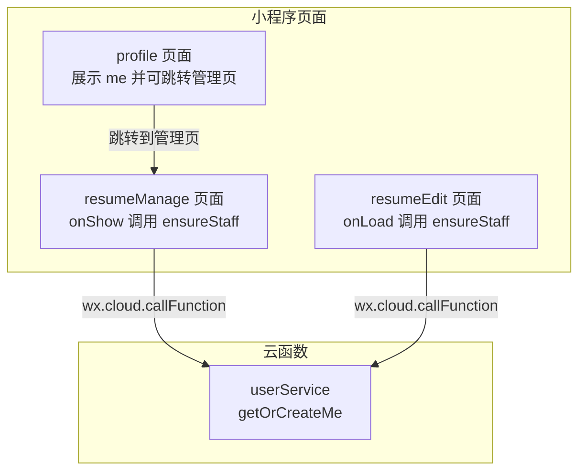
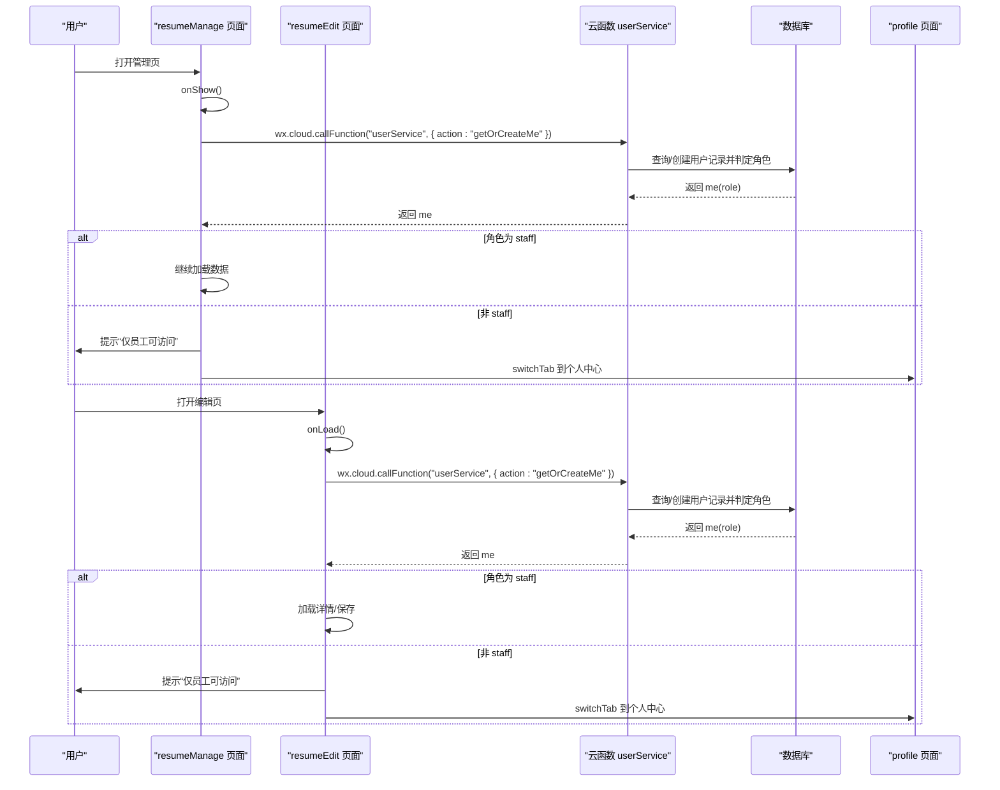
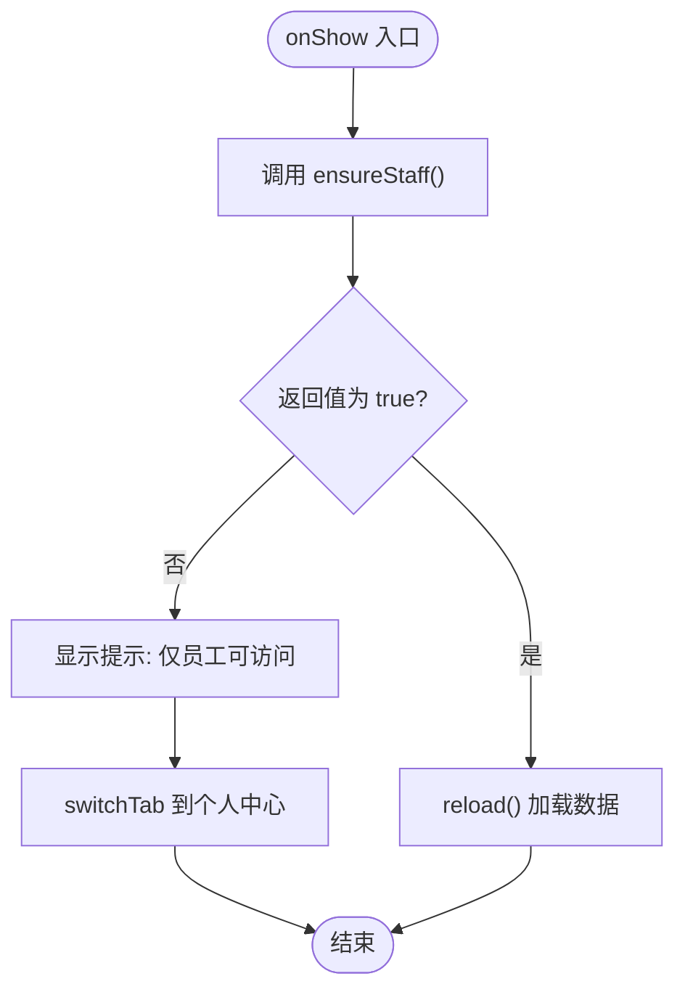
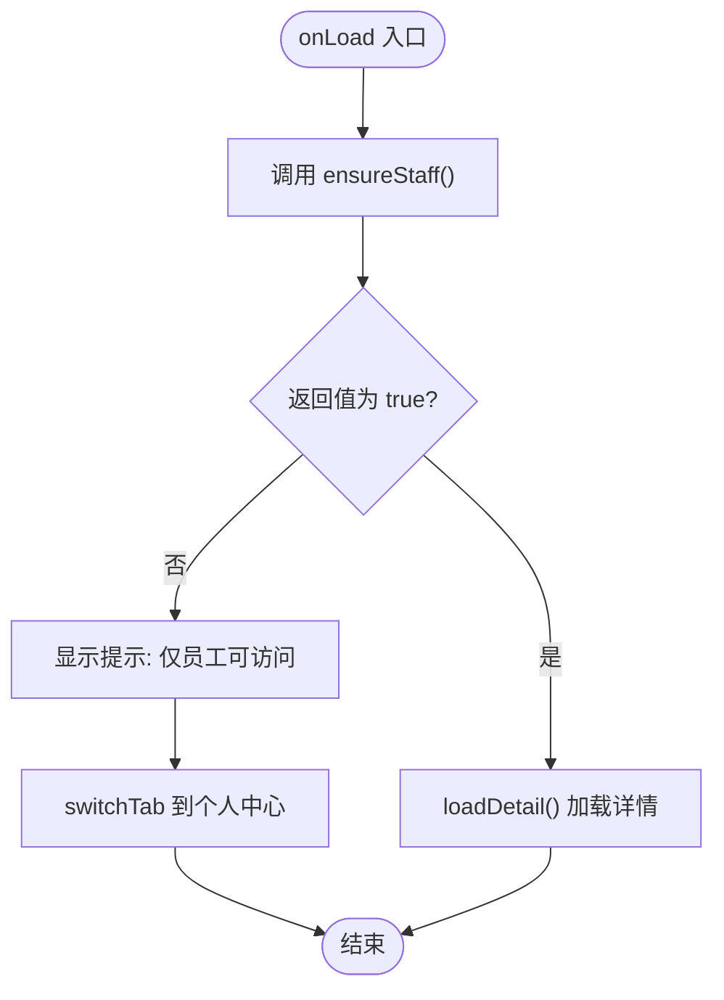
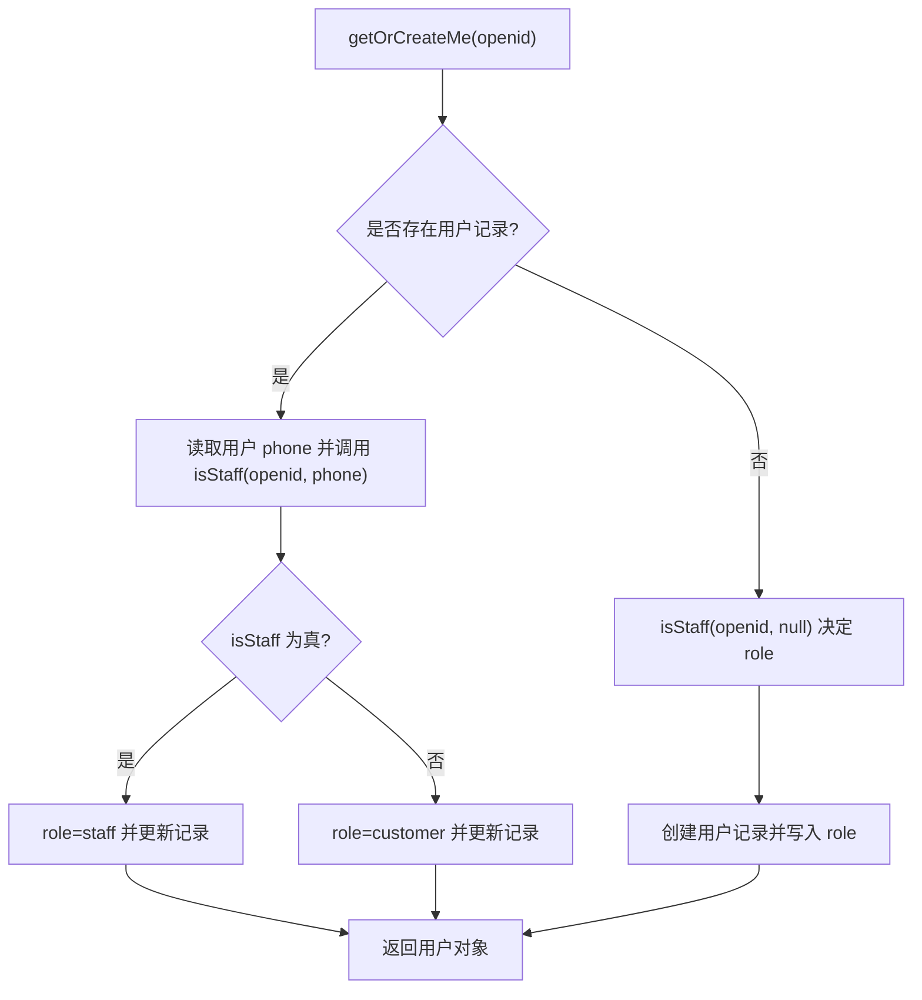
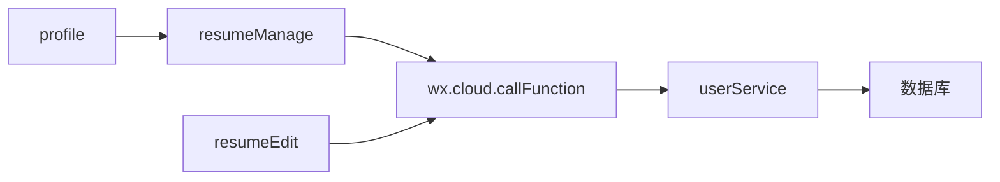

# 前端访问控制

<cite>
**本文引用的文件**
- [miniprogram/pages/admin/resumeManage/index.js](file://miniprogram/pages/admin/resumeManage/index.js)
- [miniprogram/pages/admin/resumeEdit/index.js](file://miniprogram/pages/admin/resumeEdit/index.js)
- [cloudfunctions/userService/index.js](file://cloudfunctions/userService/index.js)
- [miniprogram/pages/profile/index.js](file://miniprogram/pages/profile/index.js)
- [miniprogram/utils/request.js](file://miniprogram/utils/request.js)
- [miniprogram/services/auth.js](file://miniprogram/services/auth.js)
</cite>

## 目录
1. [简介](#简介)
2. [项目结构](#项目结构)
3. [核心组件](#核心组件)
4. [架构总览](#架构总览)
5. [详细组件分析](#详细组件分析)
6. [依赖关系分析](#依赖关系分析)
7. [性能考量](#性能考量)
8. [故障排查指南](#故障排查指南)
9. [结论](#结论)

## 简介
本文件聚焦于安得褓贝小程序管理页面的路由级权限控制，重点说明 resumeManage 与 resumeEdit 页面在生命周期中通过 ensureStaff 函数进行员工身份校验，确保仅具备 staff 角色的用户可访问管理功能。文档同时阐述前端权限控制作为后端校验的前置补充，以提升用户体验并减少无效请求；并提供调试方法与错误处理建议，包括如何通过 wx.cloud.callFunction 的 catch 块处理权限相关错误。

## 项目结构
管理页面位于 miniprogram/pages/admin 下，分别提供简历管理列表与编辑页面；用户角色信息由云函数 userService 提供，个人中心页面负责展示用户信息并引导进入管理页面。

图表来源
- [miniprogram/pages/admin/resumeManage/index.js](file://miniprogram/pages/admin/resumeManage/index.js#L29-L48)
- [miniprogram/pages/admin/resumeEdit/index.js](file://miniprogram/pages/admin/resumeEdit/index.js#L29-L51)
- [cloudfunctions/userService/index.js](file://cloudfunctions/userService/index.js#L258-L289)
- [miniprogram/pages/profile/index.js](file://miniprogram/pages/profile/index.js#L49-L52)

章节来源
- [miniprogram/pages/admin/resumeManage/index.js](file://miniprogram/pages/admin/resumeManage/index.js#L1-L112)
- [miniprogram/pages/admin/resumeEdit/index.js](file://miniprogram/pages/admin/resumeEdit/index.js#L1-L211)
- [cloudfunctions/userService/index.js](file://cloudfunctions/userService/index.js#L1-L289)
- [miniprogram/pages/profile/index.js](file://miniprogram/pages/profile/index.js#L1-L53)

## 核心组件
- 路由级权限校验函数 ensureStaff：在 resumeManage 的 onShow 与 resumeEdit 的 onLoad 中调用，通过 wx.cloud.callFunction 调用 userService 的 getOrCreateMe 接口获取当前用户角色，并在非 staff 时进行页面跳转与提示。
- 用户信息服务 userService：根据 openid 与手机号白名单判定用户角色，返回 me 对象（含 role 字段），并保证用户记录存在。
- 个人中心 profile：展示用户信息，提供跳转至管理页面的入口，便于测试与演示。

章节来源
- [miniprogram/pages/admin/resumeManage/index.js](file://miniprogram/pages/admin/resumeManage/index.js#L29-L48)
- [miniprogram/pages/admin/resumeEdit/index.js](file://miniprogram/pages/admin/resumeEdit/index.js#L29-L51)
- [cloudfunctions/userService/index.js](file://cloudfunctions/userService/index.js#L258-L289)
- [miniprogram/pages/profile/index.js](file://miniprogram/pages/profile/index.js#L49-L52)

## 架构总览
下图展示了管理页面访问控制的整体流程：页面生命周期触发 ensureStaff，调用云函数 userService 获取用户信息，依据角色决定是否允许继续访问或跳转至个人中心。

图表来源
- [miniprogram/pages/admin/resumeManage/index.js](file://miniprogram/pages/admin/resumeManage/index.js#L29-L48)
- [miniprogram/pages/admin/resumeEdit/index.js](file://miniprogram/pages/admin/resumeEdit/index.js#L29-L51)
- [cloudfunctions/userService/index.js](file://cloudfunctions/userService/index.js#L258-L289)

## 详细组件分析

### resumeManage 页面的路由级权限控制
- 生命周期 onShow 中调用 ensureStaff，若返回 false 则终止后续加载逻辑。
- ensureStaff 流程：
  - 通过 wx.cloud.callFunction 调用 userService 的 getOrCreateMe。
  - 解析 resp.result.data 得到 me。
  - 若 me.role === "staff"，返回 true；否则显示“仅员工可访问”，并切换到个人中心页面。
- 数据加载 reload：仅当 ensureStaff 成功后执行，调用 resumeService 的 listForManage 云函数获取简历列表。

图表来源
- [miniprogram/pages/admin/resumeManage/index.js](file://miniprogram/pages/admin/resumeManage/index.js#L29-L48)
- [miniprogram/pages/admin/resumeManage/index.js](file://miniprogram/pages/admin/resumeManage/index.js#L51-L71)

章节来源
- [miniprogram/pages/admin/resumeManage/index.js](file://miniprogram/pages/admin/resumeManage/index.js#L29-L71)

### resumeEdit 页面的路由级权限控制
- 生命周期 onLoad 中调用 ensureStaff，若返回 false 则终止后续加载逻辑。
- ensureStaff 流程与 resumeManage 一致：调用 userService 的 getOrCreateMe，判断 role，非 staff 则提示并跳转至个人中心。
- 编辑流程 save：在表单校验通过后调用 resumeService 的 upsert 云函数保存数据；异常时提示“保存失败（无权限？）”。

图表来源
- [miniprogram/pages/admin/resumeEdit/index.js](file://miniprogram/pages/admin/resumeEdit/index.js#L29-L51)
- [miniprogram/pages/admin/resumeEdit/index.js](file://miniprogram/pages/admin/resumeEdit/index.js#L172-L209)

章节来源
- [miniprogram/pages/admin/resumeEdit/index.js](file://miniprogram/pages/admin/resumeEdit/index.js#L29-L209)

### 用户信息服务 userService 的角色判定
- getOrCreateMe：根据 openid 查询用户记录；若存在则基于 isStaff 判断角色并更新；若不存在则按 isStaff 结果创建用户并写入 role。
- isStaff：优先通过 phone 白名单判定；若无 phone，则回退到 openid 判定。
- 云函数入口 exports.main：根据 action 分发到对应方法，其中 getOrCreateMe 返回 me 对象（含 role）。

图表来源
- [cloudfunctions/userService/index.js](file://cloudfunctions/userService/index.js#L26-L84)
- [cloudfunctions/userService/index.js](file://cloudfunctions/userService/index.js#L258-L289)

章节来源
- [cloudfunctions/userService/index.js](file://cloudfunctions/userService/index.js#L26-L84)
- [cloudfunctions/userService/index.js](file://cloudfunctions/userService/index.js#L258-L289)

### 个人中心 profile 的辅助作用
- 展示 me 信息并通过按钮跳转至管理页面，便于测试 ensureStaff 的跳转逻辑。
- 在 onShow 中同样调用 userService 的 getOrCreateMe 获取最新 me。

章节来源
- [miniprogram/pages/profile/index.js](file://miniprogram/pages/profile/index.js#L9-L35)
- [miniprogram/pages/profile/index.js](file://miniprogram/pages/profile/index.js#L49-L52)

## 依赖关系分析
- 页面到云函数：resumeManage 与 resumeEdit 通过 wx.cloud.callFunction 调用 userService 的 getOrCreateMe。
- 云函数到数据库：userService 使用 cloud.database() 查询/更新 users 与 staff 集合，决定角色。
- 页面到页面：profile 提供跳转入口，resumeManage 与 resumeEdit 在权限不足时跳转至 profile。

图表来源
- [miniprogram/pages/admin/resumeManage/index.js](file://miniprogram/pages/admin/resumeManage/index.js#L29-L48)
- [miniprogram/pages/admin/resumeEdit/index.js](file://miniprogram/pages/admin/resumeEdit/index.js#L29-L51)
- [cloudfunctions/userService/index.js](file://cloudfunctions/userService/index.js#L258-L289)
- [miniprogram/pages/profile/index.js](file://miniprogram/pages/profile/index.js#L49-L52)

章节来源
- [miniprogram/pages/admin/resumeManage/index.js](file://miniprogram/pages/admin/resumeManage/index.js#L29-L48)
- [miniprogram/pages/admin/resumeEdit/index.js](file://miniprogram/pages/admin/resumeEdit/index.js#L29-L51)
- [cloudfunctions/userService/index.js](file://cloudfunctions/userService/index.js#L258-L289)
- [miniprogram/pages/profile/index.js](file://miniprogram/pages/profile/index.js#L49-L52)

## 性能考量
- 前置校验减少无效请求：ensureStaff 在页面加载前完成角色校验，避免后续云函数调用失败带来的网络与渲染开销。
- 云函数幂等与缓存：getOrCreateMe 会在用户存在时更新角色并返回最新 me，减少重复创建成本。
- 异常分支短路：非 staff 时立即提示并跳转，避免后续复杂 UI 初始化。

## 故障排查指南
- 现象：页面无法进入管理/编辑页，自动跳转至个人中心并提示“仅员工可访问”
  - 排查要点：
    - 确认当前用户是否已在 staff 白名单中（手机号或 openid）。
    - 确认云函数 userService 已正确部署且可用。
    - 确认 wx.cloud.callFunction 调用的 name 与 action 正确。
  - 参考路径：
    - [miniprogram/pages/admin/resumeManage/index.js](file://miniprogram/pages/admin/resumeManage/index.js#L29-L48)
    - [miniprogram/pages/admin/resumeEdit/index.js](file://miniprogram/pages/admin/resumeEdit/index.js#L29-L51)
    - [cloudfunctions/userService/index.js](file://cloudfunctions/userService/index.js#L258-L289)

- 现象：云函数调用失败或返回未知错误
  - 排查要点：
    - 检查云函数日志与返回结构，确认 resp.result.data 是否包含 me。
    - 检查数据库集合 users 与 staff 是否存在或可访问。
  - 参考路径：
    - [cloudfunctions/userService/index.js](file://cloudfunctions/userService/index.js#L258-L289)

- 现象：编辑保存失败，提示“保存失败（无权限？）”
  - 排查要点：
    - 确认 ensureStaff 已通过，避免因权限不足导致后续云函数调用被拦截。
    - 检查 resumeService 的 upsert 云函数权限策略与返回值。
  - 参考路径：
    - [miniprogram/pages/admin/resumeEdit/index.js](file://miniprogram/pages/admin/resumeEdit/index.js#L172-L209)

- 前端调试方法
  - 修改本地 me.role 模拟员工身份进行界面测试
    - 方法：在 profile 页面加载 me 后，临时修改本地存储中的用户角色字段（注意：此操作仅用于本地调试，不改变数据库状态）。
    - 参考路径：
      - [miniprogram/pages/profile/index.js](file://miniprogram/pages/profile/index.js#L19-L35)
  - 通过 wx.cloud.callFunction 的 catch 块处理后端返回的权限错误
    - 方法：在 resumeManage/reload 与 resumeEdit/save 中增加 catch 块，捕获权限相关错误并提示用户。
    - 参考路径：
      - [miniprogram/pages/admin/resumeManage/index.js](file://miniprogram/pages/admin/resumeManage/index.js#L51-L71)
      - [miniprogram/pages/admin/resumeEdit/index.js](file://miniprogram/pages/admin/resumeEdit/index.js#L172-L209)

- 与账号密码登录体系的关系
  - 当前管理页面采用云函数侧角色判定（openid/phone 白名单），与账号密码登录体系（CRM 后台 API）解耦。
  - 若需统一认证，可参考现有 auth 服务与 request 工具：
    - [miniprogram/services/auth.js](file://miniprogram/services/auth.js#L1-L163)
    - [miniprogram/utils/request.js](file://miniprogram/utils/request.js#L1-L125)

## 结论
通过在 resumeManage 与 resumeEdit 的生命周期中引入 ensureStaff 前置校验，前端能够在请求后端云函数之前即阻断非员工访问，显著提升用户体验并降低无效请求。配合 userService 的角色判定与 profile 的跳转入口，形成清晰、可维护的路由级权限控制闭环。建议在后续迭代中进一步完善错误提示与日志上报，以便快速定位问题。