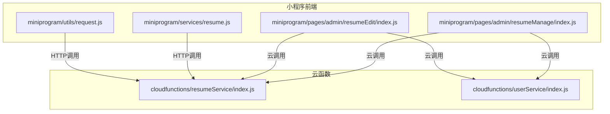
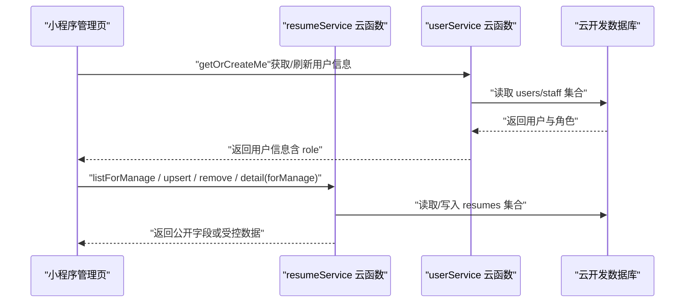
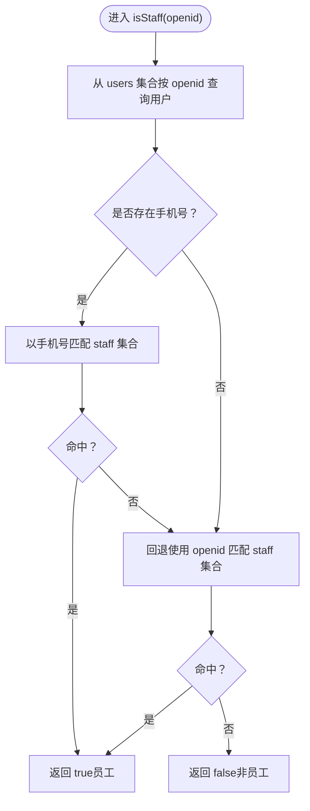
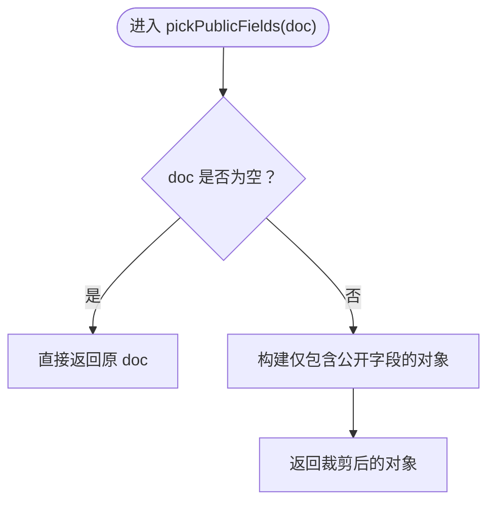
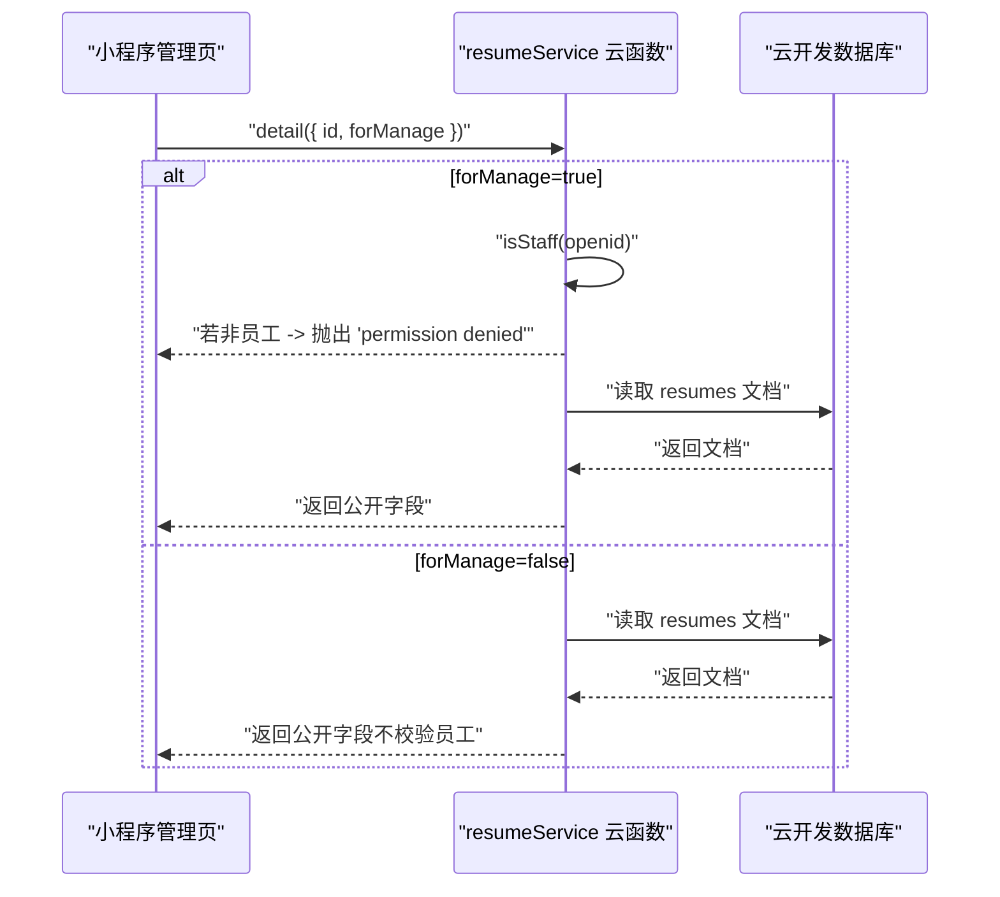
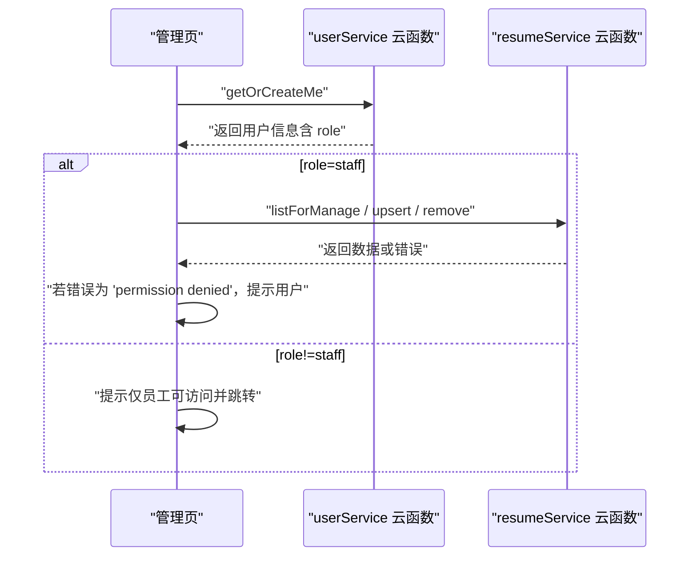
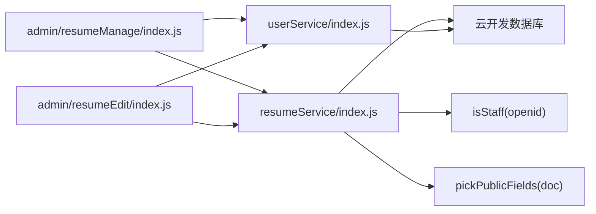

# 后端权限校验

<cite>
**本文引用的文件**
- [resumeService/index.js](file://cloudfunctions/resumeService/index.js)
- [resumeService/config.json](file://cloudfunctions/resumeService/config.json)
- [userService/index.js](file://cloudfunctions/userService/index.js)
- [API完整文档.md](file://API完整文档.md)
- [miniprogram/services/resume.js](file://miniprogram/services/resume.js)
- [miniprogram/utils/request.js](file://miniprogram/utils/request.js)
- [miniprogram/pages/admin/resumeManage/index.js](file://miniprogram/pages/admin/resumeManage/index.js)
- [miniprogram/pages/admin/resumeEdit/index.js](file://miniprogram/pages/admin/resumeEdit/index.js)
</cite>

## 目录
1. [简介](#简介)
2. [项目结构](#项目结构)
3. [核心组件](#核心组件)
4. [架构总览](#架构总览)
5. [详细组件分析](#详细组件分析)
6. [依赖关系分析](#依赖关系分析)
7. [性能考量](#性能考量)
8. [故障排查指南](#故障排查指南)
9. [结论](#结论)

## 简介
本文件聚焦于安得褓贝项目中“简历管理”云函数的后端权限校验实现，重点围绕 resumeService 云函数的访问控制策略，解释以下关键点：
- 基于 isStaff(openid) 的员工身份校验，贯穿 listForManage、upsertResume、removeResume 等管理接口。
- getDetail 接口的双重逻辑：当 forManage=true 时进行权限校验；否则仅返回公开字段，实现同一接口的安全复用。
- pickPublicFields 函数如何过滤简历数据，确保敏感字段不泄露给 C 端用户。
- 提供实际代码示例的定位路径，帮助开发者快速定位实现细节。
- 错误处理最佳实践：前端如何捕获并友好提示“permission denied”，以及云函数日志中权限拒绝事件的追踪方法。

## 项目结构
本项目采用云开发云函数与小程序前端分离的架构。权限校验主要集中在 resumeService 云函数中，同时通过 userService 云函数维护用户与员工角色映射，并由小程序前端通过云调用触发相应能力。

图表来源
- [resumeService/index.js](file://cloudfunctions/resumeService/index.js#L180-L216)
- [userService/index.js](file://cloudfunctions/userService/index.js#L258-L289)
- [miniprogram/pages/admin/resumeManage/index.js](file://miniprogram/pages/admin/resumeManage/index.js#L35-L80)
- [miniprogram/pages/admin/resumeEdit/index.js](file://miniprogram/pages/admin/resumeEdit/index.js#L38-L84)
- [miniprogram/services/resume.js](file://miniprogram/services/resume.js#L1-L239)
- [miniprogram/utils/request.js](file://miniprogram/utils/request.js#L1-L125)

章节来源
- [resumeService/index.js](file://cloudfunctions/resumeService/index.js#L1-L216)
- [userService/index.js](file://cloudfunctions/userService/index.js#L1-L289)
- [miniprogram/pages/admin/resumeManage/index.js](file://miniprogram/pages/admin/resumeManage/index.js#L1-L112)
- [miniprogram/pages/admin/resumeEdit/index.js](file://miniprogram/pages/admin/resumeEdit/index.js#L1-L211)
- [miniprogram/services/resume.js](file://miniprogram/services/resume.js#L1-L239)
- [miniprogram/utils/request.js](file://miniprogram/utils/request.js#L1-L125)

## 核心组件
- 员工身份判定 isStaff(openid)
  - 优先通过手机号匹配 staff 集合；若无手机号，则回退到 openid 匹配。
  - 该函数被多个管理接口前置调用，作为权限控制的核心依据。
- 数据字段裁剪 pickPublicFields(doc)
  - 仅保留公开字段，屏蔽敏感信息，保证 C 端用户只能看到最小必要数据。
- 管理接口
  - listForManage：列出简历（仅员工可见），返回公开字段。
  - upsertResume：新增/更新简历（仅员工），返回受控字段。
  - removeResume：删除简历（仅员工）。
  - getDetail：详情接口，支持两种模式：
    - forManage=true：进行员工身份校验，返回公开字段。
    - forManage=false：不校验，仅返回公开字段。
- 前端入口
  - 管理端页面在进入时先通过 userService 的 getOrCreateMe 判断角色，再调用 resumeService 的管理接口。

章节来源
- [resumeService/index.js](file://cloudfunctions/resumeService/index.js#L26-L76)
- [resumeService/index.js](file://cloudfunctions/resumeService/index.js#L108-L120)
- [resumeService/index.js](file://cloudfunctions/resumeService/index.js#L122-L178)
- [userService/index.js](file://cloudfunctions/userService/index.js#L26-L47)
- [miniprogram/pages/admin/resumeManage/index.js](file://miniprogram/pages/admin/resumeManage/index.js#L35-L80)
- [miniprogram/pages/admin/resumeEdit/index.js](file://miniprogram/pages/admin/resumeEdit/index.js#L38-L84)

## 架构总览
下图展示了从小程序前端到云函数再到数据库的调用链路与权限控制点。

图表来源
- [resumeService/index.js](file://cloudfunctions/resumeService/index.js#L180-L216)
- [userService/index.js](file://cloudfunctions/userService/index.js#L258-L289)
- [miniprogram/pages/admin/resumeManage/index.js](file://miniprogram/pages/admin/resumeManage/index.js#L35-L80)
- [miniprogram/pages/admin/resumeEdit/index.js](file://miniprogram/pages/admin/resumeEdit/index.js#L38-L84)

## 详细组件分析

### 员工身份判定 isStaff(openid)
- 判定流程
  - 从 users 集合按 openid 查询用户，提取手机号。
  - 若手机号存在，优先以其匹配 staff 集合；命中即返回员工身份。
  - 若无手机号或未命中，回退使用 openid 匹配 staff 集合。
- 作用范围
  - listForManage、upsertResume、removeResume、getDetail(forManage=true) 均在函数入口处调用 isStaff(openid)，若返回 false 则抛出“permission denied”。

图表来源
- [resumeService/index.js](file://cloudfunctions/resumeService/index.js#L26-L56)

章节来源
- [resumeService/index.js](file://cloudfunctions/resumeService/index.js#L26-L56)

### 数据字段裁剪 pickPublicFields(doc)
- 设计目标
  - 仅返回对外公开字段，屏蔽隐私与内部字段，防止敏感信息泄露。
- 返回字段清单
  - 包括但不限于：_id、name、age、city、experienceYears、priceMonth、tags、intro、coverFileId、photos、videoFileId、status、updatedAt、createdAt。
- 使用场景
  - listResumes、listForManage、getDetail（forManage=false 或 forManage=true 时均返回公开字段）。

图表来源
- [resumeService/index.js](file://cloudfunctions/resumeService/index.js#L58-L76)

章节来源
- [resumeService/index.js](file://cloudfunctions/resumeService/index.js#L58-L76)

### 接口权限控制与 getDetail 的双重逻辑
- listForManage
  - 入口处调用 isStaff(openid)，若非员工则抛出“permission denied”。
  - 返回公开字段列表。
- upsertResume
  - 入口处调用 isStaff(openid)，若非员工则抛出“permission denied”。
  - 对输入数据进行清洗与标准化，设置状态为 published 或 draft，并返回受控字段。
- removeResume
  - 入口处调用 isStaff(openid)，若非员工则抛出“permission denied”。
  - 校验 id 后删除对应简历。
- getDetail
  - 当 forManage=true：先调用 isStaff(openid)，若非员工则抛出“permission denied”，随后返回公开字段。
  - 当 forManage=false：不进行员工校验，但仍返回公开字段，实现同一接口的安全复用。

图表来源
- [resumeService/index.js](file://cloudfunctions/resumeService/index.js#L108-L120)
- [resumeService/index.js](file://cloudfunctions/resumeService/index.js#L122-L178)

章节来源
- [resumeService/index.js](file://cloudfunctions/resumeService/index.js#L108-L120)
- [resumeService/index.js](file://cloudfunctions/resumeService/index.js#L122-L178)

### 前端调用与错误处理最佳实践
- 管理端页面在进入时先调用 userService 的 getOrCreateMe，根据返回的 role 决定是否允许访问管理功能。
- 管理端页面在调用 resumeService 的管理接口时，若返回“permission denied”，前端应提示用户“仅员工可访问”或“无权限”，并引导至个人中心。
- 前端请求封装
  - authenticatedRequest 会在 401 时清除本地 Token 并跳转登录；对于业务层的“permission denied”，建议在页面层捕获并提示用户。
- 云函数日志追踪
  - 云函数返回错误时会将错误消息透传到前端；可在云函数日志中搜索“permission denied”关键字，定位具体调用与上下文。

图表来源
- [miniprogram/pages/admin/resumeManage/index.js](file://miniprogram/pages/admin/resumeManage/index.js#L35-L80)
- [miniprogram/pages/admin/resumeEdit/index.js](file://miniprogram/pages/admin/resumeEdit/index.js#L38-L84)
- [userService/index.js](file://cloudfunctions/userService/index.js#L258-L289)
- [resumeService/index.js](file://cloudfunctions/resumeService/index.js#L180-L216)

章节来源
- [miniprogram/pages/admin/resumeManage/index.js](file://miniprogram/pages/admin/resumeManage/index.js#L1-L112)
- [miniprogram/pages/admin/resumeEdit/index.js](file://miniprogram/pages/admin/resumeEdit/index.js#L1-L211)
- [miniprogram/utils/request.js](file://miniprogram/utils/request.js#L1-L125)
- [resumeService/index.js](file://cloudfunctions/resumeService/index.js#L180-L216)

## 依赖关系分析
- resumeService 云函数
  - 依赖云开发数据库，读写 users、staff、resumes 集合。
  - 依赖 isStaff(openid) 与 pickPublicFields(doc)。
- userService 云函数
  - 依赖云开发数据库，维护 users、staff、accounts 集合。
  - 提供 getOrCreateMe，用于刷新用户角色（staff/customer）。
- 小程序前端
  - 通过云调用触发 resumeService 与 userService。
  - 通过 HTTP 请求封装调用公开接口（如列表/详情公开接口）。

图表来源
- [resumeService/index.js](file://cloudfunctions/resumeService/index.js#L1-L216)
- [userService/index.js](file://cloudfunctions/userService/index.js#L1-L289)
- [miniprogram/pages/admin/resumeManage/index.js](file://miniprogram/pages/admin/resumeManage/index.js#L1-L112)
- [miniprogram/pages/admin/resumeEdit/index.js](file://miniprogram/pages/admin/resumeEdit/index.js#L1-L211)

章节来源
- [resumeService/index.js](file://cloudfunctions/resumeService/index.js#L1-L216)
- [userService/index.js](file://cloudfunctions/userService/index.js#L1-L289)
- [miniprogram/pages/admin/resumeManage/index.js](file://miniprogram/pages/admin/resumeManage/index.js#L1-L112)
- [miniprogram/pages/admin/resumeEdit/index.js](file://miniprogram/pages/admin/resumeEdit/index.js#L1-L211)

## 性能考量
- 数据库查询
  - isStaff(openid) 会进行两次集合查询（users 与 staff），建议在 staff 集合上建立索引以提升命中效率。
- 字段裁剪
  - pickPublicFields 仅做字段映射，复杂度 O(k)，k 为公开字段数，影响极小。
- 管理接口
  - listForManage 限制了最大返回条数，避免一次性返回过多数据。
- 建议
  - 对频繁访问的字段建立复合索引（如 staff.phone、users._openid）。
  - 对 resumes 的常用查询条件建立索引（如 status、updatedAt）。

[本节为通用建议，不直接分析具体文件]

## 故障排查指南
- 常见错误与定位
  - “permission denied”
    - 前端：在调用管理接口后，若返回该错误，应提示“仅员工可访问”或“无权限”，并引导用户前往个人中心或重新登录。
    - 云函数：在云函数日志中搜索“permission denied”，定位具体调用与上下文。
  - 401 未授权
    - 前端：authenticatedRequest 在收到 401 时会清除本地 Token 并跳转登录页；若非业务错误，建议统一拦截处理。
  - 404 资源不存在
    - 前端：提示“资源不存在”，并引导用户回到列表页。
- 日志追踪
  - 在云函数入口处对异常进行统一返回，错误消息会透传到前端；可在云函数日志中按 action/openid/错误消息进行检索。

章节来源
- [resumeService/index.js](file://cloudfunctions/resumeService/index.js#L180-L216)
- [miniprogram/utils/request.js](file://miniprogram/utils/request.js#L68-L101)
- [API完整文档.md](file://API完整文档.md#L1160-L1206)

## 结论
本项目通过 resumeService 云函数的 isStaff(openid) 与 pickPublicFields(doc) 实现了清晰的后端权限控制与数据脱敏：
- 管理接口在入口处统一校验员工身份，非员工一律拒绝。
- getDetail 支持两种模式：forManage=true 时进行员工校验，forManage=false 时不校验但仍返回公开字段，实现同一接口的安全复用。
- 前端在管理页入口处先通过 userService 刷新用户角色，再调用管理接口，形成前后端协同的权限保障。
- 建议持续完善数据库索引与日志监控，确保权限控制稳定可靠。