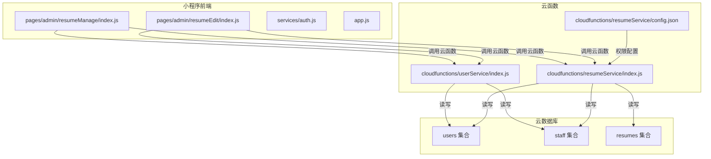
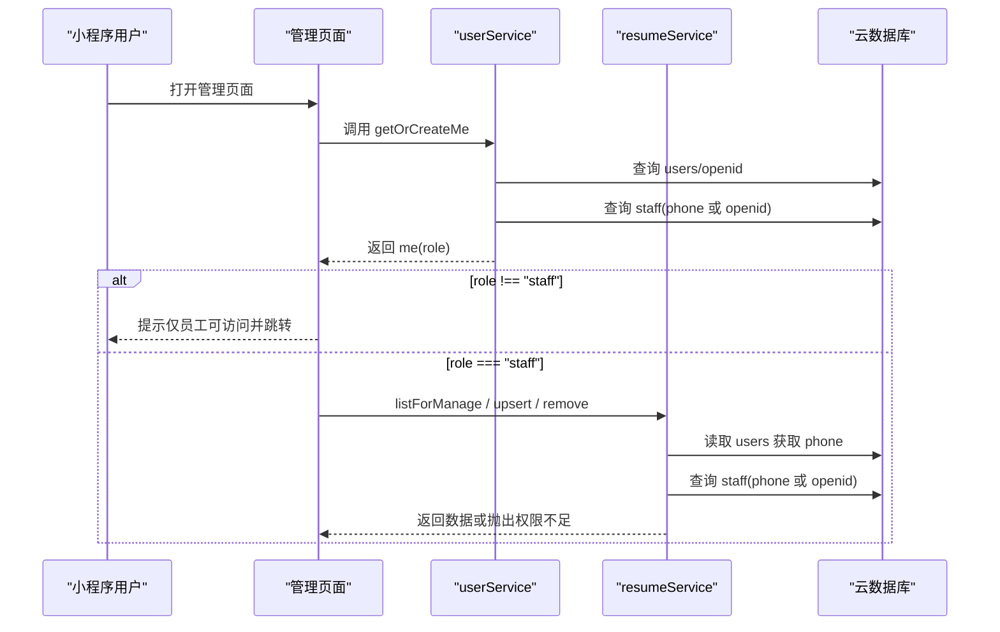
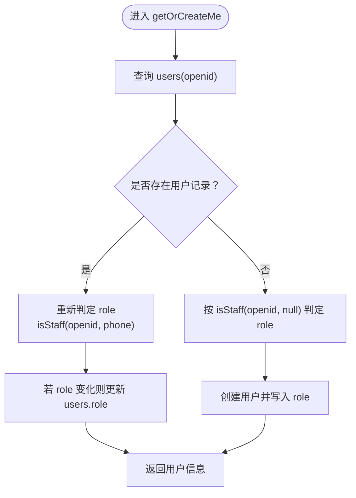
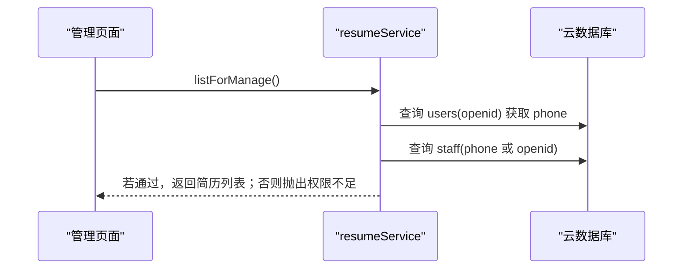
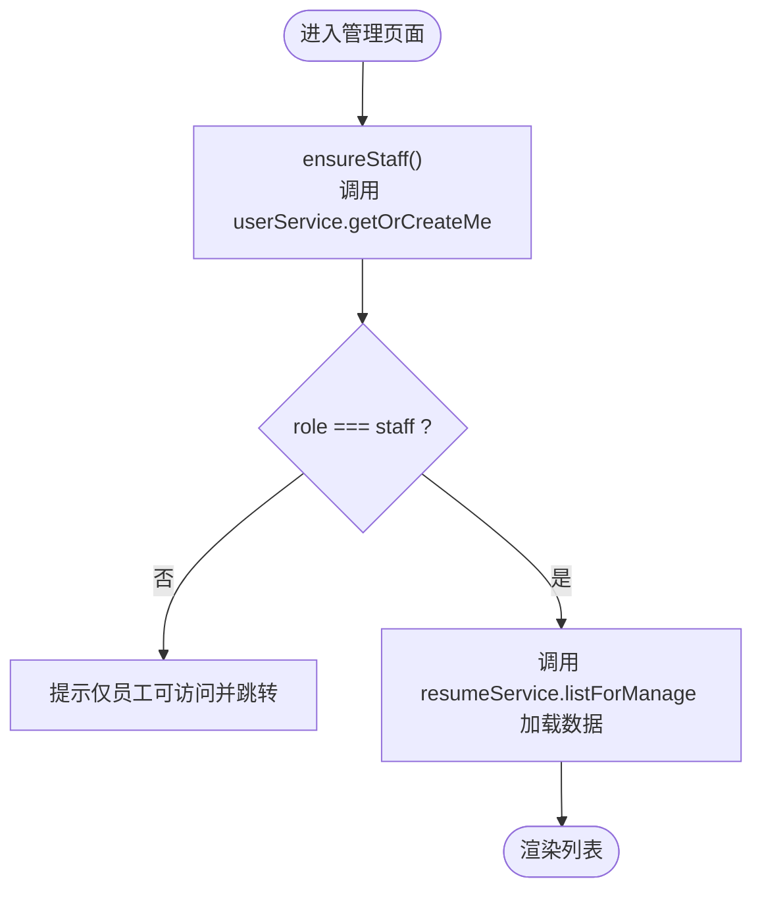
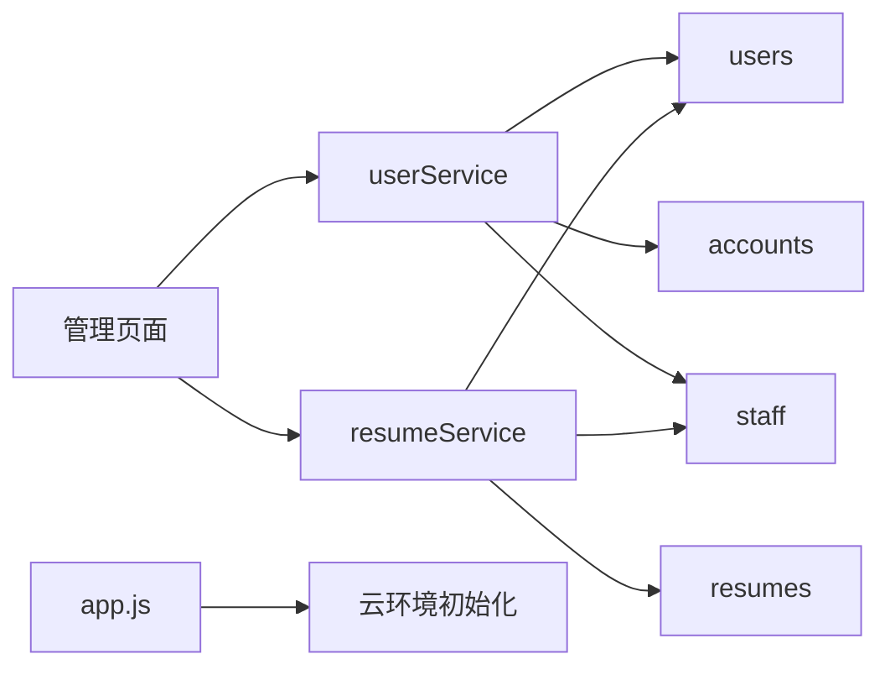

# 权限系统

<cite>
**本文引用的文件**
- [cloudfunctions/userService/index.js](file://cloudfunctions/userService/index.js)
- [cloudfunctions/resumeService/index.js](file://cloudfunctions/resumeService/index.js)
- [miniprogram/pages/admin/resumeManage/index.js](file://miniprogram/pages/admin/resumeManage/index.js)
- [miniprogram/pages/admin/resumeEdit/index.js](file://miniprogram/pages/admin/resumeEdit/index.js)
- [miniprogram/services/auth.js](file://miniprogram/services/auth.js)
- [miniprogram/app.js](file://miniprogram/app.js)
- [docs/简历管理方案深度分析.md](file://docs/简历管理方案深度分析.md)
- [docs/快速测试指南.md](file://docs/快速测试指南.md)
- [cloudfunctions/resumeService/config.json](file://cloudfunctions/resumeService/config.json)
- [PRD.md](file://PRD.md)
</cite>

## 目录
1. [简介](#简介)
2. [项目结构](#项目结构)
3. [核心组件](#核心组件)
4. [架构总览](#架构总览)
5. [详细组件分析](#详细组件分析)
6. [依赖关系分析](#依赖关系分析)
7. [性能考量](#性能考量)
8. [故障排查指南](#故障排查指南)
9. [结论](#结论)
10. [附录](#附录)

## 简介
本文件围绕“安得褓贝”的权限系统展开，重点解释基于 staff 集合的员工白名单访问控制机制。系统通过用户 openid 和手机号在云函数 userService 的 isStaff 函数中判定用户角色（staff/customer），并在用户信息入库或更新时自动同步 users 集合的 role 字段。在简历管理相关云函数（resumeService）中，所有涉及管理操作的接口在执行前均调用 isStaff(openid) 进行访问控制，拒绝非员工请求。前端通过路由访问前的 staff 校验，确保仅员工可访问管理页面。同时，系统采用 pickPublicFields 过滤敏感字段，保障 C 端用户仅能看到公开信息。最后提供权限调试方法与常见问题排查建议。

## 项目结构
- 云函数层
  - userService：负责用户信息与角色判定、手机号登录、账号密码登录/注册等
  - resumeService：负责简历列表、详情、管理列表、增删改等接口，并进行权限校验
- 前端层（小程序）
  - 管理页面：resumeManage、resumeEdit
  - 认证服务：auth.js（账号密码登录相关，与本权限体系配合）
  - 应用入口：app.js（云环境初始化）

图表来源
- [cloudfunctions/userService/index.js](file://cloudfunctions/userService/index.js#L1-L289)
- [cloudfunctions/resumeService/index.js](file://cloudfunctions/resumeService/index.js#L1-L216)
- [cloudfunctions/resumeService/config.json](file://cloudfunctions/resumeService/config.json#L1-L5)
- [miniprogram/pages/admin/resumeManage/index.js](file://miniprogram/pages/admin/resumeManage/index.js#L1-L112)
- [miniprogram/pages/admin/resumeEdit/index.js](file://miniprogram/pages/admin/resumeEdit/index.js#L1-L211)

章节来源
- [cloudfunctions/userService/index.js](file://cloudfunctions/userService/index.js#L1-L289)
- [cloudfunctions/resumeService/index.js](file://cloudfunctions/resumeService/index.js#L1-L216)
- [miniprogram/pages/admin/resumeManage/index.js](file://miniprogram/pages/admin/resumeManage/index.js#L1-L112)
- [miniprogram/pages/admin/resumeEdit/index.js](file://miniprogram/pages/admin/resumeEdit/index.js#L1-L211)
- [miniprogram/app.js](file://miniprogram/app.js#L1-L21)

## 核心组件
- 员工白名单与角色判定
  - staff 集合：存储员工标识（openid 或 phone），作为权限判定依据
  - users 集合：存储用户信息及 role 字段，role 由 isStaff 判定并自动更新
- 云函数 userService
  - isStaff(openid, phone)：优先通过 phone 判断，其次回退 openid
  - getOrCreateMe(openid)：获取或创建用户，并根据 isStaff 结果更新 role
  - loginByPhone(...)：通过微信手机号授权获取手机号并更新用户信息
- 云函数 resumeService
  - isStaff(openid)：先读取 users 中的 phone，再按 phone 或 openid 判定
  - listForManage、upsertResume、removeResume：均在执行前调用 isStaff 并抛出“权限不足”错误
  - pickPublicFields：过滤返回给 C 端的公开字段
- 前端管理页面
  - resumeManage、resumeEdit：进入页面前调用 userService.getOrCreateMe，若 role 非 staff 则拒绝并跳转

章节来源
- [cloudfunctions/userService/index.js](file://cloudfunctions/userService/index.js#L26-L84)
- [cloudfunctions/userService/index.js](file://cloudfunctions/userService/index.js#L105-L161)
- [cloudfunctions/resumeService/index.js](file://cloudfunctions/resumeService/index.js#L26-L56)
- [cloudfunctions/resumeService/index.js](file://cloudfunctions/resumeService/index.js#L58-L106)
- [cloudfunctions/resumeService/index.js](file://cloudfunctions/resumeService/index.js#L122-L178)
- [miniprogram/pages/admin/resumeManage/index.js](file://miniprogram/pages/admin/resumeManage/index.js#L35-L48)
- [miniprogram/pages/admin/resumeEdit/index.js](file://miniprogram/pages/admin/resumeEdit/index.js#L38-L51)

## 架构总览
下图展示了从前端到云函数再到数据库的权限控制链路，以及公开字段过滤策略。

图表来源
- [miniprogram/pages/admin/resumeManage/index.js](file://miniprogram/pages/admin/resumeManage/index.js#L35-L48)
- [miniprogram/pages/admin/resumeEdit/index.js](file://miniprogram/pages/admin/resumeEdit/index.js#L38-L51)
- [cloudfunctions/userService/index.js](file://cloudfunctions/userService/index.js#L26-L84)
- [cloudfunctions/resumeService/index.js](file://cloudfunctions/resumeService/index.js#L26-L56)
- [cloudfunctions/resumeService/index.js](file://cloudfunctions/resumeService/index.js#L122-L178)

## 详细组件分析

### 组件A：员工白名单与角色判定（userService）
- 设计要点
  - isStaff(openid, phone)：优先使用 phone 判定，若 users 中存在 phone，则在 staff 集合中查找 phone；否则回退到 openid 判定
  - getOrCreateMe(openid)：若用户存在则重新判定 role 并更新；若不存在则按 isStaff 结果创建用户并写入 role
  - loginByPhone(...)：通过微信手机号授权获取手机号，更新 users 并重新判定 role
- 数据流
  - 用户首次访问或登录后，系统读取 openid，尝试从 users 获取用户信息
  - 若存在 phone，优先用 phone 判定 staff；否则用 openid 判定
  - 根据判定结果更新 users 的 role 字段，供后续接口使用

图表来源
- [cloudfunctions/userService/index.js](file://cloudfunctions/userService/index.js#L49-L84)
- [cloudfunctions/userService/index.js](file://cloudfunctions/userService/index.js#L26-L47)

章节来源
- [cloudfunctions/userService/index.js](file://cloudfunctions/userService/index.js#L26-L84)
- [cloudfunctions/userService/index.js](file://cloudfunctions/userService/index.js#L105-L161)

### 组件B：简历管理接口的权限控制（resumeService）
- 设计要点
  - isStaff(openid)：先从 users 读取 phone，优先用 phone 判定 staff，否则用 openid 判定
  - listForManage、upsertResume、removeResume：均在执行前调用 isStaff，若为 false 则抛出“权限不足”
  - pickPublicFields：仅返回公开字段，隐藏内部敏感信息
- 接口序列

图表来源
- [cloudfunctions/resumeService/index.js](file://cloudfunctions/resumeService/index.js#L122-L133)
- [cloudfunctions/resumeService/index.js](file://cloudfunctions/resumeService/index.js#L26-L56)

章节来源
- [cloudfunctions/resumeService/index.js](file://cloudfunctions/resumeService/index.js#L26-L56)
- [cloudfunctions/resumeService/index.js](file://cloudfunctions/resumeService/index.js#L58-L106)
- [cloudfunctions/resumeService/index.js](file://cloudfunctions/resumeService/index.js#L122-L178)

### 组件C：前端路由控制与错误处理（管理页面）
- 设计要点
  - 进入管理页面时，先调用 userService.getOrCreateMe，若返回 role !== "staff"，则提示并跳转至个人中心
  - 管理页面调用 resumeService 的接口时，若返回“权限不足”，前端提示并清空列表或给出相应反馈
- 页面流程

图表来源
- [miniprogram/pages/admin/resumeManage/index.js](file://miniprogram/pages/admin/resumeManage/index.js#L35-L48)
- [miniprogram/pages/admin/resumeManage/index.js](file://miniprogram/pages/admin/resumeManage/index.js#L51-L71)

章节来源
- [miniprogram/pages/admin/resumeManage/index.js](file://miniprogram/pages/admin/resumeManage/index.js#L1-L112)
- [miniprogram/pages/admin/resumeEdit/index.js](file://miniprogram/pages/admin/resumeEdit/index.js#L1-L211)

### 组件D：公开字段过滤（pickPublicFields）
- 设计要点
  - 仅返回简历的公开字段，避免泄露内部字段
  - 该函数在 listResumes 与 getDetail(forManage=false) 场景中被使用，确保 C 端用户只看到公开信息

章节来源
- [cloudfunctions/resumeService/index.js](file://cloudfunctions/resumeService/index.js#L58-L106)

## 依赖关系分析
- 云函数依赖
  - userService 依赖 users、staff、accounts 集合
  - resumeService 依赖 users、staff、resumes 集合
- 前端依赖
  - 管理页面依赖云函数 userService 与 resumeService
  - app.js 初始化云环境，保证后续云调用可用

图表来源
- [cloudfunctions/resumeService/index.js](file://cloudfunctions/resumeService/index.js#L18-L24)
- [cloudfunctions/userService/index.js](file://cloudfunctions/userService/index.js#L18-L24)
- [miniprogram/app.js](file://miniprogram/app.js#L1-L21)

章节来源
- [cloudfunctions/resumeService/index.js](file://cloudfunctions/resumeService/index.js#L1-L24)
- [cloudfunctions/userService/index.js](file://cloudfunctions/userService/index.js#L1-L24)
- [miniprogram/app.js](file://miniprogram/app.js#L1-L21)

## 性能考量
- 集合初始化
  - 两个云函数在首次运行时自动创建 users、staff、resumes 等集合，避免新环境直接报错
- 查询路径
  - isStaff 会先读取 users 获取 phone，再在 staff 集合中查询，查询条件简单且命中率高
- 数据返回
  - 通过 pickPublicFields 过滤字段，减少传输体积，提升前端渲染效率

章节来源
- [cloudfunctions/resumeService/index.js](file://cloudfunctions/resumeService/index.js#L10-L24)
- [cloudfunctions/userService/index.js](file://cloudfunctions/userService/index.js#L10-L24)
- [cloudfunctions/resumeService/index.js](file://cloudfunctions/resumeService/index.js#L58-L106)

## 故障排查指南
- 常见问题
  - “权限不足”错误
    - 现象：调用 listForManage/upsert/remove 抛出“权限不足”
    - 排查：确认 staff 集合中是否存在对应 openid 或 phone；确认 users 中 phone 是否正确
  - 无法访问管理页面
    - 现象：进入管理页面提示“仅员工可访问”
    - 排查：确认 getOrCreateMe 返回的 role 是否为 staff；检查前端 ensureStaff 流程
  - 云函数部署与环境
    - 现象：云函数报“集合不存在”
    - 排查：确认已部署 userService 与 resumeService；检查 app.js 中 env 配置
- 调试方法
  - 使用“快速测试指南”中的方法，模拟员工身份进行测试
  - 在云函数中打印 openid、phone、role 等关键信息，定位问题
  - 在前端控制台查看 wx.cloud.callFunction 的返回值与错误信息

章节来源
- [docs/快速测试指南.md](file://docs/快速测试指南.md#L1-L246)
- [cloudfunctions/resumeService/index.js](file://cloudfunctions/resumeService/index.js#L180-L216)
- [miniprogram/pages/admin/resumeManage/index.js](file://miniprogram/pages/admin/resumeManage/index.js#L35-L48)
- [miniprogram/app.js](file://miniprogram/app.js#L1-L21)

## 结论
本权限体系以 staff 集合作为核心，结合 openid 与 phone 的双重判定，实现了灵活的员工白名单控制。通过云函数 userService 的自动角色判定与更新，以及 resumeService 的前置权限校验，确保了管理接口的安全性。前端在管理页面入口处进行二次拦截，进一步提升了用户体验与安全性。公开字段过滤策略有效保护了内部数据。建议后续完善 staff 集合的录入与维护流程，以及在前端管理页增加更严格的入口拦截。

## 附录
- 安全边界
  - pickPublicFields 仅返回公开字段，避免敏感信息泄露
  - 所有管理接口在执行前均进行 isStaff 校验，拒绝非员工请求
- 权限调试
  - 使用“快速测试指南”提供的方法，模拟员工身份进行测试
  - 在云函数中打印 openid、phone、role 等关键信息，定位问题

章节来源
- [cloudfunctions/resumeService/index.js](file://cloudfunctions/resumeService/index.js#L58-L106)
- [cloudfunctions/resumeService/index.js](file://cloudfunctions/resumeService/index.js#L122-L178)
- [docs/快速测试指南.md](file://docs/快速测试指南.md#L1-L246)