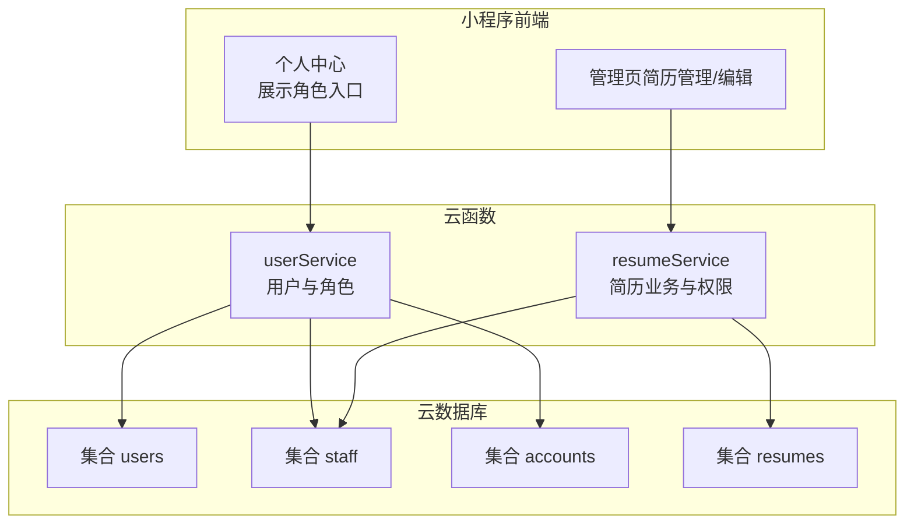
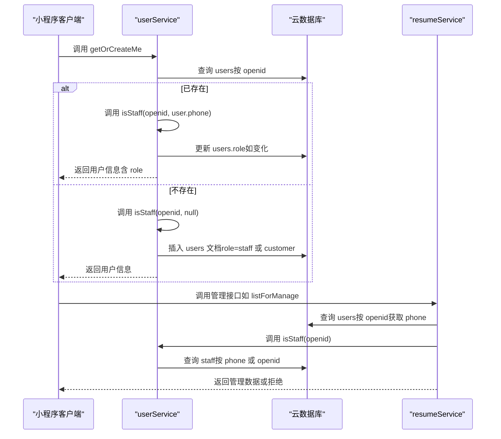
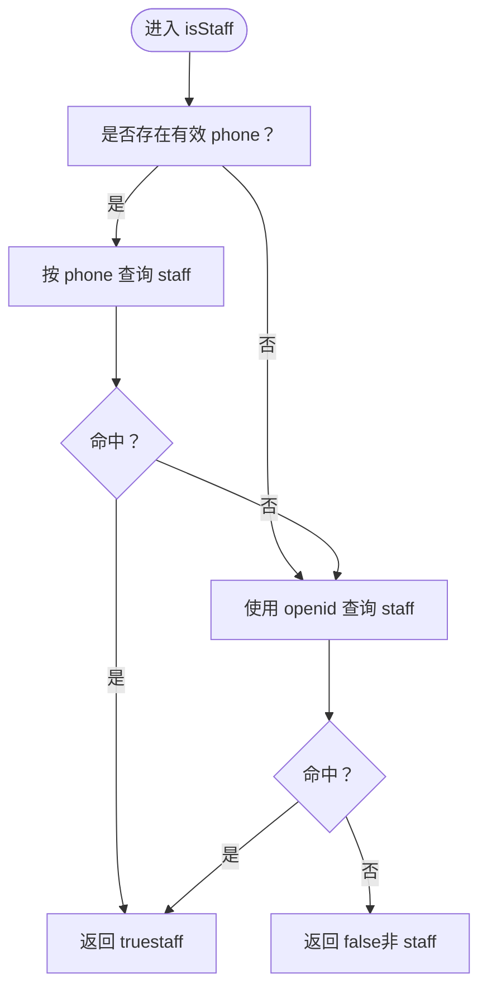
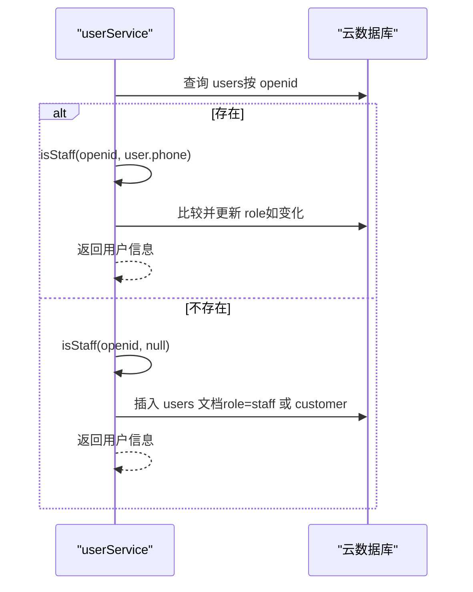
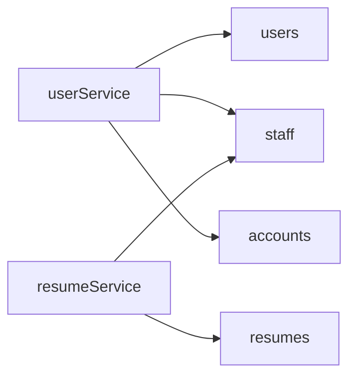

# 角色管理

<cite>
**本文引用的文件**
- [cloudfunctions/userService/index.js](file://cloudfunctions/userService/index.js)
- [cloudfunctions/userService/config.json](file://cloudfunctions/userService/config.json)
- [cloudfunctions/resumeService/index.js](file://cloudfunctions/resumeService/index.js)
- [PRD.md](file://PRD.md)
- [docs/简历管理方案深度分析.md](file://docs/简历管理方案深度分析.md)
</cite>

## 目录
1. [简介](#简介)
2. [项目结构](#项目结构)
3. [核心组件](#核心组件)
4. [架构总览](#架构总览)
5. [详细组件分析](#详细组件分析)
6. [依赖关系分析](#依赖关系分析)
7. [性能考量](#性能考量)
8. [故障排查指南](#故障排查指南)
9. [结论](#结论)
10. [附录](#附录)

## 简介
本章节聚焦“安得褓贝”的角色管理与员工白名单机制，围绕基于微信云开发的云函数实现，解释如何通过用户 openid 与手机号双重判定员工身份：优先使用手机号匹配 staff 集合，失败时回退到 openid 匹配，从而兼容新旧逻辑。同时说明 getOrCreateMe 在用户首次访问时自动创建 users 记录，并调用 isStaff 判定角色（staff/customer），并在用户信息更新后自动刷新 role 字段。最后给出角色调试方法与最佳实践。

## 项目结构
- 云函数 userService：负责用户档案、角色判定、手机号登录、账号密码登录等。
- 云函数 resumeService：负责简历列表/详情/管理等业务，内部复用 isStaff 进行权限校验。
- 数据集合：users（用户档案）、staff（员工白名单）、accounts（账号密码，用于账号密码登录场景）。
- 前端页面：个人中心展示角色入口，管理页入口受角色控制。

图表来源
- [cloudfunctions/userService/index.js](file://cloudfunctions/userService/index.js#L1-L289)
- [cloudfunctions/resumeService/index.js](file://cloudfunctions/resumeService/index.js#L1-L150)
- [PRD.md](file://PRD.md#L206-L281)

章节来源
- [PRD.md](file://PRD.md#L206-L281)

## 核心组件
- isStaff：在 userService 中实现，优先以手机号匹配 staff 集合，失败再以 openid 匹配，兼容旧逻辑。
- getOrCreateMe：在用户首次访问时创建 users 记录并写入初始 role；在用户信息更新后重新判定角色并刷新。
- updateMe：更新用户昵称、头像、手机号等字段，并触发角色刷新。
- loginByPhone：通过微信 phonenumber 接口获取手机号，写入 users 并刷新角色。
- accountLogin/accountRegister：账号密码登录/注册（当前实现不直接区分员工/阿姨，权限仍由 staff 集合决定）。

章节来源
- [cloudfunctions/userService/index.js](file://cloudfunctions/userService/index.js#L26-L103)
- [cloudfunctions/userService/index.js](file://cloudfunctions/userService/index.js#L105-L161)
- [cloudfunctions/userService/index.js](file://cloudfunctions/userService/index.js#L163-L256)

## 架构总览
角色判定的核心流程如下：
- 用户访问时调用 getOrCreateMe，若 users 中已有该 openid 的记录，则重新调用 isStaff 判定角色并写回 users.role；若不存在，则先以 isStaff 判定角色，创建 users 文档并返回。
- isStaff 的判定顺序：优先以用户 phone 匹配 staff 集合；若无 phone 或未命中，则以 openid 匹配 staff 集合。
- 管理端简历相关接口在 resumeService 中复用 isStaff 进行权限校验，仅 staff 可执行管理类操作。

图表来源
- [cloudfunctions/userService/index.js](file://cloudfunctions/userService/index.js#L26-L103)
- [cloudfunctions/resumeService/index.js](file://cloudfunctions/resumeService/index.js#L108-L150)

## 详细组件分析

### isStaff：员工白名单判定
- 优先使用手机号匹配 staff 集合，命中即返回 true。
- 若手机号为空或未命中，则使用 openid 匹配 staff 集合，命中即返回 true。
- 该设计确保新老逻辑兼容：新员工可通过手机号白名单直接生效，老员工仍可用 openid 兼容。

图表来源
- [cloudfunctions/userService/index.js](file://cloudfunctions/userService/index.js#L26-L47)
- [cloudfunctions/resumeService/index.js](file://cloudfunctions/resumeService/index.js#L26-L56)

章节来源
- [cloudfunctions/userService/index.js](file://cloudfunctions/userService/index.js#L26-L47)
- [cloudfunctions/resumeService/index.js](file://cloudfunctions/resumeService/index.js#L26-L56)

### getOrCreateMe：用户档案与角色刷新
- 首次访问：若 users 中不存在该 openid 的记录，则调用 isStaff(openid, null) 判定角色，创建用户文档并返回。
- 已存在：读取用户信息，调用 isStaff(openid, user.phone) 刷新角色；若角色变化，更新 users.role 并返回最新用户信息。
- 该机制确保用户信息变更（如绑定手机号）后，角色能自动同步。

图表来源
- [cloudfunctions/userService/index.js](file://cloudfunctions/userService/index.js#L49-L84)

章节来源
- [cloudfunctions/userService/index.js](file://cloudfunctions/userService/index.js#L49-L84)

### updateMe：用户信息更新与角色刷新
- 支持更新 nickname、avatarUrl、phone 等字段。
- 更新后再次调用 getOrCreateMe，确保角色随 phone 等字段变化而刷新。

章节来源
- [cloudfunctions/userService/index.js](file://cloudfunctions/userService/index.js#L86-L103)

### loginByPhone：手机号授权登录与角色刷新
- 通过微信 phonenumber 接口获取手机号，写入 users 并刷新角色。
- 日志中包含关键步骤输出，便于调试。

章节来源
- [cloudfunctions/userService/index.js](file://cloudfunctions/userService/index.js#L105-L161)
- [cloudfunctions/userService/config.json](file://cloudfunctions/userService/config.json#L1-L5)

### 账号密码登录与角色映射
- 当前实现：账号密码登录成功后，将 openid 绑定到 accounts 记录；权限判定时仍以 staff 集合是否存在该 openid 或 phone 决定角色。
- 若需区分员工/阿姨/客户，可参考文档中的“方案一”：在 accounts 中增加 role 字段，并在登录后同步到 users。

章节来源
- [cloudfunctions/userService/index.js](file://cloudfunctions/userService/index.js#L163-L256)
- [docs/简历管理方案深度分析.md](file://docs/简历管理方案深度分析.md#L43-L94)
- [docs/简历管理方案深度分析.md](file://docs/简历管理方案深度分析.md#L96-L220)

## 依赖关系分析
- userService 依赖集合：users、staff、accounts。
- resumeService 依赖集合：resumes、staff。
- 角色判定依赖：staff 集合作为权限控制的唯一来源；users.role 作为最终角色落地。

图表来源
- [cloudfunctions/userService/index.js](file://cloudfunctions/userService/index.js#L18-L24)
- [cloudfunctions/resumeService/index.js](file://cloudfunctions/resumeService/index.js#L10-L24)
- [PRD.md](file://PRD.md#L283-L307)

章节来源
- [PRD.md](file://PRD.md#L283-L307)

## 性能考量
- isStaff 查询：分别针对 phone 与 openid 的查询均为单条限制查询，复杂度较低。
- getOrCreateMe：首次访问可能涉及插入 users 文档，后续主要为查询与条件更新，整体开销可控。
- 建议：
  - 在 staff 集合上为 openid 与 phone 建立索引，以降低查询延迟。
  - 控制 resumeService 的管理接口分页与过滤，避免一次性返回过多数据。

[本节为通用建议，不直接分析具体文件]

## 故障排查指南
- 角色始终为 customer
  - 检查 staff 集合是否包含对应 openid 或 phone。
  - 确认 getOrCreateMe 是否被调用（个人中心 onShow 会触发）。
  - 若用户已存在但角色未更新，检查 updateMe 是否正确传入 phone 并再次调用 getOrCreateMe。
- 手机号授权失败
  - 确认云函数配置已授予 phonenumber.getPhoneNumber 权限。
  - 查看日志中 loginByPhone 的关键步骤输出，定位失败环节。
- 管理页无权限
  - 管理接口会在后端强校验 staff，若失败会抛出“无权限或失败”。请确认 staff 白名单维护与 openid/phone 的一致性。

章节来源
- [cloudfunctions/userService/config.json](file://cloudfunctions/userService/config.json#L1-L5)
- [cloudfunctions/userService/index.js](file://cloudfunctions/userService/index.js#L105-L161)
- [cloudfunctions/resumeService/index.js](file://cloudfunctions/resumeService/index.js#L108-L150)
- [PRD.md](file://PRD.md#L262-L281)

## 结论
本项目采用“staff 集合为权限控制源头”的设计，通过 isStaff 的双因子判定（手机号优先、openid 兼容）实现平滑过渡。getOrCreateMe 与 updateMe 的配合确保用户角色在首次访问与信息更新后都能准确反映在 users.role 中。resumeService 的管理接口在后端进行强校验，保障了权限边界。若业务需要更细粒度的角色（如员工/阿姨/客户），可参考文档中的“方案一”，在 accounts 中引入 role 字段并同步到 users。

[本节为总结，不直接分析具体文件]

## 附录

### 角色调试方法
- 在云开发控制台手动添加测试手机号到 staff 集合，验证 getOrCreateMe 返回的 role 是否变为 staff。
- 使用日志观察：
  - userService 中 loginByPhone 的关键步骤日志，包括获取手机号、更新 users、重新获取用户信息。
  - resumeService 中管理接口的权限校验日志（forManage 场景）。
- 前端验证：
  - 个人中心 onShow 会拉取 getOrCreateMe，确认 role 变化后界面入口是否随之变化。

章节来源
- [cloudfunctions/userService/index.js](file://cloudfunctions/userService/index.js#L105-L161)
- [cloudfunctions/resumeService/index.js](file://cloudfunctions/resumeService/index.js#L108-L150)
- [PRD.md](file://PRD.md#L144-L173)