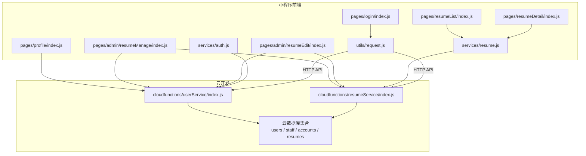
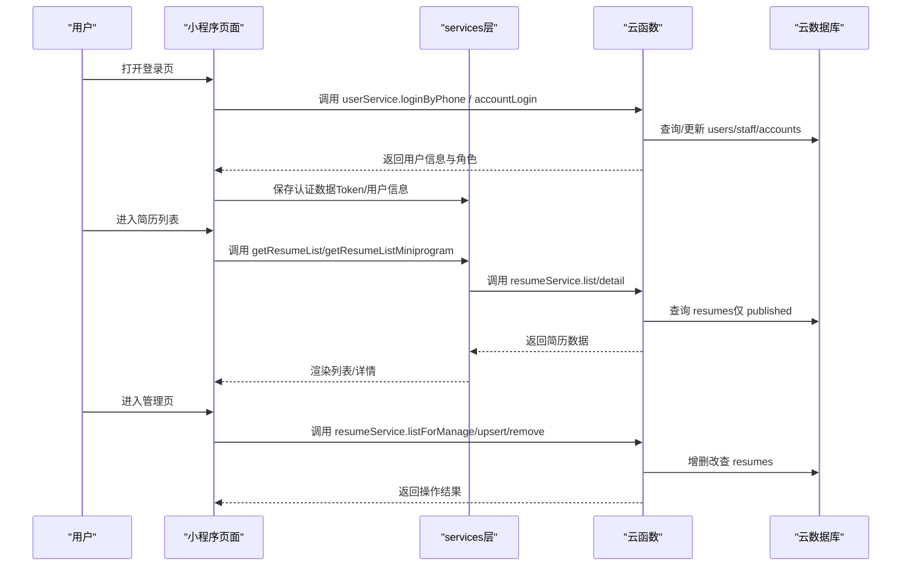
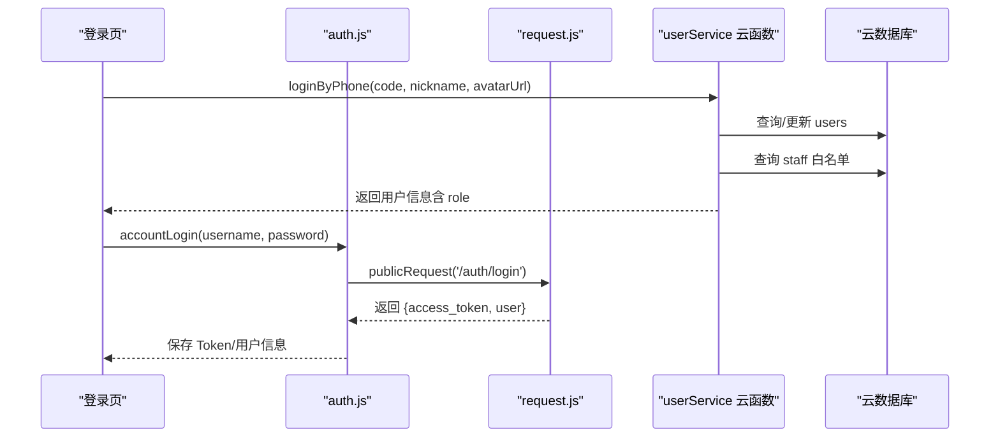
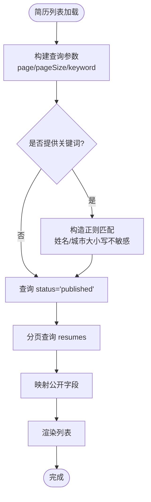
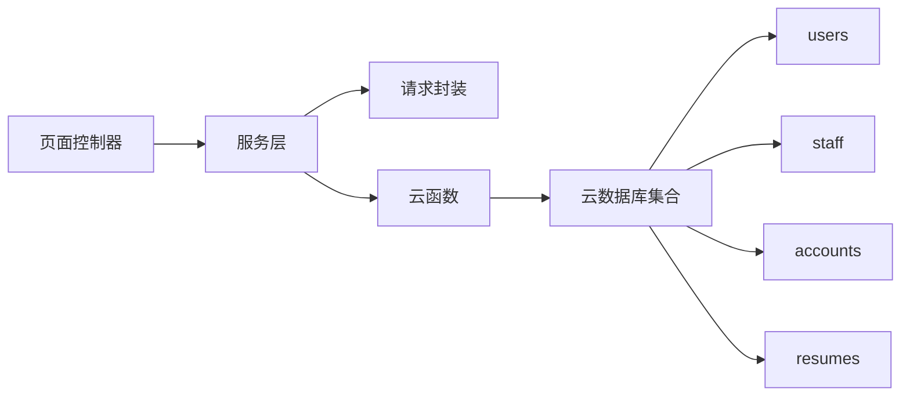

# 核心功能

<cite>
**本文引用的文件**
- [miniprogram/app.js](file://miniprogram/app.js)
- [miniprogram/utils/request.js](file://miniprogram/utils/request.js)
- [miniprogram/services/auth.js](file://miniprogram/services/auth.js)
- [miniprogram/services/resume.js](file://miniprogram/services/resume.js)
- [miniprogram/pages/login/index.js](file://miniprogram/pages/login/index.js)
- [miniprogram/pages/profile/index.js](file://miniprogram/pages/profile/index.js)
- [miniprogram/pages/resumeList/index.js](file://miniprogram/pages/resumeList/index.js)
- [miniprogram/pages/resumeDetail/index.js](file://miniprogram/pages/resumeDetail/index.js)
- [miniprogram/pages/admin/resumeManage/index.js](file://miniprogram/pages/admin/resumeManage/index.js)
- [miniprogram/pages/admin/resumeEdit/index.js](file://miniprogram/pages/admin/resumeEdit/index.js)
- [cloudfunctions/userService/index.js](file://cloudfunctions/userService/index.js)
- [cloudfunctions/resumeService/index.js](file://cloudfunctions/resumeService/index.js)
- [PRD.md](file://PRD.md)
- [docs/简历管理方案深度分析.md](file://docs/简历管理方案深度分析.md)
</cite>

## 目录
1. [简介](#简介)
2. [项目结构](#项目结构)
3. [核心组件](#核心组件)
4. [架构总览](#架构总览)
5. [详细组件分析](#详细组件分析)
6. [依赖关系分析](#依赖关系分析)
7. [性能考量](#性能考量)
8. [故障排查指南](#故障排查指南)
9. [结论](#结论)

## 简介
本文件围绕安得褓贝小程序的核心功能进行系统化梳理，覆盖用户系统、简历系统与权限系统三大模块。重点说明：
- 用户系统：支持微信手机号一键登录与账号密码登录两种方式；用户信息获取与更新流程；个人中心页面实现。
- 简历系统：简历列表展示（关键词搜索、分页加载）、简历详情查看（支持图片与视频展示）、员工端简历管理（增删改查、发布状态控制）。
- 权限系统：基于 staff 集合的员工白名单机制，通过 openid/phone 判定用户角色（staff/customer），并实施不同级别的访问控制。

## 项目结构
项目采用“小程序前端 + 云开发云函数 + 云数据库”的分层架构：
- 小程序前端负责页面交互、网络请求封装与业务编排。
- 云函数作为后端服务，提供用户与简历的鉴权与数据操作能力。
- 云数据库存储用户、员工白名单、账号密码与简历数据。

图表来源
- [miniprogram/pages/login/index.js](file://miniprogram/pages/login/index.js#L1-L294)
- [miniprogram/pages/profile/index.js](file://miniprogram/pages/profile/index.js#L1-L53)
- [miniprogram/pages/resumeList/index.js](file://miniprogram/pages/resumeList/index.js#L1-L698)
- [miniprogram/pages/resumeDetail/index.js](file://miniprogram/pages/resumeDetail/index.js#L1-L800)
- [miniprogram/pages/admin/resumeManage/index.js](file://miniprogram/pages/admin/resumeManage/index.js#L1-L112)
- [miniprogram/pages/admin/resumeEdit/index.js](file://miniprogram/pages/admin/resumeEdit/index.js#L1-L211)
- [miniprogram/services/auth.js](file://miniprogram/services/auth.js#L1-L163)
- [miniprogram/services/resume.js](file://miniprogram/services/resume.js#L1-L239)
- [miniprogram/utils/request.js](file://miniprogram/utils/request.js#L1-L125)
- [cloudfunctions/userService/index.js](file://cloudfunctions/userService/index.js#L1-L289)
- [cloudfunctions/resumeService/index.js](file://cloudfunctions/resumeService/index.js#L1-L216)

章节来源
- [miniprogram/app.js](file://miniprogram/app.js#L1-L21)
- [miniprogram/utils/request.js](file://miniprogram/utils/request.js#L1-L125)

## 核心组件
- 认证服务（auth.js）：封装账号密码登录、Token 管理、用户信息获取与本地存储。
- 简历服务（resume.js）：封装简历列表、详情、创建/更新/删除、分享与文件上传等 API。
- 云函数（userService/resumeService）：实现用户角色判定、简历增删改查与发布状态控制。
- 页面控制器：登录页、个人中心、简历列表、简历详情、员工管理与编辑页面。

章节来源
- [miniprogram/services/auth.js](file://miniprogram/services/auth.js#L1-L163)
- [miniprogram/services/resume.js](file://miniprogram/services/resume.js#L1-L239)
- [cloudfunctions/userService/index.js](file://cloudfunctions/userService/index.js#L1-L289)
- [cloudfunctions/resumeService/index.js](file://cloudfunctions/resumeService/index.js#L1-L216)

## 架构总览
整体交互流程如下：
- 小程序通过 utils/request.js 封装请求，区分公开与认证请求。
- 用户系统通过云函数 userService 完成微信手机号登录、账号密码登录、用户信息获取与更新。
- 简历系统通过云函数 resumeService 完成简历列表（仅 published）、详情、管理端列表、增删改查与发布状态控制。
- 权限控制：resumeService 内部 isStaff 通过 staff 集合判定，非 staff 角色无法执行管理操作。

图表来源
- [miniprogram/pages/login/index.js](file://miniprogram/pages/login/index.js#L1-L294)
- [miniprogram/services/auth.js](file://miniprogram/services/auth.js#L1-L163)
- [miniprogram/services/resume.js](file://miniprogram/services/resume.js#L1-L239)
- [cloudfunctions/userService/index.js](file://cloudfunctions/userService/index.js#L1-L289)
- [cloudfunctions/resumeService/index.js](file://cloudfunctions/resumeService/index.js#L1-L216)

## 详细组件分析

### 用户系统
- 支持两种登录方式：
  - 微信手机号一键登录：通过云函数调用微信手机号接口获取手机号，写入 users 并根据 staff 白名单判定角色。
  - 账号密码登录：调用“安得家政”API，返回 access_token 与用户信息，保存至本地存储。
- 用户信息获取与更新：
  - 通过云函数 userService.getOrCreateMe 获取或创建用户记录，并根据 staff 白名单动态更新角色。
  - 通过 updateMe 更新昵称、头像、手机号等字段。
- Token 管理：
  - validateToken 通过调用 /auth/me 验证 Token 有效性；authenticatedRequest 自动注入 Authorization。
  - 登录成功后同时写入 access_token 与 token，兼容不同后端字段。
- 个人中心页面：
  - 读取用户信息并展示；提供设置入口与跳转管理页。

图表来源
- [miniprogram/pages/login/index.js](file://miniprogram/pages/login/index.js#L1-L294)
- [miniprogram/services/auth.js](file://miniprogram/services/auth.js#L1-L163)
- [miniprogram/utils/request.js](file://miniprogram/utils/request.js#L1-L125)
- [cloudfunctions/userService/index.js](file://cloudfunctions/userService/index.js#L1-L289)

章节来源
- [miniprogram/pages/login/index.js](file://miniprogram/pages/login/index.js#L1-L294)
- [miniprogram/pages/profile/index.js](file://miniprogram/pages/profile/index.js#L1-L53)
- [miniprogram/services/auth.js](file://miniprogram/services/auth.js#L1-L163)
- [cloudfunctions/userService/index.js](file://cloudfunctions/userService/index.js#L1-L289)

### 简历系统
- 列表展示（C端公开）：
  - 仅返回 status=published 的简历，关键词搜索仅匹配姓名/城市（正则模糊，大小写不敏感），分页 page 从 0 开始，pageSize 最大 20。
  - 小程序端提供 getResumeListMiniprogram 供内部使用，支持 keyword/jobType/orderStatus 等筛选。
- 详情查看：
  - 公开接口返回封面、照片、视频等字段；详情页对字段进行兼容与格式化，支持视频与图片切换、相册浏览、证书预览。
  - 详情页支持从列表页预加载视频，减少二次加载时延。
- 员工端简历管理：
  - 仅 staff 角色可访问管理页与执行 upsert/remove。
  - upsert 支持草稿/发布状态切换；remove 删除简历；listForManage 返回最近更新的简历列表。
- 媒体上传：
  - 简历编辑页支持封面、照片、视频上传，统一上传到云存储并返回 fileID。
  - 服务层 uploadFile 支持小程序端直传 fileID。

图表来源
- [cloudfunctions/resumeService/index.js](file://cloudfunctions/resumeService/index.js#L78-L106)
- [miniprogram/services/resume.js](file://miniprogram/services/resume.js#L1-L71)
- [miniprogram/pages/resumeList/index.js](file://miniprogram/pages/resumeList/index.js#L321-L400)

章节来源
- [cloudfunctions/resumeService/index.js](file://cloudfunctions/resumeService/index.js#L78-L133)
- [miniprogram/services/resume.js](file://miniprogram/services/resume.js#L1-L135)
- [miniprogram/pages/resumeList/index.js](file://miniprogram/pages/resumeList/index.js#L1-L698)
- [miniprogram/pages/resumeDetail/index.js](file://miniprogram/pages/resumeDetail/index.js#L1-L800)
- [miniprogram/pages/admin/resumeManage/index.js](file://miniprogram/pages/admin/resumeManage/index.js#L1-L112)
- [miniprogram/pages/admin/resumeEdit/index.js](file://miniprogram/pages/admin/resumeEdit/index.js#L1-L211)

### 权限系统
- 员工白名单机制：
  - 通过 staff 集合的 openid/phone 判定用户是否为 staff。
  - 优先使用手机号匹配，若无手机号则回退到 openid 匹配。
- 角色判定与访问控制：
  - 用户首次访问时，getOrCreateMe 会根据 staff 白名单更新用户角色。
  - 管理端页面在 onShow 时再次校验角色，非 staff 直接提示并跳转。
  - 云函数 resumeService 的 detail/listForManage/upsert/remove 均在执行前校验 isStaff，拒绝则抛出权限错误。
- 业务规则：
  - 仅 status=published 的简历对 C 端可见。
  - 搜索仅匹配姓名/城市字段。

```mermaid
flowchart TD
A["用户访问管理页"] --> B["调用 userService.getOrCreateMe"]
B --> C{"role 是否为 staff?"}
C --> |是| D["允许访问管理页"]
C --> |否| E["提示无权限并跳转个人中心"]
D --> F["调用 resumeService.listForManage/upsert/remove"]
F --> G{"isStaff(openid)?"}
G --> |是| H["执行业务操作"]
G --> |否| I["抛出权限错误"]
```

图表来源
- [cloudfunctions/userService/index.js](file://cloudfunctions/userService/index.js#L26-L84)
- [cloudfunctions/resumeService/index.js](file://cloudfunctions/resumeService/index.js#L26-L56)
- [miniprogram/pages/admin/resumeManage/index.js](file://miniprogram/pages/admin/resumeManage/index.js#L29-L71)

章节来源
- [cloudfunctions/userService/index.js](file://cloudfunctions/userService/index.js#L26-L84)
- [cloudfunctions/resumeService/index.js](file://cloudfunctions/resumeService/index.js#L26-L56)
- [miniprogram/pages/admin/resumeManage/index.js](file://miniprogram/pages/admin/resumeManage/index.js#L1-L112)
- [docs/简历管理方案深度分析.md](file://docs/简历管理方案深度分析.md#L12-L103)
- [PRD.md](file://PRD.md#L222-L254)

## 依赖关系分析
- 前端依赖关系：
  - pages/* 依赖 services/* 与 utils/request.js。
  - services/auth.js 依赖 utils/request.js。
  - services/resume.js 依赖 utils/request.js。
- 云函数依赖关系：
  - userService/resumeService 依赖 wx-server-sdk 与云数据库。
  - 两者均依赖 staff 集合进行权限判定。
- 数据集合依赖：
  - users：用户档案与角色。
  - staff：员工白名单（openid/phone）。
  - accounts：账号密码登录凭证。
  - resumes：简历数据与发布状态。

图表来源
- [miniprogram/utils/request.js](file://miniprogram/utils/request.js#L1-L125)
- [miniprogram/services/auth.js](file://miniprogram/services/auth.js#L1-L163)
- [miniprogram/services/resume.js](file://miniprogram/services/resume.js#L1-L239)
- [cloudfunctions/userService/index.js](file://cloudfunctions/userService/index.js#L1-L289)
- [cloudfunctions/resumeService/index.js](file://cloudfunctions/resumeService/index.js#L1-L216)

章节来源
- [cloudfunctions/userService/index.js](file://cloudfunctions/userService/index.js#L1-L289)
- [cloudfunctions/resumeService/index.js](file://cloudfunctions/resumeService/index.js#L1-L216)
- [PRD.md](file://PRD.md#L222-L254)

## 性能考量
- 视频预加载策略：
  - 简历列表页提供 VideoPreloader，支持 cloud:// URL 转换、并发下载、缓存清理与批量预加载，降低首屏视频加载卡顿。
  - 详情页优先使用列表页预加载的本地路径，避免二次下载。
- 列表分页与筛选：
  - 服务端限制 pageSize 最大 20，page 从 0 开始；前端在无筛选时使用 total 字段，筛选时回退到本地计数。
- 媒体上传：
  - 编辑页支持多图/视频上传，统一走云存储，减少前端体积与跨域复杂度。

章节来源
- [miniprogram/pages/resumeList/index.js](file://miniprogram/pages/resumeList/index.js#L1-L195)
- [miniprogram/pages/resumeDetail/index.js](file://miniprogram/pages/resumeDetail/index.js#L450-L520)
- [cloudfunctions/resumeService/index.js](file://cloudfunctions/resumeService/index.js#L78-L106)

## 故障排查指南
- 登录失败：
  - 账号密码登录：检查域名配置与网络请求错误，必要时关闭开发者工具的“不校验合法域名”设置。
  - 微信手机号登录：确认用户已授权且昵称已填写，头像上传失败不影响登录流程。
- Token 过期：
  - authenticatedRequest 在 401 时自动清除本地 Token 并跳转登录页。
- 权限错误：
  - 管理页提示“仅员工可访问”或云函数返回“permission denied”，检查 staff 白名单与 openid/phone 是否正确。
- 简历列表为空：
  - 确认简历状态为 published，关键词仅匹配姓名/城市，分页参数是否正确。

章节来源
- [miniprogram/pages/login/index.js](file://miniprogram/pages/login/index.js#L195-L294)
- [miniprogram/utils/request.js](file://miniprogram/utils/request.js#L43-L103)
- [cloudfunctions/resumeService/index.js](file://cloudfunctions/resumeService/index.js#L108-L133)
- [miniprogram/pages/admin/resumeManage/index.js](file://miniprogram/pages/admin/resumeManage/index.js#L29-L71)

## 结论
本项目通过清晰的三层架构实现了用户、简历与权限三大核心功能：
- 用户系统支持微信手机号与账号密码两种登录方式，并以 staff 白名单为核心实现员工角色判定。
- 简历系统遵循“仅 published 对 C 端可见”的规则，提供关键词搜索与分页加载，详情页支持图片与视频展示，并提供员工端的增删改查与发布状态控制。
- 权限系统以云函数为中心，结合前端拦截与后端校验，确保管理操作的安全性。