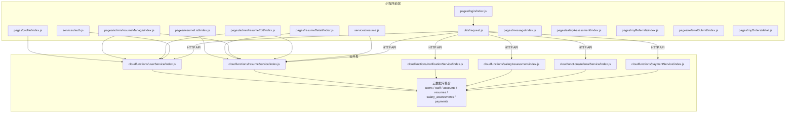
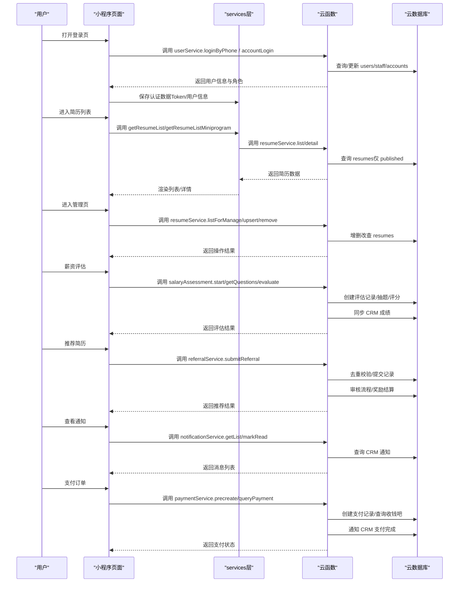
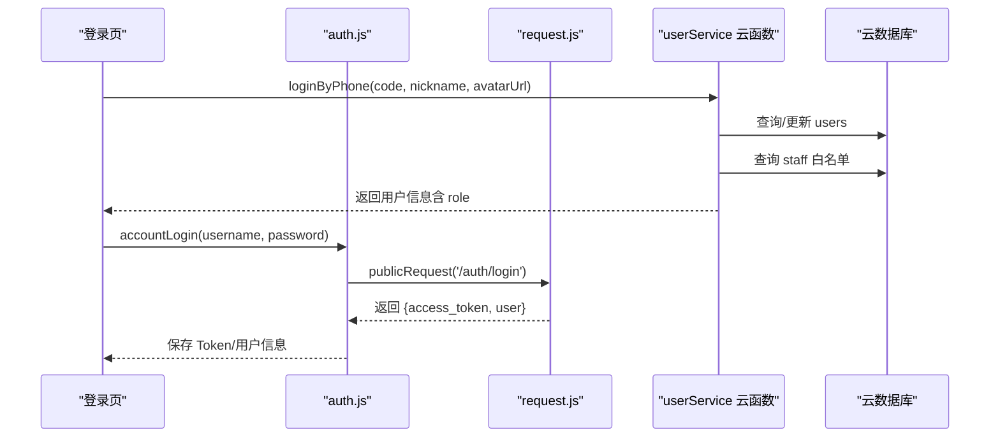
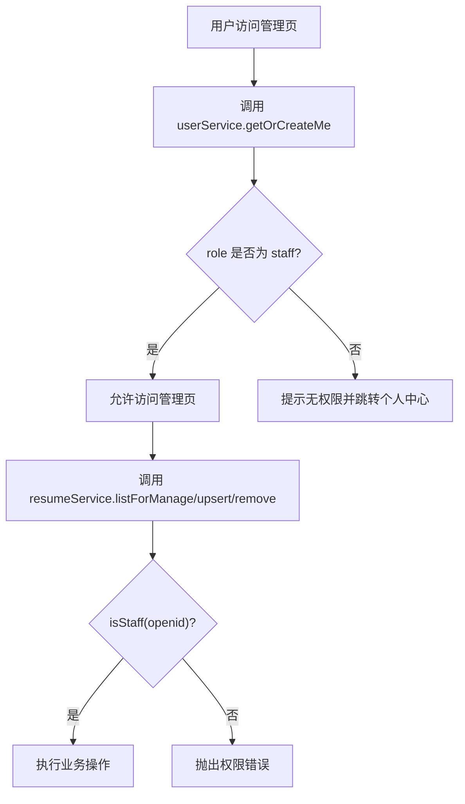
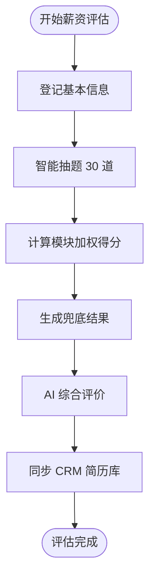
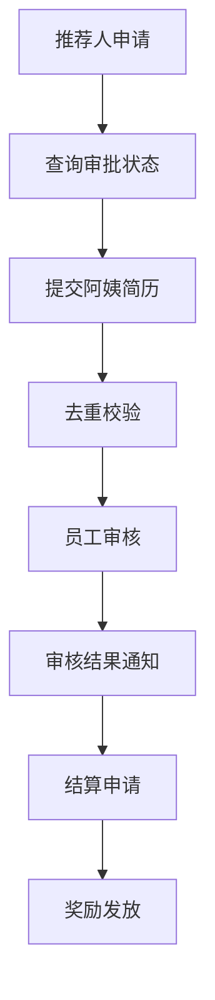
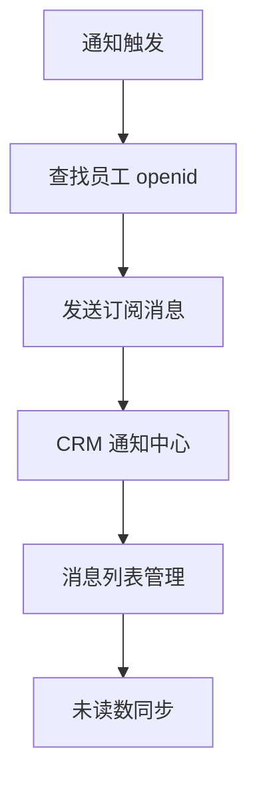
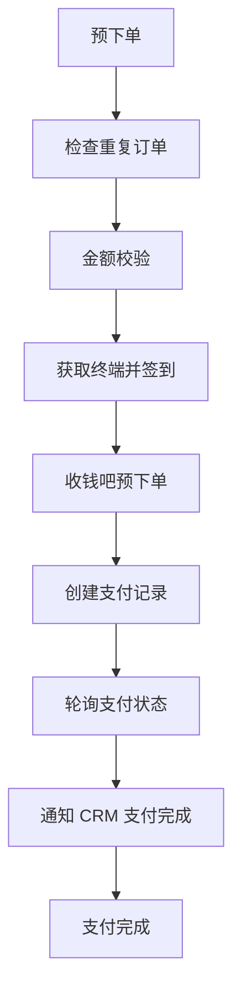
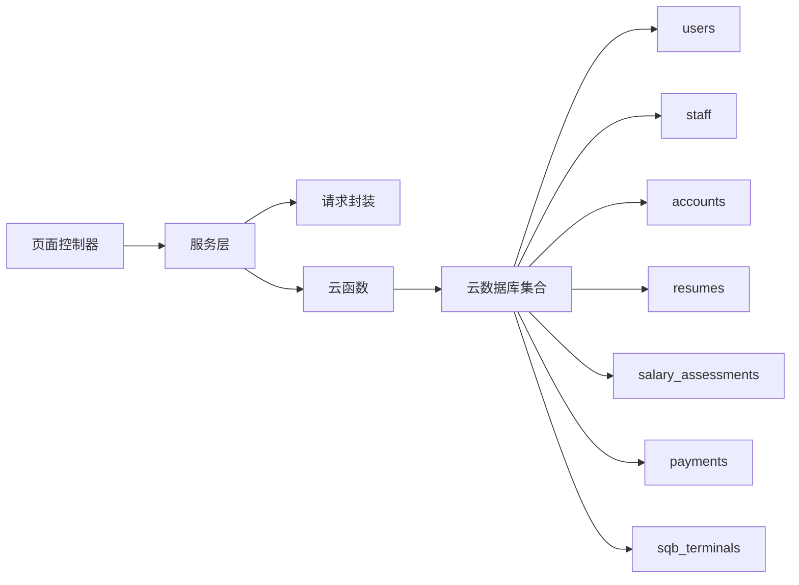

# 核心功能

<cite>
**本文引用的文件**
- [miniprogram/app.js](file://miniprogram/app.js)
- [miniprogram/utils/request.js](file://miniprogram/utils/request.js)
- [miniprogram/services/auth.js](file://miniprogram/services/auth.js)
- [miniprogram/services/resume.js](file://miniprogram/services/resume.js)
- [miniprogram/services/userService.js](file://miniprogram/services/userService.js)
- [miniprogram/pages/login/index.js](file://miniprogram/pages/login/index.js)
- [miniprogram/pages/profile/index.js](file://miniprogram/pages/profile/index.js)
- [miniprogram/pages/resumeList/index.js](file://miniprogram/pages/resumeList/index.js)
- [miniprogram/pages/resumeDetail/index.js](file://miniprogram/pages/resumeDetail/index.js)
- [miniprogram/pages/admin/resumeManage/index.js](file://miniprogram/pages/admin/resumeManage/index.js)
- [miniprogram/pages/admin/resumeEdit/index.js](file://miniprogram/pages/admin/resumeEdit/index.js)
- [miniprogram/pages/message/index.js](file://miniprogram/pages/message/index.js)
- [miniprogram/pages/salaryAssessment/index.js](file://miniprogram/pages/salaryAssessment/index.js)
- [miniprogram/pages/myReferrals/index.js](file://miniprogram/pages/myReferrals/index.js)
- [miniprogram/pages/referralSubmit/index.js](file://miniprogram/pages/referralSubmit/index.js)
- [miniprogram/pages/myOrders/detail.js](file://miniprogram/pages/myOrders/detail.js)
- [cloudfunctions/userService/index.js](file://cloudfunctions/userService/index.js)
- [cloudfunctions/resumeService/index.js](file://cloudfunctions/resumeService/index.js)
- [cloudfunctions/notificationService/index.js](file://cloudfunctions/notificationService/index.js)
- [cloudfunctions/salaryAssessment/index.js](file://cloudfunctions/salaryAssessment/index.js)
- [cloudfunctions/referralService/index.js](file://cloudfunctions/referralService/index.js)
- [cloudfunctions/paymentService/index.js](file://cloudfunctions/paymentService/index.js)
- [PRD.md](file://PRD.md)
- [docs/简历管理方案深度分析.md](file://docs/简历管理方案深度分析.md)
</cite>

## 目录
1. [简介](#简介)
2. [项目结构](#项目结构)
3. [核心组件](#核心组件)
4. [架构总览](#架构总览)
5. [详细组件分析](#详细组件分析)
6. [依赖关系分析](#依赖关系分析)
7. [性能考量](#性能考量)
8. [故障排查指南](#故障排查指南)
9. [结论](#结论)

## 简介
本文件围绕安得褓贝小程序的核心功能进行系统化梳理，覆盖用户系统、简历系统、权限系统、薪资评估系统、推荐系统、通知服务、支付服务七大模块。重点说明：
- 用户系统：支持微信手机号一键登录与账号密码登录两种方式；用户信息获取与更新流程；个人中心页面实现。
- 简历系统：简历列表展示（关键词搜索、分页加载）、简历详情查看（支持图片与视频展示）、员工端简历管理（增删改查、发布状态控制）。
- 权限系统：基于 staff 集合的员工白名单机制，通过 openid/phone 判定用户角色（staff/customer），并实施不同级别的访问控制。
- 薪资评估系统：AI 智能测评、30 题抽题策略、模块加权评分、兜底薪资区间计算、CRM 成绩同步。
- 推荐系统：推荐人申请、去重校验、简历提交、审核流程、结算申请、奖励发放。
- 通知服务：订阅消息推送、CRM 通知中心、消息列表管理、未读数同步。
- 支付服务：收钱吧支付对接、预下单、状态查询、退款、CRM 通知。

## 项目结构
项目采用"小程序前端 + 云开发云函数 + 云数据库"的分层架构：
- 小程序前端负责页面交互、网络请求封装与业务编排。
- 云函数作为后端服务，提供用户、简历、薪资评估、推荐、通知、支付等鉴权与数据操作能力。
- 云数据库存储用户、员工白名单、账号密码、简历、薪资评估记录、推荐记录等数据。

**图表来源**
- [miniprogram/pages/login/index.js:1-294](file://miniprogram/pages/login/index.js#L1-L294)
- [miniprogram/pages/profile/index.js:1-53](file://miniprogram/pages/profile/index.js#L1-L53)
- [miniprogram/pages/resumeList/index.js:1-698](file://miniprogram/pages/resumeList/index.js#L1-L698)
- [miniprogram/pages/resumeDetail/index.js:1-800](file://miniprogram/pages/resumeDetail/index.js#L1-L800)
- [miniprogram/pages/admin/resumeManage/index.js:1-112](file://miniprogram/pages/admin/resumeManage/index.js#L1-L112)
- [miniprogram/pages/admin/resumeEdit/index.js:1-211](file://miniprogram/pages/admin/resumeEdit/index.js#L1-L211)
- [miniprogram/services/auth.js:1-163](file://miniprogram/services/auth.js#L1-L163)
- [miniprogram/services/resume.js:1-239](file://miniprogram/services/resume.js#L1-L239)
- [miniprogram/utils/request.js:1-125](file://miniprogram/utils/request.js#L1-L125)
- [cloudfunctions/userService/index.js:1-289](file://cloudfunctions/userService/index.js#L1-L289)
- [cloudfunctions/resumeService/index.js:1-216](file://cloudfunctions/resumeService/index.js#L1-L216)
- [cloudfunctions/notificationService/index.js:1-248](file://cloudfunctions/notificationService/index.js#L1-L248)
- [cloudfunctions/salaryAssessment/index.js:1-882](file://cloudfunctions/salaryAssessment/index.js#L1-L882)
- [cloudfunctions/referralService/index.js:1-374](file://cloudfunctions/referralService/index.js#L1-L374)
- [cloudfunctions/paymentService/index.js:1-662](file://cloudfunctions/paymentService/index.js#L1-L662)

**章节来源**
- [miniprogram/app.js:1-21](file://miniprogram/app.js#L1-L21)
- [miniprogram/utils/request.js:1-125](file://miniprogram/utils/request.js#L1-L125)

## 核心组件
- 认证服务（auth.js）：封装账号密码登录、Token 管理、用户信息获取与本地存储。
- 简历服务（resume.js）：封装简历列表、详情、创建/更新/删除、分享与文件上传等 API。
- 云函数（userService/resumeService）：实现用户角色判定、简历增删改查与发布状态控制。
- 页面控制器：登录页、个人中心、简历列表、简历详情、员工管理与编辑页面。
- **新增** 薪资评估服务（salaryAssessment）：AI 智能测评、30 题抽题、评分计算、CRM 同步。
- **新增** 推荐服务（referralService）：推荐人申请、简历提交、审核、结算。
- **新增** 通知服务（notificationService）：订阅消息、CRM 通知中心、消息管理。
- **新增** 支付服务（paymentService）：收钱吧支付对接、预下单、状态查询、退款。

**章节来源**
- [miniprogram/services/auth.js:1-163](file://miniprogram/services/auth.js#L1-L163)
- [miniprogram/services/resume.js:1-239](file://miniprogram/services/resume.js#L1-L239)
- [cloudfunctions/userService/index.js:1-289](file://cloudfunctions/userService/index.js#L1-L289)
- [cloudfunctions/resumeService/index.js:1-216](file://cloudfunctions/resumeService/index.js#L1-L216)
- [cloudfunctions/salaryAssessment/index.js:1-882](file://cloudfunctions/salaryAssessment/index.js#L1-L882)
- [cloudfunctions/referralService/index.js:1-374](file://cloudfunctions/referralService/index.js#L1-L374)
- [cloudfunctions/notificationService/index.js:1-248](file://cloudfunctions/notificationService/index.js#L1-L248)
- [cloudfunctions/paymentService/index.js:1-662](file://cloudfunctions/paymentService/index.js#L1-L662)

## 架构总览
整体交互流程如下：
- 小程序通过 utils/request.js 封装请求，区分公开与认证请求。
- 用户系统通过云函数 userService 完成微信手机号登录、账号密码登录、用户信息获取与更新。
- 简历系统通过云函数 resumeService 完成简历列表（仅 published）、详情、管理端列表、增删改查与发布状态控制。
- 权限控制：resumeService 内部 isStaff 通过 staff 集合判定，非 staff 角色无法执行管理操作。
- **新增** 薪资评估系统：小程序端发起测评登记，云函数生成 30 题问卷，AI 评分后同步 CRM。
- **新增** 推荐系统：推荐人通过小程序提交简历，经过 CRM 审核后进入奖励流程。
- **新增** 通知服务：订阅消息推送员工简历查看，CRM 通知中心支持消息列表与标记已读。
- **新增** 支付服务：收钱吧对接，支持家政合同与职培订单支付、状态查询、退款。

**图表来源**
- [miniprogram/pages/login/index.js:1-294](file://miniprogram/pages/login/index.js#L1-L294)
- [miniprogram/services/auth.js:1-163](file://miniprogram/services/auth.js#L1-L163)
- [miniprogram/services/resume.js:1-239](file://miniprogram/services/resume.js#L1-L239)
- [cloudfunctions/userService/index.js:1-289](file://cloudfunctions/userService/index.js#L1-L289)
- [cloudfunctions/resumeService/index.js:1-216](file://cloudfunctions/resumeService/index.js#L1-L216)
- [cloudfunctions/salaryAssessment/index.js:477-720](file://cloudfunctions/salaryAssessment/index.js#L477-L720)
- [cloudfunctions/referralService/index.js:154-196](file://cloudfunctions/referralService/index.js#L154-L196)
- [cloudfunctions/notificationService/index.js:223-247](file://cloudfunctions/notificationService/index.js#L223-L247)
- [cloudfunctions/paymentService/index.js:211-405](file://cloudfunctions/paymentService/index.js#L211-L405)

## 详细组件分析

### 用户系统
- 支持两种登录方式：
  - 微信手机号一键登录：通过云函数调用微信手机号接口获取手机号，写入 users 并根据 staff 白名单判定角色。
  - 账号密码登录：调用"安得家政"API，返回 access_token 与用户信息，保存至本地存储。
- 用户信息获取与更新：
  - 通过云函数 userService.getOrCreateMe 获取或创建用户记录，并根据 staff 白名单动态更新角色。
  - 通过 updateMe 更新昵称、头像、手机号等字段。
- Token 管理：
  - validateToken 通过调用 /auth/me 验证 Token 有效性；authenticatedRequest 自动注入 Authorization。
  - 登录成功后同时写入 access_token 与 token，兼容不同后端字段。
- 个人中心页面：
  - 读取用户信息并展示；提供设置入口与跳转管理页。

**图表来源**
- [miniprogram/pages/login/index.js:1-294](file://miniprogram/pages/login/index.js#L1-L294)
- [miniprogram/services/auth.js:1-163](file://miniprogram/services/auth.js#L1-L163)
- [miniprogram/utils/request.js:1-125](file://miniprogram/utils/request.js#L1-L125)
- [cloudfunctions/userService/index.js:1-289](file://cloudfunctions/userService/index.js#L1-L289)

**章节来源**
- [miniprogram/pages/login/index.js:1-294](file://miniprogram/pages/login/index.js#L1-L294)
- [miniprogram/pages/profile/index.js:1-53](file://miniprogram/pages/profile/index.js#L1-L53)
- [miniprogram/services/auth.js:1-163](file://miniprogram/services/auth.js#L1-L163)
- [cloudfunctions/userService/index.js:1-289](file://cloudfunctions/userService/index.js#L1-L289)

### 简历系统
- 列表展示（C端公开）：
  - 仅返回 status=published 的简历，关键词搜索仅匹配姓名/城市（正则模糊，大小写不敏感），分页 page 从 0 开始，pageSize 最大 20。
  - 小程序端提供 getResumeListMiniprogram 供内部使用，支持 keyword/jobType/orderStatus 等筛选。
- 详情查看：
  - 公开接口返回封面、照片、视频等字段；详情页对字段进行兼容与格式化，支持视频与图片切换、相册浏览、证书预览。
  - 详情页支持从列表页预加载视频，减少二次加载时延。
- 员工端简历管理：
  - 仅 staff 角色可访问管理页与执行 upsert/remove。
  - upsert 支持草稿/发布状态切换；remove 删除简历；listForManage 返回最近更新的简历列表。
- 媒体上传：
  - 简历编辑页支持封面、照片、视频上传，统一上传到云存储并返回 fileID。
  - 服务层 uploadFile 支持小程序端直传 fileID。

**图表来源**
- [cloudfunctions/resumeService/index.js:78-106](file://cloudfunctions/resumeService/index.js#L78-L106)
- [miniprogram/services/resume.js:1-71](file://miniprogram/services/resume.js#L1-L71)
- [miniprogram/pages/resumeList/index.js:321-400](file://miniprogram/pages/resumeList/index.js#L321-L400)

**章节来源**
- [cloudfunctions/resumeService/index.js:78-133](file://cloudfunctions/resumeService/index.js#L78-L133)
- [miniprogram/services/resume.js:1-135](file://miniprogram/services/resume.js#L1-L135)
- [miniprogram/pages/resumeList/index.js:1-698](file://miniprogram/pages/resumeList/index.js#L1-L698)
- [miniprogram/pages/resumeDetail/index.js:1-800](file://miniprogram/pages/resumeDetail/index.js#L1-L800)
- [miniprogram/pages/admin/resumeManage/index.js:1-112](file://miniprogram/pages/admin/resumeManage/index.js#L1-L112)
- [miniprogram/pages/admin/resumeEdit/index.js:1-211](file://miniprogram/pages/admin/resumeEdit/index.js#L1-L211)

### 权限系统
- 员工白名单机制：
  - 通过 staff 集合的 openid/phone 判定用户是否为 staff。
  - 优先使用手机号匹配，若无手机号则回退到 openid 匹配。
- 角色判定与访问控制：
  - 用户首次访问时，getOrCreateMe 会根据 staff 白名单更新用户角色。
  - 管理端页面在 onShow 时再次校验角色，非 staff 直接提示并跳转。
  - 云函数 resumeService 的 detail/listForManage/upsert/remove 均在执行前校验 isStaff，拒绝则抛出权限错误。
- 业务规则：
  - 仅 status=published 的简历对 C 端可见。
  - 搜索仅匹配姓名/城市字段。

**图表来源**
- [cloudfunctions/userService/index.js:26-84](file://cloudfunctions/userService/index.js#L26-L84)
- [cloudfunctions/resumeService/index.js:26-56](file://cloudfunctions/resumeService/index.js#L26-L56)
- [miniprogram/pages/admin/resumeManage/index.js:29-71](file://miniprogram/pages/admin/resumeManage/index.js#L29-L71)

**章节来源**
- [cloudfunctions/userService/index.js:26-84](file://cloudfunctions/userService/index.js#L26-L84)
- [cloudfunctions/resumeService/index.js:26-56](file://cloudfunctions/resumeService/index.js#L26-L56)
- [miniprogram/pages/admin/resumeManage/index.js:1-112](file://miniprogram/pages/admin/resumeManage/index.js#L1-L112)
- [docs/简历管理方案深度分析.md:12-103](file://docs/简历管理方案深度分析.md#L12-L103)
- [PRD.md:222-254](file://PRD.md#L222-L254)

### 薪资评估系统
- **新增** 评估流程：
  - 登记阶段：收集基本信息（姓名、手机号、工种、年龄、经验、学历、城市），生成 assessmentId。
  - 抽题阶段：按工种智能抽取 30 道题（硬件4+技能18+心理8），内存缓存题库，支持难度配额与子类轮询分配。
  - 评分阶段：计算模块加权得分（硬件20%/技能60%/心理20%），实时返回兜底结果。
  - AI 出稿：调用豆包 AI 生成综合评价、优势、改进建议、薪资区间。
  - CRM 同步：将测评结果同步到 CRM 简历库，支持幂等回写。
- **新增** AI 评分 Prompt：
  - 包含应聘者基本信息、模块得分、完整答题情况、城市薪资行情参考。
  - 输出严格 JSON 结构，包含总分、等级、优势、改进建议、薪资区间、理由等。
- **新增** 薪资矩阵：
  - 北京基准 + 城市系数调整，支持月嫂按"元/单"、其他工种按"元/月"计价。
  - 五档等级映射到具体薪资区间，支持按城市分档（一线/新一线/其他）。

**图表来源**
- [cloudfunctions/salaryAssessment/index.js:376-459](file://cloudfunctions/salaryAssessment/index.js#L376-L459)
- [cloudfunctions/salaryAssessment/index.js:602-647](file://cloudfunctions/salaryAssessment/index.js#L602-L647)
- [cloudfunctions/salaryAssessment/index.js:649-720](file://cloudfunctions/salaryAssessment/index.js#L649-L720)

**章节来源**
- [cloudfunctions/salaryAssessment/index.js:1-882](file://cloudfunctions/salaryAssessment/index.js#L1-L882)
- [miniprogram/pages/salaryAssessment/index.js:1-335](file://miniprogram/pages/salaryAssessment/index.js#L1-L335)

### 推荐系统
- **新增** 推荐人管理：
  - 推荐人申请：通过 CRM 完成身份验证与审核，审批通过后同步用户角色。
  - 推荐人状态查询：实时获取审批状态与来源员工信息。
  - 推荐人统计：展示推荐总数、已签单数、累计奖励等指标。
- **新增** 简历推荐：
  - 去重校验：CRM 侧去重 + 本地简历库双重校验。
  - 简历提交：支持姓名、手机号、身份证号、服务类型、经验、备注等信息。
  - 审核流程：员工端分配待审核列表，支持通过/拒绝操作。
  - 结算申请：支持奖励金额、收款信息、银行账户等结算资料。
- **新增** 工种管理：
  - 动态加载 CRM 工种列表，支持英文 key 与中文标签映射。
  - 兜底工种列表，CRM 不可达时使用。

**图表来源**
- [cloudfunctions/referralService/index.js:65-117](file://cloudfunctions/referralService/index.js#L65-L117)
- [cloudfunctions/referralService/index.js:154-196](file://cloudfunctions/referralService/index.js#L154-L196)
- [cloudfunctions/referralService/index.js:245-279](file://cloudfunctions/referralService/index.js#L245-L279)

**章节来源**
- [cloudfunctions/referralService/index.js:1-374](file://cloudfunctions/referralService/index.js#L1-L374)
- [miniprogram/pages/myReferrals/index.js:1-100](file://miniprogram/pages/myReferrals/index.js#L1-L100)
- [miniprogram/pages/referralSubmit/index.js:1-186](file://miniprogram/pages/referralSubmit/index.js#L1-L186)

### 通知服务
- **新增** 订阅消息：
  - 简历查看通知：当客户查看员工简历时，向员工发送订阅消息提醒。
  - 多渠道查找：优先从 users 集合查找 openid，回退到 staff_profiles 集合。
  - 错误诊断：支持测试发送、openid 查询、集合数据导出等诊断功能。
- **新增** CRM 通知中心：
  - 消息列表：支持分页查询、未读数统计、消息标记已读。
  - 类型配置：合同相关、推荐相关等不同类型的消息配置不同跳转路径。
  - 未读数同步：全局刷新消息未读数，更新 tabBar 红点。
- **新增** 通知类型：
  - 合同邀请、已签约、付款成功、阿姨确认、合同到期等。
  - 推荐相关：新推荐待审核、推荐官审批、审核结果、奖励到账等。

**图表来源**
- [cloudfunctions/notificationService/index.js:45-97](file://cloudfunctions/notificationService/index.js#L45-L97)
- [cloudfunctions/notificationService/index.js:223-247](file://cloudfunctions/notificationService/index.js#L223-L247)

**章节来源**
- [cloudfunctions/notificationService/index.js:1-248](file://cloudfunctions/notificationService/index.js#L1-L248)
- [miniprogram/pages/message/index.js:1-226](file://miniprogram/pages/message/index.js#L1-L226)

### 支付服务
- **新增** 收钱吧支付对接：
  - 终端管理：激活码激活、自动签到、终端密钥轮换。
  - 预下单：支持家政合同与职培订单，金额从 CRM 获取，防篡改校验。
  - 状态查询：轮询收钱吧订单状态，同步支付结果到 CRM。
  - 退款处理：支持部分/全额退款，状态回写。
- **新增** 支付流程：
  - 防重复支付：按合同ID + 状态查询，避免重复创建订单。
  - 金额校验：CRM 二次校验应付金额，防止客户端篡改。
  - CRM 通知：支付成功异步通知 CRM，支持家政与职培两类订单。
- **新增** 订单类型：
  - 家政合同：从 CRM 合同 serviceFee 读取金额。
  - 职培订单：客户端传入金额，CRM 校验 payableAmountCents 与 paymentEnabled。

**图表来源**
- [cloudfunctions/paymentService/index.js:211-348](file://cloudfunctions/paymentService/index.js#L211-L348)
- [cloudfunctions/paymentService/index.js:354-405](file://cloudfunctions/paymentService/index.js#L354-L405)

**章节来源**
- [cloudfunctions/paymentService/index.js:1-662](file://cloudfunctions/paymentService/index.js#L1-L662)
- [miniprogram/pages/myOrders/detail.js:1-197](file://miniprogram/pages/myOrders/detail.js#L1-L197)

## 依赖关系分析
- 前端依赖关系：
  - pages/* 依赖 services/* 与 utils/request.js。
  - services/auth.js 依赖 utils/request.js。
  - services/resume.js 依赖 utils/request.js。
  - **新增** services/userService.js 依赖 utils/request.js。
- 云函数依赖关系：
  - userService/resumeService 依赖 wx-server-sdk 与云数据库。
  - 两者均依赖 staff 集合进行权限判定。
  - **新增** salaryAssessment 依赖 wx-server-sdk、HTTPS 请求、CRM 接口。
  - **新增** referralService 依赖 HTTPS 请求、CRM 接口。
  - **新增** notificationService 依赖 wx-server-sdk、HTTPS 请求。
  - **新增** paymentService 依赖 wx-server-sdk、收钱吧 API、HTTPS 请求。
- 数据集合依赖：
  - users：用户档案与角色。
  - staff：员工白名单（openid/phone）。
  - accounts：账号密码登录凭证。
  - resumes：简历数据与发布状态。
  - **新增** salary_assessments：薪资评估记录与结果。
  - **新增** payments：支付订单与状态。
  - **新增** sqb_terminals：收钱吧终端信息。

**图表来源**
- [miniprogram/utils/request.js:1-125](file://miniprogram/utils/request.js#L1-L125)
- [miniprogram/services/auth.js:1-163](file://miniprogram/services/auth.js#L1-L163)
- [miniprogram/services/resume.js:1-239](file://miniprogram/services/resume.js#L1-L239)
- [cloudfunctions/userService/index.js:1-289](file://cloudfunctions/userService/index.js#L1-L289)
- [cloudfunctions/resumeService/index.js:1-216](file://cloudfunctions/resumeService/index.js#L1-L216)
- [cloudfunctions/salaryAssessment/index.js:1-882](file://cloudfunctions/salaryAssessment/index.js#L1-L882)
- [cloudfunctions/referralService/index.js:1-374](file://cloudfunctions/referralService/index.js#L1-L374)
- [cloudfunctions/notificationService/index.js:1-248](file://cloudfunctions/notificationService/index.js#L1-L248)
- [cloudfunctions/paymentService/index.js:1-662](file://cloudfunctions/paymentService/index.js#L1-L662)

**章节来源**
- [cloudfunctions/userService/index.js:1-289](file://cloudfunctions/userService/index.js#L1-L289)
- [cloudfunctions/resumeService/index.js:1-216](file://cloudfunctions/resumeService/index.js#L1-L216)
- [cloudfunctions/salaryAssessment/index.js:1-882](file://cloudfunctions/salaryAssessment/index.js#L1-L882)
- [cloudfunctions/referralService/index.js:1-374](file://cloudfunctions/referralService/index.js#L1-L374)
- [cloudfunctions/notificationService/index.js:1-248](file://cloudfunctions/notificationService/index.js#L1-L248)
- [cloudfunctions/paymentService/index.js:1-662](file://cloudfunctions/paymentService/index.js#L1-L662)
- [PRD.md:222-254](file://PRD.md#L222-L254)

## 性能考量
- 视频预加载策略：
  - 简历列表页提供 VideoPreloader，支持 cloud:// URL 转换、并发下载、缓存清理与批量预加载，降低首屏视频加载卡顿。
  - 详情页优先使用列表页预加载的本地路径，避免二次下载。
- 列表分页与筛选：
  - 服务端限制 pageSize 最大 20，page 从 0 开始；前端在无筛选时使用 total 字段，筛选时回退到本地计数。
- 媒体上传：
  - 编辑页支持多图/视频上传，统一走云存储，减少前端体积与跨域复杂度。
- **新增** 题库缓存：
  - 薪资评估系统使用内存缓存题库，TTL 10 分钟，热启动直接 JS 随机抽样，减少数据库查询压力。
- **新增** 支付防重：
  - 预下单前检查现有订单状态，避免重复创建；收钱吧订单状态轮询，防止重复扣款风险。
- **新增** 通知优化：
  - 全局刷新消息未读数，避免重复拉取；tabBar 红点与消息列表同步更新。

**章节来源**
- [miniprogram/pages/resumeList/index.js:1-195](file://miniprogram/pages/resumeList/index.js#L1-L195)
- [miniprogram/pages/resumeDetail/index.js:450-520](file://miniprogram/pages/resumeDetail/index.js#L450-L520)
- [cloudfunctions/resumeService/index.js:78-106](file://cloudfunctions/resumeService/index.js#L78-L106)
- [cloudfunctions/salaryAssessment/index.js:310-340](file://cloudfunctions/salaryAssessment/index.js#L310-L340)
- [cloudfunctions/paymentService/index.js:217-255](file://cloudfunctions/paymentService/index.js#L217-L255)
- [miniprogram/app.js:227-247](file://miniprogram/app.js#L227-L247)

## 故障排查指南
- 登录失败：
  - 账号密码登录：检查域名配置与网络请求错误，必要时关闭开发者工具的"不校验合法域名"设置。
  - 微信手机号登录：确认用户已授权且昵称已填写，头像上传失败不影响登录流程。
- Token 过期：
  - authenticatedRequest 在 401 时自动清除本地 Token 并跳转登录页。
- 权限错误：
  - 管理页提示"仅员工可访问"或云函数返回"permission denied"，检查 staff 白名单与 openid/phone 是否正确。
- 简历列表为空：
  - 确认简历状态为 published，关键词仅匹配姓名/城市，分页参数是否正确。
- **新增** 薪资评估问题：
  - 题库不足：检查 salary_question_bank 集合数据，确保硬件30/技能320/心理150题量。
  - AI 调用失败：检查 ARK_API_KEY 环境变量配置，确认网络可达。
  - CRM 同步失败：检查 CRM 服务密钥与网络连接。
- **新增** 推荐系统问题：
  - 去重失败：检查 CRM 与本地 resumes 数据一致性。
  - 审核流程异常：确认员工权限与分配状态。
- **新增** 通知服务问题：
  - 订阅消息失败：检查模板ID、用户订阅状态、openid 查询结果。
  - CRM 通知异常：检查服务密钥与网络连接。
- **新增** 支付服务问题：
  - 终端未激活：检查激活码与设备ID配置。
  - 重复支付：检查现有订单状态与收钱吧订单状态。
  - 金额异常：确认 CRM 金额与客户端传入值的一致性。

**章节来源**
- [miniprogram/pages/login/index.js:195-294](file://miniprogram/pages/login/index.js#L195-L294)
- [miniprogram/utils/request.js:43-103](file://miniprogram/utils/request.js#L43-L103)
- [cloudfunctions/resumeService/index.js:108-133](file://cloudfunctions/resumeService/index.js#L108-L133)
- [miniprogram/pages/admin/resumeManage/index.js:29-71](file://miniprogram/pages/admin/resumeManage/index.js#L29-L71)
- [cloudfunctions/salaryAssessment/index.js:188-209](file://cloudfunctions/salaryAssessment/index.js#L188-L209)
- [cloudfunctions/referralService/index.js:122-151](file://cloudfunctions/referralService/index.js#L122-L151)
- [cloudfunctions/notificationService/index.js:136-185](file://cloudfunctions/notificationService/index.js#L136-L185)
- [cloudfunctions/paymentService/index.js:159-186](file://cloudfunctions/paymentService/index.js#L159-L186)

## 结论
本项目通过清晰的三层架构实现了用户、简历、权限、薪资评估、推荐、通知、支付七大核心功能：
- 用户系统支持微信手机号与账号密码两种登录方式，并以 staff 白名单为核心实现员工角色判定。
- 简历系统遵循"仅 published 对 C 端可见"的规则，提供关键词搜索与分页加载，详情页支持图片与视频展示，并提供员工端的增删改查与发布状态控制。
- 权限系统以云函数为中心，结合前端拦截与后端校验，确保管理操作的安全性。
- **新增** 薪资评估系统通过 AI 智能测评、30 题抽题策略、模块加权评分、兜底薪资区间计算，实现标准化的薪资评估流程，并与 CRM 系统深度集成。
- **新增** 推荐系统提供完整的推荐人管理、简历提交、审核、结算全流程，支持去重校验与奖励发放。
- **新增** 通知服务支持订阅消息推送与 CRM 通知中心，实现消息列表管理与未读数同步。
- **新增** 支付服务通过收钱吧对接，支持家政合同与职培订单的预下单、状态查询、退款等完整支付流程。