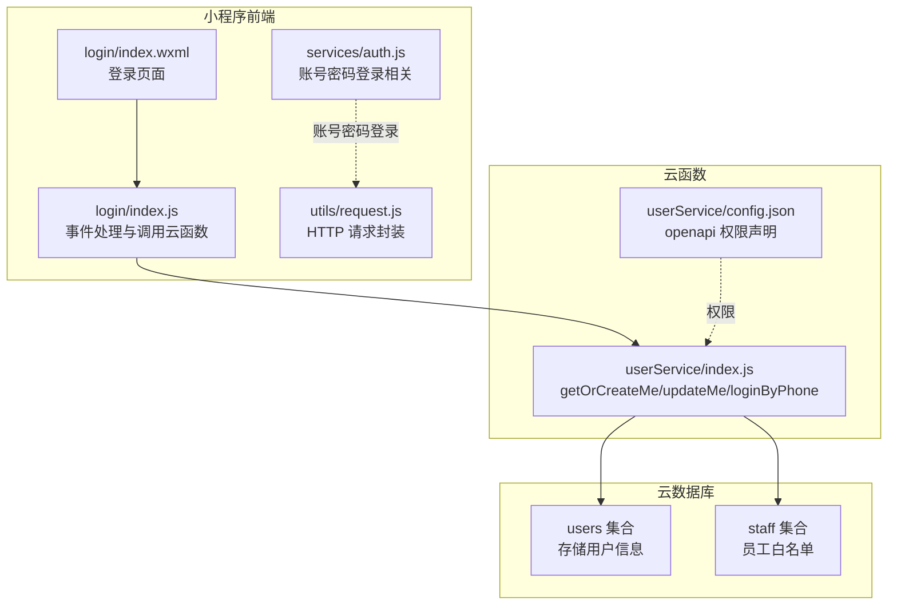
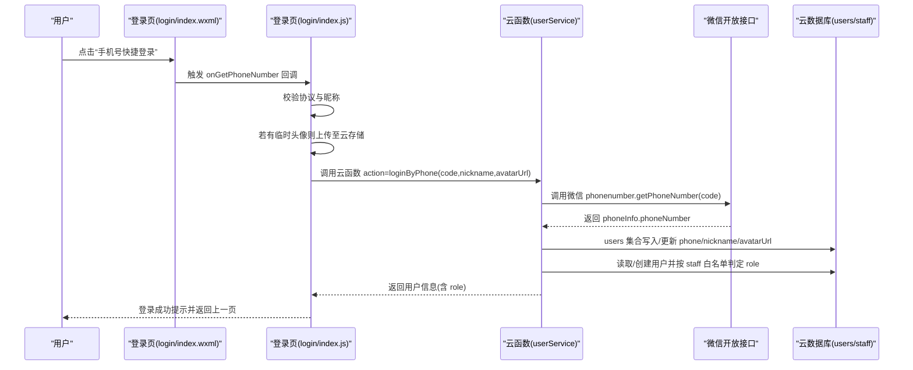
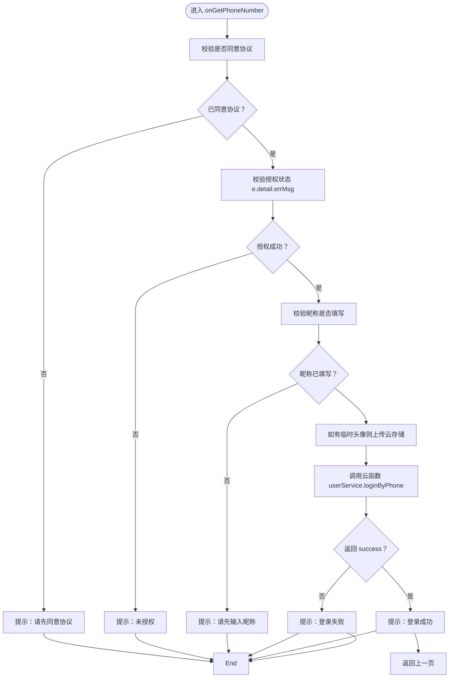
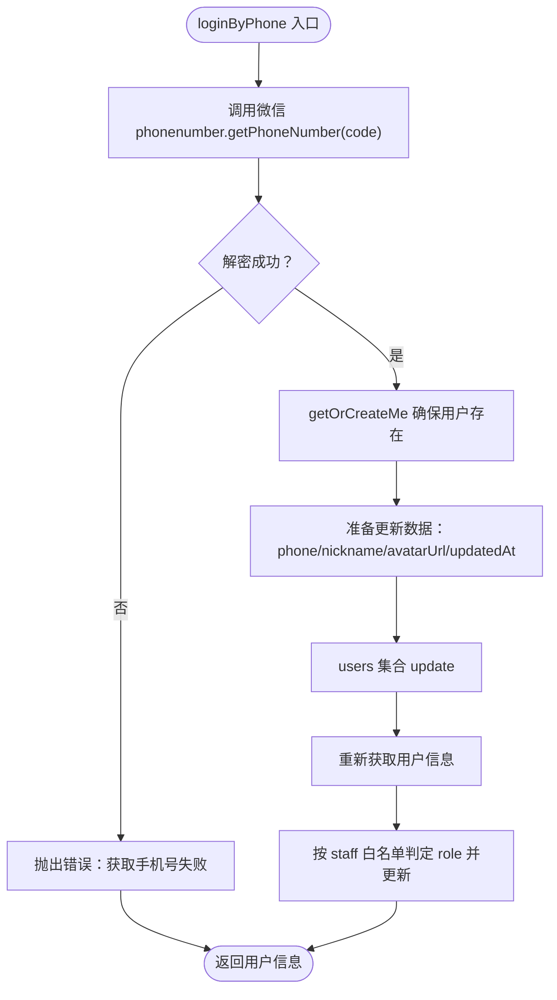
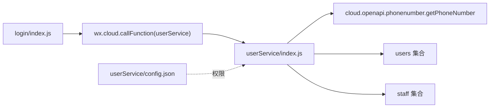

# 微信登录

<cite>
**本文引用的文件**
- [miniprogram/pages/login/index.js](file://miniprogram/pages/login/index.js)
- [miniprogram/pages/login/index.wxml](file://miniprogram/pages/login/index.wxml)
- [miniprogram/pages/login/index.json](file://miniprogram/pages/login/index.json)
- [cloudfunctions/userService/index.js](file://cloudfunctions/userService/index.js)
- [cloudfunctions/userService/config.json](file://cloudfunctions/userService/config.json)
- [miniprogram/services/auth.js](file://miniprogram/services/auth.js)
- [miniprogram/utils/request.js](file://miniprogram/utils/request.js)
- [PRD.md](file://PRD.md)
</cite>

## 目录
1. [简介](#简介)
2. [项目结构](#项目结构)
3. [核心组件](#核心组件)
4. [架构总览](#架构总览)
5. [详细组件分析](#详细组件分析)
6. [依赖关系分析](#依赖关系分析)
7. [性能考虑](#性能考虑)
8. [故障排查指南](#故障排查指南)
9. [结论](#结论)
10. [附录](#附录)

## 简介
本文件围绕“手机号授权登录”流程展开，重点说明通过前端页面 login/index.js 中的事件处理函数 onGetPhoneNumber，配合云函数 userService 的 loginByPhone 接口，完成用户授权手机号、解密并落库、自动创建/更新用户信息、基于 staff 白名单的角色判定（customer/staff）的完整链路。同时给出常见问题的定位与解决思路，帮助开发者快速理解与排障。

## 项目结构
- 前端页面 login/index.js 负责用户交互、协议校验、头像上传、调用云函数等。
- 云函数 userService/index.js 提供 getOrCreateMe/updateMe/loginByPhone 等能力，并通过 wx-server-sdk 调用微信开放接口 phonenumber.getPhoneNumber 解密手机号。
- 云函数权限配置 userService/config.json 声明了所需 openapi 权限。
- PRD.md 对 staff 白名单、用户 phone 字段等背景做了补充说明。

图表来源
- [miniprogram/pages/login/index.js](file://miniprogram/pages/login/index.js#L1-L294)
- [miniprogram/pages/login/index.wxml](file://miniprogram/pages/login/index.wxml#L1-L62)
- [cloudfunctions/userService/index.js](file://cloudfunctions/userService/index.js#L1-L289)
- [cloudfunctions/userService/config.json](file://cloudfunctions/userService/config.json#L1-L6)
- [miniprogram/services/auth.js](file://miniprogram/services/auth.js#L1-L163)
- [miniprogram/utils/request.js](file://miniprogram/utils/request.js#L1-L125)

章节来源
- [miniprogram/pages/login/index.js](file://miniprogram/pages/login/index.js#L1-L294)
- [miniprogram/pages/login/index.wxml](file://miniprogram/pages/login/index.wxml#L1-L62)
- [cloudfunctions/userService/index.js](file://cloudfunctions/userService/index.js#L1-L289)
- [cloudfunctions/userService/config.json](file://cloudfunctions/userService/config.json#L1-L6)
- [PRD.md](file://PRD.md#L321-L353)

## 核心组件
- 前端登录页 login/index.js
  - 负责协议勾选校验、昵称与头像输入、调用 wx.getPhoneNumber 获取加密数据、上传临时头像至云存储、调用云函数 userService 的 loginByPhone。
  - 在登录成功后，页面会提示并返回上一页，或在账号密码登录场景中跳转首页。
- 云函数 userService
  - 提供 getOrCreateMe/updateMe/loginByPhone 等动作。
  - loginByPhone 内部调用微信开放接口 cloud.openapi.phonenumber.getPhoneNumber 解密手机号，并将手机号与昵称、头像等信息写入 users 集合。
  - 自动根据 staff 白名单（phone 或 openid）判定用户角色（customer/staff），并更新 users 集合中的 role 字段。
- 云函数权限配置
  - userService/config.json 声明了 phonenumber.getPhoneNumber 的 openapi 权限，确保云函数具备解密手机号的能力。
- PRD 背景
  - PRD.md 指出 staff 集合用于员工白名单维护，且用户 phone 字段后端支持写入但前端暂无入口，这影响了手机号授权登录后的角色判定与展示策略。

章节来源
- [miniprogram/pages/login/index.js](file://miniprogram/pages/login/index.js#L125-L190)
- [cloudfunctions/userService/index.js](file://cloudfunctions/userService/index.js#L105-L161)
- [cloudfunctions/userService/config.json](file://cloudfunctions/userService/config.json#L1-L6)
- [PRD.md](file://PRD.md#L321-L353)

## 架构总览
下图展示了从用户点击“手机号快捷登录”按钮开始，到登录完成并更新用户信息的端到端流程。

图表来源
- [miniprogram/pages/login/index.wxml](file://miniprogram/pages/login/index.wxml#L1-L30)
- [miniprogram/pages/login/index.js](file://miniprogram/pages/login/index.js#L125-L190)
- [cloudfunctions/userService/index.js](file://cloudfunctions/userService/index.js#L105-L161)
- [cloudfunctions/userService/config.json](file://cloudfunctions/userService/config.json#L1-L6)

## 详细组件分析

### 前端页面 login/index.js 的 onGetPhoneNumber 事件处理
- 协议校验：若未勾选协议，提示“请先同意《用户协议》和《隐私政策》”并终止流程。
- 授权校验：若 e.detail.errMsg 不为“getPhoneNumber:ok”，提示“未授权”并终止流程。
- 昵称检查：若昵称为空，提示“请先输入昵称”并终止流程。
- 临时头像上传：若头像 URL 以 http://tmp/ 开头，则上传至云存储，得到 fileID；上传失败不会阻断登录流程。
- 调用云函数：调用 wx.cloud.callFunction，传入 action=loginByPhone，携带 code、nickname、avatarUrl。
- 成功/失败反馈：根据云函数返回的 success 字段提示“登录成功/失败”，并在 finally 中隐藏加载状态。

图表来源
- [miniprogram/pages/login/index.js](file://miniprogram/pages/login/index.js#L125-L190)

章节来源
- [miniprogram/pages/login/index.js](file://miniprogram/pages/login/index.js#L125-L190)

### 云函数 userService 的 loginByPhone 实现
- 参数解析：接收 openid、code、nickname、avatarUrl。
- 调用微信开放接口：通过 cloud.openapi.phonenumber.getPhoneNumber(code) 解密手机号。
- 数据落库：确保用户记录存在（getOrCreateMe），然后更新 phone、nickname、avatarUrl、updatedAt 等字段。
- 角色判定：根据 staff 白名单（优先手机号匹配，其次 openid）判定用户角色（customer/staff），并更新 users 集合中的 role 字段。
- 返回用户信息：返回最新用户对象（含 role）给前端。

图表来源
- [cloudfunctions/userService/index.js](file://cloudfunctions/userService/index.js#L105-L161)

章节来源
- [cloudfunctions/userService/index.js](file://cloudfunctions/userService/index.js#L105-L161)

### 云函数权限与数据库集合
- 权限声明：userService/config.json 声明了 phonenumber.getPhoneNumber 的 openapi 权限，确保云函数可调用微信开放接口。
- 集合初始化：ensureCollections 在首次运行时自动创建 users、staff、accounts 集合，避免新环境直接报错。
- 角色判定：isStaff 优先通过 phone 匹配 staff 集合，其次回退到 openid 匹配，最终决定用户角色。

章节来源
- [cloudfunctions/userService/config.json](file://cloudfunctions/userService/config.json#L1-L6)
- [cloudfunctions/userService/index.js](file://cloudfunctions/userService/index.js#L1-L84)
- [cloudfunctions/userService/index.js](file://cloudfunctions/userService/index.js#L26-L47)

### 页面结构与交互
- 登录页 login/index.wxml 提供头像选择、昵称输入、手机号快捷登录按钮、账号密码登录入口、用户协议与隐私政策链接。
- 登录页 login/index.json 设置了页面标题为“登录”。

章节来源
- [miniprogram/pages/login/index.wxml](file://miniprogram/pages/login/index.wxml#L1-L62)
- [miniprogram/pages/login/index.json](file://miniprogram/pages/login/index.json#L1-L5)

### 账号密码登录（对比参考）
- 前端通过 services/auth.js 的 login 方法发起公开请求，携带用户名与密码。
- 云端通过 utils/request.js 的 authenticatedRequest 添加 Authorization 头，向 CRM 后台 API 发起认证请求。
- 登录成功后保存 access_token、userInfo、openid 等信息，并跳转首页。

章节来源
- [miniprogram/services/auth.js](file://miniprogram/services/auth.js#L1-L163)
- [miniprogram/utils/request.js](file://miniprogram/utils/request.js#L1-L125)

## 依赖关系分析
- 前端 login/index.js 依赖：
  - 登录页 wxml 的 open-type=getPhoneNumber 事件绑定。
  - wx.cloud.callFunction 调用 userService。
  - 临时头像上传 wx.cloud.uploadFile。
- 云函数 userService 依赖：
  - wx-server-sdk 初始化与上下文获取 OPENID。
  - cloud.openapi.phonenumber.getPhoneNumber 解密手机号。
  - 云数据库 users/staff 集合读写。
- 权限依赖：
  - userService/config.json 声明 phonenumber.getPhoneNumber 权限。
- PRD 背景依赖：
  - staff 集合作为员工白名单来源，影响角色判定。

图表来源
- [miniprogram/pages/login/index.js](file://miniprogram/pages/login/index.js#L125-L190)
- [cloudfunctions/userService/index.js](file://cloudfunctions/userService/index.js#L105-L161)
- [cloudfunctions/userService/config.json](file://cloudfunctions/userService/config.json#L1-L6)

章节来源
- [miniprogram/pages/login/index.js](file://miniprogram/pages/login/index.js#L125-L190)
- [cloudfunctions/userService/index.js](file://cloudfunctions/userService/index.js#L105-L161)
- [cloudfunctions/userService/config.json](file://cloudfunctions/userService/config.json#L1-L6)

## 性能考虑
- 云函数内 ensureCollections 使用并发创建集合，减少初始化等待时间。
- loginByPhone 在更新用户信息前先执行 getOrCreateMe，避免重复查询。
- 前端上传临时头像采用异步上传，失败不影响登录主流程，降低耦合度。
- 建议：在高并发场景下，可对 phonenumber.getPhoneNumber 的调用增加幂等与去重策略，避免重复解密与写库。

章节来源
- [cloudfunctions/userService/index.js](file://cloudfunctions/userService/index.js#L18-L24)
- [cloudfunctions/userService/index.js](file://cloudfunctions/userService/index.js#L123-L139)
- [miniprogram/pages/login/index.js](file://miniprogram/pages/login/index.js#L146-L160)

## 故障排查指南
- 用户未授权手机号
  - 现象：onGetPhoneNumber 回调中 e.detail.errMsg 非“getPhoneNumber:ok”，前端提示“未授权”。
  - 处理：引导用户重新授权；确认页面已正确绑定 open-type="getPhoneNumber"。
  - 参考路径：[miniprogram/pages/login/index.js](file://miniprogram/pages/login/index.js#L133-L136)
- 未勾选用户协议/隐私政策
  - 现象：前端提示“请先同意《用户协议》和《隐私政策》”。
  - 处理：确保用户勾选协议后再进行授权。
  - 参考路径：[miniprogram/pages/login/index.js](file://miniprogram/pages/login/index.js#L126-L129)
- 昵称为空
  - 现象：前端提示“请先输入昵称”。
  - 处理：在授权前完善昵称信息。
  - 参考路径：[miniprogram/pages/login/index.js](file://miniprogram/pages/login/index.js#L139-L142)
- 临时头像上传失败
  - 现象：上传临时头像失败但不影响登录主流程。
  - 处理：检查网络与云存储权限；上传失败时可降级使用原头像或默认头像。
  - 参考路径：[miniprogram/pages/login/index.js](file://miniprogram/pages/login/index.js#L151-L159)
- 登录态冲突（账号密码登录）
  - 现象：authenticatedRequest 收到 401，提示“登录已过期”，并清理本地存储。
  - 处理：引导用户重新登录账号密码；检查本地存储的 access_token 是否存在。
  - 参考路径：[miniprogram/utils/request.js](file://miniprogram/utils/request.js#L70-L89)
- 云函数权限不足
  - 现象：调用微信 phonenumber.getPhoneNumber 报权限不足。
  - 处理：确认 userService/config.json 已声明 phonenumber.getPhoneNumber 权限并已部署。
  - 参考路径：[cloudfunctions/userService/config.json](file://cloudfunctions/userService/config.json#L1-L6)
- 登录失败（云函数内部错误）
  - 现象：loginByPhone 返回失败或抛出异常。
  - 处理：查看云函数日志，确认 code 是否有效、phoneInfo.phoneNumber 是否存在、users/staff 集合是否可写。
  - 参考路径：[cloudfunctions/userService/index.js](file://cloudfunctions/userService/index.js#L110-L118)

## 结论
手机号授权登录流程在前端与云函数两端分工明确：前端负责协议校验、头像上传与调用云函数，云函数负责解密手机号、创建/更新用户信息并基于 staff 白名单判定角色。通过合理的错误提示与降级策略，可显著提升用户体验。建议在生产环境中进一步完善 staff 白名单的录入与维护机制，并在前端补充 phone 字段的展示与更新入口，以完善用户生命周期管理。

## 附录
- 云函数入口与动作映射
  - getOrCreateMe：获取或创建用户信息
  - updateMe：更新用户昵称/头像/手机号等
  - loginByPhone：解密手机号并落库，自动判定角色
  - accountRegister/accountLogin：账号密码注册与登录（与手机号登录并行）

章节来源
- [cloudfunctions/userService/index.js](file://cloudfunctions/userService/index.js#L258-L289)