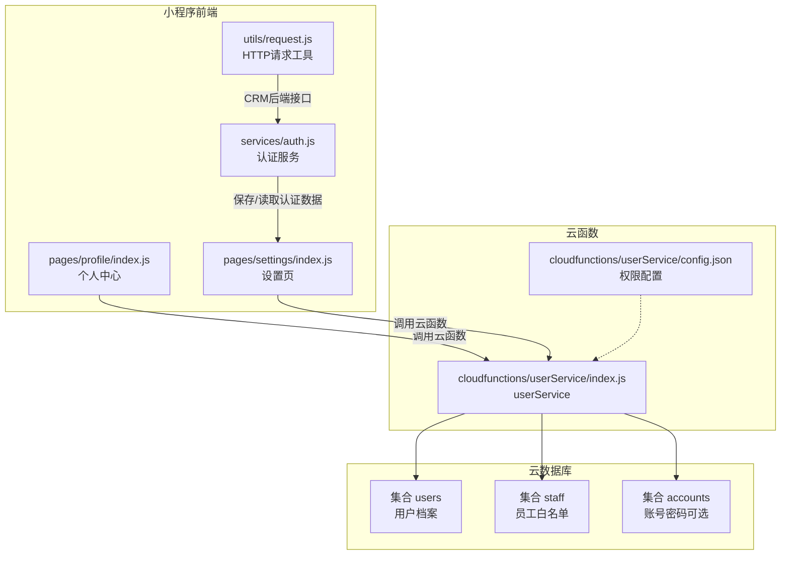
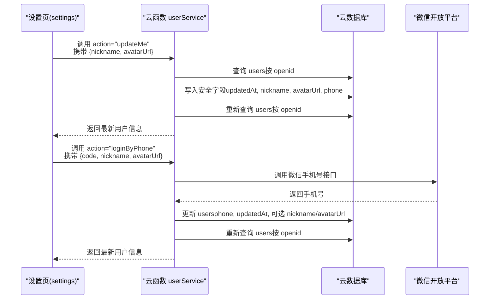
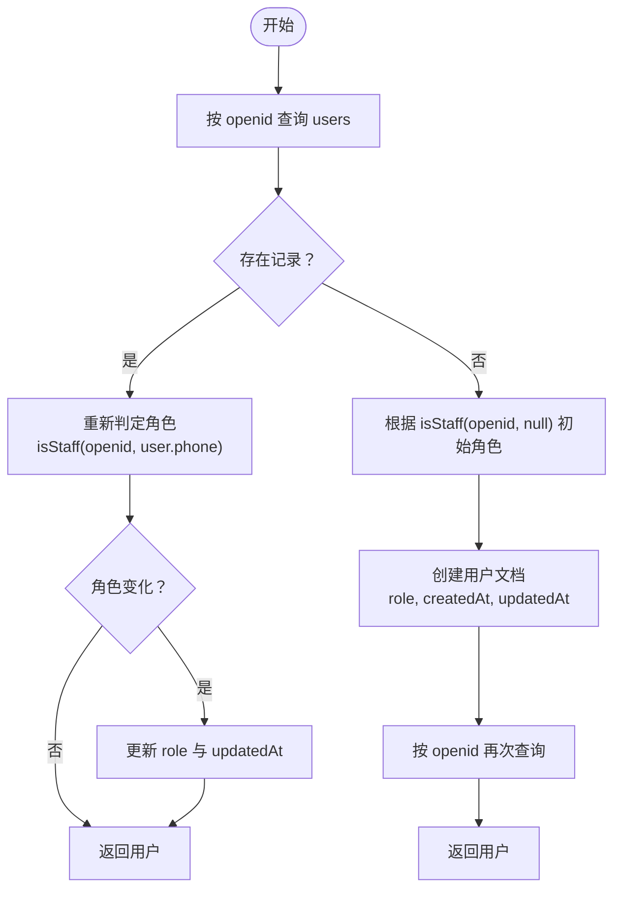
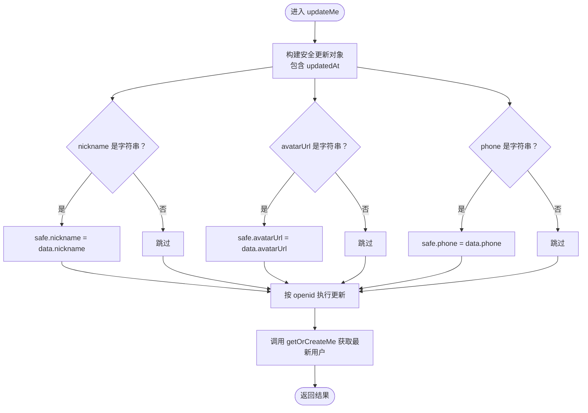
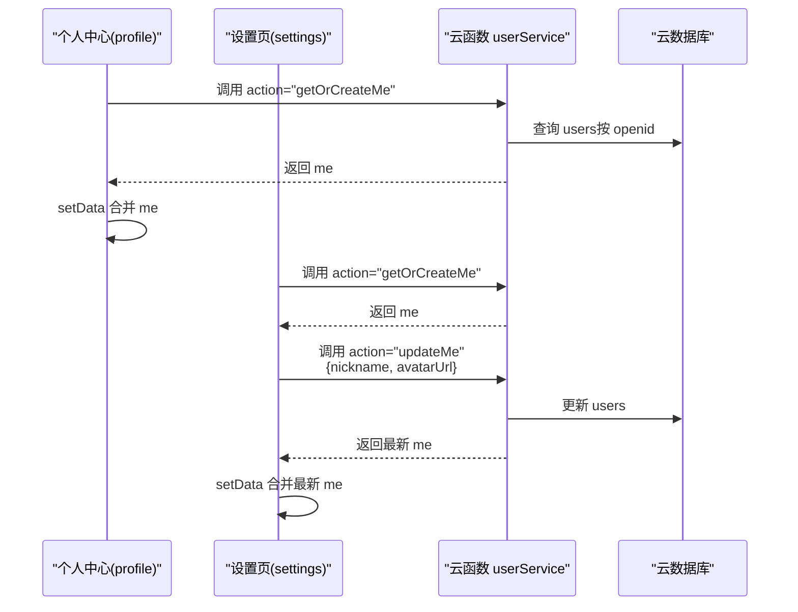
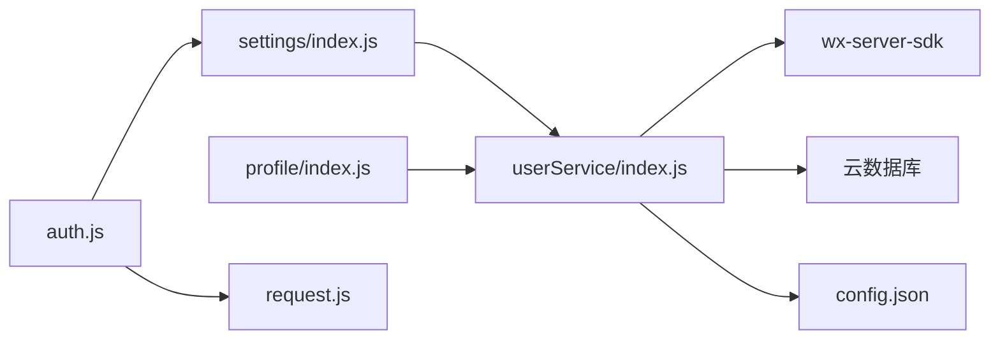

# 用户信息管理

<cite>
**本文引用的文件**
- [cloudfunctions/userService/index.js](file://cloudfunctions/userService/index.js)
- [cloudfunctions/userService/config.json](file://cloudfunctions/userService/config.json)
- [miniprogram/pages/profile/index.js](file://miniprogram/pages/profile/index.js)
- [miniprogram/pages/settings/index.js](file://miniprogram/pages/settings/index.js)
- [miniprogram/services/auth.js](file://miniprogram/services/auth.js)
- [miniprogram/utils/request.js](file://miniprogram/utils/request.js)
- [PRD.md](file://PRD.md)
</cite>

## 目录
1. [简介](#简介)
2. [项目结构](#项目结构)
3. [核心组件](#核心组件)
4. [架构总览](#架构总览)
5. [详细组件分析](#详细组件分析)
6. [依赖关系分析](#依赖关系分析)
7. [性能考量](#性能考量)
8. [故障排查指南](#故障排查指南)
9. [结论](#结论)
10. [附录](#附录)

## 简介
本文件围绕安得褓贝项目中的用户信息管理功能展开，重点解析两个云函数：getOrCreateMe 与 updateMe 的实现机制与交互流程。内容涵盖：
- getOrCreateMe 如何根据用户 openid 在 users 集合中查询或创建用户记录，并基于 staff 白名单动态判定用户角色（customer/staff）。
- updateMe 的安全数据过滤机制，仅允许更新 nickname、avatarUrl、phone 等指定字段，并自动更新 updatedAt 时间戳。
- 前端个人中心页面如何调用云函数获取用户信息、提交修改请求，以及 auth.js 服务中 getCurrentUser 与 saveAuthData 方法如何协同工作。
- 用户信息变更后前端数据绑定的更新流程，以及角色变更的自动同步机制。
- 常见问题与解决方案，如“用户信息获取失败”、“头像更新不生效”、“角色权限未及时刷新”。

## 项目结构
用户信息管理涉及云函数与小程序前端页面的协作：
- 云函数 userService：提供 getOrCreateMe、updateMe、loginByPhone 等能力，并负责 users、staff、accounts 集合的初始化与权限判定。
- 小程序前端：
  - profile 页面：展示用户信息并触发 getOrCreateMe。
  - settings 页面：编辑昵称、头像、手机号授权，调用 updateMe 与 loginByPhone。
  - auth.js：封装认证数据的保存与读取，getCurrentUser 用于验证 Token 与拉取用户信息。
  - request.js：封装公开与认证请求，供 CRM 后端接口使用（与用户信息管理云函数并行存在）。

图表来源
- [cloudfunctions/userService/index.js](file://cloudfunctions/userService/index.js#L1-L289)
- [cloudfunctions/userService/config.json](file://cloudfunctions/userService/config.json#L1-L6)
- [miniprogram/pages/profile/index.js](file://miniprogram/pages/profile/index.js#L1-L53)
- [miniprogram/pages/settings/index.js](file://miniprogram/pages/settings/index.js#L1-L171)
- [miniprogram/services/auth.js](file://miniprogram/services/auth.js#L1-L163)
- [miniprogram/utils/request.js](file://miniprogram/utils/request.js#L1-L125)

章节来源
- [cloudfunctions/userService/index.js](file://cloudfunctions/userService/index.js#L1-L289)
- [cloudfunctions/userService/config.json](file://cloudfunctions/userService/config.json#L1-L6)
- [miniprogram/pages/profile/index.js](file://miniprogram/pages/profile/index.js#L1-L53)
- [miniprogram/pages/settings/index.js](file://miniprogram/pages/settings/index.js#L1-L171)
- [miniprogram/services/auth.js](file://miniprogram/services/auth.js#L1-L163)
- [miniprogram/utils/request.js](file://miniprogram/utils/request.js#L1-L125)

## 核心组件
- 云函数 userService：
  - getOrCreateMe：按 openid 查询或创建用户，动态判定角色并返回用户对象。
  - updateMe：安全过滤用户可更新字段，自动更新 updatedAt，并返回最新用户信息。
  - loginByPhone：通过微信手机号授权获取手机号并更新用户信息，同时自动同步角色。
  - isStaff：优先通过 phone 白名单判定 staff，兼容 openid 白名单。
  - ensureCollections：首次运行时自动创建 users、staff、accounts 集合。
- 前端页面：
  - profile/index.js：调用 getOrCreateMe 展示用户信息。
  - settings/index.js：编辑昵称与头像，调用 updateMe；手机号授权后调用 loginByPhone。
- 认证服务 auth.js：
  - getCurrentUser：通过 authenticatedRequest 拉取用户信息（CRM 后端接口）。
  - saveAuthData：保存 access_token 与 userInfo 到本地存储。
- 请求工具 request.js：封装公开与认证请求，处理 Token 过期跳转。

章节来源
- [cloudfunctions/userService/index.js](file://cloudfunctions/userService/index.js#L26-L103)
- [cloudfunctions/userService/index.js](file://cloudfunctions/userService/index.js#L105-L161)
- [cloudfunctions/userService/index.js](file://cloudfunctions/userService/index.js#L163-L289)
- [miniprogram/pages/profile/index.js](file://miniprogram/pages/profile/index.js#L1-L53)
- [miniprogram/pages/settings/index.js](file://miniprogram/pages/settings/index.js#L1-L171)
- [miniprogram/services/auth.js](file://miniprogram/services/auth.js#L1-L163)
- [miniprogram/utils/request.js](file://miniprogram/utils/request.js#L1-L125)

## 架构总览
用户信息管理的端到端流程如下：
- 前端页面通过 wx.cloud.callFunction 调用 userService 云函数。
- 云函数根据 openid 访问 users、staff、accounts 集合，执行查询、创建、更新与角色判定。
- 前端在 settings 页面中支持头像上传与手机号授权，随后调用云函数完成信息更新与角色同步。
- auth.js 与 request.js 主要服务于 CRM 后端接口，与用户信息管理云函数并行存在。

图表来源
- [cloudfunctions/userService/index.js](file://cloudfunctions/userService/index.js#L86-L103)
- [cloudfunctions/userService/index.js](file://cloudfunctions/userService/index.js#L105-L161)
- [miniprogram/pages/settings/index.js](file://miniprogram/pages/settings/index.js#L119-L169)

## 详细组件分析

### getOrCreateMe 实现机制
- 功能要点
  - 按 openid 查询 users 集合，若存在则返回用户对象。
  - 若不存在，则根据 staff 白名单判定初始角色（staff 或 customer），创建用户并返回。
  - 若用户已存在，会再次检查角色（考虑 phone 变化），如有变化则更新 users 的 role 字段并返回最新值。
- 关键逻辑
  - isStaff(openid, phone)：优先通过 phone 白名单判定 staff；若无 phone，则回退到 openid 白名单。
  - 角色同步：当用户已存在且角色发生变化时，自动更新 users 的 role 与 updatedAt。
- 性能与健壮性
  - ensureCollections 首次运行自动创建集合，避免新环境直接报错。
  - 查询与更新均基于 openid，保证幂等性。

图表来源
- [cloudfunctions/userService/index.js](file://cloudfunctions/userService/index.js#L26-L84)

章节来源
- [cloudfunctions/userService/index.js](file://cloudfunctions/userService/index.js#L26-L84)

### updateMe 安全数据过滤机制
- 功能要点
  - 仅允许更新以下字段：nickname、avatarUrl、phone。
  - 自动更新 updatedAt 为服务器时间。
  - 更新完成后再次调用 getOrCreateMe，确保返回最新用户信息（含角色同步）。
- 前端调用示例
  - settings 页面在保存时，先上传临时头像至云存储，再调用云函数 action="updateMe"，传入 { nickname, avatarUrl }。
- 安全性
  - 通过显式构造 safe 对象，避免客户端传入其他字段导致意外覆盖。

图表来源
- [cloudfunctions/userService/index.js](file://cloudfunctions/userService/index.js#L86-L103)
- [miniprogram/pages/settings/index.js](file://miniprogram/pages/settings/index.js#L147-L169)

章节来源
- [cloudfunctions/userService/index.js](file://cloudfunctions/userService/index.js#L86-L103)
- [miniprogram/pages/settings/index.js](file://miniprogram/pages/settings/index.js#L119-L169)

### 前端调用与数据绑定流程
- 个人中心页面
  - onShow 生命周期中调用 wx.cloud.callFunction，action="getOrCreateMe"，将返回的 me 合并到页面 data.me 中，实现数据绑定。
- 设置页
  - 加载时同样调用 getOrCreateMe，以确保展示最新信息。
  - 编辑昵称与头像时，先上传临时头像至云存储，再调用 updateMe。
  - 手机号授权回调中，调用 loginByPhone，成功后重新加载用户信息，确保手机号与角色同步。
- 认证服务
  - auth.js 的 getCurrentUser 通过 authenticatedRequest 拉取用户信息（CRM 后端接口），saveAuthData 将 access_token 与 userInfo 存入本地存储，便于后续请求使用。

图表来源
- [miniprogram/pages/profile/index.js](file://miniprogram/pages/profile/index.js#L1-L53)
- [miniprogram/pages/settings/index.js](file://miniprogram/pages/settings/index.js#L1-L171)
- [cloudfunctions/userService/index.js](file://cloudfunctions/userService/index.js#L26-L103)

章节来源
- [miniprogram/pages/profile/index.js](file://miniprogram/pages/profile/index.js#L1-L53)
- [miniprogram/pages/settings/index.js](file://miniprogram/pages/settings/index.js#L1-L171)
- [miniprogram/services/auth.js](file://miniprogram/services/auth.js#L1-L163)

### 角色判定与白名单机制
- 白名单来源
  - staff 集合包含 openid 与 phone 字段，作为员工权限判定依据。
- 判定优先级
  - 优先通过 phone 白名单判定 staff；若用户存在 phone，则以此为准。
  - 若无 phone 或不在 phone 白名单中，则回退到 openid 白名单。
- 角色同步
  - getOrCreateMe 在用户已存在时会重新判定角色，若有变化则更新 users 的 role 与 updatedAt。
  - loginByPhone 成功后也会重新获取用户信息，确保角色与手机号同步。

章节来源
- [cloudfunctions/userService/index.js](file://cloudfunctions/userService/index.js#L26-L84)
- [cloudfunctions/userService/index.js](file://cloudfunctions/userService/index.js#L105-L161)
- [PRD.md](file://PRD.md#L222-L281)

## 依赖关系分析
- 云函数依赖
  - wx-server-sdk：初始化云开发环境、获取微信上下文 openid。
  - 云数据库命令：db.command、db.serverDate。
  - 配置文件 config.json：声明 phonenumber.getPhoneNumber 开放接口权限。
- 前端依赖
  - settings 页面依赖 wx.cloud.callFunction 与 wx.cloud.uploadFile。
  - auth.js 与 request.js 用于 CRM 后端接口的认证与请求封装。
- 数据库依赖
  - users：存储用户基本信息与角色。
  - staff：员工白名单（openid 与 phone）。
  - accounts：账号密码登录（可选）。

图表来源
- [cloudfunctions/userService/index.js](file://cloudfunctions/userService/index.js#L1-L289)
- [cloudfunctions/userService/config.json](file://cloudfunctions/userService/config.json#L1-L6)
- [miniprogram/pages/settings/index.js](file://miniprogram/pages/settings/index.js#L1-L171)
- [miniprogram/pages/profile/index.js](file://miniprogram/pages/profile/index.js#L1-L53)
- [miniprogram/services/auth.js](file://miniprogram/services/auth.js#L1-L163)
- [miniprogram/utils/request.js](file://miniprogram/utils/request.js#L1-L125)

章节来源
- [cloudfunctions/userService/index.js](file://cloudfunctions/userService/index.js#L1-L289)
- [cloudfunctions/userService/config.json](file://cloudfunctions/userService/config.json#L1-L6)
- [miniprogram/pages/settings/index.js](file://miniprogram/pages/settings/index.js#L1-L171)
- [miniprogram/pages/profile/index.js](file://miniprogram/pages/profile/index.js#L1-L53)
- [miniprogram/services/auth.js](file://miniprogram/services/auth.js#L1-L163)
- [miniprogram/utils/request.js](file://miniprogram/utils/request.js#L1-L125)

## 性能考量
- 集合初始化：ensureCollections 在首次运行时批量创建 users、staff、accounts，避免后续运行时报集合不存在。
- 查询与更新：按 openid 查询与更新，减少索引压力；更新时仅写入安全字段，降低冲突风险。
- 角色判定：isStaff 优先通过 phone 白名单判定，减少不必要的 openid 查询。
- 前端缓存：settings 页面在编辑过程中保留临时数据（tempNickname、tempAvatarUrl），减少重复网络请求。

[本节为通用性能建议，不直接分析具体文件]

## 故障排查指南
- 用户信息获取失败
  - 检查云函数是否正确初始化环境与集合。
  - 确认前端调用 wx.cloud.callFunction 的 action 参数是否为 "getOrCreateMe"。
  - 排查网络与权限问题，确保云函数具备读取 users、staff、accounts 的权限。
- 头像更新不生效
  - 确认 settings 页面在保存前已将临时头像上传至云存储并获得 fileID。
  - 确认 updateMe 传入的 avatarUrl 为有效的 fileID。
- 角色权限未及时刷新
  - 确认 staff 白名单中已添加对应 openid 或 phone。
  - 确认 getOrCreateMe 已被调用以触发角色重判定与更新。
  - 若通过手机号授权更新用户信息，确认 loginByPhone 成功并重新获取了最新用户信息。

章节来源
- [cloudfunctions/userService/index.js](file://cloudfunctions/userService/index.js#L18-L24)
- [cloudfunctions/userService/index.js](file://cloudfunctions/userService/index.js#L26-L84)
- [cloudfunctions/userService/index.js](file://cloudfunctions/userService/index.js#L105-L161)
- [miniprogram/pages/settings/index.js](file://miniprogram/pages/settings/index.js#L119-L169)

## 结论
- getOrCreateMe 与 updateMe 通过安全的数据过滤与角色判定，确保用户信息管理的准确性与一致性。
- 前端通过 settings 页面与 profile 页面实现完整的用户信息编辑与展示流程。
- 角色判定依赖 staff 白名单，支持 phone 与 openid 两种方式，具备良好的扩展性。
- 建议在生产环境中完善 staff 白名单的维护流程与账号密码登录的角色映射，进一步提升系统的可运维性与安全性。

[本节为总结性内容，不直接分析具体文件]

## 附录
- 云函数权限配置
  - phonenumber.getPhoneNumber：用于手机号授权获取手机号。
- 前端认证与请求
  - auth.js 提供 Token 与用户信息的本地存储与读取。
  - request.js 提供公开与认证请求封装，处理 Token 过期跳转。

章节来源
- [cloudfunctions/userService/config.json](file://cloudfunctions/userService/config.json#L1-L6)
- [miniprogram/services/auth.js](file://miniprogram/services/auth.js#L1-L163)
- [miniprogram/utils/request.js](file://miniprogram/utils/request.js#L1-L125)