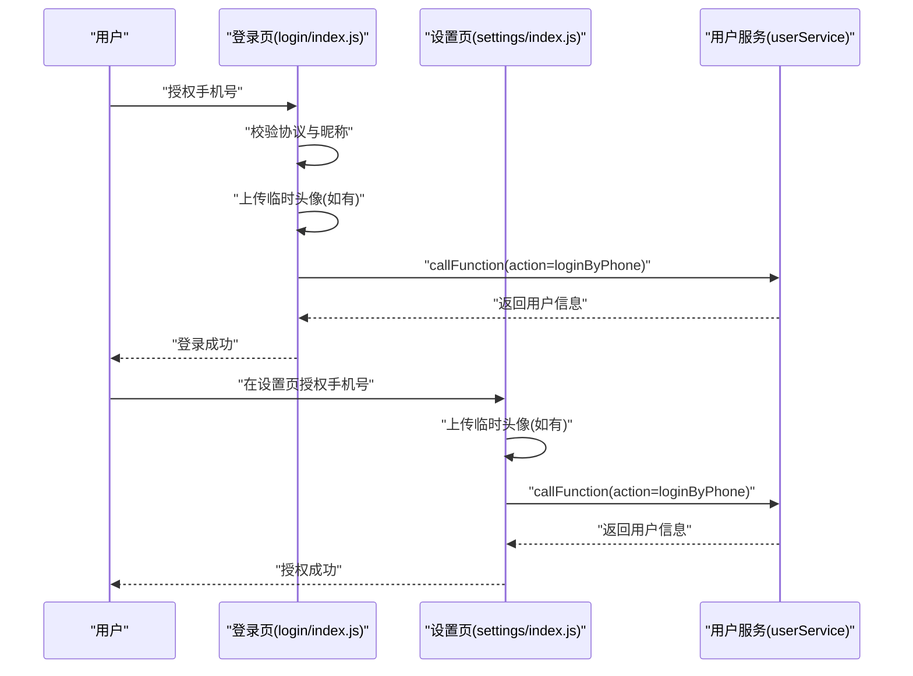
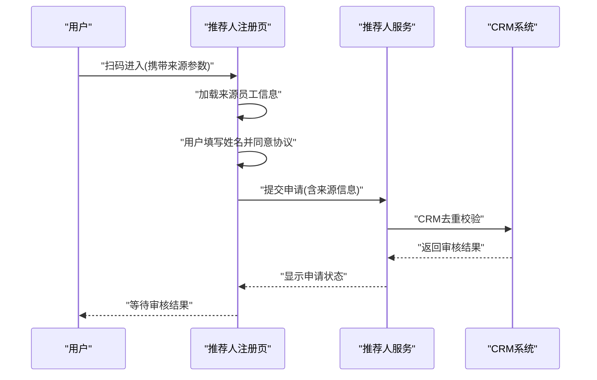
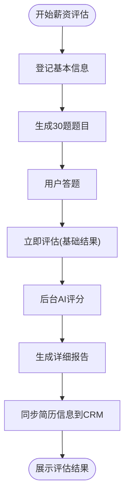
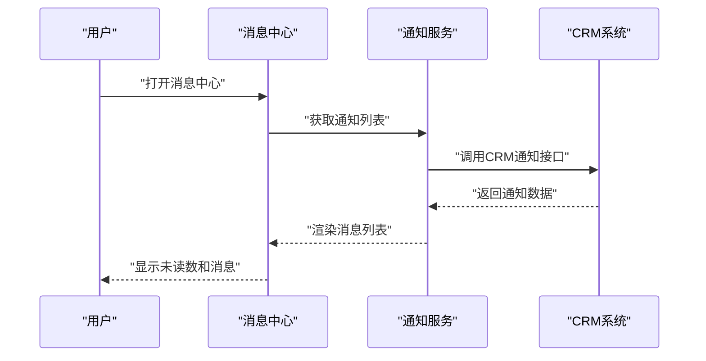
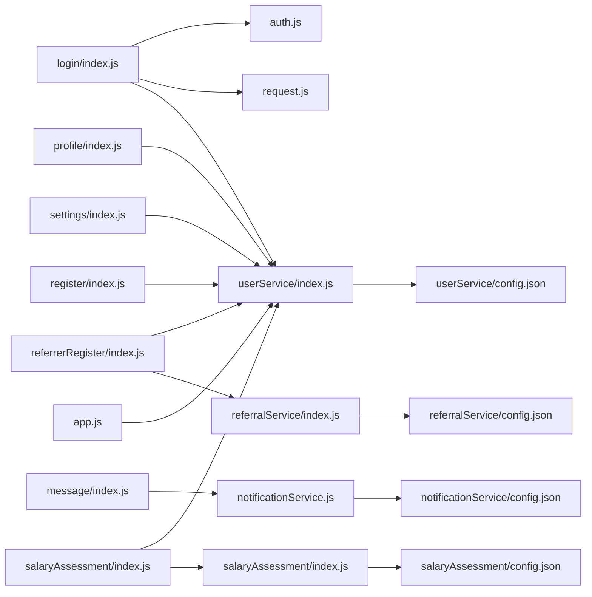

# 用户系统

<cite>
**本文引用的文件**
- [cloudfunctions/userService/index.js](file://cloudfunctions/userService/index.js)
- [cloudfunctions/userService/config.json](file://cloudfunctions/userService/config.json)
- [cloudfunctions/referralService/index.js](file://cloudfunctions/referralService/index.js)
- [cloudfunctions/referralService/config.json](file://cloudfunctions/referralService/config.json)
- [cloudfunctions/salaryAssessment/index.js](file://cloudfunctions/salaryAssessment/index.js)
- [cloudfunctions/salaryAssessment/config.json](file://cloudfunctions/salaryAssessment/config.json)
- [cloudfunctions/notificationService/index.js](file://cloudfunctions/notificationService/index.js)
- [cloudfunctions/notificationService/config.json](file://cloudfunctions/notificationService/config.json)
- [miniprogram/services/auth.js](file://miniprogram/services/auth.js)
- [miniprogram/utils/request.js](file://miniprogram/utils/request.js)
- [miniprogram/pages/login/index.js](file://miniprogram/pages/login/index.js)
- [miniprogram/pages/profile/index.js](file://miniprogram/pages/profile/index.js)
- [miniprogram/pages/register/index.js](file://miniprogram/pages/register/index.js)
- [miniprogram/pages/settings/index.js](file://miniprogram/pages/settings/index.js)
- [miniprogram/pages/message/index.js](file://miniprogram/pages/message/index.js)
- [miniprogram/pages/referrerRegister/index.js](file://miniprogram/pages/referrerRegister/index.js)
- [miniprogram/pages/referrerRegister/pending.js](file://miniprogram/pages/referrerRegister/pending.js)
- [miniprogram/pages/myReferrals/index.js](file://miniprogram/pages/myReferrals/index.js)
- [miniprogram/pages/referralSubmit/index.js](file://miniprogram/pages/referralSubmit/index.js)
- [miniprogram/pages/salaryAssessment/index.js](file://miniprogram/pages/salaryAssessment/index.js)
- [miniprogram/pages/salaryAssessment/quiz.js](file://miniprogram/pages/salaryAssessment/quiz.js)
- [miniprogram/pages/salaryAssessment/result.js](file://miniprogram/pages/salaryAssessment/result.js)
- [miniprogram/services/notificationService.js](file://miniprogram/services/notificationService.js)
- [miniprogram/app.js](file://miniprogram/app.js)
- [docs/账号密码登录测试说明.md](file://docs/账号密码登录测试说明.md)
- [docs/Web管理后台快速实施指南.md](file://docs/Web管理后台快速实施指南.md)
- [docs/迁移完成总结.md](file://docs/迁移完成总结.md)
- [PRD.md](file://PRD.md)
</cite>

## 更新摘要
**变更内容**
- 新增推荐人注册功能模块，支持通过海报扫码申请成为推荐人
- 新增薪资评估系统，提供AI智能测评和薪资水平评估
- 新增通知服务集成，支持消息中心和订阅消息推送
- 扩展用户角色体系，新增推荐人(referrer)角色支持
- 增强CRM系统集成，实现推荐人、薪资评估、通知等功能的云端统一管理

## 目录
1. [简介](#简介)
2. [项目结构](#项目结构)
3. [核心组件](#核心组件)
4. [架构总览](#架构总览)
5. [详细组件分析](#详细组件分析)
6. [新增功能模块](#新增功能模块)
7. [依赖关系分析](#依赖关系分析)
8. [性能考量](#性能考量)
9. [故障排查指南](#故障排查指南)
10. [结论](#结论)
11. [附录](#附录)

## 简介
本文件围绕安得褓贝用户系统，系统性梳理微信登录与账号密码登录两种认证方式，重点说明通过云函数 userService 实现的 getOrCreateMe、updateMe、loginByPhone、accountRegister 和 accountLogin 等核心接口的工作流程；阐述用户信息获取与更新机制（昵称、头像、手机号的存储与同步），以及个人中心页面的数据绑定逻辑；解释用户角色（customer/staff/referrer）的判定逻辑（基于 users 与 staff 集合的关联查询）；提供安全考虑（密码明文存储风险与未来加密建议）；并提供常见问题（登录态失效、手机号授权失败）的排查方法。

**更新** 新增推荐人注册、薪资评估和通知服务三大功能模块，扩展了用户系统的业务能力边界。

## 项目结构
用户系统涉及小程序前端与云函数后端两部分，现已扩展为包含推荐人、薪资评估、通知服务等多个功能模块：
- 小程序前端：登录页、个人中心、设置页、注册页、消息中心、推荐人注册、薪资评估、通知服务
- 云函数后端：用户服务、推荐人服务、薪资评估服务、通知服务

```mermaid
graph TB
subgraph "小程序前端"
Login["登录页<br/>pages/login/index.js"]
Profile["个人中心<br/>pages/profile/index.js"]
Settings["设置页<br/>pages/settings/index.js"]
Register["注册页<br/>pages/register/index.js"]
Message["消息中心<br/>pages/message/index.js"]
ReferrerReg["推荐人注册<br/>pages/referrerRegister/index.js"]
ReferrerPending["推荐人状态<br/>pages/referrerRegister/pending.js"]
MyReferrals["我的推荐<br/>pages/myReferrals/index.js"]
ReferralSubmit["推荐提交<br/>pages/referralSubmit/index.js"]
SalaryAssess["薪资评估<br/>pages/salaryAssessment/index.js"]
AssessQuiz["评估答题<br/>pages/salaryAssessment/quiz.js"]
AssessResult["评估结果<br/>pages/salaryAssessment/result.js"]
AuthSvc["认证服务<br/>services/auth.js"]
Req["请求封装<br/>utils/request.js"]
NotificationSvc["通知服务<br/>services/notificationService.js"]
end
subgraph "云函数后端"
UserService["用户服务<br/>cloudfunctions/userService/index.js"]
ReferralService["推荐人服务<br/>cloudfunctions/referralService/index.js"]
SalaryAssessment["薪资评估<br/>cloudfunctions/salaryAssessment/index.js"]
NotificationService["通知服务<br/>cloudfunctions/notificationService/index.js"]
Cfg["权限配置<br/>config.json"]
end
subgraph "运行环境"
App["应用初始化<br/>miniprogram/app.js"]
end
Login --> AuthSvc
Login --> Req
Login --> UserService
Profile --> UserService
Settings --> UserService
Register --> UserService
Message --> NotificationService
ReferrerReg --> ReferralService
ReferrerPending --> UserService
MyReferrals --> ReferralService
ReferralSubmit --> ReferralService
SalaryAssess --> SalaryAssessment
AssessQuiz --> SalaryAssessment
AssessResult --> SalaryAssessment
AuthSvc --> Req
UserService --> Cfg
ReferralService --> Cfg
SalaryAssessment --> Cfg
NotificationService --> Cfg
App --> UserService
```



**图表来源**
- [miniprogram/pages/login/index.js:1-294](file://miniprogram/pages/login/index.js#L1-L294)
- [miniprogram/pages/profile/index.js:1-53](file://miniprogram/pages/profile/index.js#L1-L53)
- [miniprogram/pages/settings/index.js:1-120](file://miniprogram/pages/settings/index.js#L1-L120)
- [miniprogram/pages/register/index.js:1-97](file://miniprogram/pages/register/index.js#L1-L97)
- [miniprogram/pages/message/index.js:1-100](file://miniprogram/pages/message/index.js#L1-L100)
- [miniprogram/pages/referrerRegister/index.js:1-257](file://miniprogram/pages/referrerRegister/index.js#L1-L257)
- [miniprogram/pages/referrerRegister/pending.js:1-66](file://miniprogram/pages/referrerRegister/pending.js#L1-L66)
- [miniprogram/pages/myReferrals/index.js:1-99](file://miniprogram/pages/myReferrals/index.js#L1-L99)
- [miniprogram/pages/referralSubmit/index.js:1-60](file://miniprogram/pages/referralSubmit/index.js#L1-L60)
- [miniprogram/pages/salaryAssessment/index.js:1-335](file://miniprogram/pages/salaryAssessment/index.js#L1-L335)
- [miniprogram/pages/salaryAssessment/quiz.js:1-264](file://miniprogram/pages/salaryAssessment/quiz.js#L1-L264)
- [miniprogram/pages/salaryAssessment/result.js:1-264](file://miniprogram/pages/salaryAssessment/result.js#L1-L264)
- [miniprogram/services/auth.js:1-163](file://miniprogram/services/auth.js#L1-L163)
- [miniprogram/utils/request.js:1-125](file://miniprogram/utils/request.js#L1-L125)
- [miniprogram/services/notificationService.js:1-46](file://miniprogram/services/notificationService.js#L1-L46)
- [miniprogram/app.js:1-248](file://miniprogram/app.js#L1-L248)

**章节来源**
- [miniprogram/pages/login/index.js:1-294](file://miniprogram/pages/login/index.js#L1-L294)
- [miniprogram/pages/profile/index.js:1-53](file://miniprogram/pages/profile/index.js#L1-L53)
- [miniprogram/pages/settings/index.js:1-120](file://miniprogram/pages/settings/index.js#L1-L120)
- [miniprogram/pages/register/index.js:1-97](file://miniprogram/pages/register/index.js#L1-L97)
- [miniprogram/pages/message/index.js:1-100](file://miniprogram/pages/message/index.js#L1-L100)
- [miniprogram/pages/referrerRegister/index.js:1-257](file://miniprogram/pages/referrerRegister/index.js#L1-L257)
- [miniprogram/pages/referrerRegister/pending.js:1-66](file://miniprogram/pages/referrerRegister/pending.js#L1-L66)
- [miniprogram/pages/myReferrals/index.js:1-99](file://miniprogram/pages/myReferrals/index.js#L1-L99)
- [miniprogram/pages/referralSubmit/index.js:1-60](file://miniprogram/pages/referralSubmit/index.js#L1-L60)
- [miniprogram/pages/salaryAssessment/index.js:1-335](file://miniprogram/pages/salaryAssessment/index.js#L1-L335)
- [miniprogram/pages/salaryAssessment/quiz.js:1-264](file://miniprogram/pages/salaryAssessment/quiz.js#L1-L264)
- [miniprogram/pages/salaryAssessment/result.js:1-264](file://miniprogram/pages/salaryAssessment/result.js#L1-L264)
- [miniprogram/services/auth.js:1-163](file://miniprogram/services/auth.js#L1-L163)
- [miniprogram/utils/request.js:1-125](file://miniprogram/utils/request.js#L1-L125)
- [miniprogram/services/notificationService.js:1-46](file://miniprogram/services/notificationService.js#L1-L46)
- [miniprogram/app.js:1-248](file://miniprogram/app.js#L1-L248)

## 核心组件
- 云函数 userService：负责用户信息的创建/获取、更新、微信手机号登录、账号密码注册与登录等
- 认证服务 auth.js：封装账号密码登录、获取当前用户、Token 校验、保存/读取本地认证数据、登出
- 请求封装 request.js：封装公开请求与认证请求，统一处理 401 登录态失效跳转
- 登录页 login/index.js：处理微信手机号授权、账号密码登录、加载用户信息、登录状态检查
- 个人中心 profile/index.js：加载并展示用户信息
- 设置页 settings/index.js：补充手机号授权与用户信息更新
- 注册页 register/index.js：调用云函数执行账号密码注册
- 消息中心 message/index.js：集成通知服务，展示消息列表和未读数
- 推荐人注册 pages/referrerRegister/index.js：申请成为推荐人，支持扫码来源追踪
- 薪资评估 pages/salaryAssessment/index.js：提供AI智能薪资评估服务
- 应用初始化 app.js：设置云环境，集成消息角标刷新

**章节来源**
- [cloudfunctions/userService/index.js:1-289](file://cloudfunctions/userService/index.js#L1-L289)
- [miniprogram/services/auth.js:1-163](file://miniprogram/services/auth.js#L1-L163)
- [miniprogram/utils/request.js:1-125](file://miniprogram/utils/request.js#L1-L125)
- [miniprogram/pages/login/index.js:1-294](file://miniprogram/pages/login/index.js#L1-L294)
- [miniprogram/pages/profile/index.js:1-53](file://miniprogram/pages/profile/index.js#L1-L53)
- [miniprogram/pages/settings/index.js:1-120](file://miniprogram/pages/settings/index.js#L1-L120)
- [miniprogram/pages/register/index.js:1-97](file://miniprogram/pages/register/index.js#L1-L97)
- [miniprogram/pages/message/index.js:1-100](file://miniprogram/pages/message/index.js#L1-L100)
- [miniprogram/pages/referrerRegister/index.js:1-257](file://miniprogram/pages/referrerRegister/index.js#L1-L257)
- [miniprogram/pages/salaryAssessment/index.js:1-335](file://miniprogram/pages/salaryAssessment/index.js#L1-L335)
- [miniprogram/app.js:1-248](file://miniprogram/app.js#L1-L248)

## 架构总览
用户系统采用"小程序前端 + 云函数后端"的分层架构，现已扩展为多模块协同：
- 前端通过 wx.cloud.callFunction 调用各云函数接口
- 前端通过 authService 与 request.js 统一封装登录、Token 校验与请求
- 后端通过云数据库操作 users、staff、accounts、referrers、salary_assessments 等集合
- CRM 系统作为统一业务中枢，支撑推荐人、薪资评估、通知等功能

```mermaid
sequenceDiagram
participant U as "用户"
participant L as "登录页(login/index.js)"
participant A as "认证服务(auth.js)"
participant R as "请求封装(request.js)"
participant C as "用户服务(userService)"
U->>L : "点击微信手机号登录"
L->>L : "onGetPhoneNumber 回调"
L->>C : "调用云函数 action=loginByPhone(code,nickname,avatarUrl)"
C-->>L : "返回用户信息(含role)"
L-->>U : "登录成功，返回上一页"
U->>L : "点击账号密码登录"
L->>A : "login(username,password)"
A->>R : "publicRequest('/auth/login')"
R-->>A : "返回登录响应"
A-->>L : "保存access_token与用户信息"
L-->>U : "跳转首页"
U->>RR as "推荐人注册"
RR->>RS as "推荐人服务"
RS->>CRM as "CRM系统"
RS-->>RR : "返回申请结果"
RR-->>U : "提交成功"
U->>SA as "薪资评估"
SA->>SS as "薪资评估服务"
SS->>CRM : "同步简历信息"
SS-->>SA : "返回评估结果"
SA-->>U : "展示AI评估报告"
```

**图表来源**
- [miniprogram/pages/login/index.js:125-190](file://miniprogram/pages/login/index.js#L125-L190)
- [miniprogram/services/auth.js:14-22](file://miniprogram/services/auth.js#L14-L22)
- [miniprogram/utils/request.js:12-41](file://miniprogram/utils/request.js#L12-L41)
- [cloudfunctions/userService/index.js:105-161](file://cloudfunctions/userService/index.js#L105-L161)
- [miniprogram/pages/referrerRegister/index.js:207-255](file://miniprogram/pages/referrerRegister/index.js#L207-L255)
- [cloudfunctions/referralService/index.js:65-94](file://cloudfunctions/referralService/index.js#L65-L94)
- [miniprogram/pages/salaryAssessment/index.js:252-318](file://miniprogram/pages/salaryAssessment/index.js#L252-L318)
- [cloudfunctions/salaryAssessment/index.js:477-522](file://cloudfunctions/salaryAssessment/index.js#L477-L522)

## 详细组件分析

### 云函数 userService 核心接口
- getOrCreateMe(openid)：按 openid 查询或创建用户记录，并根据手机号/旧 openid 判定角色（customer/staff），返回用户对象
- updateMe(openid, data)：安全更新 nickname、avatarUrl、phone 等字段，随后重新获取用户信息
- loginByPhone(openid, code, nickname, avatarUrl)：调用微信手机号开放接口解密手机号，确保用户记录存在，更新用户信息（含昵称、头像、手机号），并重新判定角色
- accountRegister(openid, username, password, nickname)：检查账号是否存在，明文保存账号与昵称，返回注册结果
- accountLogin(openid, username, password)：查询账号，明文比对密码，确保用户记录存在，更新用户信息（昵称、账号名），更新账号 openid 与最后登录时间，重新获取用户信息


**图表来源**
- [cloudfunctions/userService/index.js:26-84](file://cloudfunctions/userService/index.js#L26-L84)
- [cloudfunctions/userService/index.js:86-103](file://cloudfunctions/userService/index.js#L86-L103)
- [cloudfunctions/userService/index.js:105-161](file://cloudfunctions/userService/index.js#L105-L161)
- [cloudfunctions/userService/index.js:163-196](file://cloudfunctions/userService/index.js#L163-L196)
- [cloudfunctions/userService/index.js:198-256](file://cloudfunctions/userService/index.js#L198-L256)

**章节来源**
- [cloudfunctions/userService/index.js:26-84](file://cloudfunctions/userService/index.js#L26-L84)
- [cloudfunctions/userService/index.js:86-103](file://cloudfunctions/userService/index.js#L86-L103)
- [cloudfunctions/userService/index.js:105-161](file://cloudfunctions/userService/index.js#L105-L161)
- [cloudfunctions/userService/index.js:163-196](file://cloudfunctions/userService/index.js#L163-L196)
- [cloudfunctions/userService/index.js:198-256](file://cloudfunctions/userService/index.js#L198-L256)

### 微信登录与手机号授权流程
- 登录页 login/index.js 在 onGetPhoneNumber 回调中：
  - 校验用户协议同意与昵称填写
  - 若有临时头像，先上传至云存储再调用云函数
  - 调用云函数 action=loginByPhone，传入 code、nickname、avatarUrl
  - 成功后提示并返回上一页
- 设置页 settings/index.js 提供"获取手机号"入口，逻辑与登录页一致



**图表来源**
- [miniprogram/pages/login/index.js:125-190](file://miniprogram/pages/login/index.js#L125-L190)
- [miniprogram/pages/settings/index.js:63-100](file://miniprogram/pages/settings/index.js#L63-L100)
- [cloudfunctions/userService/index.js:105-161](file://cloudfunctions/userService/index.js#L105-L161)

**章节来源**
- [miniprogram/pages/login/index.js:125-190](file://miniprogram/pages/login/index.js#L125-L190)
- [miniprogram/pages/settings/index.js:63-100](file://miniprogram/pages/settings/index.js#L63-L100)
- [cloudfunctions/userService/index.js:105-161](file://cloudfunctions/userService/index.js#L105-L161)

### 账号密码登录与注册流程
- 登录页 login/index.js：
  - onAccountLogin 校验账号/密码非空
  - 调用 authService.login(username,password)，内部通过 request.publicRequest 发起 /auth/login
  - 成功后保存 access_token 与用户信息，跳转首页
- 注册页 register/index.js：
  - onRegister 校验账号/密码/确认密码/昵称
  - 调用云函数 action=accountRegister(username,password,nickname)
  - 成功后提示返回登录页

```mermaid
sequenceDiagram
participant U as "用户"
participant L as "登录页(login/index.js)"
participant A as "认证服务(auth.js)"
participant R as "请求封装(request.js)"
participant C as "用户服务(userService)"
U->>L : "输入账号/密码"
L->>A : "login(username,password)"
A->>R : "publicRequest('/auth/login')"
R-->>A : "返回登录响应"
A-->>L : "保存access_token与用户信息"
L-->>U : "跳转首页"
U->>Rg as "注册页(register/index.js)"
Rg->>C : "callFunction(action=accountRegister)"
C-->>Rg : "返回注册结果"
Rg-->>U : "提示注册成功"
```

**图表来源**
- [miniprogram/pages/login/index.js:195-277](file://miniprogram/pages/login/index.js#L195-L277)
- [miniprogram/services/auth.js:14-22](file://miniprogram/services/auth.js#L14-L22)
- [miniprogram/utils/request.js:12-41](file://miniprogram/utils/request.js#L12-L41)
- [miniprogram/pages/register/index.js:25-90](file://miniprogram/pages/register/index.js#L25-L90)
- [cloudfunctions/userService/index.js:163-196](file://cloudfunctions/userService/index.js#L163-L196)

**章节来源**
- [miniprogram/pages/login/index.js:195-277](file://miniprogram/pages/login/index.js#L195-L277)
- [miniprogram/services/auth.js:14-22](file://miniprogram/services/auth.js#L14-L22)
- [miniprogram/utils/request.js:12-41](file://miniprogram/utils/request.js#L12-L41)
- [miniprogram/pages/register/index.js:25-90](file://miniprogram/pages/register/index.js#L25-L90)
- [cloudfunctions/userService/index.js:163-196](file://cloudfunctions/userService/index.js#L163-L196)

### 用户信息获取与更新机制
- 个人中心 profile/index.js：
  - onShow 时调用云函数 action=getOrCreateMe，合并更新 me 数据
- 登录页 login/index.js：
  - onLoad 时调用云函数 action=getOrCreateMe，初始化 me 与表单字段
- 更新机制：
  - updateMe 安全更新 nickname、avatarUrl、phone
  - loginByPhone 在解密手机号后同时更新昵称、头像、手机号
  - accountLogin 在登录成功后更新用户昵称与账号名

**章节来源**
- [miniprogram/pages/profile/index.js:9-35](file://miniprogram/pages/profile/index.js#L9-L35)
- [miniprogram/pages/login/index.js:69-85](file://miniprogram/pages/login/index.js#L69-L85)
- [cloudfunctions/userService/index.js:86-103](file://cloudfunctions/userService/index.js#L86-L103)
- [cloudfunctions/userService/index.js:105-161](file://cloudfunctions/userService/index.js#L105-L161)
- [cloudfunctions/userService/index.js:198-256](file://cloudfunctions/userService/index.js#L198-L256)

### 用户角色（customer/staff/referrer）判定逻辑
- 后端判定：
  - isStaff(openid, phone)：优先通过手机号匹配 staff 集合；若无手机号或不匹配，回退到 openid 匹配
  - getOrCreateMe 内部在获取/创建用户后，重新调用 isStaff 判定角色并更新 users 记录
  - **新增** 推荐人角色：当 CRM 审核通过推荐人申请时，自动同步 users.role = referrer
- 前端展示：
  - PRD 指出：个人中心根据 me.role 展示员工入口
- 注意：
  - PRD 指出：前端未做路由守卫，即使 customer 手动进入管理页，云函数会拒绝

**章节来源**
- [cloudfunctions/userService/index.js:26-47](file://cloudfunctions/userService/index.js#L26-L47)
- [cloudfunctions/userService/index.js:49-84](file://cloudfunctions/userService/index.js#L49-L84)
- [cloudfunctions/referralService/index.js:96-117](file://cloudfunctions/referralService/index.js#L96-L117)
- [PRD.md:275-281](file://PRD.md#L275-L281)

### 安全考虑与改进建议
- 现状：
  - 账号密码注册与登录均使用明文存储密码，存在高风险
- 建议：
  - 使用 bcrypt 等加密算法对密码进行加盐哈希存储
  - 增加找回密码、修改密码、登录日志、设备管理等安全能力
- 参考：
  - 文档明确建议添加密码加密（bcrypt）

**章节来源**
- [cloudfunctions/userService/index.js:163-196](file://cloudfunctions/userService/index.js#L163-L196)
- [docs/账号密码登录测试说明.md:111-119](file://docs/账号密码登录测试说明.md#L111-L119)

## 新增功能模块

### 推荐人注册系统
**功能概述**
推荐人注册系统允许用户通过海报扫码申请成为推荐人，系统支持来源追踪、状态管理和审核流程。

**核心流程**
- 推荐人申请：用户填写姓名和同意协议，支持已有手机号直接提交或微信授权获取手机号
- 来源追踪：通过二维码参数传递员工信息（staffId、phone、openid、customerId）
- CRM 集成：申请信息通过 CRM 系统进行去重校验和审核
- 状态管理：支持查看申请状态、重新申请、跳转推荐列表



**图表来源**
- [miniprogram/pages/referrerRegister/index.js:20-67](file://miniprogram/pages/referrerRegister/index.js#L20-L67)
- [miniprogram/pages/referrerRegister/index.js:207-255](file://miniprogram/pages/referrerRegister/index.js#L207-L255)
- [cloudfunctions/referralService/index.js:65-94](file://cloudfunctions/referralService/index.js#L65-L94)

**核心接口**
- registerReferrer：申请成为推荐人，支持手机号和来源追踪信息
- getReferrerInfo：查询推荐人审核状态，通过后同步用户角色
- checkDuplicate：CRM 去重校验（手机号/身份证号）
- submitReferral：推荐阿姨简历（员工侧功能）

**章节来源**
- [miniprogram/pages/referrerRegister/index.js:1-257](file://miniprogram/pages/referrerRegister/index.js#L1-L257)
- [miniprogram/pages/referrerRegister/pending.js:1-66](file://miniprogram/pages/referrerRegister/pending.js#L1-L66)
- [miniprogram/pages/myReferrals/index.js:1-99](file://miniprogram/pages/myReferrals/index.js#L1-L99)
- [miniprogram/pages/referralSubmit/index.js:1-60](file://miniprogram/pages/referralSubmit/index.js#L1-L60)
- [cloudfunctions/referralService/index.js:65-196](file://cloudfunctions/referralService/index.js#L65-L196)

### 薪资评估系统
**功能概述**
薪资评估系统提供AI智能薪资评估服务，用户可进行30题智能测评，获得详细的薪资水平分析报告。

**核心流程**
- 信息登记：用户填写基本信息（姓名、手机号、工种、年龄、经验、学历、城市）
- 题目生成：根据工种和经验自动抽取30道题目（硬件4题+技能18题+心理8题）
- 答题评估：用户答题后立即获得基础评估结果
- AI深度分析：后台调用AI模型生成详细分析报告
- 结果展示：展示综合得分、等级、薪资范围和详细分析



**图表来源**
- [miniprogram/pages/salaryAssessment/index.js:225-318](file://miniprogram/pages/salaryAssessment/index.js#L225-L318)
- [miniprogram/pages/salaryAssessment/quiz.js:176-231](file://miniprogram/pages/salaryAssessment/quiz.js#L176-L231)
- [miniprogram/pages/salaryAssessment/result.js:140-172](file://miniprogram/pages/salaryAssessment/result.js#L140-L172)

**核心接口**
- start：开始评估，登记简历线索
- getQuestions：获取智能组卷的30道题目
- evaluate：计算基础得分，返回兜底结果
- runAIEvaluation：调用AI生成详细报告
- getResult：获取评估结果
- submitResumeToCrm：同步简历到CRM

**章节来源**
- [miniprogram/pages/salaryAssessment/index.js:1-335](file://miniprogram/pages/salaryAssessment/index.js#L1-L335)
- [miniprogram/pages/salaryAssessment/quiz.js:1-264](file://miniprogram/pages/salaryAssessment/quiz.js#L1-L264)
- [miniprogram/pages/salaryAssessment/result.js:1-264](file://miniprogram/pages/salaryAssessment/result.js#L1-L264)
- [cloudfunctions/salaryAssessment/index.js:477-720](file://cloudfunctions/salaryAssessment/index.js#L477-L720)

### 通知服务集成
**功能概述**
通知服务集成提供消息中心和订阅消息推送功能，支持CRM通知列表、消息标记和员工简历查看提醒。

**核心功能**
- 消息中心：展示CRM推送的通知列表，支持分页和未读统计
- 订阅消息：向员工推送简历查看通知
- 角标刷新：自动刷新消息未读数并在TabBar显示红点



**图表来源**
- [miniprogram/pages/message/index.js:75-100](file://miniprogram/pages/message/index.js#L75-L100)
- [miniprogram/services/notificationService.js:1-46](file://miniprogram/services/notificationService.js#L1-L46)
- [cloudfunctions/notificationService/index.js:223-247](file://cloudfunctions/notificationService/index.js#L223-L247)

**核心接口**
- getList：获取通知列表（支持分页）
- markRead：标记单条通知已读
- markAllRead：全部标记已读
- sendResumeViewNotify：发送简历查看订阅消息
- sendTestNotify：发送测试通知（诊断用）

**章节来源**
- [miniprogram/pages/message/index.js:1-100](file://miniprogram/pages/message/index.js#L1-L100)
- [miniprogram/services/notificationService.js:1-46](file://miniprogram/services/notificationService.js#L1-L46)
- [cloudfunctions/notificationService/index.js:187-247](file://cloudfunctions/notificationService/index.js#L187-L247)

## 依赖关系分析
- 前端依赖：
  - login/index.js 依赖 auth.js 与 request.js，间接依赖云函数 userService
  - profile/index.js 依赖云函数 userService
  - settings/index.js 依赖云函数 userService
  - register/index.js 依赖云函数 userService
  - message/index.js 依赖 notificationService.js
  - referrerRegister/index.js 依赖 userService.js 和 referrerRegister 页面
  - salaryAssessment/index.js 依赖 userService.js 和 CRM 系统
  - app.js 初始化云环境，影响所有云调用
- 云函数依赖：
  - userService 依赖云数据库与微信开放接口 phonenumber.getPhoneNumber
  - referralService 依赖 CRM 系统进行推荐人管理
  - salaryAssessment 依赖 CRM 系统进行简历同步和AI评估
  - notificationService 依赖微信订阅消息API和CRM系统
  - config.json 声明所需 openapi 权限



**图表来源**
- [miniprogram/pages/login/index.js:1-294](file://miniprogram/pages/login/index.js#L1-L294)
- [miniprogram/pages/profile/index.js:1-53](file://miniprogram/pages/profile/index.js#L1-L53)
- [miniprogram/pages/settings/index.js:1-120](file://miniprogram/pages/settings/index.js#L1-L120)
- [miniprogram/pages/register/index.js:1-97](file://miniprogram/pages/register/index.js#L1-L97)
- [miniprogram/pages/message/index.js:1-100](file://miniprogram/pages/message/index.js#L1-L100)
- [miniprogram/pages/referrerRegister/index.js:1-257](file://miniprogram/pages/referrerRegister/index.js#L1-L257)
- [miniprogram/pages/salaryAssessment/index.js:1-335](file://miniprogram/pages/salaryAssessment/index.js#L1-L335)
- [miniprogram/services/auth.js:1-163](file://miniprogram/services/auth.js#L1-L163)
- [miniprogram/utils/request.js:1-125](file://miniprogram/utils/request.js#L1-L125)
- [miniprogram/services/notificationService.js:1-46](file://miniprogram/services/notificationService.js#L1-L46)
- [cloudfunctions/userService/index.js:1-289](file://cloudfunctions/userService/index.js#L1-L289)
- [cloudfunctions/referralService/index.js:1-374](file://cloudfunctions/referralService/index.js#L1-L374)
- [cloudfunctions/salaryAssessment/index.js:1-882](file://cloudfunctions/salaryAssessment/index.js#L1-L882)
- [cloudfunctions/notificationService/index.js:1-248](file://cloudfunctions/notificationService/index.js#L1-L248)
- [cloudfunctions/userService/config.json:1-6](file://cloudfunctions/userService/config.json#L1-L6)
- [cloudfunctions/referralService/config.json:1-6](file://cloudfunctions/referralService/config.json#L1-L6)
- [cloudfunctions/salaryAssessment/config.json:1-7](file://cloudfunctions/salaryAssessment/config.json#L1-L7)
- [cloudfunctions/notificationService/config.json:1-8](file://cloudfunctions/notificationService/config.json#L1-L8)
- [miniprogram/app.js:1-248](file://miniprogram/app.js#L1-L248)

**章节来源**
- [miniprogram/pages/login/index.js:1-294](file://miniprogram/pages/login/index.js#L1-L294)
- [miniprogram/pages/profile/index.js:1-53](file://miniprogram/pages/profile/index.js#L1-L53)
- [miniprogram/pages/settings/index.js:1-120](file://miniprogram/pages/settings/index.js#L1-L120)
- [miniprogram/pages/register/index.js:1-97](file://miniprogram/pages/register/index.js#L1-L97)
- [miniprogram/pages/message/index.js:1-100](file://miniprogram/pages/message/index.js#L1-L100)
- [miniprogram/pages/referrerRegister/index.js:1-257](file://miniprogram/pages/referrerRegister/index.js#L1-L257)
- [miniprogram/pages/salaryAssessment/index.js:1-335](file://miniprogram/pages/salaryAssessment/index.js#L1-L335)
- [miniprogram/services/auth.js:1-163](file://miniprogram/services/auth.js#L1-L163)
- [miniprogram/utils/request.js:1-125](file://miniprogram/utils/request.js#L1-L125)
- [miniprogram/services/notificationService.js:1-46](file://miniprogram/services/notificationService.js#L1-L46)
- [cloudfunctions/userService/index.js:1-289](file://cloudfunctions/userService/index.js#L1-L289)
- [cloudfunctions/referralService/index.js:1-374](file://cloudfunctions/referralService/index.js#L1-L374)
- [cloudfunctions/salaryAssessment/index.js:1-882](file://cloudfunctions/salaryAssessment/index.js#L1-L882)
- [cloudfunctions/notificationService/index.js:1-248](file://cloudfunctions/notificationService/index.js#L1-L248)
- [cloudfunctions/userService/config.json:1-6](file://cloudfunctions/userService/config.json#L1-L6)
- [cloudfunctions/referralService/config.json:1-6](file://cloudfunctions/referralService/config.json#L1-L6)
- [cloudfunctions/salaryAssessment/config.json:1-7](file://cloudfunctions/salaryAssessment/config.json#L1-L7)
- [cloudfunctions/notificationService/config.json:1-8](file://cloudfunctions/notificationService/config.json#L1-L8)
- [miniprogram/app.js:1-248](file://miniprogram/app.js#L1-L248)

## 性能考量
- 云函数并发与冷启动：云函数首次调用可能有冷启动延迟，建议在业务低峰期触发预热
- 数据库查询：getOrCreateMe 与 loginByPhone 均涉及多集合查询，建议在 staff 与 accounts 集合建立合适索引以提升查询效率
- 文件上传：头像上传走云存储，注意控制图片尺寸与格式，减少带宽与存储成本
- 前端渲染：个人中心与登录页尽量避免重复请求，复用缓存数据
- **新增** CRM 集成：推荐人、薪资评估、通知服务均依赖 CRM 系统，需关注网络延迟和接口可用性
- **新增** AI 评估：薪资评估的AI调用有60秒预算，需合理控制超时时间和错误处理

## 故障排查指南
- 登录态失效（Token 过期）
  - 现象：authenticatedRequest 收到 401，自动清理本地 Token 并跳转登录页
  - 排查：确认后端是否正确颁发与校验 Token；检查前端是否正确保存 access_token
  - 参考：请求封装对 401 的处理逻辑
- 手机号授权失败
  - 现象：onGetPhoneNumber 回调 errMsg 不为 ok，或未授权
  - 排查：确认用户已同意协议与昵称已填写；检查微信开放平台配置与 code 是否有效
- 域名校验问题
  - 现象：网络请求失败，提示"request:fail"
  - 排查：在开发者工具"详情"→"本地设置"中勾选"不校验合法域名"，生产环境需配置正确域名
- 云函数权限不足
  - 现象：调用 phonenumber.getPhoneNumber 报权限不足
  - 排查：确认 userService 的 config.json 已声明该 openapi 权限
- 密码明文风险
  - 现象：数据库中存储明文密码
  - 排查：尽快引入 bcrypt 加密；增加登录日志与安全审计
- **新增** CRM 集成问题
  - 现象：推荐人申请、薪资评估、通知服务调用失败
  - 排查：检查 CRM 服务密钥配置、网络连通性和接口返回状态码
- **新增** AI 评估超时
  - 现象：薪资评估AI报告生成超时
  - 排查：检查 ARK_API_KEY 环境变量配置，网络连接稳定性和超时设置
- **新增** 订阅消息失败
  - 现象：简历查看通知发送失败
  - 排查：检查微信订阅消息模板ID、用户订阅状态和发送频率限制

**章节来源**
- [miniprogram/utils/request.js:43-103](file://miniprogram/utils/request.js#L43-L103)
- [miniprogram/pages/login/index.js:125-190](file://miniprogram/pages/login/index.js#L125-L190)
- [cloudfunctions/userService/config.json:1-6](file://cloudfunctions/userService/config.json#L1-L6)
- [docs/迁移完成总结.md:158-186](file://docs/迁移完成总结.md#L158-L186)
- [cloudfunctions/referralService/index.js:1-374](file://cloudfunctions/referralService/index.js#L1-L374)
- [cloudfunctions/salaryAssessment/index.js:188-209](file://cloudfunctions/salaryAssessment/index.js#L188-L209)
- [cloudfunctions/notificationService/index.js:136-185](file://cloudfunctions/notificationService/index.js#L136-L185)

## 结论
用户系统通过云函数 userService 提供了完善的用户信息管理与认证能力，支持微信手机号登录与账号密码登录两种路径。角色判定逻辑清晰，前后端配合良好。当前存在的主要风险在于账号密码明文存储，建议尽快引入密码加密与完善的安全能力。登录态失效与手机号授权失败是常见问题，可通过本文提供的排查步骤快速定位与解决。

**更新** 新增的推荐人注册、薪资评估和通知服务三大功能模块显著扩展了用户系统的业务能力，通过CRM系统实现了统一的业务管理。这些功能模块采用微服务架构设计，各自独立部署并通过云函数进行统一调度，为用户提供更加完整的家政服务生态体验。

## 附录
- 云函数入口与 action 分发
  - getOrCreateMe：获取或创建用户并判定角色
  - updateMe：安全更新用户信息
  - loginByPhone：微信手机号登录
  - accountRegister：账号密码注册
  - accountLogin：账号密码登录
  - **新增** registerReferrer：推荐人申请
  - **新增** getReferrerInfo：查询推荐人状态
  - **新增** submitReferral：推荐阿姨简历
  - **新增** start：开始薪资评估
  - **新增** getQuestions：获取评估题目
  - **新增** evaluate：计算评估结果
  - **新增** runAIEvaluation：AI深度分析
  - **新增** getList：获取通知列表
  - **新增** sendResumeViewNotify：发送订阅消息
- 前端关键页面与职责
  - 登录页：处理微信手机号授权与账号密码登录，加载用户信息
  - 个人中心：展示用户信息，支持跳转设置与管理入口
  - 设置页：补充手机号授权与用户信息更新
  - 注册页：执行账号密码注册
  - **新增** 消息中心：展示CRM推送的通知列表
  - **新增** 推荐人注册：申请成为推荐人，支持扫码来源追踪
  - **新增** 薪资评估：提供AI智能薪资评估服务
- 运行环境
  - app.js 配置云环境，确保所有云调用指向正确环境
  - **新增** 角标刷新：自动更新消息未读数并在TabBar显示红点

**章节来源**
- [cloudfunctions/userService/index.js:258-289](file://cloudfunctions/userService/index.js#L258-L289)
- [cloudfunctions/referralService/index.js:340-374](file://cloudfunctions/referralService/index.js#L340-L374)
- [cloudfunctions/salaryAssessment/index.js:800-882](file://cloudfunctions/salaryAssessment/index.js#L800-L882)
- [cloudfunctions/notificationService/index.js:187-248](file://cloudfunctions/notificationService/index.js#L187-L248)
- [miniprogram/pages/login/index.js:1-294](file://miniprogram/pages/login/index.js#L1-L294)
- [miniprogram/pages/profile/index.js:1-53](file://miniprogram/pages/profile/index.js#L1-L53)
- [miniprogram/pages/settings/index.js:1-120](file://miniprogram/pages/settings/index.js#L1-L120)
- [miniprogram/pages/register/index.js:1-97](file://miniprogram/pages/register/index.js#L1-L97)
- [miniprogram/pages/message/index.js:1-100](file://miniprogram/pages/message/index.js#L1-L100)
- [miniprogram/pages/referrerRegister/index.js:1-257](file://miniprogram/pages/referrerRegister/index.js#L1-L257)
- [miniprogram/pages/salaryAssessment/index.js:1-335](file://miniprogram/pages/salaryAssessment/index.js#L1-L335)
- [miniprogram/app.js:1-248](file://miniprogram/app.js#L1-L248)