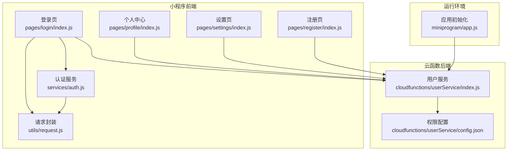
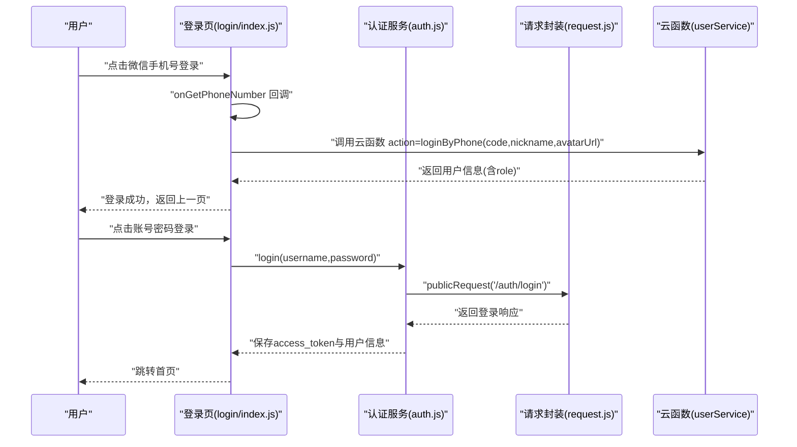
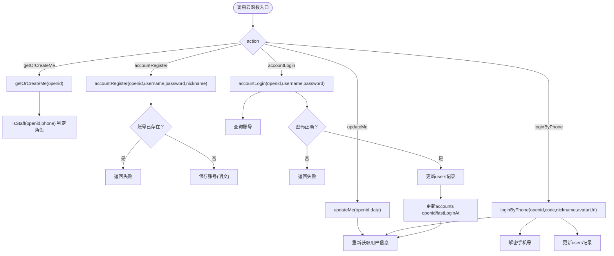
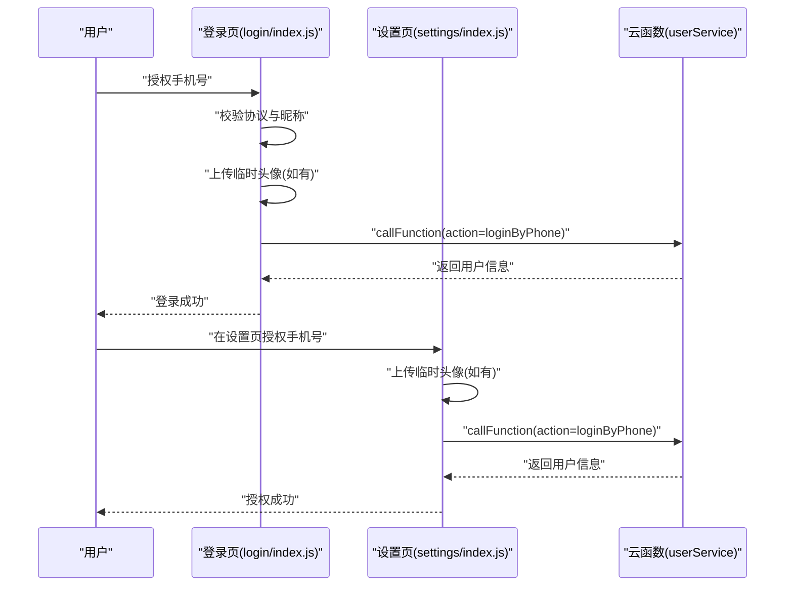
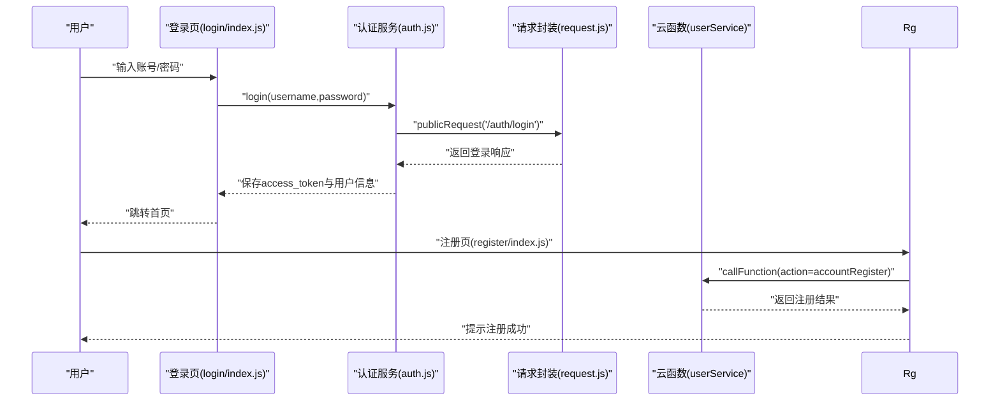
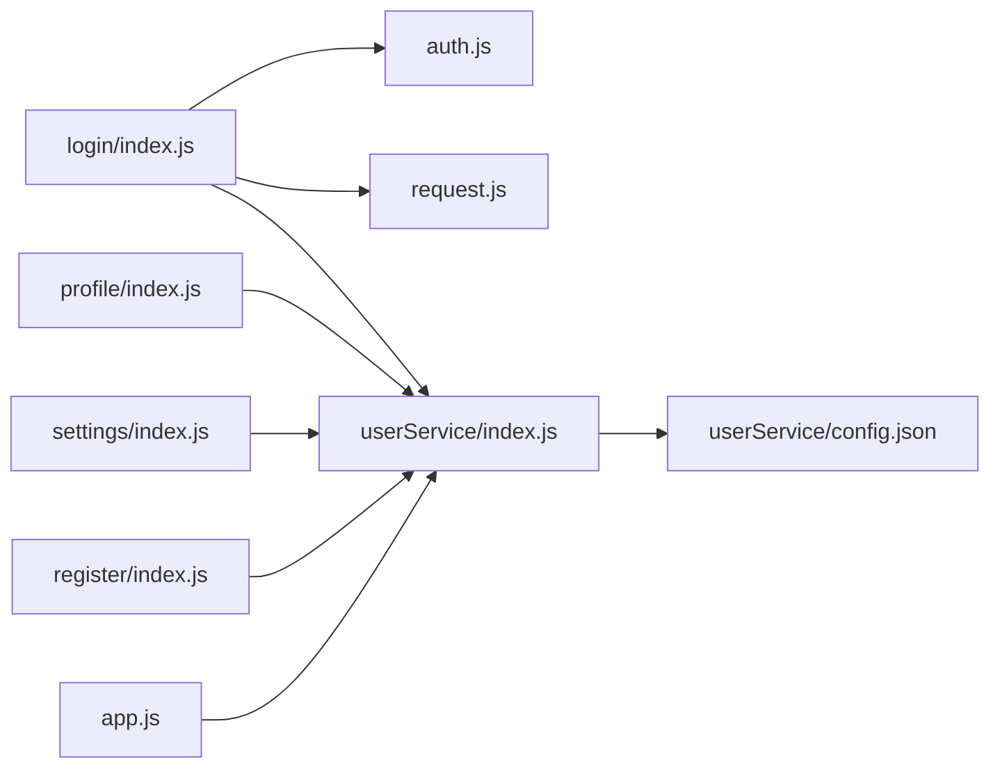

# 用户系统

<cite>
**本文引用的文件**
- [cloudfunctions/userService/index.js](file://cloudfunctions/userService/index.js)
- [cloudfunctions/userService/config.json](file://cloudfunctions/userService/config.json)
- [miniprogram/services/auth.js](file://miniprogram/services/auth.js)
- [miniprogram/utils/request.js](file://miniprogram/utils/request.js)
- [miniprogram/pages/login/index.js](file://miniprogram/pages/login/index.js)
- [miniprogram/pages/profile/index.js](file://miniprogram/pages/profile/index.js)
- [miniprogram/pages/register/index.js](file://miniprogram/pages/register/index.js)
- [miniprogram/pages/settings/index.js](file://miniprogram/pages/settings/index.js)
- [miniprogram/app.js](file://miniprogram/app.js)
- [docs/账号密码登录测试说明.md](file://docs/账号密码登录测试说明.md)
- [docs/Web管理后台快速实施指南.md](file://docs/Web管理后台快速实施指南.md)
- [docs/迁移完成总结.md](file://docs/迁移完成总结.md)
- [PRD.md](file://PRD.md)
</cite>

## 目录
1. [简介](#简介)
2. [项目结构](#项目结构)
3. [核心组件](#核心组件)
4. [架构总览](#架构总览)
5. [详细组件分析](#详细组件分析)
6. [依赖关系分析](#依赖关系分析)
7. [性能考量](#性能考量)
8. [故障排查指南](#故障排查指南)
9. [结论](#结论)
10. [附录](#附录)

## 简介
本文件围绕安得褓贝用户系统，系统性梳理微信登录与账号密码登录两种认证方式，重点说明通过云函数 userService 实现的 getOrCreateMe、updateMe、loginByPhone、accountRegister 和 accountLogin 等核心接口的工作流程；阐述用户信息获取与更新机制（昵称、头像、手机号的存储与同步），以及个人中心页面的数据绑定逻辑；解释用户角色（customer/staff）的判定逻辑（基于 users 与 staff 集合的关联查询）；给出安全考虑（密码明文存储风险与未来加密建议）；并提供常见问题（登录态失效、手机号授权失败）的排查方法。

## 项目结构
用户系统涉及小程序前端与云函数后端两部分：
- 小程序前端：登录页、个人中心、设置页、注册页、认证服务与请求封装
- 云函数后端：用户信息服务（userService）

图表来源
- [miniprogram/pages/login/index.js](file://miniprogram/pages/login/index.js#L1-L294)
- [miniprogram/pages/profile/index.js](file://miniprogram/pages/profile/index.js#L1-L53)
- [miniprogram/pages/settings/index.js](file://miniprogram/pages/settings/index.js#L1-L120)
- [miniprogram/pages/register/index.js](file://miniprogram/pages/register/index.js#L1-L97)
- [miniprogram/services/auth.js](file://miniprogram/services/auth.js#L1-L163)
- [miniprogram/utils/request.js](file://miniprogram/utils/request.js#L1-L125)
- [cloudfunctions/userService/index.js](file://cloudfunctions/userService/index.js#L1-L289)
- [cloudfunctions/userService/config.json](file://cloudfunctions/userService/config.json#L1-L6)
- [miniprogram/app.js](file://miniprogram/app.js#L1-L21)

章节来源
- [miniprogram/pages/login/index.js](file://miniprogram/pages/login/index.js#L1-L294)
- [miniprogram/pages/profile/index.js](file://miniprogram/pages/profile/index.js#L1-L53)
- [miniprogram/pages/settings/index.js](file://miniprogram/pages/settings/index.js#L1-L120)
- [miniprogram/pages/register/index.js](file://miniprogram/pages/register/index.js#L1-L97)
- [miniprogram/services/auth.js](file://miniprogram/services/auth.js#L1-L163)
- [miniprogram/utils/request.js](file://miniprogram/utils/request.js#L1-L125)
- [cloudfunctions/userService/index.js](file://cloudfunctions/userService/index.js#L1-L289)
- [cloudfunctions/userService/config.json](file://cloudfunctions/userService/config.json#L1-L6)
- [miniprogram/app.js](file://miniprogram/app.js#L1-L21)

## 核心组件
- 云函数 userService：负责用户信息的创建/获取、更新、微信手机号登录、账号密码注册与登录等
- 认证服务 auth.js：封装账号密码登录、获取当前用户、Token 校验、保存/读取本地认证数据、登出
- 请求封装 request.js：封装公开请求与认证请求，统一处理 401 登录态失效跳转
- 登录页 login/index.js：处理微信手机号授权、账号密码登录、加载用户信息、登录状态检查
- 个人中心 profile/index.js：加载并展示用户信息
- 设置页 settings/index.js：补充手机号授权与用户信息更新
- 注册页 register/index.js：调用云函数执行账号密码注册
- 应用初始化 app.js：设置云环境

章节来源
- [cloudfunctions/userService/index.js](file://cloudfunctions/userService/index.js#L1-L289)
- [miniprogram/services/auth.js](file://miniprogram/services/auth.js#L1-L163)
- [miniprogram/utils/request.js](file://miniprogram/utils/request.js#L1-L125)
- [miniprogram/pages/login/index.js](file://miniprogram/pages/login/index.js#L1-L294)
- [miniprogram/pages/profile/index.js](file://miniprogram/pages/profile/index.js#L1-L53)
- [miniprogram/pages/settings/index.js](file://miniprogram/pages/settings/index.js#L1-L120)
- [miniprogram/pages/register/index.js](file://miniprogram/pages/register/index.js#L1-L97)
- [miniprogram/app.js](file://miniprogram/app.js#L1-L21)

## 架构总览
用户系统采用“小程序前端 + 云函数后端”的分层架构：
- 前端通过 wx.cloud.callFunction 调用 userService 的接口
- 前端通过 authService 与 request.js 统一封装登录、Token 校验与请求
- 后端通过云数据库操作 users、staff、accounts 集合，实现用户角色与信息管理

图表来源
- [miniprogram/pages/login/index.js](file://miniprogram/pages/login/index.js#L125-L190)
- [miniprogram/services/auth.js](file://miniprogram/services/auth.js#L14-L22)
- [miniprogram/utils/request.js](file://miniprogram/utils/request.js#L12-L41)
- [cloudfunctions/userService/index.js](file://cloudfunctions/userService/index.js#L105-L161)

## 详细组件分析

### 云函数 userService 核心接口
- getOrCreateMe(openid)：按 openid 查询或创建用户记录，并根据手机号/旧 openid 判定角色（customer/staff），返回用户对象
- updateMe(openid, data)：安全更新 nickname、avatarUrl、phone 等字段，随后重新获取用户信息
- loginByPhone(openid, code, nickname, avatarUrl)：调用微信手机号开放接口解密手机号，确保用户记录存在，更新用户信息（含昵称、头像、手机号），并重新判定角色
- accountRegister(openid, username, password, nickname)：检查账号是否存在，明文保存账号与昵称，返回注册结果
- accountLogin(openid, username, password)：查询账号，明文比对密码，确保用户记录存在，更新用户信息（昵称、账号名），更新账号 openid 与最后登录时间，重新获取用户信息

图表来源
- [cloudfunctions/userService/index.js](file://cloudfunctions/userService/index.js#L26-L84)
- [cloudfunctions/userService/index.js](file://cloudfunctions/userService/index.js#L86-L103)
- [cloudfunctions/userService/index.js](file://cloudfunctions/userService/index.js#L105-L161)
- [cloudfunctions/userService/index.js](file://cloudfunctions/userService/index.js#L163-L196)
- [cloudfunctions/userService/index.js](file://cloudfunctions/userService/index.js#L198-L256)

章节来源
- [cloudfunctions/userService/index.js](file://cloudfunctions/userService/index.js#L26-L84)
- [cloudfunctions/userService/index.js](file://cloudfunctions/userService/index.js#L86-L103)
- [cloudfunctions/userService/index.js](file://cloudfunctions/userService/index.js#L105-L161)
- [cloudfunctions/userService/index.js](file://cloudfunctions/userService/index.js#L163-L196)
- [cloudfunctions/userService/index.js](file://cloudfunctions/userService/index.js#L198-L256)

### 微信登录与手机号授权流程
- 登录页 login/index.js 在 onGetPhoneNumber 回调中：
  - 校验用户协议同意与昵称填写
  - 若有临时头像，先上传至云存储再调用云函数
  - 调用云函数 action=loginByPhone，传入 code、nickname、avatarUrl
  - 成功后提示并返回上一页
- 设置页 settings/index.js 提供“获取手机号”入口，逻辑与登录页一致

图表来源
- [miniprogram/pages/login/index.js](file://miniprogram/pages/login/index.js#L125-L190)
- [miniprogram/pages/settings/index.js](file://miniprogram/pages/settings/index.js#L63-L100)
- [cloudfunctions/userService/index.js](file://cloudfunctions/userService/index.js#L105-L161)

章节来源
- [miniprogram/pages/login/index.js](file://miniprogram/pages/login/index.js#L125-L190)
- [miniprogram/pages/settings/index.js](file://miniprogram/pages/settings/index.js#L63-L100)
- [cloudfunctions/userService/index.js](file://cloudfunctions/userService/index.js#L105-L161)

### 账号密码登录与注册流程
- 登录页 login/index.js：
  - onAccountLogin 校验账号/密码非空
  - 调用 authService.login(username,password)，内部通过 request.publicRequest 发起 /auth/login
  - 成功后保存 access_token 与用户信息，跳转首页
- 注册页 register/index.js：
  - onRegister 校验账号/密码/确认密码/昵称
  - 调用云函数 action=accountRegister(username,password,nickname)
  - 成功后提示返回登录页

图表来源
- [miniprogram/pages/login/index.js](file://miniprogram/pages/login/index.js#L195-L277)
- [miniprogram/services/auth.js](file://miniprogram/services/auth.js#L14-L22)
- [miniprogram/utils/request.js](file://miniprogram/utils/request.js#L12-L41)
- [miniprogram/pages/register/index.js](file://miniprogram/pages/register/index.js#L25-L90)
- [cloudfunctions/userService/index.js](file://cloudfunctions/userService/index.js#L163-L196)

章节来源
- [miniprogram/pages/login/index.js](file://miniprogram/pages/login/index.js#L195-L277)
- [miniprogram/services/auth.js](file://miniprogram/services/auth.js#L14-L22)
- [miniprogram/utils/request.js](file://miniprogram/utils/request.js#L12-L41)
- [miniprogram/pages/register/index.js](file://miniprogram/pages/register/index.js#L25-L90)
- [cloudfunctions/userService/index.js](file://cloudfunctions/userService/index.js#L163-L196)

### 用户信息获取与更新机制
- 个人中心 profile/index.js：
  - onShow 时调用云函数 action=getOrCreateMe，合并更新 me 数据
- 登录页 login/index.js：
  - onLoad 时调用云函数 action=getOrCreateMe，初始化 me 与表单字段
- 更新机制：
  - updateMe 安全更新 nickname、avatarUrl、phone
  - loginByPhone 在解密手机号后同时更新昵称、头像、手机号
  - accountLogin 在登录成功后更新用户昵称与账号名

章节来源
- [miniprogram/pages/profile/index.js](file://miniprogram/pages/profile/index.js#L9-L35)
- [miniprogram/pages/login/index.js](file://miniprogram/pages/login/index.js#L69-L85)
- [cloudfunctions/userService/index.js](file://cloudfunctions/userService/index.js#L86-L103)
- [cloudfunctions/userService/index.js](file://cloudfunctions/userService/index.js#L105-L161)
- [cloudfunctions/userService/index.js](file://cloudfunctions/userService/index.js#L198-L256)

### 用户角色（customer/staff）判定逻辑
- 后端判定：
  - isStaff(openid, phone)：优先通过手机号匹配 staff 集合；若无手机号或不匹配，回退到 openid 匹配
  - getOrCreateMe 内部在获取/创建用户后，重新调用 isStaff 判定角色并更新 users 记录
- 前端展示：
  - PRD 指出：个人中心根据 me.role 展示员工入口
- 注意：
  - PRD 指出：前端未做路由守卫，即使 customer 手动进入管理页，云函数会拒绝

章节来源
- [cloudfunctions/userService/index.js](file://cloudfunctions/userService/index.js#L26-L47)
- [cloudfunctions/userService/index.js](file://cloudfunctions/userService/index.js#L49-L84)
- [PRD.md](file://PRD.md#L275-L281)

### 安全考虑与改进建议
- 现状：
  - 账号密码注册与登录均使用明文存储密码，存在高风险
- 建议：
  - 使用 bcrypt 等加密算法对密码进行加盐哈希存储
  - 增加找回密码、修改密码、登录日志、设备管理等安全能力
- 参考：
  - 文档明确建议添加密码加密（bcrypt）

章节来源
- [cloudfunctions/userService/index.js](file://cloudfunctions/userService/index.js#L163-L196)
- [docs/账号密码登录测试说明.md](file://docs/账号密码登录测试说明.md#L111-L119)

## 依赖关系分析
- 前端依赖：
  - login/index.js 依赖 auth.js 与 request.js，间接依赖云函数 userService
  - profile/index.js 依赖云函数 userService
  - settings/index.js 依赖云函数 userService
  - register/index.js 依赖云函数 userService
  - app.js 初始化云环境，影响所有云调用
- 云函数依赖：
  - userService 依赖云数据库与微信开放接口 phonenumber.getPhoneNumber
  - config.json 声明所需 openapi 权限

图表来源
- [miniprogram/pages/login/index.js](file://miniprogram/pages/login/index.js#L1-L294)
- [miniprogram/pages/profile/index.js](file://miniprogram/pages/profile/index.js#L1-L53)
- [miniprogram/pages/settings/index.js](file://miniprogram/pages/settings/index.js#L1-L120)
- [miniprogram/pages/register/index.js](file://miniprogram/pages/register/index.js#L1-L97)
- [miniprogram/services/auth.js](file://miniprogram/services/auth.js#L1-L163)
- [miniprogram/utils/request.js](file://miniprogram/utils/request.js#L1-L125)
- [cloudfunctions/userService/index.js](file://cloudfunctions/userService/index.js#L1-L289)
- [cloudfunctions/userService/config.json](file://cloudfunctions/userService/config.json#L1-L6)
- [miniprogram/app.js](file://miniprogram/app.js#L1-L21)

章节来源
- [miniprogram/pages/login/index.js](file://miniprogram/pages/login/index.js#L1-L294)
- [miniprogram/pages/profile/index.js](file://miniprogram/pages/profile/index.js#L1-L53)
- [miniprogram/pages/settings/index.js](file://miniprogram/pages/settings/index.js#L1-L120)
- [miniprogram/pages/register/index.js](file://miniprogram/pages/register/index.js#L1-L97)
- [miniprogram/services/auth.js](file://miniprogram/services/auth.js#L1-L163)
- [miniprogram/utils/request.js](file://miniprogram/utils/request.js#L1-L125)
- [cloudfunctions/userService/index.js](file://cloudfunctions/userService/index.js#L1-L289)
- [cloudfunctions/userService/config.json](file://cloudfunctions/userService/config.json#L1-L6)
- [miniprogram/app.js](file://miniprogram/app.js#L1-L21)

## 性能考量
- 云函数并发与冷启动：云函数首次调用可能有冷启动延迟，建议在业务低峰期触发预热
- 数据库查询：getOrCreateMe 与 loginByPhone 均涉及多集合查询，建议在 staff 与 accounts 集合建立合适索引以提升查询效率
- 文件上传：头像上传走云存储，注意控制图片尺寸与格式，减少带宽与存储成本
- 前端渲染：个人中心与登录页尽量避免重复请求，复用缓存数据

## 故障排查指南
- 登录态失效（Token 过期）
  - 现象：authenticatedRequest 收到 401，自动清理本地 Token 并跳转登录页
  - 排查：确认后端是否正确颁发与校验 Token；检查前端是否正确保存 access_token
  - 参考：请求封装对 401 的处理逻辑
- 手机号授权失败
  - 现象：onGetPhoneNumber 回调 errMsg 不为 ok，或未授权
  - 排查：确认用户已同意协议与昵称已填写；检查微信开放平台配置与 code 是否有效
- 域名校验问题
  - 现象：网络请求失败，提示“request:fail”
  - 排查：在开发者工具“详情”→“本地设置”中勾选“不校验合法域名”，生产环境需配置正确域名
- 云函数权限不足
  - 现象：调用 phonenumber.getPhoneNumber 报权限不足
  - 排查：确认 userService 的 config.json 已声明该 openapi 权限
- 密码明文风险
  - 现象：数据库中存储明文密码
  - 排查：尽快引入 bcrypt 加密；增加登录日志与安全审计

章节来源
- [miniprogram/utils/request.js](file://miniprogram/utils/request.js#L43-L103)
- [miniprogram/pages/login/index.js](file://miniprogram/pages/login/index.js#L125-L190)
- [cloudfunctions/userService/config.json](file://cloudfunctions/userService/config.json#L1-L6)
- [docs/迁移完成总结.md](file://docs/迁移完成总结.md#L158-L186)

## 结论
用户系统通过云函数 userService 提供了完善的用户信息管理与认证能力，支持微信手机号登录与账号密码登录两种路径。角色判定逻辑清晰，前后端配合良好。当前存在的主要风险在于账号密码明文存储，建议尽快引入密码加密与完善的安全能力。登录态失效与手机号授权失败是常见问题，可通过本文提供的排查步骤快速定位与解决。

## 附录
- 云函数入口与 action 分发
  - getOrCreateMe：获取或创建用户并判定角色
  - updateMe：安全更新用户信息
  - loginByPhone：微信手机号登录
  - accountRegister：账号密码注册
  - accountLogin：账号密码登录
- 前端关键页面与职责
  - 登录页：处理微信手机号授权与账号密码登录，加载用户信息
  - 个人中心：展示用户信息，支持跳转设置与管理入口
  - 设置页：补充手机号授权与用户信息更新
  - 注册页：执行账号密码注册
- 运行环境
  - app.js 配置云环境，确保所有云调用指向正确环境

章节来源
- [cloudfunctions/userService/index.js](file://cloudfunctions/userService/index.js#L258-L289)
- [miniprogram/pages/login/index.js](file://miniprogram/pages/login/index.js#L1-L294)
- [miniprogram/pages/profile/index.js](file://miniprogram/pages/profile/index.js#L1-L53)
- [miniprogram/pages/settings/index.js](file://miniprogram/pages/settings/index.js#L1-L120)
- [miniprogram/pages/register/index.js](file://miniprogram/pages/register/index.js#L1-L97)
- [miniprogram/app.js](file://miniprogram/app.js#L1-L21)