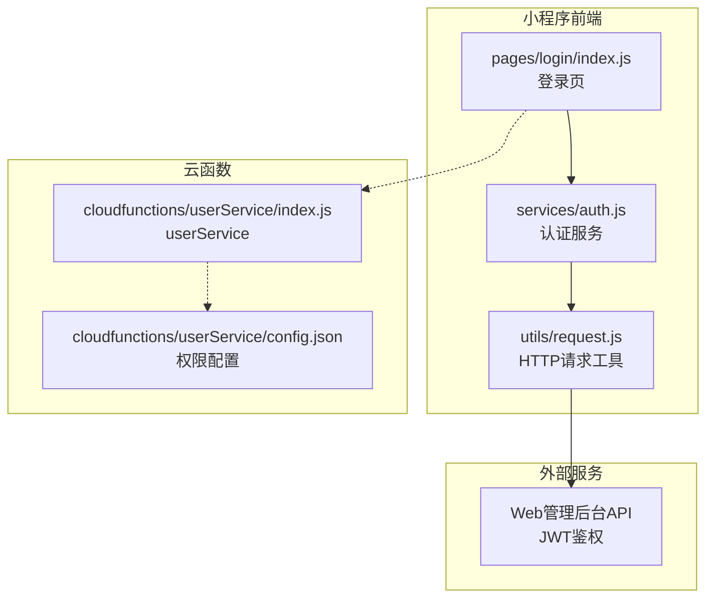
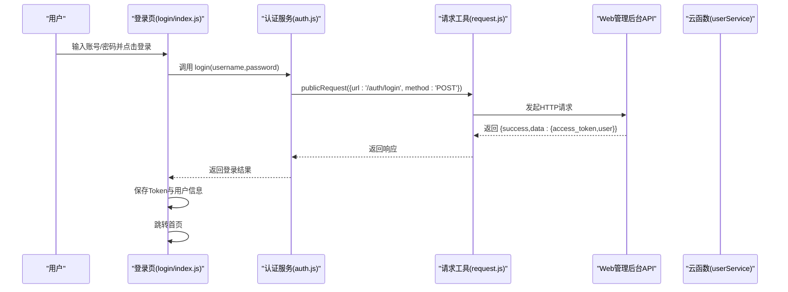
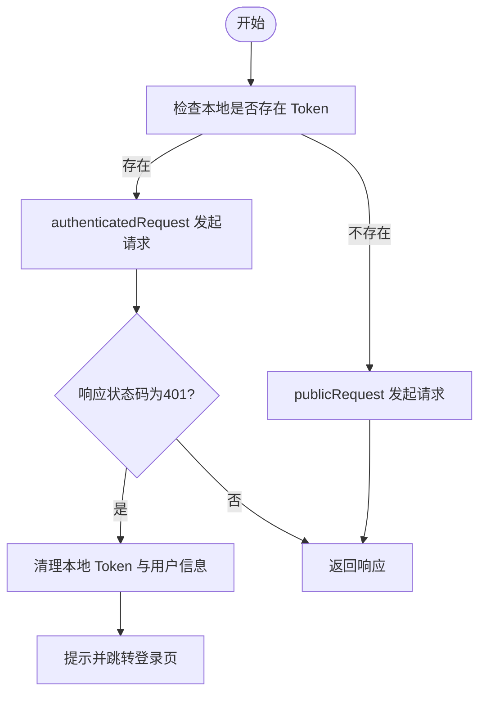
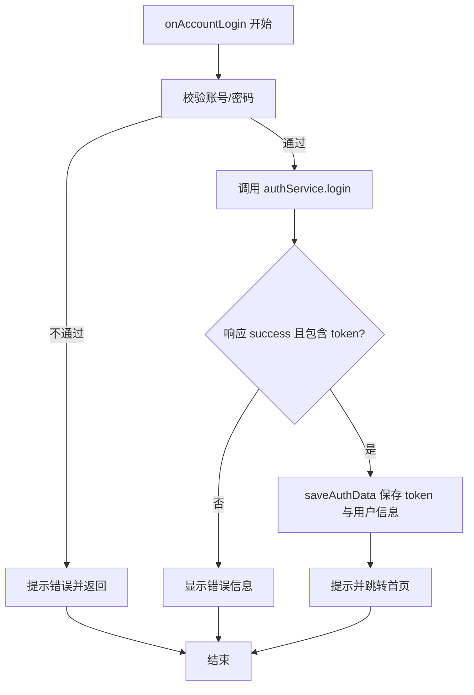
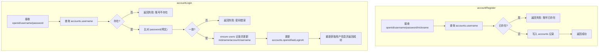
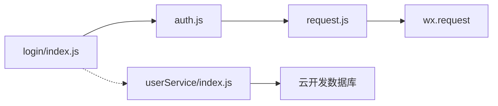

# 账号密码登录

<cite>
**本文引用的文件**
- [cloudfunctions/userService/index.js](file://cloudfunctions/userService/index.js)
- [cloudfunctions/userService/config.json](file://cloudfunctions/userService/config.json)
- [miniprogram/services/auth.js](file://miniprogram/services/auth.js)
- [miniprogram/utils/request.js](file://miniprogram/utils/request.js)
- [miniprogram/pages/login/index.js](file://miniprogram/pages/login/index.js)
- [miniprogram/pages/register/index.js](file://miniprogram/pages/register/index.js)
- [docs/账号密码登录-使用说明.md](file://docs/账号密码登录-使用说明.md)
- [docs/账号密码登录测试说明.md](file://docs/账号密码登录测试说明.md)
- [docs/Web管理后台快速实施指南.md](file://docs/Web管理后台快速实施指南.md)
</cite>

## 目录
1. [简介](#简介)
2. [项目结构](#项目结构)
3. [核心组件](#核心组件)
4. [架构总览](#架构总览)
5. [详细组件分析](#详细组件分析)
6. [依赖关系分析](#依赖关系分析)
7. [性能考量](#性能考量)
8. [故障排查指南](#故障排查指南)
9. [结论](#结论)
10. [附录](#附录)

## 简介
本文件围绕“账号密码登录”能力，系统化梳理前端通过认证服务模块调用公共请求发起登录请求的通信机制，以及云函数 userService 的账号注册与登录流程。重点覆盖：
- 前端通过 auth.js 与 request.js 的协作链路
- userService 云函数中 accountRegister 与 accountLogin 的实现要点
- 登录成功后跳转首页与 Token 失效处理机制
- 常见问题排查与安全加固建议（密码明文存储风险）

## 项目结构
本次登录体系涉及前后端关键文件如下：
- 前端请求封装与认证服务：miniprogram/utils/request.js、miniprogram/services/auth.js
- 登录页面与注册页面：miniprogram/pages/login/index.js、miniprogram/pages/register/index.js
- 云函数：cloudfunctions/userService/index.js、cloudfunctions/userService/config.json
- 文档：docs/账号密码登录-使用说明.md、docs/账号密码登录测试说明.md、docs/Web管理后台快速实施指南.md

图表来源
- [miniprogram/pages/login/index.js](file://miniprogram/pages/login/index.js#L1-L294)
- [miniprogram/services/auth.js](file://miniprogram/services/auth.js#L1-L163)
- [miniprogram/utils/request.js](file://miniprogram/utils/request.js#L1-L125)
- [cloudfunctions/userService/index.js](file://cloudfunctions/userService/index.js#L1-L289)
- [cloudfunctions/userService/config.json](file://cloudfunctions/userService/config.json#L1-L6)

章节来源
- [miniprogram/pages/login/index.js](file://miniprogram/pages/login/index.js#L1-L294)
- [miniprogram/services/auth.js](file://miniprogram/services/auth.js#L1-L163)
- [miniprogram/utils/request.js](file://miniprogram/utils/request.js#L1-L125)
- [cloudfunctions/userService/index.js](file://cloudfunctions/userService/index.js#L1-L289)
- [cloudfunctions/userService/config.json](file://cloudfunctions/userService/config.json#L1-L6)

## 核心组件
- 前端请求工具 request.js：封装 wx.request，区分公开请求与认证请求，统一处理 401 Token 过期场景
- 认证服务 auth.js：封装登录、Token 校验、本地存储读取与清理
- 登录页 login/index.js：收集表单数据、调用认证服务、处理响应、保存 Token 与用户信息、跳转首页
- 注册页 register/index.js：表单校验与调用云函数 accountRegister
- 云函数 userService：提供 getOrCreateMe、updateMe、loginByPhone、accountRegister、accountLogin 等动作

章节来源
- [miniprogram/utils/request.js](file://miniprogram/utils/request.js#L1-L125)
- [miniprogram/services/auth.js](file://miniprogram/services/auth.js#L1-L163)
- [miniprogram/pages/login/index.js](file://miniprogram/pages/login/index.js#L1-L294)
- [miniprogram/pages/register/index.js](file://miniprogram/pages/register/index.js#L1-L97)
- [cloudfunctions/userService/index.js](file://cloudfunctions/userService/index.js#L1-L289)

## 架构总览
账号密码登录的整体交互链路如下：

图表来源
- [miniprogram/pages/login/index.js](file://miniprogram/pages/login/index.js#L195-L277)
- [miniprogram/services/auth.js](file://miniprogram/services/auth.js#L14-L22)
- [miniprogram/utils/request.js](file://miniprogram/utils/request.js#L12-L41)

章节来源
- [miniprogram/pages/login/index.js](file://miniprogram/pages/login/index.js#L195-L277)
- [miniprogram/services/auth.js](file://miniprogram/services/auth.js#L14-L22)
- [miniprogram/utils/request.js](file://miniprogram/utils/request.js#L12-L41)

## 详细组件分析

### 前端通信机制：auth.js 与 request.js
- publicRequest：用于登录等无需认证的接口，自动附加客户端标识头，统一处理非 200 响应
- authenticatedRequest：用于需要 Token 的接口，自动从本地存储读取 Token 并注入 Authorization 头；当收到 401 时，清理本地存储并提示跳转登录页
- request：根据是否存在 Token 自动选择 public 或 authenticated 请求

图表来源
- [miniprogram/utils/request.js](file://miniprogram/utils/request.js#L43-L103)

章节来源
- [miniprogram/utils/request.js](file://miniprogram/utils/request.js#L1-L125)
- [miniprogram/services/auth.js](file://miniprogram/services/auth.js#L1-L163)

### 登录页 onAccountLogin：表单收集、调用认证、保存与跳转
- 收集表单数据并做基础校验
- 调用 authService.login(username,password)，内部通过 publicRequest 调用 /auth/login
- 解析响应，提取 access_token 与 user，调用 authService.saveAuthData 保存至本地存储
- 成功后提示并延迟跳转首页

图表来源
- [miniprogram/pages/login/index.js](file://miniprogram/pages/login/index.js#L195-L277)
- [miniprogram/services/auth.js](file://miniprogram/services/auth.js#L69-L95)

章节来源
- [miniprogram/pages/login/index.js](file://miniprogram/pages/login/index.js#L195-L277)
- [miniprogram/services/auth.js](file://miniprogram/services/auth.js#L69-L95)

### 云函数 userService：accountRegister 与 accountLogin
- accountRegister
  - 校验账号唯一性：按 username 查询 accounts 集合，若存在则返回失败
  - 创建账号：向 accounts 集合写入 username、password、nickname、openid、createdAt
  - 返回成功结果
- accountLogin
  - 查询账号：按 username 查询 accounts 集合，不存在则返回“账号不存在”
  - 密码比对：明文比对 password，不一致返回“密码错误”
  - 同步用户信息：确保 users 集合存在对应 openid 的用户记录，并更新 nickname、accountUsername 等字段
  - 更新账号 openid 与 lastLoginAt：支持多设备登录
  - 重新获取用户信息并返回

图表来源
- [cloudfunctions/userService/index.js](file://cloudfunctions/userService/index.js#L163-L256)

章节来源
- [cloudfunctions/userService/index.js](file://cloudfunctions/userService/index.js#L163-L256)

### 注册页 register/index.js：表单校验与调用云函数
- 对账号、密码、确认密码、昵称进行前端校验
- 调用 wx.cloud.callFunction，传入 action: "accountRegister" 与表单数据
- 根据返回结果提示成功或失败

章节来源
- [miniprogram/pages/register/index.js](file://miniprogram/pages/register/index.js#L1-L97)

### 云函数权限与初始化
- config.json 声明 phonenumber.getPhoneNumber 开放接口权限，用于手机号快捷登录
- 云函数 exports.main 中首次运行会自动创建 users、staff、accounts 等集合，避免新环境报错

章节来源
- [cloudfunctions/userService/config.json](file://cloudfunctions/userService/config.json#L1-L6)
- [cloudfunctions/userService/index.js](file://cloudfunctions/userService/index.js#L1-L24)

## 依赖关系分析
- 前端依赖
  - login/index.js 依赖 auth.js
  - auth.js 依赖 request.js
  - request.js 依赖微信原生 wx.request
- 云函数依赖
  - userService 依赖 wx-server-sdk 与云开发数据库
  - userService 通过 action 分发 getOrCreateMe、updateMe、loginByPhone、accountRegister、accountLogin

图表来源
- [miniprogram/pages/login/index.js](file://miniprogram/pages/login/index.js#L1-L294)
- [miniprogram/services/auth.js](file://miniprogram/services/auth.js#L1-L163)
- [miniprogram/utils/request.js](file://miniprogram/utils/request.js#L1-L125)
- [cloudfunctions/userService/index.js](file://cloudfunctions/userService/index.js#L1-L289)

章节来源
- [miniprogram/pages/login/index.js](file://miniprogram/pages/login/index.js#L1-L294)
- [miniprogram/services/auth.js](file://miniprogram/services/auth.js#L1-L163)
- [miniprogram/utils/request.js](file://miniprogram/utils/request.js#L1-L125)
- [cloudfunctions/userService/index.js](file://cloudfunctions/userService/index.js#L1-L289)

## 性能考量
- 登录与注册均采用单条查询与单条更新，复杂度较低，适合小规模并发
- 建议在生产环境对密码进行加密（如 bcrypt），避免明文存储带来的安全风险
- 可考虑对频繁登录失败的账号增加防暴力破解策略（如限流、验证码）

[本节为通用建议，不直接分析具体文件]

## 故障排查指南
- 域名校验失败导致请求中断
  - 现象：网络请求失败，控制台出现 request:fail
  - 解决：在开发者工具“详情/本地设置”勾选“不校验合法域名”，或在小程序后台配置合法域名
  - 参考路径：[miniprogram/pages/login/index.js](file://miniprogram/pages/login/index.js#L264-L274)、[docs/账号密码登录-使用说明.md](file://docs/账号密码登录-使用说明.md#L160-L171)
- 登录成功但未跳转
  - 现象：登录成功但页面未跳转
  - 排查：检查是否成功保存 access_token；查看控制台日志中“保存认证数据”的输出
  - 参考路径：[miniprogram/pages/login/index.js](file://miniprogram/pages/login/index.js#L233-L249)、[miniprogram/services/auth.js](file://miniprogram/services/auth.js#L69-L95)
- Token 过期
  - 现象：authenticatedRequest 返回 401
  - 处理：自动清理本地存储并提示跳转登录页
  - 参考路径：[miniprogram/utils/request.js](file://miniprogram/utils/request.js#L70-L89)
- 账号不存在/密码错误
  - 现象：accountLogin 返回相应错误信息
  - 处理：提示用户核对账号与密码
  - 参考路径：[cloudfunctions/userService/index.js](file://cloudfunctions/userService/index.js#L209-L219)
- 账号已存在
  - 现象：accountRegister 返回“账号已存在”
  - 处理：引导用户更换账号或前往登录
  - 参考路径：[cloudfunctions/userService/index.js](file://cloudfunctions/userService/index.js#L175-L177)、[miniprogram/pages/register/index.js](file://miniprogram/pages/register/index.js#L69-L83)

章节来源
- [miniprogram/pages/login/index.js](file://miniprogram/pages/login/index.js#L264-L274)
- [docs/账号密码登录-使用说明.md](file://docs/账号密码登录-使用说明.md#L160-L171)
- [miniprogram/utils/request.js](file://miniprogram/utils/request.js#L70-L89)
- [cloudfunctions/userService/index.js](file://cloudfunctions/userService/index.js#L175-L177)
- [miniprogram/pages/register/index.js](file://miniprogram/pages/register/index.js#L69-L83)

## 结论
- 当前实现基于“安得家政”的账号密码登录能力迁移到“安得褓贝”，前端通过 auth.js 与 request.js 完成登录请求与 Token 管理，云函数 userService 提供 accountRegister 与 accountLogin 的核心逻辑
- 登录成功后跳转首页与 Token 失效处理机制清晰，便于后续扩展
- 安全方面，当前密码以明文存储，建议尽快引入 bcrypt 等加密算法；同时完善注册与登录的前端校验与错误提示

[本节为总结性内容，不直接分析具体文件]

## 附录

### 登录成功后跳转首页与 Token 失效处理
- 登录成功：前端保存 access_token 与用户信息后，延迟跳转首页
- Token 失效：authenticatedRequest 收到 401 时，清理本地存储并提示跳转登录页

章节来源
- [miniprogram/pages/login/index.js](file://miniprogram/pages/login/index.js#L233-L249)
- [miniprogram/utils/request.js](file://miniprogram/utils/request.js#L70-L89)

### 前端 onAccountLogin 方法全流程（路径指引）
- 表单收集与校验：[miniprogram/pages/login/index.js](file://miniprogram/pages/login/index.js#L195-L218)
- 调用认证服务：[miniprogram/services/auth.js](file://miniprogram/services/auth.js#L14-L22)
- 保存 Token 与用户信息：[miniprogram/services/auth.js](file://miniprogram/services/auth.js#L69-L95)
- 跳转首页：[miniprogram/pages/login/index.js](file://miniprogram/pages/login/index.js#L245-L249)

章节来源
- [miniprogram/pages/login/index.js](file://miniprogram/pages/login/index.js#L195-L249)
- [miniprogram/services/auth.js](file://miniprogram/services/auth.js#L14-L22)
- [miniprogram/services/auth.js](file://miniprogram/services/auth.js#L69-L95)

### 云函数 userService 的关键路径
- accountRegister：[cloudfunctions/userService/index.js](file://cloudfunctions/userService/index.js#L163-L196)
- accountLogin：[cloudfunctions/userService/index.js](file://cloudfunctions/userService/index.js#L198-L256)
- 初始化集合与 action 分发：[cloudfunctions/userService/index.js](file://cloudfunctions/userService/index.js#L1-L24)、[cloudfunctions/userService/index.js](file://cloudfunctions/userService/index.js#L258-L289)

章节来源
- [cloudfunctions/userService/index.js](file://cloudfunctions/userService/index.js#L163-L256)
- [cloudfunctions/userService/index.js](file://cloudfunctions/userService/index.js#L1-L24)
- [cloudfunctions/userService/index.js](file://cloudfunctions/userService/index.js#L258-L289)

### 安全建议
- 密码加密：引入 bcrypt 等加密算法，避免明文存储
- 多设备登录：当前通过更新 accounts.openid 支持多设备登录，建议增加登录设备管理与安全提醒
- 前端校验：完善账号与密码格式校验，减少无效请求
- 日志与监控：记录登录失败与异常行为，便于审计与风控

章节来源
- [docs/账号密码登录测试说明.md](file://docs/账号密码登录测试说明.md#L105-L110)
- [docs/Web管理后台快速实施指南.md](file://docs/Web管理后台快速实施指南.md#L146-L185)