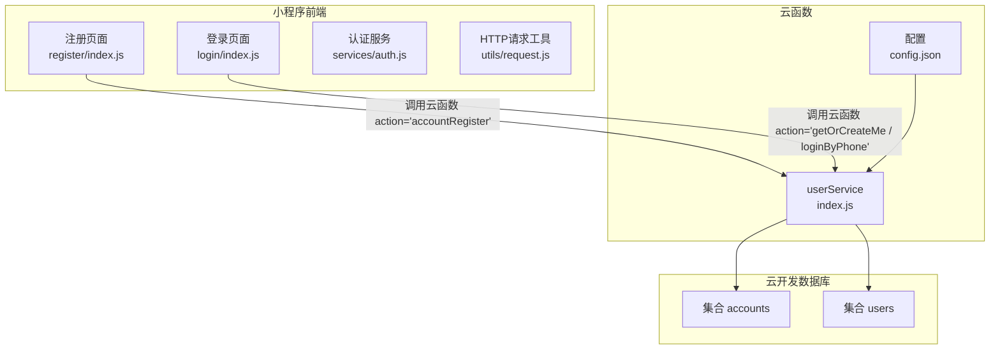
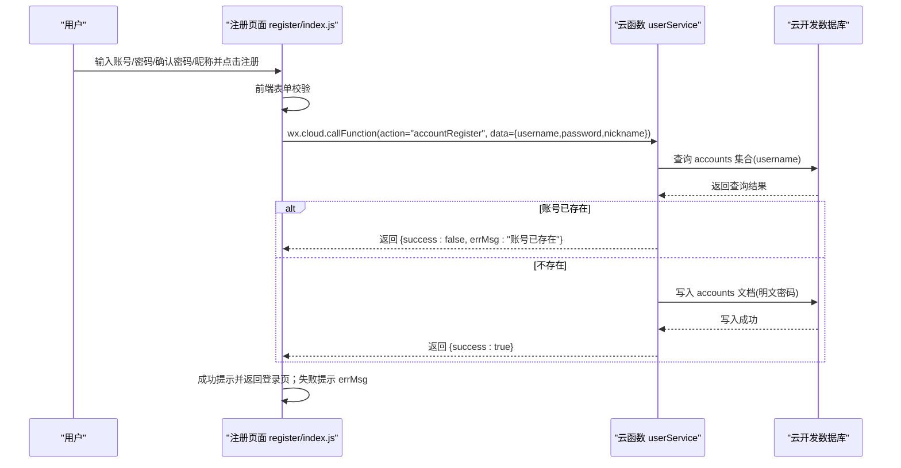
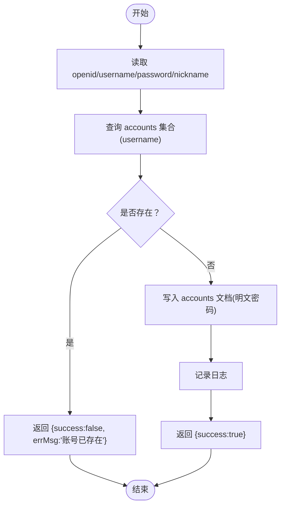
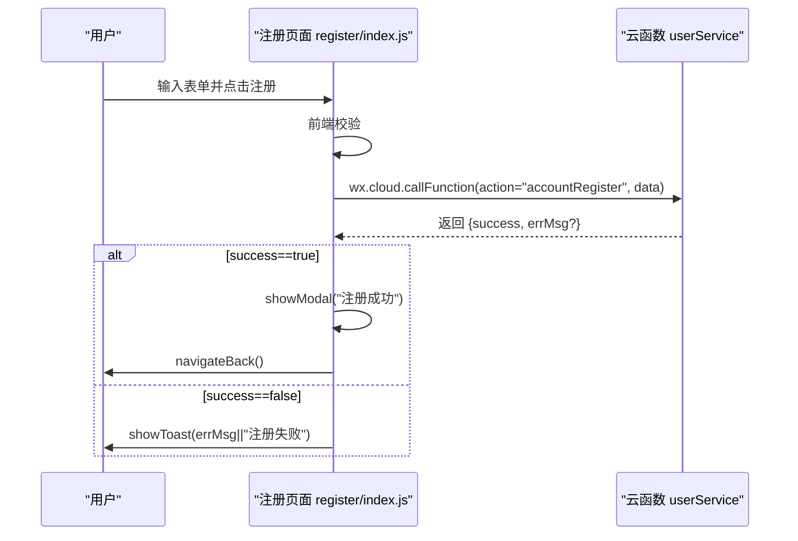
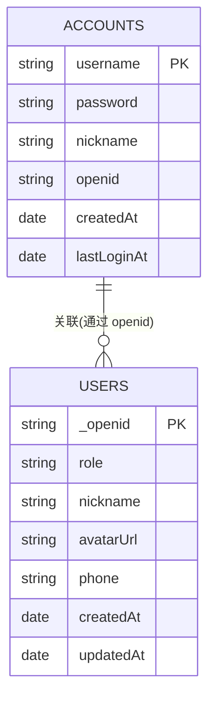
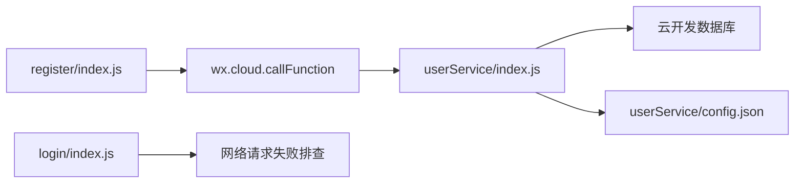

# 账号注册

<cite>
**本文引用的文件**
- [cloudfunctions/userService/index.js](file://cloudfunctions/userService/index.js)
- [cloudfunctions/userService/config.json](file://cloudfunctions/userService/config.json)
- [miniprogram/pages/register/index.js](file://miniprogram/pages/register/index.js)
- [miniprogram/pages/register/index.wxml](file://miniprogram/pages/register/index.wxml)
- [miniprogram/pages/login/index.js](file://miniprogram/pages/login/index.js)
- [miniprogram/services/auth.js](file://miniprogram/services/auth.js)
- [miniprogram/utils/request.js](file://miniprogram/utils/request.js)
- [docs/账号密码登录-使用说明.md](file://docs/账号密码登录-使用说明.md)
- [docs/账号密码登录测试说明.md](file://docs/账号密码登录测试说明.md)
</cite>

## 目录
1. [简介](#简介)
2. [项目结构](#项目结构)
3. [核心组件](#核心组件)
4. [架构总览](#架构总览)
5. [详细组件分析](#详细组件分析)
6. [依赖关系分析](#依赖关系分析)
7. [性能考量](#性能考量)
8. [故障排查指南](#故障排查指南)
9. [结论](#结论)
10. [附录](#附录)

## 简介
本文件围绕“账号注册”功能展开，重点解析云函数 userService 中的 accountRegister 实现逻辑，说明其如何接收 openid、username、password、nickname 参数，并通过查询 accounts 集合进行账号唯一性校验；同时指出当前明文密码存储的安全隐患，并建议采用 bcrypt 等哈希算法加密存储。结合前端注册页面 register/index.js 的表单收集、提交与错误提示交互流程，给出用户提交注册信息后前端调用云函数并处理响应的参考路径。最后提供常见问题排查方法与开发环境域名校验注意事项。

## 项目结构
围绕账号注册相关的关键文件分布如下：
- 云函数 userService：包含 accountRegister、accountLogin、getOrCreateMe、loginByPhone 等能力，统一通过 exports.main 分发 action。
- 小程序前端：
  - register 页面：负责收集表单数据并调用云函数执行注册。
  - login 页面：提供账号密码登录入口（与注册配套），并演示网络请求失败的排查思路。
  - services/auth.js 与 utils/request.js：封装 HTTP 请求与 Token 管理（用于“安得家政”账号密码登录场景，便于对照理解前后端交互模式）。

图表来源
- [cloudfunctions/userService/index.js](file://cloudfunctions/userService/index.js#L163-L196)
- [cloudfunctions/userService/config.json](file://cloudfunctions/userService/config.json#L1-L6)
- [miniprogram/pages/register/index.js](file://miniprogram/pages/register/index.js#L25-L90)
- [miniprogram/pages/login/index.js](file://miniprogram/pages/login/index.js#L69-L85)

章节来源
- [cloudfunctions/userService/index.js](file://cloudfunctions/userService/index.js#L163-L196)
- [miniprogram/pages/register/index.js](file://miniprogram/pages/register/index.js#L25-L90)

## 核心组件
- 云函数 userService 的 exports.main：根据 event.action 分发至具体方法，其中 accountRegister 负责账号注册。
- accountRegister：接收 openid、username、password、nickname，先查询 accounts 集合判断账号是否存在，若不存在则写入明文密码；返回 success 与 errMsg 字段。
- 注册页面 register/index.js：收集表单数据，进行前端校验，调用 wx.cloud.callFunction 并处理结果，成功时提示并返回登录页，失败时提示错误信息。
- 登录页面 login/index.js：演示网络请求失败的排查思路（与本仓库“安得家政”账号密码登录相关，可类比用于定位域名校验问题）。

章节来源
- [cloudfunctions/userService/index.js](file://cloudfunctions/userService/index.js#L163-L196)
- [miniprogram/pages/register/index.js](file://miniprogram/pages/register/index.js#L25-L90)
- [miniprogram/pages/login/index.js](file://miniprogram/pages/login/index.js#L195-L277)

## 架构总览
下图展示了从用户提交注册到云函数处理再到数据库写入的整体流程。

图表来源
- [miniprogram/pages/register/index.js](file://miniprogram/pages/register/index.js#L25-L90)
- [cloudfunctions/userService/index.js](file://cloudfunctions/userService/index.js#L163-L196)

## 详细组件分析

### 云函数 userService.accountRegister 实现
- 参数接收：从 event 中读取 username、password、nickname，并由 cloud.getWXContext() 获取 openid。
- 唯一性校验：查询 accounts 集合，按 username 精确匹配，限制返回条数为 1，若存在则直接返回错误。
- 写入逻辑：若不存在，则向 accounts 集合添加一条文档，字段包含 username、password（明文）、nickname、openid、createdAt。
- 返回值：成功返回 {success:true}，失败返回 {success:false, errMsg:"..."}。

图表来源
- [cloudfunctions/userService/index.js](file://cloudfunctions/userService/index.js#L163-L196)

章节来源
- [cloudfunctions/userService/index.js](file://cloudfunctions/userService/index.js#L163-L196)

### 前端注册页面 register/index.js 交互逻辑
- 表单收集：通过 onUsernameInput/onPasswordInput/onConfirmPasswordInput/onNicknameInput 收集数据。
- 前端校验：
  - 账号：非空且长度/格式校验（4-20位字母或数字）。
  - 密码：非空且长度≥6。
  - 确认密码：与密码一致。
  - 昵称：非空。
- 调用云函数：调用 wx.cloud.callFunction，传入 action="accountRegister" 与表单数据。
- 结果处理：
  - 成功：弹窗提示“注册成功”，并返回登录页。
  - 失败：toast 提示 errMsg 或默认“注册失败”。

图表来源
- [miniprogram/pages/register/index.js](file://miniprogram/pages/register/index.js#L25-L90)

章节来源
- [miniprogram/pages/register/index.js](file://miniprogram/pages/register/index.js#L1-L97)

### 云函数配置与集合初始化
- 配置文件 userService/config.json：声明云函数所需的 openapi 权限（如 phonenumber.getPhoneNumber），虽然与账号注册无直接关系，但体现了云函数权限管理。
- 集合初始化：exports.main 中首次运行会自动创建 users、staff、accounts 集合，避免新环境直接报“集合不存在”。

章节来源
- [cloudfunctions/userService/config.json](file://cloudfunctions/userService/config.json#L1-L6)
- [cloudfunctions/userService/index.js](file://cloudfunctions/userService/index.js#L10-L24)
- [cloudfunctions/userService/index.js](file://cloudfunctions/userService/index.js#L258-L288)

### 数据模型与集合关系
- accounts 集合：存储账号密码注册信息，字段包含 username、password（明文）、nickname、openid、createdAt、lastLoginAt 等。
- users 集合：存储用户基本信息，注册/登录后会与 openid 关联并更新用户资料。

图表来源
- [cloudfunctions/userService/index.js](file://cloudfunctions/userService/index.js#L163-L196)
- [cloudfunctions/userService/index.js](file://cloudfunctions/userService/index.js#L49-L84)

## 依赖关系分析
- 前端依赖：
  - register/index.js 依赖 wx.cloud.callFunction 发起云函数调用。
  - login/index.js 展示网络请求失败的排查思路（与本仓库“安得家政”账号密码登录相关，可类比用于定位域名校验问题）。
- 云函数依赖：
  - cloud.database() 与 db.collection(...) 进行数据库操作。
  - cloud.getWXContext() 获取 openid。
- 配置依赖：
  - userService/config.json 声明云函数所需权限。

图表来源
- [miniprogram/pages/register/index.js](file://miniprogram/pages/register/index.js#L25-L90)
- [cloudfunctions/userService/index.js](file://cloudfunctions/userService/index.js#L258-L288)
- [cloudfunctions/userService/config.json](file://cloudfunctions/userService/config.json#L1-L6)
- [miniprogram/pages/login/index.js](file://miniprogram/pages/login/index.js#L195-L277)

章节来源
- [miniprogram/pages/register/index.js](file://miniprogram/pages/register/index.js#L25-L90)
- [cloudfunctions/userService/index.js](file://cloudfunctions/userService/index.js#L258-L288)
- [cloudfunctions/userService/config.json](file://cloudfunctions/userService/config.json#L1-L6)
- [miniprogram/pages/login/index.js](file://miniprogram/pages/login/index.js#L195-L277)

## 性能考量
- 查询 accounts 的唯一性校验使用精确匹配 username 并 limit(1)，复杂度 O(n)（索引命中时接近 O(log n)），在账号量增长时建议为 username 建立唯一索引以提升性能与一致性。
- 写入 accounts 时一次性插入文档，成本较低；后续登录时也需对 username 建索引以保证 accountLogin 的查询效率。
- 当前明文密码存储在数据库中，存在较大安全隐患，建议引入 bcrypt 等哈希算法进行密码加密存储，避免泄露风险。

章节来源
- [cloudfunctions/userService/index.js](file://cloudfunctions/userService/index.js#L163-L196)
- [docs/账号密码登录测试说明.md](file://docs/账号密码登录测试说明.md#L104-L119)

## 故障排查指南
- “账号已存在”
  - 现象：注册接口返回 {success:false, errMsg:'账号已存在'}。
  - 排查：确认用户名是否已被他人注册；确保前端校验通过后再提交。
  - 参考路径：[cloudfunctions/userService/index.js](file://cloudfunctions/userService/index.js#L163-L196)、[miniprogram/pages/register/index.js](file://miniprogram/pages/register/index.js#L25-L90)
- “网络请求失败”
  - 现象：登录/注册过程中出现网络异常或请求失败提示。
  - 排查（针对本仓库“安得家政”账号密码登录）：
    - 开发者工具中勾选“不校验合法域名、web-view（业务域名）、TLS 版本以及 HTTPS 证书”。
    - 生产环境需在微信公众平台后台配置合法域名。
  - 参考路径：[docs/账号密码登录-使用说明.md](file://docs/账号密码登录-使用说明.md#L163-L171)、[miniprogram/pages/login/index.js](file://miniprogram/pages/login/index.js#L264-L273)
- “注册失败：未知错误”
  - 现象：catch 到异常时统一提示“注册失败”。
  - 排查：查看控制台日志，确认云函数是否抛出异常；检查数据库连接与集合权限。
  - 参考路径：[miniprogram/pages/register/index.js](file://miniprogram/pages/register/index.js#L84-L89)

章节来源
- [cloudfunctions/userService/index.js](file://cloudfunctions/userService/index.js#L163-L196)
- [miniprogram/pages/register/index.js](file://miniprogram/pages/register/index.js#L25-L90)
- [docs/账号密码登录-使用说明.md](file://docs/账号密码登录-使用说明.md#L163-L171)
- [miniprogram/pages/login/index.js](file://miniprogram/pages/login/index.js#L264-L273)

## 结论
- accountRegister 通过查询 accounts 集合实现了账号唯一性校验，并在存在时返回明确错误；注册成功后将明文密码写入数据库，存在严重安全风险。
- 建议在生产环境中使用 bcrypt 等哈希算法对密码进行加密存储，并为 username 建立唯一索引以提升性能与一致性。
- 前端注册页面提供了基础表单校验与云函数调用流程，错误提示直观，可作为后续优化（如密码强度、二次确认、验证码等）的良好起点。

## 附录
- 前端调用云函数示例（参考路径）
  - 注册：[miniprogram/pages/register/index.js](file://miniprogram/pages/register/index.js#L56-L77)
  - 获取用户信息：[miniprogram/pages/login/index.js](file://miniprogram/pages/login/index.js#L69-L85)
- 数据库结构参考
  - accounts 集合字段与说明：[docs/账号密码登录测试说明.md](file://docs/账号密码登录测试说明.md#L23-L35)
- 域名校验设置
  - 开发环境与生产环境配置要点：[docs/账号密码登录-使用说明.md](file://docs/账号密码登录-使用说明.md#L163-L171)