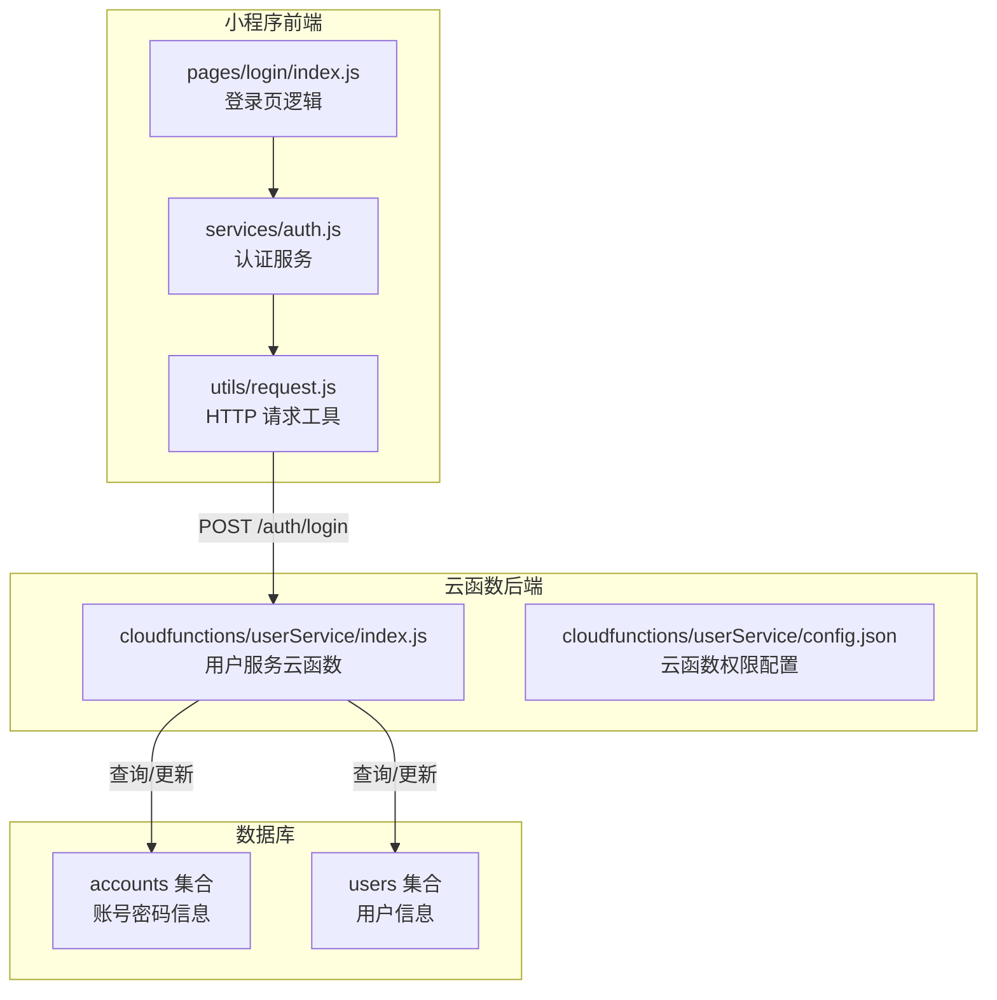
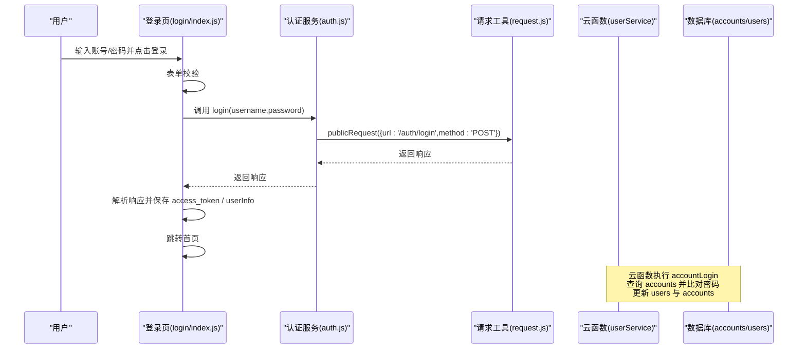
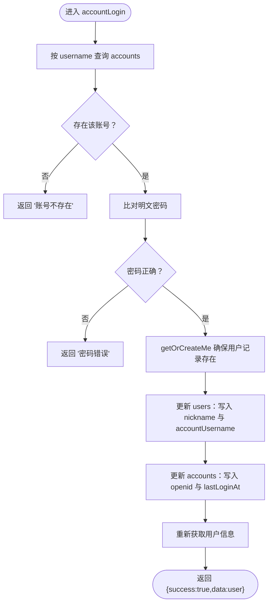
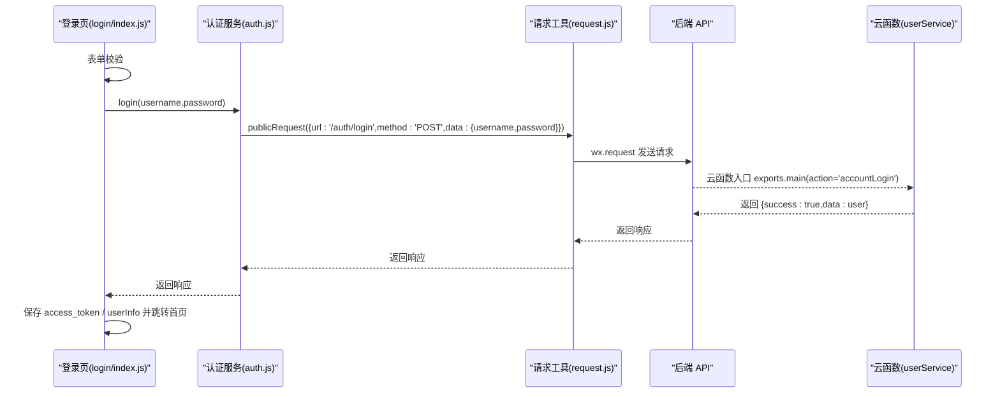
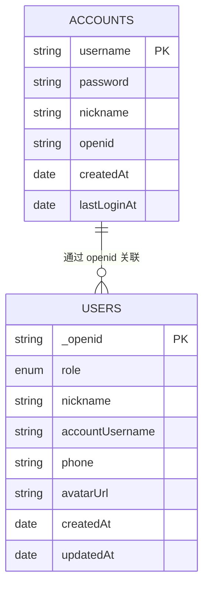
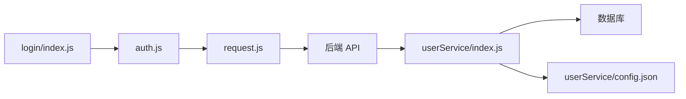

# 账号登录

<cite>
**本文引用的文件**
- [cloudfunctions/userService/index.js](file://cloudfunctions/userService/index.js)
- [cloudfunctions/userService/config.json](file://cloudfunctions/userService/config.json)
- [miniprogram/pages/login/index.js](file://miniprogram/pages/login/index.js)
- [miniprogram/services/auth.js](file://miniprogram/services/auth.js)
- [miniprogram/utils/request.js](file://miniprogram/utils/request.js)
- [docs/账号密码登录-使用说明.md](file://docs/账号密码登录-使用说明.md)
- [docs/账号密码登录测试说明.md](file://docs/账号密码登录测试说明.md)
- [miniprogram/app.js](file://miniprogram/app.js)
</cite>

## 目录
1. [简介](#简介)
2. [项目结构](#项目结构)
3. [核心组件](#核心组件)
4. [架构总览](#架构总览)
5. [详细组件分析](#详细组件分析)
6. [依赖关系分析](#依赖关系分析)
7. [性能考量](#性能考量)
8. [故障排查指南](#故障排查指南)
9. [结论](#结论)
10. [附录](#附录)

## 简介
本文件围绕“账号密码登录”功能展开，重点剖析云函数 accountLogin 的执行流程，说明其如何基于 username 查询 accounts 集合并进行明文密码比对；登录成功后通过 getOrCreateMe 确保用户记录存在，更新 users 集合中的昵称与账号绑定信息，并同步更新 accounts 集合中的 openid 以支持多设备登录。同时，结合 auth.js 服务模块，解释前端如何通过 publicRequest 发起 POST 请求调用云函数；以 login/index.js 中的 onAccountLogin 方法为例，展示表单验证、请求调用、Token 保存至本地存储（access_token、userInfo）及跳转首页的完整链路。最后强调当前明文存储密码的重大安全风险，并给出改进建议与常见问题的解决方案。

## 项目结构
本项目采用“小程序前端 + 云函数后端”的分层架构：
- 小程序前端负责 UI、表单校验、网络请求与本地存储；
- 云函数负责数据库操作、用户态维护与登录/注册逻辑；
- 文档用于说明 API、域名配置、测试流程与注意事项。

图表来源
- [miniprogram/pages/login/index.js](file://miniprogram/pages/login/index.js#L195-L277)
- [miniprogram/services/auth.js](file://miniprogram/services/auth.js#L14-L22)
- [miniprogram/utils/request.js](file://miniprogram/utils/request.js#L12-L41)
- [cloudfunctions/userService/index.js](file://cloudfunctions/userService/index.js#L198-L256)
- [cloudfunctions/userService/config.json](file://cloudfunctions/userService/config.json#L1-L6)

章节来源
- [miniprogram/pages/login/index.js](file://miniprogram/pages/login/index.js#L1-L294)
- [miniprogram/services/auth.js](file://miniprogram/services/auth.js#L1-L163)
- [miniprogram/utils/request.js](file://miniprogram/utils/request.js#L1-L125)
- [cloudfunctions/userService/index.js](file://cloudfunctions/userService/index.js#L1-L289)
- [cloudfunctions/userService/config.json](file://cloudfunctions/userService/config.json#L1-L6)

## 核心组件
- 云函数 userService：提供 getOrCreateMe、updateMe、loginByPhone、accountRegister、accountLogin 等能力，并在入口 exports.main 中按 action 分发。
- 前端认证服务 auth.js：封装登录、Token 校验、保存与登出等逻辑。
- 前端请求工具 request.js：封装公开请求 publicRequest 与认证请求 authenticatedRequest。
- 登录页 login/index.js：负责表单输入、校验、调用 authService.login 并处理响应与本地存储。

章节来源
- [cloudfunctions/userService/index.js](file://cloudfunctions/userService/index.js#L198-L256)
- [miniprogram/services/auth.js](file://miniprogram/services/auth.js#L14-L22)
- [miniprogram/utils/request.js](file://miniprogram/utils/request.js#L12-L41)
- [miniprogram/pages/login/index.js](file://miniprogram/pages/login/index.js#L195-L277)

## 架构总览
账号密码登录的整体调用链如下：
- 前端登录页触发 onAccountLogin，进行表单校验；
- 调用 authService.login(username, password)，内部通过 publicRequest 发起 POST 请求；
- 云函数 userService 接收 action="accountLogin"，执行账号查询与密码比对；
- 成功后更新 users 与 accounts，并返回用户信息；
- 前端保存 access_token 与 userInfo，跳转首页。

图表来源
- [miniprogram/pages/login/index.js](file://miniprogram/pages/login/index.js#L195-L277)
- [miniprogram/services/auth.js](file://miniprogram/services/auth.js#L14-L22)
- [miniprogram/utils/request.js](file://miniprogram/utils/request.js#L12-L41)
- [cloudfunctions/userService/index.js](file://cloudfunctions/userService/index.js#L198-L256)

## 详细组件分析

### 云函数 accountLogin 执行流程
- 输入参数：openid、username、password
- 查询逻辑：按 username 查询 accounts 集合，若不存在则返回“账号不存在”
- 密码验证：进行明文字符串比对，不一致则返回“密码错误”
- 用户记录保障：调用 getOrCreateMe 确保 users 集合中存在对应用户记录
- 同步更新：将 account.nickname 写入 users.accountUsername，并更新 users 昵称
- 多设备登录：更新 accounts 中的 openid 与 lastLoginAt
- 返回结果：返回 { success: true, data: user }

图表来源
- [cloudfunctions/userService/index.js](file://cloudfunctions/userService/index.js#L198-L256)

章节来源
- [cloudfunctions/userService/index.js](file://cloudfunctions/userService/index.js#L198-L256)

### 前端调用链：onAccountLogin → authService.login → publicRequest
- onAccountLogin：收集 username/password，进行非空校验，调用 authService.login
- authService.login：封装 publicRequest，向 /auth/login 发起 POST 请求
- publicRequest：构造请求头（含 Content-Type、X-Client-Type、X-Platform），发送请求并处理响应
- 响应处理：解析 access_token 与 userInfo，保存至本地存储，跳转首页

图表来源
- [miniprogram/pages/login/index.js](file://miniprogram/pages/login/index.js#L195-L277)
- [miniprogram/services/auth.js](file://miniprogram/services/auth.js#L14-L22)
- [miniprogram/utils/request.js](file://miniprogram/utils/request.js#L12-L41)
- [cloudfunctions/userService/index.js](file://cloudfunctions/userService/index.js#L258-L289)

章节来源
- [miniprogram/pages/login/index.js](file://miniprogram/pages/login/index.js#L195-L277)
- [miniprogram/services/auth.js](file://miniprogram/services/auth.js#L14-L22)
- [miniprogram/utils/request.js](file://miniprogram/utils/request.js#L12-L41)
- [cloudfunctions/userService/index.js](file://cloudfunctions/userService/index.js#L258-L289)

### getOrCreateMe 与用户信息同步
- getOrCreateMe：按 openid 查询 users 集合，若不存在则创建；同时根据 staff 白名单判定角色并更新
- 登录成功后：将 account.nickname 写入 users.accountUsername，并更新 updatedAt
- 多设备登录：更新 accounts.openid 与 lastLoginAt，使同一账号可在多设备登录

章节来源
- [cloudfunctions/userService/index.js](file://cloudfunctions/userService/index.js#L49-L84)
- [cloudfunctions/userService/index.js](file://cloudfunctions/userService/index.js#L221-L246)

### 数据模型与集合关系
- accounts 集合：存储 username、password、nickname、openid、createdAt、lastLoginAt
- users 集合：存储 _openid、role、nickname、accountUsername、phone、avatarUrl、createdAt、updatedAt

图表来源
- [cloudfunctions/userService/index.js](file://cloudfunctions/userService/index.js#L198-L256)
- [docs/账号密码登录测试说明.md](file://docs/账号密码登录测试说明.md#L23-L35)

章节来源
- [cloudfunctions/userService/index.js](file://cloudfunctions/userService/index.js#L198-L256)
- [docs/账号密码登录测试说明.md](file://docs/账号密码登录测试说明.md#L23-L35)

## 依赖关系分析
- 前端依赖
  - login/index.js 依赖 auth.js 的 login 方法
  - auth.js 依赖 request.js 的 publicRequest
  - request.js 依赖全局环境配置（BASE_URL）
- 云函数依赖
  - userService 依赖云开发 SDK 与数据库命令
  - userService 依赖 getOrCreateMe、updateMe 等内部方法
- 权限与配置
  - userService 配置中声明 phonenumber.getPhoneNumber 权限（用于手机号登录场景）

图表来源
- [miniprogram/pages/login/index.js](file://miniprogram/pages/login/index.js#L195-L277)
- [miniprogram/services/auth.js](file://miniprogram/services/auth.js#L14-L22)
- [miniprogram/utils/request.js](file://miniprogram/utils/request.js#L12-L41)
- [cloudfunctions/userService/index.js](file://cloudfunctions/userService/index.js#L258-L289)
- [cloudfunctions/userService/config.json](file://cloudfunctions/userService/config.json#L1-L6)

章节来源
- [miniprogram/pages/login/index.js](file://miniprogram/pages/login/index.js#L195-L277)
- [miniprogram/services/auth.js](file://miniprogram/services/auth.js#L14-L22)
- [miniprogram/utils/request.js](file://miniprogram/utils/request.js#L12-L41)
- [cloudfunctions/userService/index.js](file://cloudfunctions/userService/index.js#L258-L289)
- [cloudfunctions/userService/config.json](file://cloudfunctions/userService/config.json#L1-L6)

## 性能考量
- 数据库查询
  - accountLogin 对 accounts 的查询为单字段精确匹配，索引友好；建议在 username 上建立唯一索引以提升性能并保证唯一性
- 事务与并发
  - 当前实现未使用数据库事务；若需强一致（如注册+登录原子性），可考虑引入事务或幂等设计
- 网络请求
  - publicRequest 与 authenticatedRequest 均为同步请求；在高并发下可考虑增加重试与超时策略
- 本地存储
  - 双键存储 access_token 与 userInfo 提升兼容性，注意避免重复写入造成冗余

[本节为通用指导，不直接分析具体文件]

## 故障排查指南
- 常见错误与定位
  - “账号不存在”：检查 username 是否正确，确认 accounts 集合中是否存在该用户名
  - “密码错误”：确认明文比对是否一致；建议尽快引入加密方案
  - “域名校验失败导致请求中断”：开发环境需勾选“不校验合法域名”，生产环境需在微信公众平台配置合法域名
  - “登录响应格式错误，未找到访问令牌”：检查后端返回结构，确保包含 access_token 或 token 字段
  - “Token 验证失败”：可能是 Token 过期或无效，清理本地存储后重新登录
- 前端调试要点
  - 查看控制台日志，确认 publicRequest 是否成功、authService.saveAuthData 是否执行
  - 检查本地存储中是否存在 access_token、userInfo、openid
- 云函数调试要点
  - 在 accountLogin 中打印关键变量（如 openid、username、查询结果），定位账号是否存在与密码比对是否通过
  - 确认 getOrCreateMe 是否成功创建或更新用户记录

章节来源
- [miniprogram/pages/login/index.js](file://miniprogram/pages/login/index.js#L211-L277)
- [miniprogram/services/auth.js](file://miniprogram/services/auth.js#L41-L63)
- [cloudfunctions/userService/index.js](file://cloudfunctions/userService/index.js#L198-L256)
- [docs/账号密码登录-使用说明.md](file://docs/账号密码登录-使用说明.md#L202-L229)

## 结论
账号密码登录功能通过前端表单校验与公共请求，调用云函数完成账号查询与明文密码比对；登录成功后同步用户信息并支持多设备登录。当前实现存在明文密码存储的安全隐患，建议立即引入加密方案（如 bcrypt）。同时，完善 Token 过期处理、域名配置与本地存储一致性，可显著提升安全性与稳定性。

[本节为总结性内容，不直接分析具体文件]

## 附录

### 安全加固建议
- 密码加密：使用 bcrypt 对密码进行哈希存储，登录时进行哈希比对
- Token 安全：缩短 Token 有效期、启用刷新机制、限制 IP/设备白名单
- 传输安全：启用 HTTPS、校验证书、限制 CORS
- 输入校验：增强账号与密码格式校验，防止注入与暴力破解
- 日志审计：记录登录尝试与异常行为，便于追踪与风控

[本节为通用指导，不直接分析具体文件]

### 域名与环境配置
- 生产环境需在微信公众平台配置合法域名
- 开发环境可在开发者工具“本地设置”中勾选“不校验合法域名”

章节来源
- [docs/账号密码登录-使用说明.md](file://docs/账号密码登录-使用说明.md#L163-L171)
- [docs/账号密码登录-使用说明.md](file://docs/账号密码登录-使用说明.md#L166-L170)