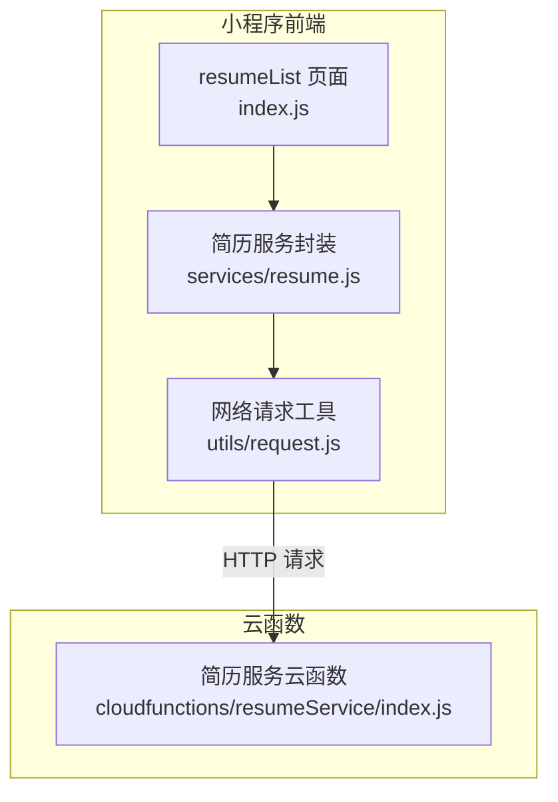
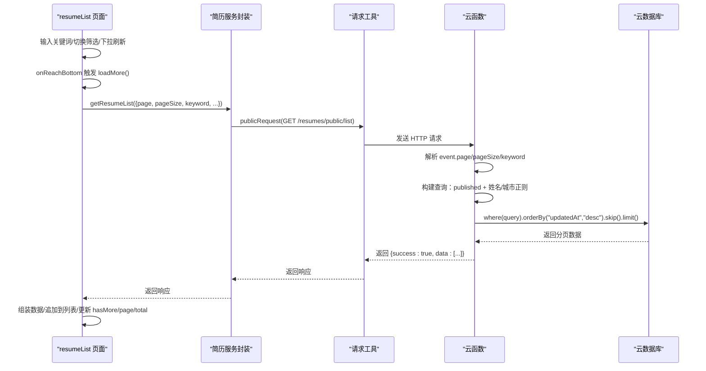
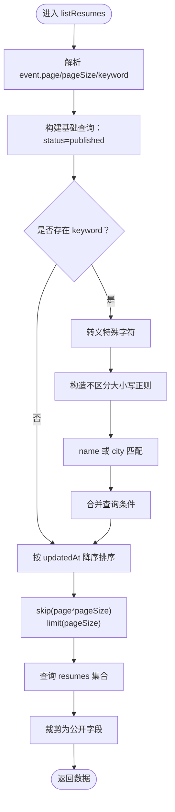
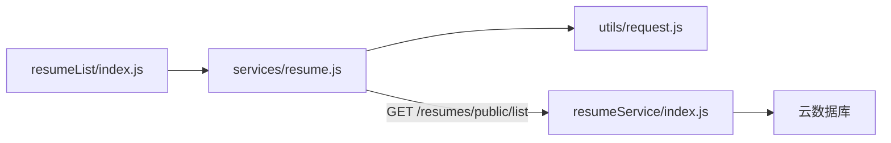

# 搜索与分页

<cite>
**本文引用的文件**
- [miniprogram/pages/resumeList/index.js](file://miniprogram/pages/resumeList/index.js)
- [miniprogram/services/resume.js](file://miniprogram/services/resume.js)
- [cloudfunctions/resumeService/index.js](file://cloudfunctions/resumeService/index.js)
- [miniprogram/utils/request.js](file://miniprogram/utils/request.js)
- [cloudfunctions/resumeService/config.json](file://cloudfunctions/resumeService/config.json)
- [miniprogram/pages/resumeList/index.json](file://miniprogram/pages/resumeList/index.json)
</cite>

## 目录
1. [简介](#简介)
2. [项目结构](#项目结构)
3. [核心组件](#核心组件)
4. [架构总览](#架构总览)
5. [详细组件分析](#详细组件分析)
6. [依赖关系分析](#依赖关系分析)
7. [性能考虑](#性能考虑)
8. [故障排查指南](#故障排查指南)
9. [结论](#结论)

## 简介
本章节面向“安得褓贝简历系统”的搜索与分页能力，围绕以下目标展开：
- 前端 resumeList 页面通过 getResumeList 服务调用 CRM 公开接口，传递 keyword、page、pageSize 等参数。
- 云函数 listResumes 基于云数据库正则查询实现姓名/城市模糊搜索，包含特殊字符转义与不区分大小写选项。
- 分页加载机制：skip 和 limit 的使用，以及 onReachBottom 触发加载下一页的交互。
- 业务规则：搜索仅支持姓名和城市字段，不支持标签；分页每页最多 20 条。
- 性能优化建议：合理设置 pageSize，避免深度分页。

## 项目结构
简历搜索与分页涉及三层：
- 前端页面：miniprogram/pages/resumeList/index.js
- 前端服务封装：miniprogram/services/resume.js
- 云函数：cloudfunctions/resumeService/index.js
- 网络请求工具：miniprogram/utils/request.js
- 页面配置：miniprogram/pages/resumeList/index.json

图表来源
- [miniprogram/pages/resumeList/index.js](file://miniprogram/pages/resumeList/index.js#L325-L576)
- [miniprogram/services/resume.js](file://miniprogram/services/resume.js#L16-L45)
- [miniprogram/utils/request.js](file://miniprogram/utils/request.js#L1-L125)
- [cloudfunctions/resumeService/index.js](file://cloudfunctions/resumeService/index.js#L180-L216)

章节来源
- [miniprogram/pages/resumeList/index.js](file://miniprogram/pages/resumeList/index.js#L196-L215)
- [miniprogram/pages/resumeList/index.json](file://miniprogram/pages/resumeList/index.json#L1-L4)

## 核心组件
- 前端页面状态与交互
  - 关键状态：keyword、resumes、page、pageSize、hasMore、loading、total、筛选项等。
  - 交互事件：onReachBottom 触发加载更多，reload 重置并重新加载，onPullDownRefresh 下拉刷新。
- 前端服务封装
  - getResumeList：构造查询参数（page/pageSize/keyword/筛选），发起公开请求。
- 云函数
  - listResumes：接收 page、pageSize、keyword，构建查询条件（published 状态 + 姓名/城市正则），使用 skip/limit 实现分页，返回公开字段集。
- 网络请求工具
  - publicRequest：封装公开接口请求，统一处理响应与错误。

章节来源
- [miniprogram/pages/resumeList/index.js](file://miniprogram/pages/resumeList/index.js#L196-L215)
- [miniprogram/services/resume.js](file://miniprogram/services/resume.js#L16-L45)
- [cloudfunctions/resumeService/index.js](file://cloudfunctions/resumeService/index.js#L78-L106)
- [miniprogram/utils/request.js](file://miniprogram/utils/request.js#L12-L41)

## 架构总览
下面的序列图展示了从前端到云函数的完整调用链路，包括搜索与分页的关键步骤。

图表来源
- [miniprogram/pages/resumeList/index.js](file://miniprogram/pages/resumeList/index.js#L325-L576)
- [miniprogram/services/resume.js](file://miniprogram/services/resume.js#L16-L45)
- [miniprogram/utils/request.js](file://miniprogram/utils/request.js#L12-L41)
- [cloudfunctions/resumeService/index.js](file://cloudfunctions/resumeService/index.js#L78-L106)

## 详细组件分析

### 前端页面：resumeList
- 关键状态
  - keyword：搜索关键词
  - page/pageSize：当前页码与每页条数
  - resumes：当前列表
  - hasMore：是否还有更多数据
  - loading：加载中状态
  - total：总数（开启筛选时回退为当前列表长度）
- 交互流程
  - onReachBottom：调用 loadMore
  - reload：重置 page=1，清空列表，重新加载
  - onPullDownRefresh：下拉刷新，完成后停止
- 加载更多逻辑
  - 构造请求参数：page、pageSize、keyword、可选筛选（等级/类型）
  - 调用 getResumeList
  - 处理响应：组装数据、过滤无头像简历、追加到列表
  - 更新 hasMore：根据服务端返回条数与 pageSize 的关系判断
  - 更新 total：未开启筛选时优先使用服务端 total，否则回退为当前累计长度
  - page 自增：每次成功加载后 page+1
- 事件与筛选
  - onKeywordInput：更新 keyword
  - 筛选：等级与职位类型通过自定义弹层选择，选择后调用 reload 重新加载

章节来源
- [miniprogram/pages/resumeList/index.js](file://miniprogram/pages/resumeList/index.js#L196-L215)
- [miniprogram/pages/resumeList/index.js](file://miniprogram/pages/resumeList/index.js#L261-L263)
- [miniprogram/pages/resumeList/index.js](file://miniprogram/pages/resumeList/index.js#L325-L385)
- [miniprogram/pages/resumeList/index.js](file://miniprogram/pages/resumeList/index.js#L386-L576)

### 前端服务封装：getResumeList
- 功能
  - 构造查询参数：page/pageSize/keyword/筛选项
  - 仅当 keyword 存在且非空时加入查询
  - 调用 publicRequest 发起 GET 请求至 /resumes/public/list
- 关键点
  - pageSize 默认 20，keyword 为空时不参与查询
  - 支持传入等级与职位类型筛选参数

章节来源
- [miniprogram/services/resume.js](file://miniprogram/services/resume.js#L16-L45)

### 云函数：listResumes（简历列表）
- 查询构建
  - page/pageSize/keyword 三要素
  - 业务规则：仅对 published 状态简历进行检索
  - 搜索字段：姓名 name 与城市 city
  - 正则策略：对特殊字符进行转义，使用不区分大小写选项
  - 组合查询：status=published 与 (name 匹配 OR city 匹配)
- 分页实现
  - orderBy("updatedAt","desc")：按更新时间倒序
  - skip(page * pageSize)：计算偏移
  - limit(pageSize)：限制返回条数
  - 业务约束：pageSize 上限 20
- 字段裁剪
  - 仅返回公开字段，避免泄露敏感信息

图表来源
- [cloudfunctions/resumeService/index.js](file://cloudfunctions/resumeService/index.js#L78-L106)

章节来源
- [cloudfunctions/resumeService/index.js](file://cloudfunctions/resumeService/index.js#L78-L106)

### 网络请求工具：publicRequest
- 统一处理
  - 基础 URL：https://crm.andejiazheng.com/api
  - Content-Type：application/json
  - X-Client-Type：miniprogram
  - X-Platform：wechat
  - 成功/失败分支：统一响应与错误处理
- 与服务封装配合
  - getResumeList 使用 publicRequest 发起公开接口请求

章节来源
- [miniprogram/utils/request.js](file://miniprogram/utils/request.js#L1-L125)
- [miniprogram/services/resume.js](file://miniprogram/services/resume.js#L16-L45)

### 页面配置与标题
- 导航栏标题：简历列表

章节来源
- [miniprogram/pages/resumeList/index.json](file://miniprogram/pages/resumeList/index.json#L1-L4)

## 依赖关系分析
- 前端页面依赖服务封装
- 服务封装依赖网络请求工具
- 云函数依赖云数据库 SDK
- 云函数配置文件声明 openapi 权限（本功能未启用）

图表来源
- [miniprogram/pages/resumeList/index.js](file://miniprogram/pages/resumeList/index.js#L325-L576)
- [miniprogram/services/resume.js](file://miniprogram/services/resume.js#L16-L45)
- [miniprogram/utils/request.js](file://miniprogram/utils/request.js#L12-L41)
- [cloudfunctions/resumeService/index.js](file://cloudfunctions/resumeService/index.js#L180-L216)

章节来源
- [cloudfunctions/resumeService/config.json](file://cloudfunctions/resumeService/config.json#L1-L6)

## 性能考虑
- 合理设置 pageSize
  - 云函数限制每页最多 20 条，前端默认 10，确保不会超过上限。
- 避免深度分页
  - 由于 skip(page*pageSize) 会随着页码增大而增加数据库扫描成本，建议：
    - 限制最大可加载页数
    - 在高频搜索场景下，优先使用更精确的索引字段或二级索引
    - 对热门关键词建立复合索引（如 status + updatedAt + name/city）
- 减少不必要的字段传输
  - 云函数仅返回公开字段，降低网络与序列化开销
- 前端优化
  - 列表加载完成后进行视频预加载，减少首屏等待
  - 仅在存在视频时进行预加载，避免无效 IO

章节来源
- [cloudfunctions/resumeService/index.js](file://cloudfunctions/resumeService/index.js#L78-L106)
- [miniprogram/services/resume.js](file://miniprogram/services/resume.js#L16-L45)
- [miniprogram/pages/resumeList/index.js](file://miniprogram/pages/resumeList/index.js#L269-L319)

## 故障排查指南
- 搜索无结果
  - 确认 keyword 是否为空或仅包含空白字符
  - 检查是否正确传入筛选参数（等级/类型）
  - 查看云函数日志：确认是否命中正则查询
- 分页异常
  - 确认 page 从 1 开始，且每次成功加载后 page+1
  - 检查 hasMore 判断逻辑：是否基于服务端返回条数与 pageSize 的关系
- 网络请求失败
  - 检查 publicRequest 的响应处理与错误提示
  - 确认基础 URL 与端点路径正确
- 权限问题
  - 本功能为公开接口，无需登录；若出现 401/403，请检查后端路由与鉴权配置

章节来源
- [miniprogram/pages/resumeList/index.js](file://miniprogram/pages/resumeList/index.js#L325-L576)
- [miniprogram/utils/request.js](file://miniprogram/utils/request.js#L12-L41)
- [cloudfunctions/resumeService/index.js](file://cloudfunctions/resumeService/index.js#L180-L216)

## 结论
- 搜索与分页在前端与云函数两端协同完成：前端负责输入与交互、参数拼装与分页推进，云函数负责安全查询与分页执行。
- 搜索范围限定在姓名与城市，不支持标签字段；分页上限为 20 条/页。
- 通过 skip/limit 与 orderBy("updatedAt","desc") 实现稳定分页；结合正则转义与不区分大小写提升可用性。
- 建议持续关注深度分页性能，必要时引入更优索引与分页策略。