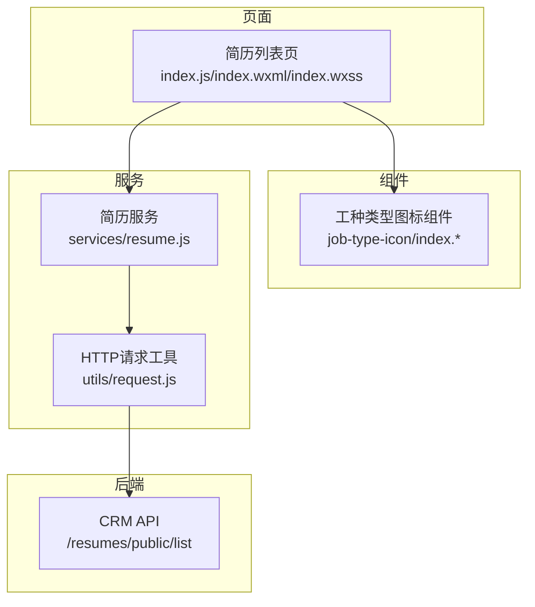
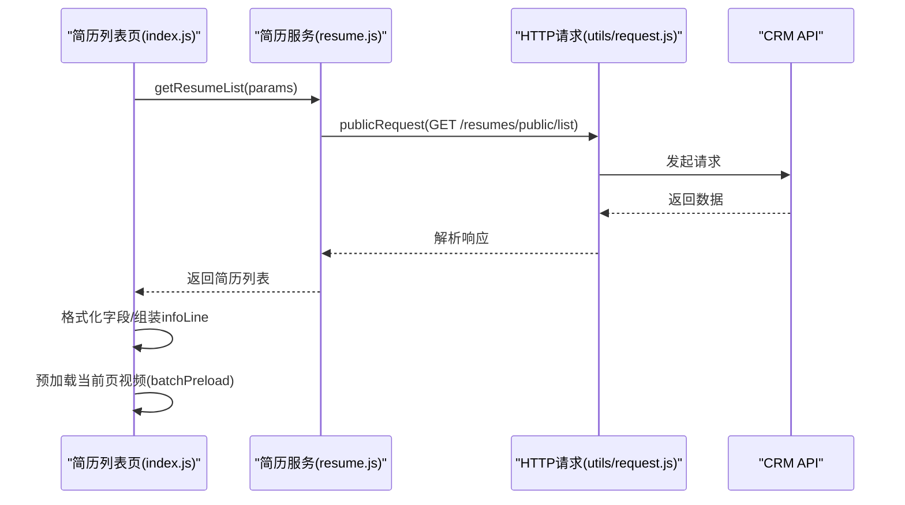
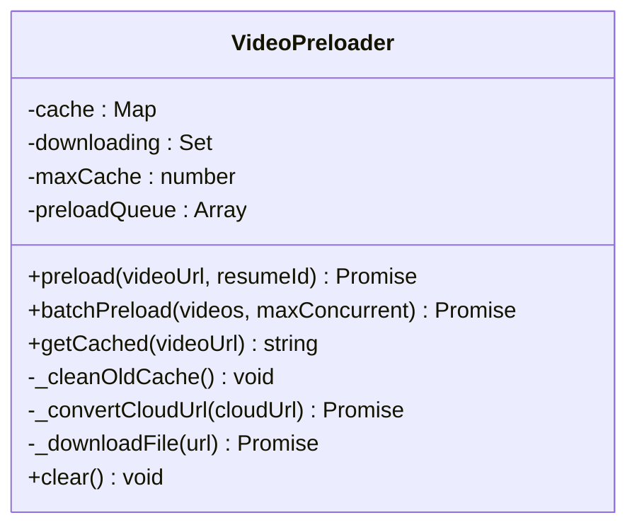
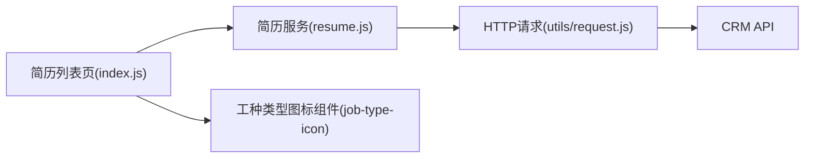

# UI渲染与优化

<cite>
**本文引用的文件**
- [miniprogram/pages/resumeList/index.js](file://miniprogram/pages/resumeList/index.js)
- [miniprogram/pages/resumeList/index.json](file://miniprogram/pages/resumeList/index.json)
- [miniprogram/pages/resumeList/index.wxml](file://miniprogram/pages/resumeList/index.wxml)
- [miniprogram/pages/resumeList/index.wxss](file://miniprogram/pages/resumeList/index.wxss)
- [miniprogram/components/job-type-icon/index.js](file://miniprogram/components/job-type-icon/index.js)
- [miniprogram/components/job-type-icon/index.json](file://miniprogram/components/job-type-icon/index.json)
- [miniprogram/components/job-type-icon/index.wxml](file://miniprogram/components/job-type-icon/index.wxml)
- [miniprogram/services/resume.js](file://miniprogram/services/resume.js)
- [miniprogram/utils/request.js](file://miniprogram/utils/request.js)
- [视频预加载优化方案.md](file://视频预加载优化方案.md)
- [视频预加载调试指南.md](file://视频预加载调试指南.md)
</cite>

## 目录
1. [简介](#简介)
2. [项目结构](#项目结构)
3. [核心组件](#核心组件)
4. [架构总览](#架构总览)
5. [详细组件分析](#详细组件分析)
6. [依赖关系分析](#依赖关系分析)
7. [性能考量](#性能考量)
8. [故障排查指南](#故障排查指南)
9. [结论](#结论)
10. [附录](#附录)

## 简介
本文件围绕“安得褓贝”小程序简历列表页的UI渲染与性能优化进行系统化梳理，重点覆盖以下方面：
- 简历卡片字段映射与格式化：年龄、经验、价格（含单位“/26天”或“/月”）、标签（技能拼音转中文）、介绍、封面图、基本信息行（infoLine）的动态拼接逻辑。
- 工种类型图标（job-type-icon组件）的使用与样式。
- 性能优化策略：视频预加载管理器（VideoPreloader）的实现与缓存机制、并发控制、cloud:// URL转换与本地路径替换流程；图片懒加载与列表渲染优化（避免频繁setData）；分批预加载策略（每批3个，延迟500ms）。
- 提供实际代码示例路径，如简历列表页中格式化函数与预加载方法的实现位置。

## 项目结构
简历列表页位于小程序端 pages/resumeList，采用经典的WXML+JS+WXSS组织方式，并通过服务层调用CRM API获取数据。组件层提供job-type-icon用于展示工种图标与标签。

**图表来源**
- [miniprogram/pages/resumeList/index.js](file://miniprogram/pages/resumeList/index.js#L1-L120)
- [miniprogram/pages/resumeList/index.wxml](file://miniprogram/pages/resumeList/index.wxml#L1-L121)
- [miniprogram/pages/resumeList/index.wxss](file://miniprogram/pages/resumeList/index.wxss#L1-L120)
- [miniprogram/components/job-type-icon/index.js](file://miniprogram/components/job-type-icon/index.js#L1-L18)
- [miniprogram/services/resume.js](file://miniprogram/services/resume.js#L1-L120)
- [miniprogram/utils/request.js](file://miniprogram/utils/request.js#L1-L125)

**章节来源**
- [miniprogram/pages/resumeList/index.json](file://miniprogram/pages/resumeList/index.json#L1-L4)
- [miniprogram/pages/resumeList/index.wxml](file://miniprogram/pages/resumeList/index.wxml#L1-L121)
- [miniprogram/pages/resumeList/index.wxss](file://miniprogram/pages/resumeList/index.wxss#L1-L200)
- [miniprogram/components/job-type-icon/index.json](file://miniprogram/components/job-type-icon/index.json#L1-L6)

## 核心组件
- 简历列表页（index.js）：负责筛选、分页、数据格式化、视频预加载与渲染。
- 简历服务（services/resume.js）：封装公开接口调用，构建查询参数并发起请求。
- HTTP请求工具（utils/request.js）：统一封装publicRequest/authenticatedRequest，处理Token与错误。
- 工种类型图标组件（job-type-icon）：接收type/label/emoji属性，渲染带背景与标签的图标块。

**章节来源**
- [miniprogram/pages/resumeList/index.js](file://miniprogram/pages/resumeList/index.js#L1-L120)
- [miniprogram/services/resume.js](file://miniprogram/services/resume.js#L1-L120)
- [miniprogram/utils/request.js](file://miniprogram/utils/request.js#L1-L125)
- [miniprogram/components/job-type-icon/index.js](file://miniprogram/components/job-type-icon/index.js#L1-L18)

## 架构总览
简历列表页的数据流如下：页面加载时调用简历服务，服务层通过HTTP请求工具向CRM API发起请求，返回数据后在页面内进行格式化与渲染，并在加载完成后触发视频预加载。

**图表来源**
- [miniprogram/pages/resumeList/index.js](file://miniprogram/pages/resumeList/index.js#L325-L576)
- [miniprogram/services/resume.js](file://miniprogram/services/resume.js#L16-L45)
- [miniprogram/utils/request.js](file://miniprogram/utils/request.js#L12-L41)

## 详细组件分析

### 简历卡片字段映射与格式化
简历卡片渲染涉及多个字段的映射与格式化，具体包括：
- 年龄与经验：直接取自后端字段，用于infoLine拼接。
- 籍贯/地址：优先使用nativePlace，若为空则回退currentAddress；格式化规则为提取省/市/自治区/特别行政区或截取前3个字符，避免过长。
- 学历：枚举映射为中文，未识别编码则不显示。
- 工作类型：根据jobType字符串片段映射为“住家/白班/不住家/小时工”等。
- 价格单位：月嫂（jobType === 'yuexin'）统一显示“/26天”，其他类型显示“/月”，未显示单位时infoLine中不出现该项。
- 标签（技能）：将拼音技能转换为中文，保留非拼音原样。
- 介绍：取自selfIntroduction字段。
- 封面图：取personalPhoto数组首项作为coverFileId，若为空则显示默认占位图。
- infoLine：将nativePlace、age、experienceYears、jobTypeText、educationText按顺序用“|”拼接，若均为空则显示占位符“—”。

上述逻辑集中在页面的loadMore方法中，格式化函数包括：
- formatNativePlace：处理籍贯/地址的格式化。
- formatEducation：学历枚举映射。
- formatJobType：工作类型片段映射。
- formatSkills：技能拼音转中文。
- infoLine拼接：在组装卡片对象时动态生成。

此外，页面还对“服务等级”进行了映射，用于卡片右上角徽章的显示与筛选。

**章节来源**
- [miniprogram/pages/resumeList/index.js](file://miniprogram/pages/resumeList/index.js#L387-L549)

### 工种类型图标组件（job-type-icon）
组件提供type/label/emoji三个属性，用于渲染带背景色与标签的图标块。在简历列表页的类型弹层中，通过typeOptions配置了多种工种类型及其图标类名，组件在WXML中读取这些属性进行展示。

- 属性定义：type、label、emoji。
- 使用场景：类型弹层中每个选项使用该组件渲染图标与标签。
- 样式要点：组件内使用icon-bg包裹emoji，配合外层type类名实现不同工种的背景色。

**章节来源**
- [miniprogram/components/job-type-icon/index.js](file://miniprogram/components/job-type-icon/index.js#L1-L18)
- [miniprogram/components/job-type-icon/index.wxml](file://miniprogram/components/job-type-icon/index.wxml#L1-L8)
- [miniprogram/components/job-type-icon/index.json](file://miniprogram/components/job-type-icon/index.json#L1-L6)
- [miniprogram/pages/resumeList/index.wxml](file://miniprogram/pages/resumeList/index.wxml#L16-L39)

### 视频预加载管理器（VideoPreloader）
为提升视频播放体验，页面实现了VideoPreloader类，负责：
- 缓存机制：使用Map缓存已下载视频，键为URL，值包含状态、本地临时路径、时间戳与简历ID；最大缓存数量限制为15。
- 并发控制：batchPreload限制每批并发数，默认3，避免网络拥塞。
- cloud:// URL转换：当视频URL为cloud://格式时，先通过云函数获取临时HTTPS URL，再进行下载。
- 下载与回退：使用wx.downloadFile下载，超时时间30000ms；失败时清理下载中集合并返回null。
- 清理策略：按时间戳排序，采用FIFO清理最旧缓存。
- 批量更新：在预加载完成后，将本地路径写回到对应简历对象，避免频繁setData。

页面在加载完成后，会启动预加载流程，按批次预加载当前页视频，并在每批之间延迟500ms，以平衡网络压力与用户体验。

**图表来源**
- [miniprogram/pages/resumeList/index.js](file://miniprogram/pages/resumeList/index.js#L36-L191)

**章节来源**
- [miniprogram/pages/resumeList/index.js](file://miniprogram/pages/resumeList/index.js#L36-L191)
- [miniprogram/pages/resumeList/index.js](file://miniprogram/pages/resumeList/index.js#L269-L319)

### 列表渲染与性能优化策略
- 避免频繁setData：在批量预加载完成后，一次性更新resumes数组，减少setData次数。
- 分批预加载：每批3个视频，批次间延迟500ms，降低网络拥塞与CPU占用。
- 价格单位策略：月嫂统一“/26天”，其他类型“/月”，未显示单位时infoLine不出现该项，避免多余渲染。
- 图片懒加载：简历卡片头像使用coverFileId，若为空则显示默认占位图，避免空白闪烁。
- 信息行拼接：infoLine按需拼接，空值不显示，减少冗余DOM节点。
- 价格行：金额与单位底部对齐，视觉统一；仅在有单位时渲染单位文本。
- 标签行：标签过多时通过max-height与white-space控制，避免溢出与重排。

**章节来源**
- [miniprogram/pages/resumeList/index.js](file://miniprogram/pages/resumeList/index.js#L387-L549)
- [miniprogram/pages/resumeList/index.wxml](file://miniprogram/pages/resumeList/index.wxml#L94-L110)
- [miniprogram/pages/resumeList/index.wxss](file://miniprogram/pages/resumeList/index.wxss#L390-L472)

### 代码示例路径（不含具体代码内容）
- 简历列表页格式化函数与infoLine拼接
  - [formatNativePlace](file://miniprogram/pages/resumeList/index.js#L425-L442)
  - [formatEducation](file://miniprogram/pages/resumeList/index.js#L406-L423)
  - [formatJobType](file://miniprogram/pages/resumeList/index.js#L396-L403)
  - [formatSkills](file://miniprogram/pages/resumeList/index.js#L444-L486)
  - [infoLine拼接](file://miniprogram/pages/resumeList/index.js#L505-L514)
- 视频预加载与批量更新
  - [preloadAllVideos](file://miniprogram/pages/resumeList/index.js#L269-L319)
  - [VideoPreloader.batchPreload](file://miniprogram/pages/resumeList/index.js#L118-L133)
  - [VideoPreloader.preload](file://miniprogram/pages/resumeList/index.js#L46-L117)
- 简历服务与请求封装
  - [getResumeList](file://miniprogram/services/resume.js#L16-L45)
  - [publicRequest](file://miniprogram/utils/request.js#L12-L41)
  - [authenticatedRequest](file://miniprogram/utils/request.js#L47-L103)

**章节来源**
- [miniprogram/pages/resumeList/index.js](file://miniprogram/pages/resumeList/index.js#L269-L319)
- [miniprogram/services/resume.js](file://miniprogram/services/resume.js#L16-L45)
- [miniprogram/utils/request.js](file://miniprogram/utils/request.js#L12-L41)

## 依赖关系分析
简历列表页与服务层、请求工具之间的依赖关系如下：

**图表来源**
- [miniprogram/pages/resumeList/index.js](file://miniprogram/pages/resumeList/index.js#L1-L120)
- [miniprogram/services/resume.js](file://miniprogram/services/resume.js#L1-L120)
- [miniprogram/utils/request.js](file://miniprogram/utils/request.js#L1-L125)
- [miniprogram/components/job-type-icon/index.js](file://miniprogram/components/job-type-icon/index.js#L1-L18)

**章节来源**
- [miniprogram/pages/resumeList/index.js](file://miniprogram/pages/resumeList/index.js#L1-L120)
- [miniprogram/services/resume.js](file://miniprogram/services/resume.js#L1-L120)
- [miniprogram/utils/request.js](file://miniprogram/utils/request.js#L1-L125)

## 性能考量
- 视频预加载
  - 缓存上限：最多缓存15个视频，超过后按时间戳清理最旧项。
  - 并发控制：每批最多3个并发，批次间延迟500ms，避免网络拥塞。
  - URL转换：cloud://格式先转换为临时HTTPS URL，再下载。
  - 失败回退：下载失败或状态码非200时返回null，避免阻塞后续流程。
- 列表渲染
  - 一次性批量更新：预加载完成后统一setData，减少重排与重绘。
  - 信息行与标签行：通过样式控制省略与换行，避免DOM节点过多。
  - 价格行：金额与单位底部对齐，减少视觉抖动。
- 网络与域名
  - 需要在小程序后台“开发设置”中将视频域名加入downloadFile合法域名，否则下载403。
- 优化方案参考
  - 参考文档提供了“视口监听 + 智能预加载 + 缓存管理”的完整方案，可进一步提升首屏与滚动体验。

**章节来源**
- [miniprogram/pages/resumeList/index.js](file://miniprogram/pages/resumeList/index.js#L36-L191)
- [视频预加载优化方案.md](file://视频预加载优化方案.md#L1-L125)
- [视频预加载调试指南.md](file://视频预加载调试指南.md#L68-L197)

## 故障排查指南
- 视频下载失败（403）
  - 检查小程序后台“开发设置”中“downloadFile 合法域名”是否包含视频域名。
  - 参考：[视频预加载调试指南.md](file://视频预加载调试指南.md#L68-L108)
- cloud:// URL转换失败
  - 确认已在app.js中初始化云开发（wx.cloud.init）。
  - 参考：[视频预加载调试指南.md](file://视频预加载调试指南.md#L110-L121)
- 预加载成功但详情页仍慢
  - 确认详情页是否正确使用列表页预加载的本地路径。
  - 参考：[视频预加载调试指南.md](file://视频预加载调试指南.md#L123-L134)
- 视频过大导致加载缓慢
  - 建议压缩视频体积、降低分辨率与码率。
  - 参考：[视频预加载调试指南.md](file://视频预加载调试指南.md#L91-L109)

**章节来源**
- [视频预加载调试指南.md](file://视频预加载调试指南.md#L68-L197)

## 结论
简历列表页在字段渲染与性能优化方面采取了多项务实策略：
- 字段格式化清晰、可维护性强，infoLine按需拼接，避免冗余展示。
- 视频预加载管理器具备缓存、并发控制与URL转换能力，结合分批预加载与延迟策略，有效提升播放体验。
- 列表渲染层面通过减少setData次数、样式控制与单位策略，兼顾性能与可读性。
- 若需进一步优化，可参考“视口监听 + 智能预加载 + 缓存管理”的完整方案，实现首屏与滚动场景下的极致体验。

## 附录
- 相关文档与方案
  - [视频预加载优化方案.md](file://视频预加载优化方案.md#L1-L125)
  - [视频预加载调试指南.md](file://视频预加载调试指南.md#L68-L197)