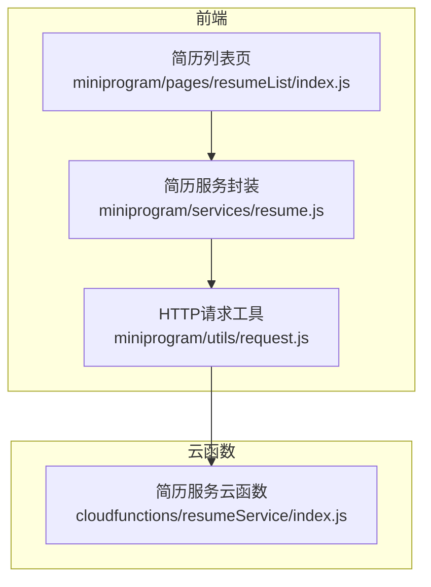
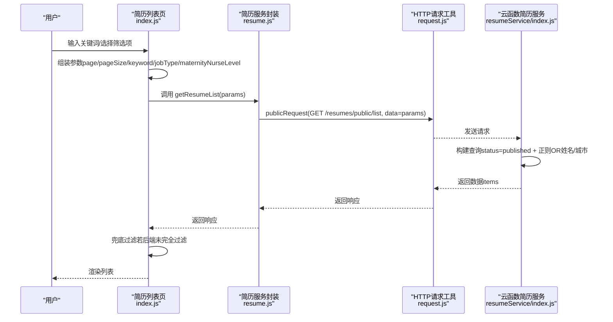
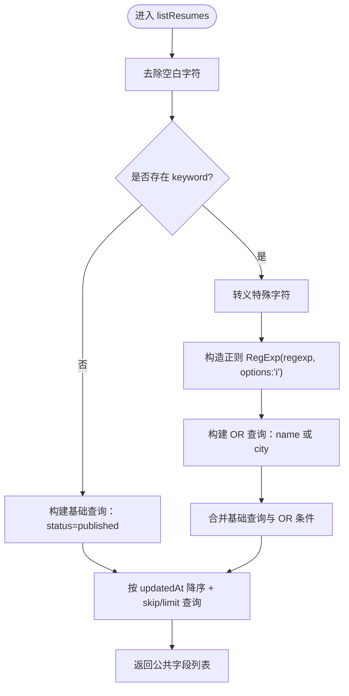
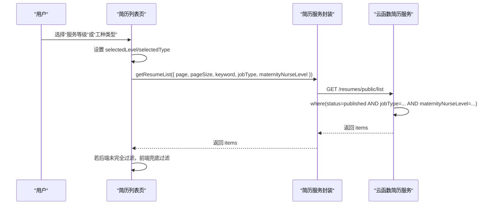
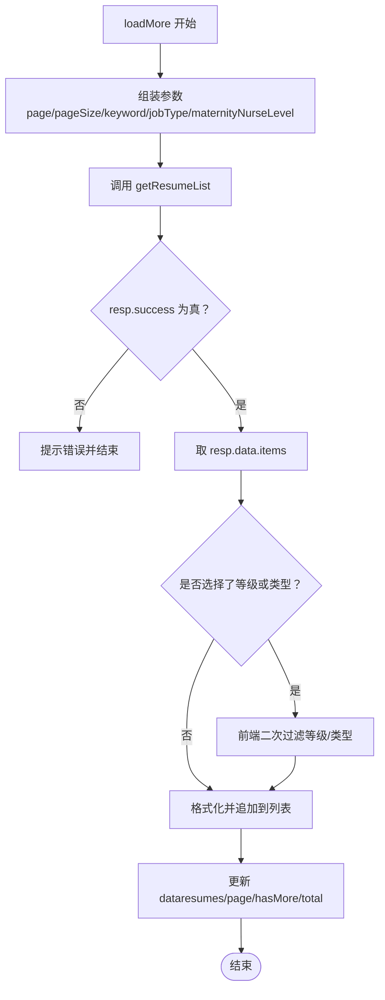

# 搜索与筛选

<cite>
**本文引用的文件**
- [miniprogram/pages/resumeList/index.js](file://miniprogram/pages/resumeList/index.js)
- [miniprogram/services/resume.js](file://miniprogram/services/resume.js)
- [cloudfunctions/resumeService/index.js](file://cloudfunctions/resumeService/index.js)
- [miniprogram/utils/request.js](file://miniprogram/utils/request.js)
- [PRD.md](file://PRD.md)
</cite>

## 目录
1. [简介](#简介)
2. [项目结构](#项目结构)
3. [核心组件](#核心组件)
4. [架构总览](#架构总览)
5. [详细组件分析](#详细组件分析)
6. [依赖关系分析](#依赖关系分析)
7. [性能考量](#性能考量)
8. [故障排查指南](#故障排查指南)
9. [结论](#结论)

## 简介
本章节围绕“安得褓贝”简历列表的搜索与筛选功能展开，目标是帮助开发者全面理解从前端到云函数的完整链路：关键词搜索（姓名/城市模糊匹配）、多维度筛选（服务等级/工种类型）、参数传递与前后端协同、以及前端兜底过滤机制。同时明确业务规则：关键词搜索仅支持姓名与城市字段，不支持标签字段；分页规则与搜索规则在 PRD 中有明确规定。

## 项目结构
简历搜索与筛选涉及三个关键层面：
- 前端页面：简历列表页负责输入关键词、选择筛选项、触发分页加载与兜底过滤。
- 前端服务封装：封装公开接口调用，组装查询参数（keyword、jobType、maternityNurseLevel）。
- 云函数：简历服务云函数负责执行数据库查询，构建正则表达式并返回公共字段。

图表来源
- [miniprogram/pages/resumeList/index.js](file://miniprogram/pages/resumeList/index.js#L321-L385)
- [miniprogram/services/resume.js](file://miniprogram/services/resume.js#L16-L45)
- [miniprogram/utils/request.js](file://miniprogram/utils/request.js#L12-L41)
- [cloudfunctions/resumeService/index.js](file://cloudfunctions/resumeService/index.js#L78-L106)

章节来源
- [miniprogram/pages/resumeList/index.js](file://miniprogram/pages/resumeList/index.js#L321-L385)
- [miniprogram/services/resume.js](file://miniprogram/services/resume.js#L16-L45)
- [miniprogram/utils/request.js](file://miniprogram/utils/request.js#L12-L41)
- [cloudfunctions/resumeService/index.js](file://cloudfunctions/resumeService/index.js#L78-L106)

## 核心组件
- 前端简历列表页（页面逻辑与筛选UI）
  - 关键点：关键词输入、服务等级与工种类型自定义弹层、分页加载、兜底过滤。
  - 重要方法路径：onKeywordInput、filterByLevel、filterByType、onPickType、loadMore。
- 前端简历服务封装（接口调用）
  - 关键点：构建查询参数（page、pageSize、keyword、jobType、maternityNurseLevel），调用公开接口。
  - 重要方法路径：getResumeList。
- 云函数简历服务（数据库查询）
  - 关键点：基于 db.RegExp 的正则查询，不区分大小写；对特殊字符进行转义；限定仅 published 状态；支持 OR 组合（姓名或城市）。
  - 重要方法路径：listResumes。
- HTTP请求工具（统一请求封装）
  - 关键点：publicRequest/authenticatedRequest 区分是否需要 Token；统一错误处理与日志输出。
  - 重要方法路径：publicRequest、authenticatedRequest、request。

章节来源
- [miniprogram/pages/resumeList/index.js](file://miniprogram/pages/resumeList/index.js#L321-L385)
- [miniprogram/services/resume.js](file://miniprogram/services/resume.js#L16-L45)
- [cloudfunctions/resumeService/index.js](file://cloudfunctions/resumeService/index.js#L78-L106)
- [miniprogram/utils/request.js](file://miniprogram/utils/request.js#L12-L41)

## 架构总览
简历搜索与筛选的端到端流程如下：

图表来源
- [miniprogram/pages/resumeList/index.js](file://miniprogram/pages/resumeList/index.js#L330-L385)
- [miniprogram/services/resume.js](file://miniprogram/services/resume.js#L16-L45)
- [miniprogram/utils/request.js](file://miniprogram/utils/request.js#L12-L41)
- [cloudfunctions/resumeService/index.js](file://cloudfunctions/resumeService/index.js#L78-L106)

## 详细组件分析

### 关键词搜索：姓名/城市模糊匹配与正则实现
- 前端行为
  - 页面监听关键词输入，将 keyword 传入请求参数。
  - 调用 getResumeList 时仅在 keyword 存在且非空时加入查询参数。
- 云函数行为
  - 对 keyword 做 trim 处理；
  - 对特殊字符进行转义，构造 db.RegExp(regexp, options:'i') 实现不区分大小写的模糊匹配；
  - 使用 _.or 组合 name 与 city 字段，形成“姓名或城市”的 OR 查询；
  - 固定 status=published；
  - 支持分页 skip/limit 与按 updatedAt 降序排序。
- 业务规则
  - PRD 明确 keyword 仅匹配姓名/城市，不支持标签字段。

图表来源
- [cloudfunctions/resumeService/index.js](file://cloudfunctions/resumeService/index.js#L78-L106)
- [PRD.md](file://PRD.md#L318-L320)

章节来源
- [cloudfunctions/resumeService/index.js](file://cloudfunctions/resumeService/index.js#L78-L106)
- [PRD.md](file://PRD.md#L318-L320)

### 多维度筛选：服务等级（maternityNurseLevel）与工种类型（jobType）
- 服务等级（月嫂等级）
  - 前端：自定义弹层展示全部等级选项，点击后设置 selectedLevel 与对应文本，随后 reload。
  - 云函数：若存在 maternityNurseLevel，则作为查询条件附加到 where。
- 工种类型（jobType）
  - 前端：自定义弹层展示多种工种类型，点击后设置 selectedType 与对应文本，随后 reload。
  - 云函数：若存在 jobType，则作为查询条件附加到 where。
- URL 参数透传
  - 页面 onLoad 支持从 URL 参数 jobType 自动映射并设置筛选项，便于外部链接直达特定工种。

图表来源
- [miniprogram/pages/resumeList/index.js](file://miniprogram/pages/resumeList/index.js#L220-L251)
- [miniprogram/pages/resumeList/index.js](file://miniprogram/pages/resumeList/index.js#L339-L355)
- [miniprogram/services/resume.js](file://miniprogram/services/resume.js#L16-L45)
- [cloudfunctions/resumeService/index.js](file://cloudfunctions/resumeService/index.js#L78-L106)

章节来源
- [miniprogram/pages/resumeList/index.js](file://miniprogram/pages/resumeList/index.js#L220-L251)
- [miniprogram/pages/resumeList/index.js](file://miniprogram/pages/resumeList/index.js#L339-L355)
- [miniprogram/services/resume.js](file://miniprogram/services/resume.js#L16-L45)
- [cloudfunctions/resumeService/index.js](file://cloudfunctions/resumeService/index.js#L78-L106)

### 前端兜底过滤机制
- 触发时机：当服务端返回的 items 数量等于 pageSize 时，hasMore 设为 true，继续下一页；当服务端未完全过滤时，前端在 loadMore 中再次根据 selectedLevel 与 selectedType 做二次过滤，确保 UI 始终反映筛选结果。
- 作用范围：仅在前端对已返回的数据进行二次过滤，不改变分页策略与服务端查询次数。

图表来源
- [miniprogram/pages/resumeList/index.js](file://miniprogram/pages/resumeList/index.js#L330-L385)

章节来源
- [miniprogram/pages/resumeList/index.js](file://miniprogram/pages/resumeList/index.js#L330-L385)

### 业务规则与约束
- 搜索规则：keyword 仅匹配姓名/城市，不支持标签字段。
- 分页规则：pageSize 最大 20；page 从 1 开始；返回条数小于 pageSize 视为无更多。
- 发布状态：仅 published 的简历出现在 C 端列表。

章节来源
- [PRD.md](file://PRD.md#L318-L323)

## 依赖关系分析
- 前端页面依赖服务封装与请求工具，服务封装依赖请求工具。
- 服务封装调用云函数简历服务（通过公开接口）。
- 云函数简历服务依赖云开发数据库 SDK，使用 db.RegExp 与 _.or 构建查询。

图表来源
- [miniprogram/pages/resumeList/index.js](file://miniprogram/pages/resumeList/index.js#L321-L385)
- [miniprogram/services/resume.js](file://miniprogram/services/resume.js#L16-L45)
- [miniprogram/utils/request.js](file://miniprogram/utils/request.js#L12-L41)
- [cloudfunctions/resumeService/index.js](file://cloudfunctions/resumeService/index.js#L78-L106)

章节来源
- [miniprogram/pages/resumeList/index.js](file://miniprogram/pages/resumeList/index.js#L321-L385)
- [miniprogram/services/resume.js](file://miniprogram/services/resume.js#L16-L45)
- [miniprogram/utils/request.js](file://miniprogram/utils/request.js#L12-L41)
- [cloudfunctions/resumeService/index.js](file://cloudfunctions/resumeService/index.js#L78-L106)

## 性能考量
- 正则查询与 OR 组合：云函数对 keyword 使用 _.or(name, city) 与不区分大小写的正则，建议在简历规模较大时考虑索引策略（如对 name、city 建立复合索引）以降低查询成本。
- 分页与 skip/limit：云函数限制 pageSize 最大 20，避免一次性返回过多数据；前端 hasMore 依据返回条数判断，减少不必要的请求。
- 前端兜底过滤：仅对已返回数据进行二次过滤，避免重复请求，但注意在大量数据场景下可能增加前端 CPU 压力。
- 视频预加载：简历列表页具备视频预加载能力，有助于提升首屏体验，但需注意并发与缓存策略，避免网络拥塞。

[本节为通用性能建议，不直接分析具体文件]

## 故障排查指南
- 关键词搜索无效
  - 检查前端是否正确传入 keyword；确认 getResumeList 在 keyword 存在时才加入查询参数。
  - 检查云函数是否对 keyword 做了 trim 与特殊字符转义，以及是否使用 options:'i' 的正则。
- 筛选不生效
  - 检查前端是否设置了 selectedLevel/selectedType 并在请求参数中携带。
  - 检查云函数是否将 jobType 与 maternityNurseLevel 作为查询条件。
- 分页异常
  - 检查 hasMore 判断逻辑是否基于返回条数与 pageSize 的关系。
- 发布状态问题
  - 确认云函数固定 status=published 条件是否生效。
- 标签字段搜索
  - PRD 明确 keyword 不支持标签字段，若出现按标签搜索的行为，属于不符合业务规则的异常。

章节来源
- [miniprogram/pages/resumeList/index.js](file://miniprogram/pages/resumeList/index.js#L330-L385)
- [miniprogram/services/resume.js](file://miniprogram/services/resume.js#L16-L45)
- [cloudfunctions/resumeService/index.js](file://cloudfunctions/resumeService/index.js#L78-L106)
- [PRD.md](file://PRD.md#L318-L323)

## 结论
本功能通过“前端参数组装 + 云函数正则 OR 查询 + 前端兜底过滤”的协作，实现了简历列表的关键词搜索与多维度筛选。关键词搜索严格遵循 PRD 规则，仅匹配姓名与城市；服务等级与工种类型的筛选在前后端均有清晰的参数传递与过滤逻辑。建议在简历规模增长后，结合索引与分页策略进一步优化查询性能，并持续关注业务规则的一致性。