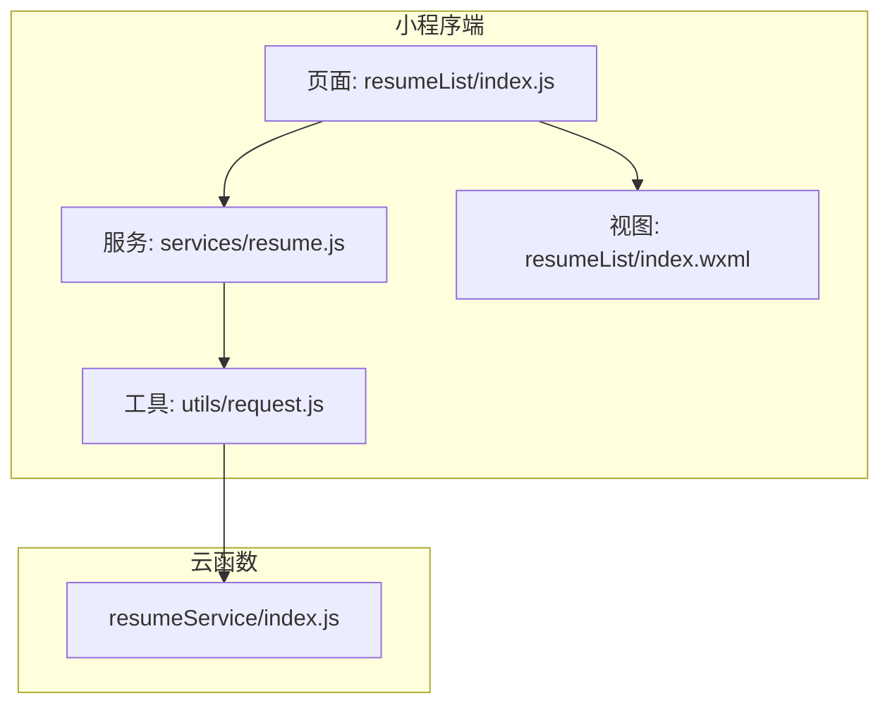
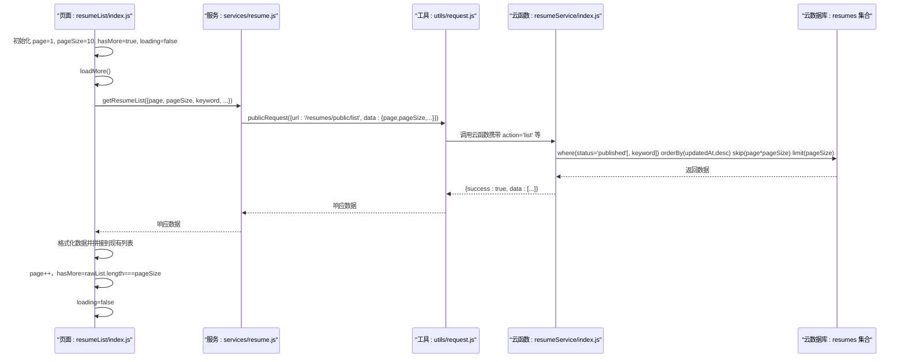

# 数据加载与分页

<cite>
**本文引用的文件**
- [miniprogram/pages/resumeList/index.js](file://miniprogram/pages/resumeList/index.js)
- [miniprogram/services/resume.js](file://miniprogram/services/resume.js)
- [miniprogram/utils/request.js](file://miniprogram/utils/request.js)
- [cloudfunctions/resumeService/index.js](file://cloudfunctions/resumeService/index.js)
- [cloudfunctions/resumeService/config.json](file://cloudfunctions/resumeService/config.json)
- [PRD.md](file://PRD.md)
- [API完整文档.md](file://API完整文档.md)
- [miniprogram/pages/resumeList/index.wxml](file://miniprogram/pages/resumeList/index.wxml)
</cite>

## 目录
1. [简介](#简介)
2. [项目结构](#项目结构)
3. [核心组件](#核心组件)
4. [架构总览](#架构总览)
5. [详细组件分析](#详细组件分析)
6. [依赖关系分析](#依赖关系分析)
7. [性能考虑](#性能考虑)
8. [故障排查指南](#故障排查指南)
9. [结论](#结论)

## 简介
本文围绕“安得褓贝”小程序简历列表的数据加载与分页机制展开，重点说明前端通过 resumeService.getResumeList 调用云函数 resumeService.list 接口的完整流程，涵盖分页参数 page/pageSize 在前端 loadMore 方法中的初始化、传递与处理逻辑（页码递增、加载状态控制、hasMore 判断依据），以及云函数 listResumes 基于云数据库的分页查询实现（skip(page*pageSize) 与 limit(pageSize) 的使用）。同时给出业务规则（仅 published 状态简历对 C 端可见）、前后端数据拼接策略、性能优化建议与常见问题排查方法。

## 项目结构
简历列表页面位于 miniprogram/pages/resumeList，核心逻辑集中在该页面 JS 文件；服务封装位于 miniprogram/services/resume.js；HTTP 请求封装位于 miniprogram/utils/request.js；云函数 resumeService 实现简历列表查询与详情等能力，位于 cloudfunctions/resumeService。

图表来源
- [miniprogram/pages/resumeList/index.js](file://miniprogram/pages/resumeList/index.js#L1-L698)
- [miniprogram/services/resume.js](file://miniprogram/services/resume.js#L1-L239)
- [miniprogram/utils/request.js](file://miniprogram/utils/request.js#L1-L125)
- [cloudfunctions/resumeService/index.js](file://cloudfunctions/resumeService/index.js#L1-L216)
- [miniprogram/pages/resumeList/index.wxml](file://miniprogram/pages/resumeList/index.wxml#L1-L121)

章节来源
- [miniprogram/pages/resumeList/index.js](file://miniprogram/pages/resumeList/index.js#L1-L698)
- [miniprogram/services/resume.js](file://miniprogram/services/resume.js#L1-L239)
- [miniprogram/utils/request.js](file://miniprogram/utils/request.js#L1-L125)
- [cloudfunctions/resumeService/index.js](file://cloudfunctions/resumeService/index.js#L1-L216)
- [miniprogram/pages/resumeList/index.wxml](file://miniprogram/pages/resumeList/index.wxml#L1-L121)

## 核心组件
- 前端页面组件：负责分页参数初始化、触发加载、状态控制、hasMore 判断、数据格式化与拼接、视频预加载。
- 服务封装组件：封装 getResumeList，构建查询参数并发起公开请求。
- 请求工具组件：封装 publicRequest/authenticatedRequest，统一处理响应与错误。
- 云函数组件：实现 listResumes，基于云数据库进行分页查询与字段裁剪。

章节来源
- [miniprogram/pages/resumeList/index.js](file://miniprogram/pages/resumeList/index.js#L1-L698)
- [miniprogram/services/resume.js](file://miniprogram/services/resume.js#L1-L239)
- [miniprogram/utils/request.js](file://miniprogram/utils/request.js#L1-L125)
- [cloudfunctions/resumeService/index.js](file://cloudfunctions/resumeService/index.js#L1-L216)

## 架构总览
前端通过 resumeService.getResumeList 发起公开请求，请求 CRM 后台接口 /resumes/public/list；云函数 resumeService 接收事件参数，执行 listResumes，基于云数据库 resumes 集合进行查询，返回 published 状态的简历，并按 updatedAt 倒序分页返回。

图表来源
- [miniprogram/pages/resumeList/index.js](file://miniprogram/pages/resumeList/index.js#L325-L576)
- [miniprogram/services/resume.js](file://miniprogram/services/resume.js#L16-L45)
- [miniprogram/utils/request.js](file://miniprogram/utils/request.js#L12-L41)
- [cloudfunctions/resumeService/index.js](file://cloudfunctions/resumeService/index.js#L78-L106)

章节来源
- [miniprogram/pages/resumeList/index.js](file://miniprogram/pages/resumeList/index.js#L325-L576)
- [miniprogram/services/resume.js](file://miniprogram/services/resume.js#L16-L45)
- [miniprogram/utils/request.js](file://miniprogram/utils/request.js#L12-L41)
- [cloudfunctions/resumeService/index.js](file://cloudfunctions/resumeService/index.js#L78-L106)

## 详细组件分析

### 前端分页参数初始化与 loadMore 流程
- 分页参数初始化
  - page 初始为 1（CRM API 页码从 1 开始）
  - pageSize 初始为 10
  - hasMore 初始为 true
  - loading 初始为 false
- loadMore 触发时机
  - 页面滚动到底部 onReachBottom() 调用 loadMore()
  - 下拉刷新 onPullDownRefresh() 调用 reload()，reload() 内部重置 page=1 并调用 loadMore()
- 参数构建与传递
  - loadMore 从 data 中读取 page、pageSize、keyword、selectedLevel、selectedType
  - 构造请求参数对象，包含 page、pageSize、keyword；若选中等级或职位类型，则附加对应筛选字段
  - 调用 resumeService.getResumeList(params)
- 数据处理与拼接
  - 解析响应 resp.success 与 resp.data.items
  - 若存在筛选条件，前端再做一次兜底过滤（等级与职位类型）
  - 对数据进行格式化（头像、技能标签、价格单位、信息行等），并过滤掉无封面的简历
  - 将格式化后的列表与现有列表拼接：resumes = prev + formattedList
- 页码递增与 hasMore 判断
  - 每次成功加载后 page 自增 1
  - hasMore = rawList.length === pageSize
  - 若开启筛选，total 回退为 resumes.length，避免使用服务端 total 导致误判
- 加载状态控制
  - 开始加载前设置 loading=true
  - finally 中恢复 loading=false
- 视频预加载
  - 加载完成后延时启动预加载，批量预取当前页视频并回填本地路径

章节来源
- [miniprogram/pages/resumeList/index.js](file://miniprogram/pages/resumeList/index.js#L196-L215)
- [miniprogram/pages/resumeList/index.js](file://miniprogram/pages/resumeList/index.js#L257-L267)
- [miniprogram/pages/resumeList/index.js](file://miniprogram/pages/resumeList/index.js#L325-L340)
- [miniprogram/pages/resumeList/index.js](file://miniprogram/pages/resumeList/index.js#L330-L576)
- [miniprogram/pages/resumeList/index.js](file://miniprogram/pages/resumeList/index.js#L561-L566)

### 服务封装与请求工具
- getResumeList
  - 仅包含有值的参数（page/pageSize/keyword/maternityNurseLevel/jobType）
  - 调用 publicRequest，请求 /resumes/public/list
- publicRequest/authenticatedRequest
  - 统一处理 200 成功与非 200 错误
  - 认证请求自动注入 Authorization: Bearer token
  - 401 时清理本地 token 并跳转登录

章节来源
- [miniprogram/services/resume.js](file://miniprogram/services/resume.js#L16-L45)
- [miniprogram/utils/request.js](file://miniprogram/utils/request.js#L12-L41)
- [miniprogram/utils/request.js](file://miniprogram/utils/request.js#L47-L103)

### 云函数 listResumes 与数据库分页
- 查询条件
  - 固定条件：status='published'
  - 关键词匹配：当 keyword 存在时，对 name 或 city 做正则模糊匹配（大小写不敏感）
- 排序与分页
  - orderBy("updatedAt","desc")
  - skip(page * pageSize)
  - limit(pageSize)
  - pageSize 限制在 1..20 区间，page 从 0 开始
- 字段裁剪
  - pickPublicFields 仅返回公开字段，避免泄露隐私
- 返回结构
  - { success: true, data: ResumePublic[] }

章节来源
- [cloudfunctions/resumeService/index.js](file://cloudfunctions/resumeService/index.js#L78-L106)
- [cloudfunctions/resumeService/index.js](file://cloudfunctions/resumeService/index.js#L58-L76)
- [cloudfunctions/resumeService/config.json](file://cloudfunctions/resumeService/config.json#L1-L6)

### 视图层与交互
- 简历卡片渲染：头像、姓名、等级徽标、基本信息行、价格与单位、技能标签
- 底部状态：加载中/没有更多
- 筛选与排序：工种类型、服务等级、价格排序（仅对已加载列表生效）

章节来源
- [miniprogram/pages/resumeList/index.wxml](file://miniprogram/pages/resumeList/index.wxml#L1-L121)
- [miniprogram/pages/resumeList/index.js](file://miniprogram/pages/resumeList/index.js#L578-L643)

## 依赖关系分析
- 前端页面依赖服务封装，服务封装依赖请求工具，请求工具最终调用 CRM 后台接口
- 云函数依赖云数据库，按 action 分发具体功能
- 业务规则通过云函数强制执行（仅 published 简历）

图表来源
- [miniprogram/pages/resumeList/index.js](file://miniprogram/pages/resumeList/index.js#L1-L698)
- [miniprogram/services/resume.js](file://miniprogram/services/resume.js#L1-L239)
- [miniprogram/utils/request.js](file://miniprogram/utils/request.js#L1-L125)
- [cloudfunctions/resumeService/index.js](file://cloudfunctions/resumeService/index.js#L1-L216)

章节来源
- [miniprogram/pages/resumeList/index.js](file://miniprogram/pages/resumeList/index.js#L1-L698)
- [miniprogram/services/resume.js](file://miniprogram/services/resume.js#L1-L239)
- [miniprogram/utils/request.js](file://miniprogram/utils/request.js#L1-L125)
- [cloudfunctions/resumeService/index.js](file://cloudfunctions/resumeService/index.js#L1-L216)

## 性能考虑
- 合理设置 pageSize
  - 云函数限制 pageSize 最大 20；前端默认 10，兼顾加载速度与网络开销
  - 建议根据设备性能与网络状况调整，避免一次性加载过多导致卡顿
- 预加载策略
  - 加载完成后批量预取当前页视频，分批并发（如每批 3 个），并设置批次间延迟，避免网络拥塞
- 数据格式化与过滤
  - 前端格式化与兜底过滤在首次加载后进行，减少重复计算
  - 仅保留有封面的简历，降低渲染压力
- 列表拼接
  - 使用 concat 拼接，避免频繁 setData 引起的多次渲染
- 无更多判断
  - 以 rawList.length === pageSize 作为 hasMore 判断依据，避免前端过滤导致提前停止

章节来源
- [cloudfunctions/resumeService/index.js](file://cloudfunctions/resumeService/index.js#L78-L106)
- [miniprogram/pages/resumeList/index.js](file://miniprogram/pages/resumeList/index.js#L325-L576)
- [miniprogram/pages/resumeList/index.js](file://miniprogram/pages/resumeList/index.js#L269-L319)

## 故障排查指南
- 无数据或“没有更多了”
  - 检查 hasMore 判断逻辑：rawList.length === pageSize
  - 确认筛选条件是否过于严格导致结果为空
- 401 未授权
  - 认证请求时会自动清理本地 token 并跳转登录，确认登录态有效
- 关键词搜索无效
  - 云函数仅对 name/city 进行模糊匹配，确保输入关键词正确
- 发布状态控制
  - 仅 published 状态简历对 C 端可见，确认简历状态
- 网络超时或失败
  - 查看请求工具日志与错误提示，确认网络与域名配置

章节来源
- [miniprogram/pages/resumeList/index.js](file://miniprogram/pages/resumeList/index.js#L325-L576)
- [miniprogram/utils/request.js](file://miniprogram/utils/request.js#L47-L103)
- [cloudfunctions/resumeService/index.js](file://cloudfunctions/resumeService/index.js#L78-L106)
- [PRD.md](file://PRD.md#L313-L327)

## 结论
本方案通过“前端分页参数 + 云函数数据库分页”的组合，实现了简历列表的稳定加载与高效分页。前端负责参数构建、状态控制与数据拼接，云函数负责业务规则与数据库查询，二者配合确保仅 published 简历对 C 端可见，并提供合理的性能优化策略。建议在实际部署中结合业务量与设备差异，动态调整 pageSize 与预加载策略，持续优化用户体验。