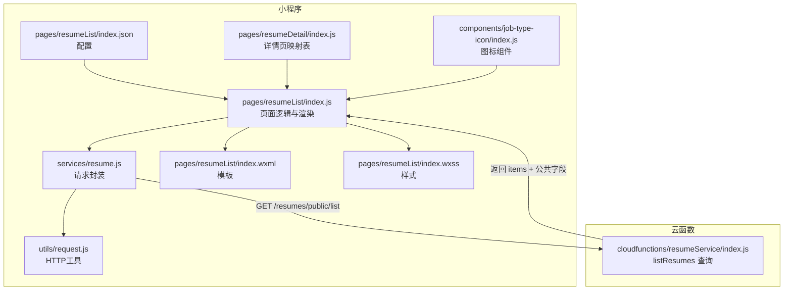
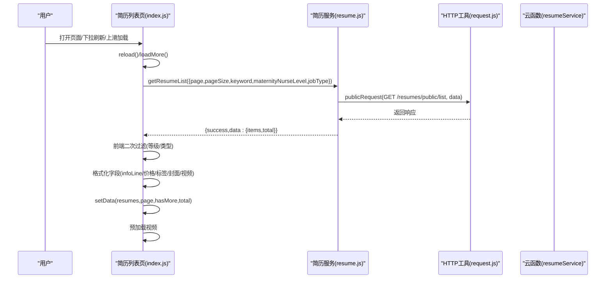
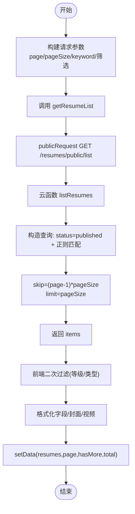
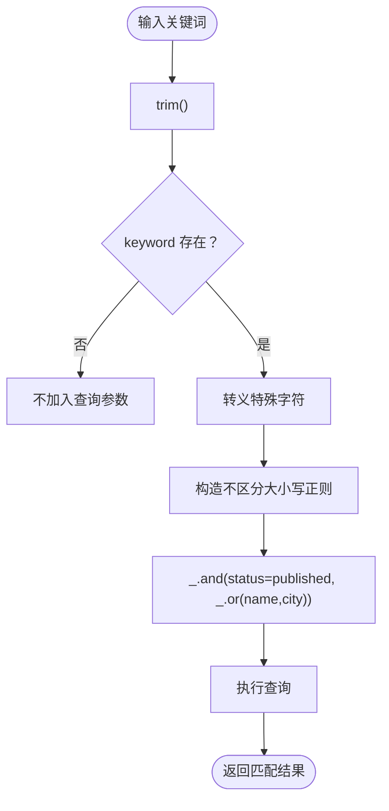
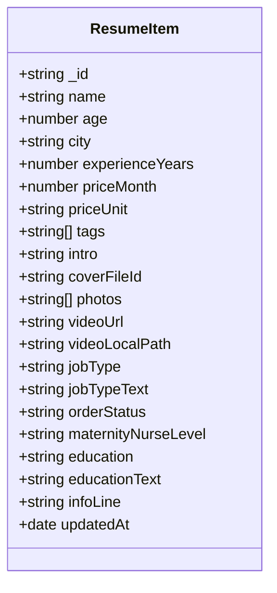
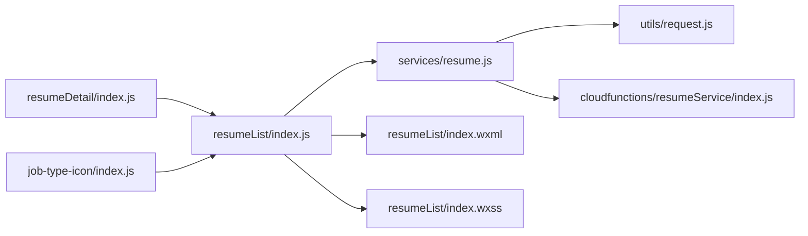

# 简历列表

<cite>
**本文引用的文件**
- [index.js](file://miniprogram/pages/resumeList/index.js)
- [resume.js](file://miniprogram/services/resume.js)
- [index.js](file://cloudfunctions/resumeService/index.js)
- [index.wxml](file://miniprogram/pages/resumeList/index.wxml)
- [index.wxss](file://miniprogram/pages/resumeList/index.wxss)
- [index.json](file://miniprogram/pages/resumeList/index.json)
- [request.js](file://miniprogram/utils/request.js)
- [app.js](file://miniprogram/app.js)
- [index.js](file://miniprogram/pages/resumeDetail/index.js)
- [index.js](file://miniprogram/components/job-type-icon/index.js)
</cite>

## 更新摘要
**所做更改**
- 修正了工种映射的一致性问题：将简历详情页面中的'yuxin'统一更正为'yuesao'
- 更新了相关文档说明，确保前后端工种标识符保持一致
- 强调了TYPE_OPTIONS与各映射表之间的协调一致性

## 目录
1. [简介](#简介)
2. [项目结构](#项目结构)
3. [核心组件](#核心组件)
4. [架构总览](#架构总览)
5. [详细组件分析](#详细组件分析)
6. [依赖关系分析](#依赖关系分析)
7. [性能考虑](#性能考虑)
8. [故障排查指南](#故障排查指南)
9. [结论](#结论)

## 简介
本章节面向"简历列表"功能，围绕分页加载、关键词搜索、数据渲染与性能优化进行系统化说明。重点阐述前端通过 resumeService.getResumeList 调用云函数 list 接口获取数据的完整流程；分页参数 page/pageSize 在前端与云函数之间的传递与处理逻辑；基于云数据库正则查询实现的姓名/城市关键词搜索机制（含特殊字符转义与不区分大小写匹配）；简历卡片字段渲染逻辑（年龄、经验、价格、标签、介绍、封面图等）；以及工种类型、服务等级筛选的前端过滤逻辑。同时提供实际代码示例路径，如 resumeList.js 中 loadMore 方法与 resumeService 中 listResumes 查询构建，并给出业务规则与性能优化建议。

**重要更新**：本次更新修正了工种映射的一致性问题，确保 TYPE_OPTIONS 中的工种标识符与各映射表保持统一，避免因标识符不一致导致的筛选和显示问题。

## 项目结构
简历列表功能涉及小程序页面、服务封装与云函数三层协作：
- 小程序页面负责交互、筛选、分页与渲染
- 服务封装负责请求构建与调用
- 云函数负责数据库查询与数据裁剪

**图表来源**
- [index.js:325-576](file://miniprogram/pages/resumeList/index.js#L325-L576)
- [resume.js:16-45](file://miniprogram/services/resume.js#L16-L45)
- [index.js:78-106](file://cloudfunctions/resumeService/index.js#L78-L106)
- [index.wxml:1-121](file://miniprogram/pages/resumeList/index.wxml#L1-L121)
- [index.wxss:1-472](file://miniprogram/pages/resumeList/index.wxss#L1-L472)
- [index.json:1-4](file://miniprogram/pages/resumeList/index.json#L1-L4)
- [request.js:1-125](file://miniprogram/utils/request.js#L1-L125)
- [index.js:12-40](file://miniprogram/pages/resumeDetail/index.js#L12-L40)
- [index.js:1-18](file://miniprogram/components/job-type-icon/index.js#L1-L18)

**章节来源**
- [index.js:1-120](file://miniprogram/pages/resumeList/index.js#L1-L120)
- [resume.js:1-120](file://miniprogram/services/resume.js#L1-L120)
- [index.js:1-120](file://cloudfunctions/resumeService/index.js#L1-L120)
- [index.wxml:1-121](file://miniprogram/pages/resumeList/index.wxml#L1-L121)
- [index.wxss:1-200](file://miniprogram/pages/resumeList/index.wxss#L1-L200)
- [index.json:1-4](file://miniprogram/pages/resumeList/index.json#L1-L4)
- [request.js:1-125](file://miniprogram/utils/request.js#L1-L125)
- [index.js:1-200](file://miniprogram/pages/resumeDetail/index.js#L1-L200)
- [index.js:1-18](file://miniprogram/components/job-type-icon/index.js#L1-L18)

## 核心组件
- 页面控制器（简历列表页）：负责分页、筛选、关键词输入、加载更多、渲染与预加载
- 服务封装（简历服务）：构建请求参数（page/pageSize/keyword/筛选），调用公开接口
- 云函数（resumeService）：执行数据库查询，裁剪公共字段，返回 items
- 请求工具（HTTP工具）：封装公开请求与认证请求，统一错误处理
- 模板与样式（WXML/WXSS）：简历卡片布局、标签、价格、等级徽章等展示
- 映射表（数据字典）：确保工种标识符在各组件间保持一致

**章节来源**
- [index.js:325-576](file://miniprogram/pages/resumeList/index.js#L325-L576)
- [resume.js:16-45](file://miniprogram/services/resume.js#L16-L45)
- [index.js:58-106](file://cloudfunctions/resumeService/index.js#L58-L106)
- [request.js:1-125](file://miniprogram/utils/request.js#L1-L125)
- [index.wxml:1-121](file://miniprogram/pages/resumeList/index.wxml#L1-L121)
- [index.wxss:1-200](file://miniprogram/pages/resumeList/index.wxss#L1-L200)

## 架构总览
简历列表的端到端流程如下：
- 用户进入简历列表页，触发 reload，调用 loadMore
- loadMore 构造请求参数（page/pageSize/keyword/筛选），调用 resumeService.getResumeList
- getResumeList 通过 publicRequest 发起 GET 请求至 /resumes/public/list
- 云函数 resumeService.listResumes 读取 event 参数，构造查询条件（published 状态 + 姓名/城市正则匹配），分页查询并返回 items
- 页面接收响应，二次前端过滤（若后端未实现筛选），格式化字段，拼接到现有列表，更新 hasMore/total，并触发视频预加载

**图表来源**
- [index.js:325-576](file://miniprogram/pages/resumeList/index.js#L325-L576)
- [resume.js:16-45](file://miniprogram/services/resume.js#L16-L45)
- [request.js:1-125](file://miniprogram/utils/request.js#L1-L125)
- [index.js:78-106](file://cloudfunctions/resumeService/index.js#L78-L106)

## 详细组件分析

### 分页加载与参数传递
- 前端分页参数
  - page/pageSize：初始 page=1，pageSize=10；每次加载后 page 自增
  - hasMore：根据服务端返回的 items 数量与 pageSize 判断是否还有更多
  - total：开启筛选时不使用服务端 total，回退到已加载条数
- 云函数分页参数
  - page/pageSize：对传入值进行边界约束（page>=0，1<=pageSize<=20）
  - skip/pageSize：使用 skip=(page-1)*pageSize 实现分页
- 业务规则
  - 仅 published 状态的简历对 C 端用户可见
  - 服务端返回 items，前端二次过滤（兜底保证）

**图表来源**
- [index.js:325-576](file://miniprogram/pages/resumeList/index.js#L325-L576)
- [resume.js:16-45](file://miniprogram/services/resume.js#L16-L45)
- [index.js:78-106](file://cloudfunctions/resumeService/index.js#L78-L106)

**章节来源**
- [index.js:325-576](file://miniprogram/pages/resumeList/index.js#L325-L576)
- [resume.js:16-45](file://miniprogram/services/resume.js#L16-L45)
- [index.js:78-106](file://cloudfunctions/resumeService/index.js#L78-L106)

### 关键词搜索与正则匹配
- 前端
  - 仅在 keyword 存在且非空时加入查询参数
  - 云函数侧对 keyword 做 trim
- 云函数
  - 对特殊字符进行转义，构造不区分大小写的正则
  - 查询条件：status=published 且 name 或 city 匹配该正则
  - 由于云开发不支持 $or，采用 _.and([status], _.or([name], [city])) 的组合
- 业务规则
  - 搜索不支持标签字段
  - 仅 published 状态参与搜索

**图表来源**
- [index.js:78-106](file://cloudfunctions/resumeService/index.js#L78-L106)

**章节来源**
- [index.js:78-106](file://cloudfunctions/resumeService/index.js#L78-L106)

### 简历卡片字段渲染逻辑
- 字段来源与映射
  - 基本信息行（单行展示，超出省略）：籍贯/城市（取 nativePlace 或 currentAddress）、年龄、经验、工作类型、学历
  - 价格：月嫂 jobType='yuesao' 显示"/26天"，其他岗位显示"/月"
  - 标签：skills 拼音映射中文
  - 封面图：personalPhoto 第一张作为 coverFileId
  - 视频：selfIntroductionVideo.url 作为 videoUrl，支持预加载
- 渲染模板
  - 左侧头像（封面图）
  - 右侧内容区：姓名、等级徽章、基本信息行、价格、技能标签
- 业务规则
  - 仅显示有封面图的简历
  - 仅 published 状态简历对 C 端可见

**图表来源**
- [index.js:387-546](file://miniprogram/pages/resumeList/index.js#L387-L546)
- [index.wxml:1-121](file://miniprogram/pages/resumeList/index.wxml#L1-L121)

**章节来源**
- [index.js:387-546](file://miniprogram/pages/resumeList/index.js#L387-L546)
- [index.wxml:1-121](file://miniprogram/pages/resumeList/index.wxml#L1-L121)
- [index.wxss:193-472](file://miniprogram/pages/resumeList/index.wxss#L193-L472)

### 工种类型与服务等级筛选
- 工种类型筛选
  - 通过自定义弹层选择，支持"全部/住家/白班/小时工/住家护老"等
  - 选择后设置 selectedType 与 selectedTypeText，并触发 reload
  - **重要更新**：TYPE_OPTIONS 中的工种标识符已统一使用 'yuesao'，确保与简历详情页面映射表保持一致
- 服务等级筛选
  - 月嫂等级映射：junior/silver/gold/platinum/diamond/crown
  - 通过自定义弹层选择，设置 selectedLevel 与 selectedLevelText，并触发 reload
- 前端兜底过滤
  - 若后端未实现筛选，页面会在本地再次过滤，保证"有反应"

**章节来源**
- [index.js:1-40](file://miniprogram/pages/resumeList/index.js#L1-L40)
- [index.js:645-696](file://miniprogram/pages/resumeList/index.js#L645-L696)

### 价格排序
- 仅对已加载的简历进行排序（升/降序）
- 排序依据：priceMonth 数值比较

**章节来源**
- [index.js:619-643](file://miniprogram/pages/resumeList/index.js#L619-L643)

### 视频预加载与性能优化
- 预加载策略
  - 列表加载完成后延时触发 preloadAllVideos
  - 批量预加载：每批 3 个，避免网络拥塞
  - cloud:// URL 自动转换为临时 HTTPS URL
  - 缓存策略：Map 缓存 + FIFO 清理，最大缓存 15 个
- 渲染优化
  - 列表项使用 wx:for 渲染，key 为 _id
  - 标签最多显示 3 行，超出隐藏
  - 价格单位与金额底部对齐，视觉统一

**章节来源**
- [index.js:37-191](file://miniprogram/pages/resumeList/index.js#L37-L191)
- [index.js:269-368](file://miniprogram/pages/resumeList/index.js#L269-L368)
- [index.wxss:431-472](file://miniprogram/pages/resumeList/index.wxss#L431-L472)

### 工种映射一致性修正
**重要更新**：为确保前后端工种标识符的一致性，已对相关映射表进行修正：

- **TYPE_OPTIONS**：使用 'yuesao' 作为月嫂的工种标识符
- **简历详情页面映射表**：已将 JOB_TYPE_MAP 和 WORK_EXPERIENCE_ICON_MAP 中的 'yuexin' 统一更正为 'yuesao'
- **图标组件**：组件属性默认值仍为 'yuexin'，但页面级映射确保了正确的显示效果

**影响范围**：
- 简历列表页的工种筛选功能
- 简历详情页的工作经历显示
- 图标资源的正确加载

**章节来源**
- [index.js:26-36](file://miniprogram/pages/resumeList/index.js#L26-L36)
- [index.js:12-40](file://miniprogram/pages/resumeDetail/index.js#L12-L40)
- [index.js:1-18](file://miniprogram/components/job-type-icon/index.js#L1-L18)

## 依赖关系分析
- 页面依赖服务封装与请求工具
- 服务封装依赖请求工具
- 云函数依赖云数据库 SDK
- 页面模板依赖样式
- **新增**：各页面间的映射表依赖关系

**图表来源**
- [index.js:1-120](file://miniprogram/pages/resumeList/index.js#L1-L120)
- [resume.js:1-120](file://miniprogram/services/resume.js#L1-L120)
- [index.js:1-120](file://cloudfunctions/resumeService/index.js#L1-L120)
- [request.js:1-125](file://miniprogram/utils/request.js#L1-L125)
- [index.wxml:1-121](file://miniprogram/pages/resumeList/index.wxml#L1-L121)
- [index.wxss:1-200](file://miniprogram/pages/resumeList/index.wxss#L1-L200)
- [index.js:1-200](file://miniprogram/pages/resumeDetail/index.js#L1-L200)
- [index.js:1-18](file://miniprogram/components/job-type-icon/index.js#L1-L18)

**章节来源**
- [index.js:1-120](file://miniprogram/pages/resumeList/index.js#L1-L120)
- [resume.js:1-120](file://miniprogram/services/resume.js#L1-L120)
- [index.js:1-120](file://cloudfunctions/resumeService/index.js#L1-L120)
- [request.js:1-125](file://miniprogram/utils/request.js#L1-L125)
- [index.wxml:1-121](file://miniprogram/pages/resumeList/index.wxml#L1-L121)
- [index.wxss:1-200](file://miniprogram/pages/resumeList/index.wxss#L1-L200)

## 性能考虑
- 列表渲染
  - 使用 wx:for + 合理的 key，避免全量重排
  - 标签最多 3 行，减少布局计算
- 网络与缓存
  - 云函数对 page/pageSize 做边界约束，避免过大请求
  - 前端对 keyword 做 trim，减少无效请求
- 资源加载
  - 视频预加载采用分批并发与缓存策略，降低首屏等待
  - cloud:// URL 自动转换，提升可访问性
- 业务过滤
  - 前端兜底过滤保证体验，但注意避免重复过滤导致 hasMore 判断偏差
- **新增**：映射表一致性优化
  - 统一的工种标识符减少了不必要的字符串转换和查找操作

## 故障排查指南
- 网络请求失败
  - 检查 BASE_URL 与 X-Client-Type/X-Platform 请求头
  - 401 时会触发 Token 过期处理，需重新登录
- 云函数异常
  - 查看云函数日志与返回的 errMsg
  - 确认集合存在与权限
- 列表为空
  - 确认筛选条件（等级/类型/关键词）是否过于严格
  - 检查封面图字段 coverFileId 是否为空
  - **新增**：检查工种标识符是否正确（应使用 'yuesao' 而非 'yuexin'）
- 视频无法播放
  - 检查 videoUrl 是否有效
  - 确认 cloud:// URL 已转换为临时 HTTPS URL
- **新增**：工种显示异常
  - 检查 TYPE_OPTIONS 与映射表中的工种标识符是否一致
  - 确认简历详情页面的 JOB_TYPE_MAP 是否已更新

**章节来源**
- [request.js:1-125](file://miniprogram/utils/request.js#L1-L125)
- [index.js:180-216](file://cloudfunctions/resumeService/index.js#L180-L216)
- [index.js:547-576](file://miniprogram/pages/resumeList/index.js#L547-L576)

## 结论
简历列表功能通过"页面-服务-云函数-数据库"的清晰分层，实现了稳定的分页加载、关键词搜索与卡片渲染。分页参数在前端与云函数间保持一致的边界约束，搜索通过正则实现不区分大小写匹配并转义特殊字符，业务规则明确（仅 published 对 C 端可见、搜索不支持标签）。前端在渲染层面做了多项优化（标签截断、价格对齐、视频预加载），并在后端未实现筛选时提供前端兜底过滤，确保用户体验稳定可靠。

**重要更新**：本次更新解决了工种映射的一致性问题，确保 TYPE_OPTIONS 中的 'yuesao' 标识符与简历详情页面的映射表保持统一，避免了因标识符不一致导致的筛选和显示问题，提升了系统的整体稳定性。