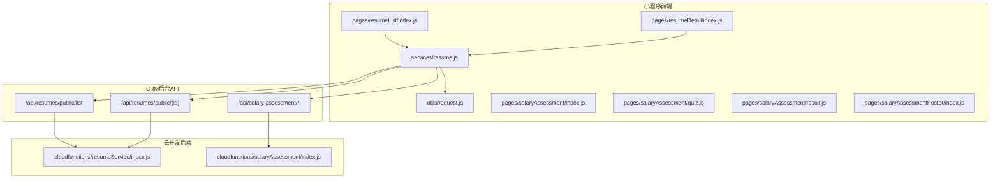
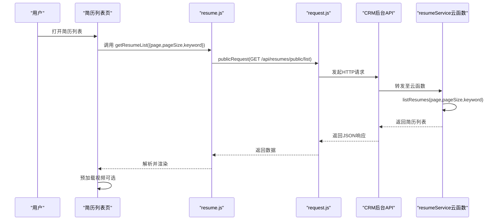
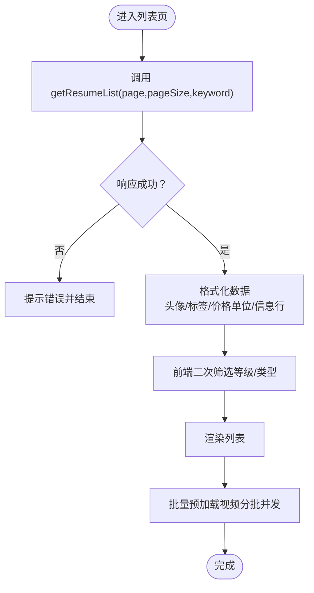
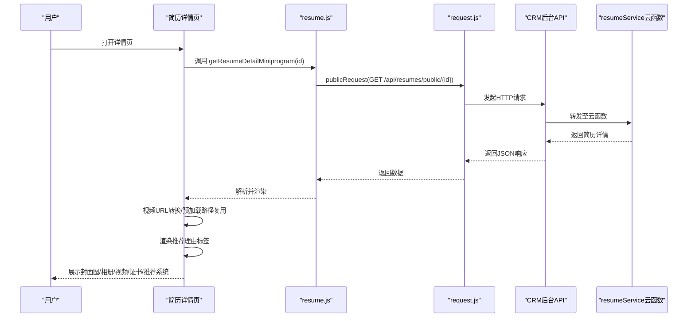
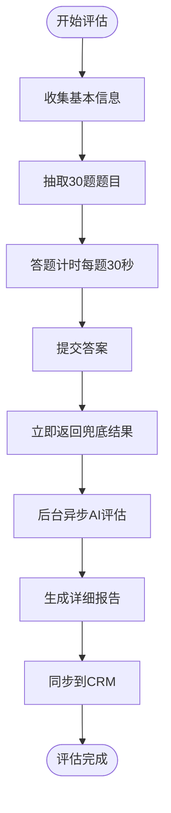
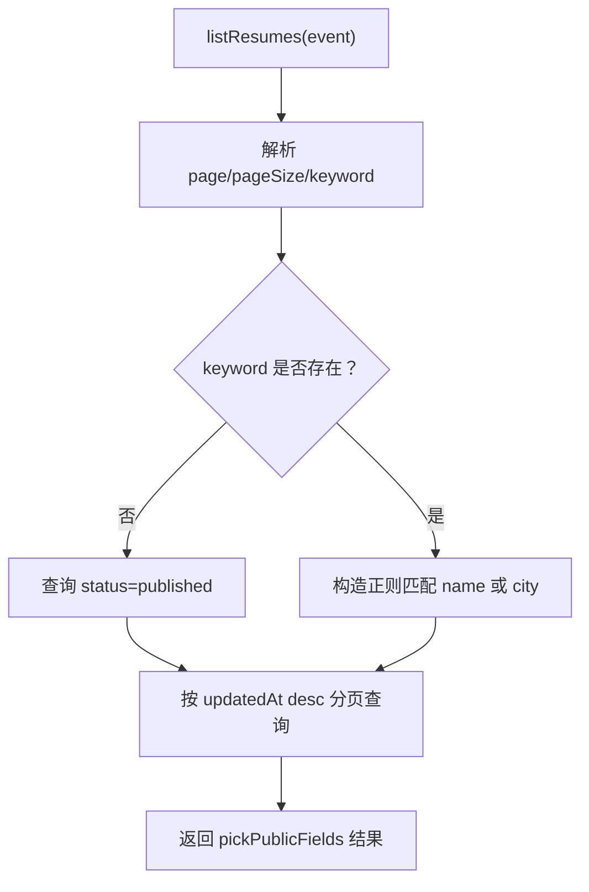
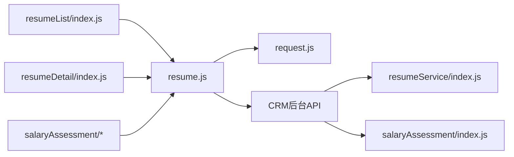

# 简历系统

<cite>
**本文引用的文件**
- [resumeService/index.js](file://cloudfunctions/resumeService/index.js)
- [resume.js](file://miniprogram/services/resume.js)
- [request.js](file://miniprogram/utils/request.js)
- [resumeList/index.js](file://miniprogram/pages/resumeList/index.js)
- [resumeDetail/index.js](file://miniprogram/pages/resumeDetail/index.js)
- [resumeDetail/index.json](file://miniprogram/pages/resumeDetail/index.json)
- [salaryAssessment/index.js](file://cloudfunctions/salaryAssessment/index.js)
- [salaryAssessment/index.js](file://miniprogram/pages/salaryAssessment/index.js)
- [salaryAssessment/quiz.js](file://miniprogram/pages/salaryAssessment/quiz.js)
- [salaryAssessment/result.js](file://miniprogram/pages/salaryAssessment/result.js)
- [salaryAssessmentPoster/index.js](file://miniprogram/pages/salaryAssessmentPoster/index.js)
- [API完整文档.md](file://API完整文档.md)
- [视频预加载优化方案.md](file://视频预加载优化方案.md)
- [简历管理方案深度分析.md](file://docs/简历管理方案深度分析.md)
</cite>

## 更新摘要
**变更内容**
- 新增薪资评估系统，包含完整的30题测评流程
- 集成AI智能评估功能，提供实时薪资区间预测
- 添加推荐系统，基于简历特征生成个性化推荐理由
- 新增海报生成系统，支持多风格海报分享
- 扩展简历详情页，增加推荐理由标签展示

## 目录
1. [简介](#简介)
2. [项目结构](#项目结构)
3. [核心组件](#核心组件)
4. [架构总览](#架构总览)
5. [详细组件分析](#详细组件分析)
6. [依赖关系分析](#依赖关系分析)
7. [性能考虑](#性能考虑)
8. [故障排查指南](#故障排查指南)
9. [结论](#结论)
10. [附录](#附录)

## 简介
本文件面向"安得褓贝"简历系统，围绕简历列表展示、详情查看、薪资评估和推荐系统展开。系统采用微信小程序前端 + 云开发后端（云函数 + 云数据库）的架构。前端通过 resumeService 调用 CRM 后台公开接口获取数据，简历列表支持分页加载（page/pageSize）与关键词搜索（仅匹配姓名和城市），简历详情页展示年龄、经验、价格、标签、介绍以及封面图、相册、视频等多媒体内容。新增的薪资评估系统提供AI智能测评，推荐系统基于简历特征生成个性化推荐理由，所有功能均提供视频预加载优化策略，确保流畅体验。

## 项目结构
- 前端（miniprogram）
  - services/resume.js：封装公开接口调用（列表、详情、上传等）
  - utils/request.js：统一请求工具（公开/认证）
  - pages/resumeList/index.js：简历列表页，含分页、关键词搜索、筛选、视频预加载
  - pages/resumeDetail/index.js：简历详情页，含字段展示、媒体渲染、证书票券、推荐系统
  - pages/resumeDetail/index.json：详情页导航标题
  - pages/salaryAssessment/index.js：薪资评估首页，收集基本信息
  - pages/salaryAssessment/quiz.js：30题测评答题页面
  - pages/salaryAssessment/result.js：评估结果展示页
  - pages/salaryAssessmentPoster/index.js：评估海报生成页
- 云函数（cloudfunctions）
  - resumeService/index.js：简历相关云函数（list/detail/upsert/remove 等），负责数据查询与权限校验
  - salaryAssessment/index.js：薪资评估云函数，提供测评、AI评估、结果查询等功能
- 文档
  - API完整文档.md：接口规范与字段说明
  - 视频预加载优化方案.md：视频预加载策略与实现要点
  - 简历管理方案深度分析.md：角色权限与管理后台方案

**图表来源**
- [resumeList/index.js:1-698](file://miniprogram/pages/resumeList/index.js#L1-L698)
- [resumeDetail/index.js:1-2162](file://miniprogram/pages/resumeDetail/index.js#L1-L2162)
- [resume.js:1-239](file://miniprogram/services/resume.js#L1-L239)
- [request.js:1-125](file://miniprogram/utils/request.js#L1-L125)
- [salaryAssessment/index.js:1-882](file://cloudfunctions/salaryAssessment/index.js#L1-L882)

**章节来源**
- [resumeList/index.js:1-698](file://miniprogram/pages/resumeList/index.js#L1-L698)
- [resumeDetail/index.js:1-2162](file://miniprogram/pages/resumeDetail/index.js#L1-L2162)
- [resume.js:1-239](file://miniprogram/services/resume.js#L1-L239)
- [request.js:1-125](file://miniprogram/utils/request.js#L1-L125)
- [salaryAssessment/index.js:1-882](file://cloudfunctions/salaryAssessment/index.js#L1-L882)

## 核心组件
- 前端服务层
  - getResumeList：公开接口，支持分页与关键词搜索（仅姓名/城市）
  - getResumeDetail：公开接口，获取简历详情
  - getResumeListMiniprogram / getResumeDetailMiniprogram：小程序专用接口（公开）
  - uploadFile：小程序上传文件（凭证由后端生成）
  - salaryAssessment：薪资评估相关接口（开始测评、获取题目、提交答案、获取结果）
- 云函数服务层
  - listResumes：实现分页、关键词搜索（正则匹配姓名/城市）、状态过滤（published）
  - getDetail：详情查询（公开接口）
  - upsertResume/removeResume：管理端能力（权限校验）
  - salaryAssessment：薪资评估云函数，提供题目抽取、AI评估、结果查询等功能
- 推荐系统
  - buildRecommendationView：构建推荐理由视图模型
  - recommendationTags：基于简历特征生成的推荐标签

**章节来源**
- [resume.js:1-239](file://miniprogram/services/resume.js#L1-L239)
- [resumeService/index.js:1-216](file://cloudfunctions/resumeService/index.js#L1-L216)
- [salaryAssessment/index.js:1-882](file://cloudfunctions/salaryAssessment/index.js#L1-L882)

## 架构总览
系统采用"小程序前端 + 云函数 + CRM 后台 API"的三层架构：
- 前端通过 services/resume.js 调用 CRM 后台公开接口（/api/resumes/public/*）
- 云函数 resumeService/index.js 提供简历列表与详情的查询能力，并对公开字段进行裁剪
- 云函数 salaryAssessment/index.js 提供薪资评估、AI评估、结果查询等完整测评流程
- 云数据库用于简历数据存储与查询（云函数中通过 db.RegExp 实现正则匹配）
- 推荐系统基于简历特征生成个性化推荐理由

**图表来源**
- [resumeList/index.js:321-576](file://miniprogram/pages/resumeList/index.js#L321-L576)
- [resume.js:16-45](file://miniprogram/services/resume.js#L16-L45)
- [request.js:12-41](file://miniprogram/utils/request.js#L12-L41)
- [resumeService/index.js:78-106](file://cloudfunctions/resumeService/index.js#L78-L106)

## 详细组件分析

### 组件A：简历列表页（resumeList/index.js）
- 分页加载
  - page/pageSize 参数传递给 getResumeList
  - hasMore 依据服务端返回条数判断，避免前端过滤导致提前停止
- 关键词搜索
  - keyword 仅匹配姓名与城市（正则不区分大小写）
  - 云函数中使用 db.RegExp 实现模糊匹配
- 筛选与排序
  - 支持服务等级与职位类型筛选（前端二次过滤兜底）
  - 价格排序仅作用于已加载列表
- 媒体预加载
  - VideoPreloader 类管理视频预加载，支持缓存、并发控制、FIFO 清理
  - 预加载策略：列表加载完成后批量预加载，分批并发，延迟间隔
- 字段展示
  - 基本信息行：籍贯、年龄、经验、工作类型、学历
  - 价格单位：月嫂统一"/26天"，其他岗位"/月"
  - 标签：技能拼音映射中文
  - 头像：取个人照片第一张，过滤无头像简历

**图表来源**
- [resumeList/index.js:321-576](file://miniprogram/pages/resumeList/index.js#L321-L576)
- [resumeList/index.js:1-191](file://miniprogram/pages/resumeList/index.js#L1-L191)

**章节来源**
- [resumeList/index.js:1-698](file://miniprogram/pages/resumeList/index.js#L1-L698)

### 组件B：简历详情页（resumeDetail/index.js）
- 字段展示
  - 基本信息：年龄、性别、星座、籍贯、民族、学历
  - 工作经历：时间区间、服务区域、订单号掩码、客户评价、工作照片
  - 媒体内容：封面图、相册、视频
  - 证书票券：基于 certificates 与 skills 生成
  - 推荐系统：基于简历特征生成的推荐理由标签
- 媒体渲染
  - 视频：支持 cloud:// 转临时链接；优先使用列表页预加载的本地路径
  - 图片：支持预览与滑动切换
  - 缩略图：按工种（月嫂/保姆/育儿嫂）策略挑选，避免与视频缩略图重复
- 交互
  - 切换视频/图片模式
  - 查看全部照片与证书
  - 证书票券点击预览
  - 推荐理由标签展开/收起
  - 点击推荐理由查看完整说明

**图表来源**
- [resumeDetail/index.js:202-362](file://miniprogram/pages/resumeDetail/index.js#L202-L362)
- [resume.js:78-99](file://miniprogram/services/resume.js#L78-L99)
- [request.js:12-41](file://miniprogram/utils/request.js#L12-L41)
- [resumeService/index.js:108-120](file://cloudfunctions/resumeService/index.js#L108-L120)

**章节来源**
- [resumeDetail/index.js:1-2162](file://miniprogram/pages/resumeDetail/index.js#L1-L2162)
- [resumeDetail/index.json:1-4](file://miniprogram/pages/resumeDetail/index.json#L1-L4)

### 组件C：薪资评估系统（salaryAssessment）
- 评估流程
  - 信息收集：收集姓名、手机号、工种、年龄、经验、学历、城市等基本信息
  - 题目抽取：根据工种和经验自动抽取30道题目（硬件4题、技能18题、心理8题）
  - 答题计时：每题30秒倒计时，超时自动选择最低分选项
  - 实时评分：提交后立即返回兜底结果，后台异步生成AI报告
  - AI评估：调用豆包AI生成详细的薪资区间、等级评估和改进建议
- AI评估功能
  - 基于答题情况和城市薪资行情生成个性化报告
  - 提供 strengths、improvements、advice 等维度的详细分析
  - 生成 salaryRange、salaryReasoning、marketComparison 等关键指标
- 数据存储
  - 评估记录包含 basicInfo、pickedQuestions、answers、sectionScores、result 等字段
  - 支持 CRM 成绩同步，实现小程序与后台系统的数据一致性

**图表来源**
- [salaryAssessment/index.js:477-720](file://cloudfunctions/salaryAssessment/index.js#L477-L720)
- [salaryAssessment/index.js:225-318](file://miniprogram/pages/salaryAssessment/index.js#L225-L318)
- [salaryAssessment/quiz.js:176-231](file://miniprogram/pages/salaryAssessment/quiz.js#L176-L231)
- [salaryAssessment/result.js:140-172](file://miniprogram/pages/salaryAssessment/result.js#L140-L172)

**章节来源**
- [salaryAssessment/index.js:1-882](file://cloudfunctions/salaryAssessment/index.js#L1-L882)
- [salaryAssessment/index.js:1-335](file://miniprogram/pages/salaryAssessment/index.js#L1-L335)
- [salaryAssessment/quiz.js:1-264](file://miniprogram/pages/salaryAssessment/quiz.js#L1-L264)
- [salaryAssessment/result.js:1-264](file://miniprogram/pages/salaryAssessment/result.js#L1-L264)

### 组件D：推荐系统（resumeDetail/index.js）
- 推荐理由生成
  - 基于简历特征（技能、经验、标签等）自动生成推荐理由
  - 支持 TopN 展示，默认显示8个标签，可展开查看更多
  - 每个标签包含计数信息，帮助用户理解推荐依据
- 视图模型
  - buildRecommendationView 函数负责构建推荐视图模型
  - 支持固定列数布局（默认3列），自动计算可见/隐藏标签数量
  - 提供展开/收起功能，优化首屏显示效果
- 交互设计
  - 点击标签查看完整推荐理由
  - 支持标签样式分级（Top1-3使用强调样式）
  - 响应式布局，适配不同屏幕尺寸

**章节来源**
- [resumeDetail/index.js:159-1300](file://miniprogram/pages/resumeDetail/index.js#L159-L1300)
- [resumeDetail/index.wxss:739-841](file://miniprogram/pages/resumeDetail/index.wxss#L739-L841)

### 组件E：云函数简历服务（resumeService/index.js）
- listResumes
  - 分页：page/pageSize，最小1、最大20
  - 关键词：仅匹配 name 与 city，使用 db.RegExp 实现不区分大小写的模糊匹配
  - 状态：仅 published 对外可见
  - 排序：按 updatedAt 降序
  - 字段裁剪：pickPublicFields 仅返回对外公开字段
- getDetail
  - 详情查询，公开接口
- upsertResume/removeResume
  - 管理端能力，权限校验通过 isStaff 判断（手机号或 openid）
- isStaff
  - 优先通过手机号匹配 staff 集合，兼容旧 openid 方式

**图表来源**
- [resumeService/index.js:78-106](file://cloudfunctions/resumeService/index.js#L78-L106)

**章节来源**
- [resumeService/index.js:1-216](file://cloudfunctions/resumeService/index.js#L1-L216)

### 组件F：前端请求工具（request.js）
- publicRequest：无需 Token 的公开请求
- authenticatedRequest：需要 Authorization: Bearer Token 的认证请求
- request：自动判断是否需要 Token

**章节来源**
- [request.js:1-125](file://miniprogram/utils/request.js#L1-L125)

### 组件G：服务封装（resume.js）
- getResumeList：公开接口，支持 keyword、page、pageSize
- getResumeListMiniprogram：小程序专用接口，支持 jobType/orderStatus 等筛选
- getResumeDetail / getResumeDetailMiniprogram：公开接口
- createResume/updateResume/deleteResume：管理端接口
- uploadFile：小程序上传文件（凭证由后端生成）
- salaryAssessment：薪资评估相关接口封装

**章节来源**
- [resume.js:1-239](file://miniprogram/services/resume.js#L1-L239)

## 依赖关系分析
- 前端依赖
  - pages/resumeList/index.js 依赖 services/resume.js 与 utils/request.js
  - pages/resumeDetail/index.js 依赖 services/resume.js 与 utils/request.js
  - pages/salaryAssessment/* 依赖 services/resume.js 与 utils/request.js
  - services/resume.js 依赖 utils/request.js
- 云函数依赖
  - cloudfunctions/resumeService/index.js 依赖 wx-server-sdk 与云数据库
  - cloudfunctions/salaryAssessment/index.js 依赖 wx-server-sdk、云数据库、HTTPS请求
- 接口依赖
  - CRM 后台公开接口：/api/resumes/public/list、/api/resumes/public/{id}
  - 薪资评估接口：/api/salary-assessment/*

**图表来源**
- [resumeList/index.js:1-698](file://miniprogram/pages/resumeList/index.js#L1-L698)
- [resumeDetail/index.js:1-2162](file://miniprogram/pages/resumeDetail/index.js#L1-L2162)
- [salaryAssessment/index.js:1-335](file://miniprogram/pages/salaryAssessment/index.js#L1-L335)
- [resume.js:1-239](file://miniprogram/services/resume.js#L1-L239)
- [request.js:1-125](file://miniprogram/utils/request.js#L1-L125)
- [resumeService/index.js:1-216](file://cloudfunctions/resumeService/index.js#L1-L216)
- [salaryAssessment/index.js:1-882](file://cloudfunctions/salaryAssessment/index.js#L1-L882)

**章节来源**
- [resumeList/index.js:1-698](file://miniprogram/pages/resumeList/index.js#L1-L698)
- [resumeDetail/index.js:1-2162](file://miniprogram/pages/resumeDetail/index.js#L1-L2162)
- [salaryAssessment/index.js:1-335](file://miniprogram/pages/salaryAssessment/index.js#L1-L335)
- [resume.js:1-239](file://miniprogram/services/resume.js#L1-L239)
- [request.js:1-125](file://miniprogram/utils/request.js#L1-L125)
- [resumeService/index.js:1-216](file://cloudfunctions/resumeService/index.js#L1-L216)
- [salaryAssessment/index.js:1-882](file://cloudfunctions/salaryAssessment/index.js#L1-L882)

## 性能考虑
- 图片懒加载
  - 列表页使用 wx:lazy-load 属性（在模板中启用），减少首屏渲染压力
- 视频预加载策略
  - 列表页：批量预加载（限制并发），缓存上限与 FIFO 清理，延迟分批
  - 详情页：优先使用列表页预加载的本地路径，避免二次下载
- 网络优化
  - 仅在可见区域预加载视频，降低带宽占用
  - 云函数中使用正则匹配与分页，避免一次性拉取大量数据
- 薪资评估优化
  - 评估提交后立即返回兜底结果，提升用户体验
  - AI评估异步执行，不阻塞主线程
  - 题库内存缓存，减少数据库查询次数
- 推荐系统优化
  - 默认只显示部分推荐标签，避免首屏过载
  - 支持展开查看更多，平衡信息密度和交互效率

**章节来源**
- [视频预加载优化方案.md:1-125](file://视频预加载优化方案.md#L1-L125)
- [resumeList/index.js:1-191](file://miniprogram/pages/resumeList/index.js#L1-L191)
- [resumeDetail/index.js:1-2162](file://miniprogram/pages/resumeDetail/index.js#L1-L2162)
- [salaryAssessment/index.js:310-340](file://cloudfunctions/salaryAssessment/index.js#L310-L340)

## 故障排查指南
- 列表加载失败
  - 检查 getResumeList 请求参数（page/pageSize/keyword）是否正确
  - 查看服务端响应 success/message，确认接口可用性
- 详情页空白或视频无法播放
  - 确认 videoFileId 是否为 cloud:// 格式，详情页会尝试转换为临时链接
  - 若仍为 cloud://，需检查云存储权限与文件有效性
- 权限问题
  - 云函数中 isStaff 通过手机号或 openid 判断，若权限不足会抛出错误
- Token 过期
  - authenticatedRequest 会在 401 时清除本地 Token 并跳转登录页
- 薪资评估问题
  - 题目加载失败：检查网络连接和云函数可用性
  - 评估结果为空：确认评估已完成且状态为 completed
  - AI报告生成失败：检查 ARK_API_KEY 环境变量配置
- 推荐系统问题
  - 推荐标签不显示：检查简历数据中 recommendationTags 字段
  - 标签布局异常：确认 buildRecommendationView 函数正常执行

**章节来源**
- [resume.js:1-239](file://miniprogram/services/resume.js#L1-L239)
- [request.js:43-103](file://miniprogram/utils/request.js#L43-L103)
- [resumeService/index.js:26-56](file://cloudfunctions/resumeService/index.js#L26-L56)
- [salaryAssessment/index.js:188-210](file://cloudfunctions/salaryAssessment/index.js#L188-L210)
- [resumeDetail/index.js:1204-1235](file://miniprogram/pages/resumeDetail/index.js#L1204-L1235)

## 结论
本简历系统通过清晰的前后端职责划分与云函数能力，实现了简历列表的分页与关键词搜索（仅姓名/城市）、详情页的丰富字段与媒体渲染，以及视频预加载优化。新增的薪资评估系统提供了完整的30题测评流程，结合AI智能评估功能，为用户提供个性化的薪资预测和改进建议。推荐系统基于简历特征生成个性化推荐理由，增强了简历的展示效果。云函数层对公开字段进行裁剪，保障数据安全；前端通过统一的服务封装与请求工具，简化了接口调用与错误处理。建议在后续迭代中进一步完善搜索能力（如标签字段）与权限模型，以满足更复杂的业务需求。

## 附录

### 业务规则摘要
- 仅 published 状态的简历对 C 端用户可见
- 搜索关键词不支持标签字段，仅匹配姓名与城市
- 详情页字段展示涵盖年龄、经验、价格、标签、介绍、封面图、相册、视频等
- 视频播放优先使用列表页预加载的本地路径，提升用户体验
- 薪资评估系统提供实时兜底结果和异步AI报告生成
- 推荐系统基于简历特征自动生成个性化推荐理由
- 支持多风格海报生成，便于用户分享评估结果

**章节来源**
- [resumeService/index.js:78-106](file://cloudfunctions/resumeService/index.js#L78-L106)
- [salaryAssessment/index.js:602-720](file://cloudfunctions/salaryAssessment/index.js#L602-L720)
- [resumeDetail/index.js:1204-1235](file://miniprogram/pages/resumeDetail/index.js#L1204-L1235)
- [API完整文档.md:217-590](file://API完整文档.md#L217-L590)
- [简历管理方案深度分析.md:1-629](file://docs/简历管理方案深度分析.md#L1-L629)