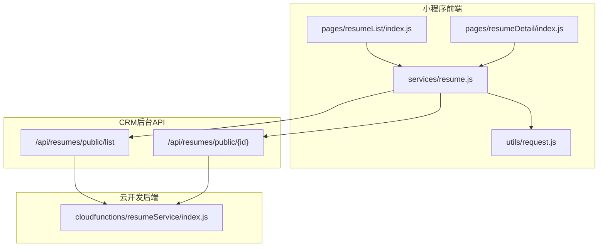
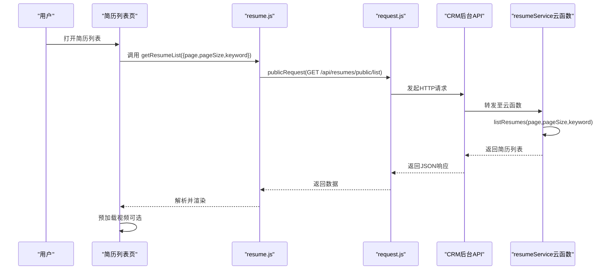
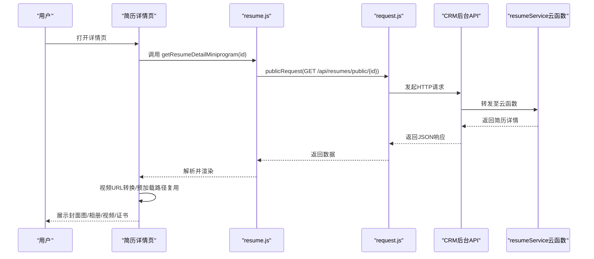
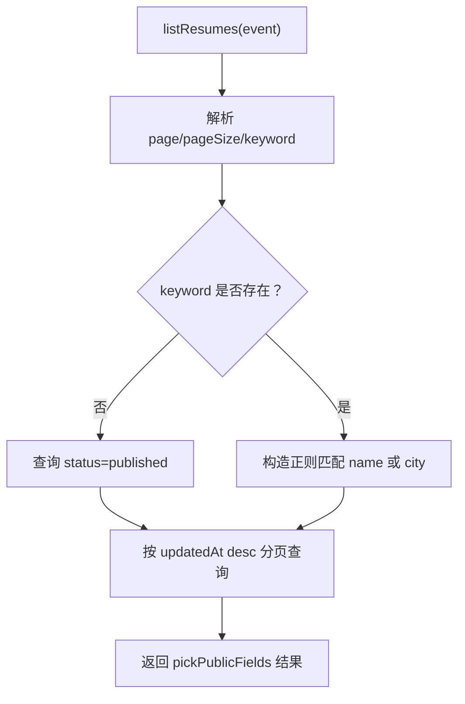
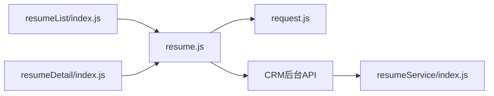

# 简历系统

<cite>
**本文引用的文件**
- [resumeService/index.js](file://cloudfunctions/resumeService/index.js)
- [resume.js](file://miniprogram/services/resume.js)
- [request.js](file://miniprogram/utils/request.js)
- [resumeList/index.js](file://miniprogram/pages/resumeList/index.js)
- [resumeDetail/index.js](file://miniprogram/pages/resumeDetail/index.js)
- [resumeDetail/index.json](file://miniprogram/pages/resumeDetail/index.json)
- [API完整文档.md](file://API完整文档.md)
- [视频预加载优化方案.md](file://视频预加载优化方案.md)
- [简历管理方案深度分析.md](file://docs/简历管理方案深度分析.md)
</cite>

## 目录
1. [简介](#简介)
2. [项目结构](#项目结构)
3. [核心组件](#核心组件)
4. [架构总览](#架构总览)
5. [详细组件分析](#详细组件分析)
6. [依赖关系分析](#依赖关系分析)
7. [性能考虑](#性能考虑)
8. [故障排查指南](#故障排查指南)
9. [结论](#结论)
10. [附录](#附录)

## 简介
本文件面向“安得褓贝”简历系统，围绕简历列表展示、详情查看与媒体内容加载展开，系统采用微信小程序前端 + 云开发后端（云函数 + 云数据库）的架构。前端通过 resumeService 调用 CRM 后台公开接口获取数据，简历列表支持分页加载（page/pageSize）与关键词搜索（仅匹配姓名和城市），简历详情页展示年龄、经验、价格、标签、介绍以及封面图、相册、视频等多媒体内容，并提供视频预加载优化策略，确保流畅体验。

## 项目结构
- 前端（miniprogram）
  - services/resume.js：封装公开接口调用（列表、详情、上传等）
  - utils/request.js：统一请求工具（公开/认证）
  - pages/resumeList/index.js：简历列表页，含分页、关键词搜索、筛选、视频预加载
  - pages/resumeDetail/index.js：简历详情页，含字段展示、媒体渲染、证书票券
  - pages/resumeDetail/index.json：详情页导航标题
- 云函数（cloudfunctions）
  - resumeService/index.js：简历相关云函数（list/detail/upsert/remove 等），负责数据查询与权限校验
- 文档
  - API完整文档.md：接口规范与字段说明
  - 视频预加载优化方案.md：视频预加载策略与实现要点
  - 简历管理方案深度分析.md：角色权限与管理后台方案

图表来源
- [resumeList/index.js](file://miniprogram/pages/resumeList/index.js#L1-L698)
- [resumeDetail/index.js](file://miniprogram/pages/resumeDetail/index.js#L1-L800)
- [resume.js](file://miniprogram/services/resume.js#L1-L239)
- [request.js](file://miniprogram/utils/request.js#L1-L125)
- [resumeService/index.js](file://cloudfunctions/resumeService/index.js#L1-L216)

章节来源
- [resumeList/index.js](file://miniprogram/pages/resumeList/index.js#L1-L698)
- [resumeDetail/index.js](file://miniprogram/pages/resumeDetail/index.js#L1-L800)
- [resume.js](file://miniprogram/services/resume.js#L1-L239)
- [request.js](file://miniprogram/utils/request.js#L1-L125)
- [resumeService/index.js](file://cloudfunctions/resumeService/index.js#L1-L216)

## 核心组件
- 前端服务层
  - getResumeList：公开接口，支持分页与关键词搜索（仅姓名/城市）
  - getResumeDetail：公开接口，获取简历详情
  - getResumeListMiniprogram / getResumeDetailMiniprogram：小程序专用接口（公开）
  - uploadFile：小程序上传文件（凭证由后端生成）
- 云函数服务层
  - listResumes：实现分页、关键词搜索（正则匹配姓名/城市）、状态过滤（published）
  - getDetail：详情查询（公开接口）
  - upsertResume/removeResume：管理端能力（权限校验）

章节来源
- [resume.js](file://miniprogram/services/resume.js#L1-L239)
- [resumeService/index.js](file://cloudfunctions/resumeService/index.js#L1-L216)

## 架构总览
系统采用“小程序前端 + 云函数 + CRM 后台 API”的三层架构：
- 前端通过 services/resume.js 调用 CRM 后台公开接口（/api/resumes/public/*）
- 云函数 resumeService/index.js 提供简历列表与详情的查询能力，并对公开字段进行裁剪
- 云数据库用于简历数据存储与查询（云函数中通过 db.RegExp 实现正则匹配）

图表来源
- [resumeList/index.js](file://miniprogram/pages/resumeList/index.js#L321-L576)
- [resume.js](file://miniprogram/services/resume.js#L16-L45)
- [request.js](file://miniprogram/utils/request.js#L12-L41)
- [resumeService/index.js](file://cloudfunctions/resumeService/index.js#L78-L106)

## 详细组件分析

### 组件A：简历列表页（resumeList/index.js）
- 分页加载
  - page/pageSize 参数传递给 getResumeList
  - hasMore 依据服务端返回条数判断，避免前端过滤导致提前停止
- 关键词搜索
  - keyword 仅匹配姓名与城市（正则不区分大小写）
  - 云函数中使用 db.RegExp 实现模糊匹配
- 筛选与排序
  - 支持服务等级与职位类型筛选（前端二次过滤兜底）
  - 价格排序仅作用于已加载列表
- 媒体预加载
  - VideoPreloader 类管理视频预加载，支持缓存、并发控制、FIFO 清理
  - 预加载策略：列表加载完成后批量预加载，分批并发，延迟间隔
- 字段展示
  - 基本信息行：籍贯、年龄、经验、工作类型、学历
  - 价格单位：月嫂统一“/26天”，其他岗位“/月”
  - 标签：技能拼音映射中文
  - 头像：取个人照片第一张，过滤无头像简历

图表来源
- [resumeList/index.js](file://miniprogram/pages/resumeList/index.js#L321-L576)
- [resumeList/index.js](file://miniprogram/pages/resumeList/index.js#L1-L191)

章节来源
- [resumeList/index.js](file://miniprogram/pages/resumeList/index.js#L1-L698)

### 组件B：简历详情页（resumeDetail/index.js）
- 字段展示
  - 基本信息：年龄、性别、星座、籍贯、民族、学历
  - 工作经历：时间区间、服务区域、订单号掩码、客户评价、工作照片
  - 媒体内容：封面图、相册、视频
  - 证书票券：基于 certificates 与 skills 生成
- 媒体渲染
  - 视频：支持 cloud:// 转临时链接；优先使用列表页预加载的本地路径
  - 图片：支持预览与滑动切换
  - 缩略图：按工种（月嫂/保姆/育儿嫂）策略挑选，避免与视频缩略图重复
- 交互
  - 切换视频/图片模式
  - 查看全部照片与证书
  - 证书票券点击预览

图表来源
- [resumeDetail/index.js](file://miniprogram/pages/resumeDetail/index.js#L202-L362)
- [resume.js](file://miniprogram/services/resume.js#L78-L99)
- [request.js](file://miniprogram/utils/request.js#L12-L41)
- [resumeService/index.js](file://cloudfunctions/resumeService/index.js#L108-L120)

章节来源
- [resumeDetail/index.js](file://miniprogram/pages/resumeDetail/index.js#L1-L800)
- [resumeDetail/index.json](file://miniprogram/pages/resumeDetail/index.json#L1-L4)

### 组件C：云函数简历服务（resumeService/index.js）
- listResumes
  - 分页：page/pageSize，最小1、最大20
  - 关键词：仅匹配 name 与 city，使用 db.RegExp 实现不区分大小写的模糊匹配
  - 状态：仅 published 对外可见
  - 排序：按 updatedAt 降序
  - 字段裁剪：pickPublicFields 仅返回对外公开字段
- getDetail
  - 详情查询，公开接口
- upsertResume/removeResume
  - 管理端能力，权限校验通过 isStaff 判断（手机号或 openid）
- isStaff
  - 优先通过手机号匹配 staff 集合，兼容旧 openid 方式

图表来源
- [resumeService/index.js](file://cloudfunctions/resumeService/index.js#L78-L106)

章节来源
- [resumeService/index.js](file://cloudfunctions/resumeService/index.js#L1-L216)

### 组件D：前端请求工具（request.js）
- publicRequest：无需 Token 的公开请求
- authenticatedRequest：需要 Authorization: Bearer Token 的认证请求
- request：自动判断是否需要 Token

章节来源
- [request.js](file://miniprogram/utils/request.js#L1-L125)

### 组件E：服务封装（resume.js）
- getResumeList：公开接口，支持 keyword、page、pageSize
- getResumeListMiniprogram：小程序专用接口，支持 jobType/orderStatus 等筛选
- getResumeDetail / getResumeDetailMiniprogram：公开接口
- createResume/updateResume/deleteResume：管理端接口
- uploadFile：小程序上传文件（凭证由后端生成）

章节来源
- [resume.js](file://miniprogram/services/resume.js#L1-L239)

## 依赖关系分析
- 前端依赖
  - pages/resumeList/index.js 依赖 services/resume.js 与 utils/request.js
  - pages/resumeDetail/index.js 依赖 services/resume.js 与 utils/request.js
  - services/resume.js 依赖 utils/request.js
- 云函数依赖
  - cloudfunctions/resumeService/index.js 依赖 wx-server-sdk 与云数据库
- 接口依赖
  - CRM 后台公开接口：/api/resumes/public/list、/api/resumes/public/{id}

图表来源
- [resumeList/index.js](file://miniprogram/pages/resumeList/index.js#L1-L698)
- [resumeDetail/index.js](file://miniprogram/pages/resumeDetail/index.js#L1-L800)
- [resume.js](file://miniprogram/services/resume.js#L1-L239)
- [request.js](file://miniprogram/utils/request.js#L1-L125)
- [resumeService/index.js](file://cloudfunctions/resumeService/index.js#L1-L216)

章节来源
- [resumeList/index.js](file://miniprogram/pages/resumeList/index.js#L1-L698)
- [resumeDetail/index.js](file://miniprogram/pages/resumeDetail/index.js#L1-L800)
- [resume.js](file://miniprogram/services/resume.js#L1-L239)
- [request.js](file://miniprogram/utils/request.js#L1-L125)
- [resumeService/index.js](file://cloudfunctions/resumeService/index.js#L1-L216)

## 性能考虑
- 图片懒加载
  - 列表页使用 wx:lazy-load 属性（在模板中启用），减少首屏渲染压力
- 视频预加载策略
  - 列表页：批量预加载（限制并发），缓存上限与 FIFO 清理，延迟分批
  - 详情页：优先使用列表页预加载的本地路径，避免二次下载
- 网络优化
  - 仅在可见区域预加载视频，降低带宽占用
  - 云函数中使用正则匹配与分页，避免一次性拉取大量数据

章节来源
- [视频预加载优化方案.md](file://视频预加载优化方案.md#L1-L125)
- [resumeList/index.js](file://miniprogram/pages/resumeList/index.js#L1-L191)
- [resumeDetail/index.js](file://miniprogram/pages/resumeDetail/index.js#L1-L800)

## 故障排查指南
- 列表加载失败
  - 检查 getResumeList 请求参数（page/pageSize/keyword）是否正确
  - 查看服务端响应 success/message，确认接口可用性
- 详情页空白或视频无法播放
  - 确认 videoFileId 是否为 cloud:// 格式，详情页会尝试转换为临时链接
  - 若仍为 cloud://，需检查云存储权限与文件有效性
- 权限问题
  - 云函数中 isStaff 通过手机号或 openid 判断，若权限不足会抛出错误
- Token 过期
  - authenticatedRequest 会在 401 时清除本地 Token 并跳转登录页

章节来源
- [resume.js](file://miniprogram/services/resume.js#L1-L239)
- [request.js](file://miniprogram/utils/request.js#L43-L103)
- [resumeService/index.js](file://cloudfunctions/resumeService/index.js#L26-L56)

## 结论
本简历系统通过清晰的前后端职责划分与云函数能力，实现了简历列表的分页与关键词搜索（仅姓名/城市）、详情页的丰富字段与媒体渲染，以及视频预加载优化。云函数层对公开字段进行裁剪，保障数据安全；前端通过统一的服务封装与请求工具，简化了接口调用与错误处理。建议在后续迭代中进一步完善搜索能力（如标签字段）与权限模型，以满足更复杂的业务需求。

## 附录

### 业务规则摘要
- 仅 published 状态的简历对 C 端用户可见
- 搜索关键词不支持标签字段，仅匹配姓名与城市
- 详情页字段展示涵盖年龄、经验、价格、标签、介绍、封面图、相册、视频等
- 视频播放优先使用列表页预加载的本地路径，提升用户体验

章节来源
- [resumeService/index.js](file://cloudfunctions/resumeService/index.js#L78-L106)
- [API完整文档.md](file://API完整文档.md#L217-L590)
- [简历管理方案深度分析.md](file://docs/简历管理方案深度分析.md#L1-L629)