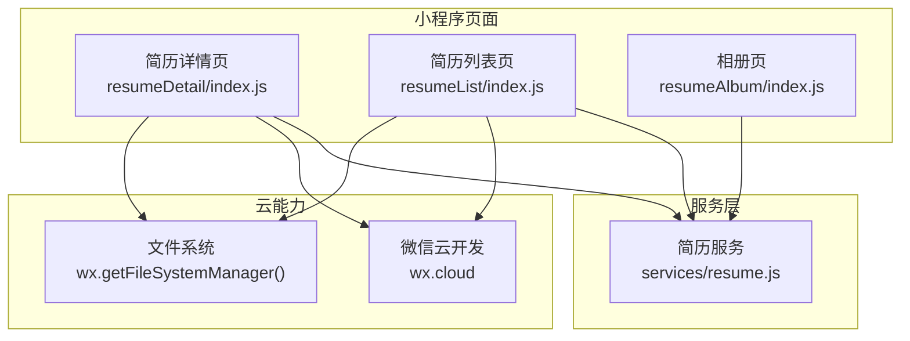
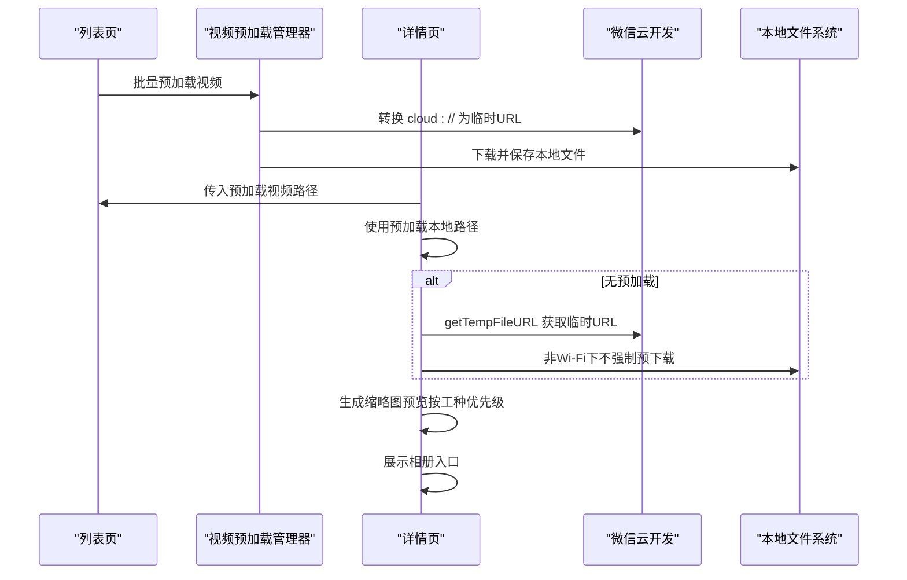
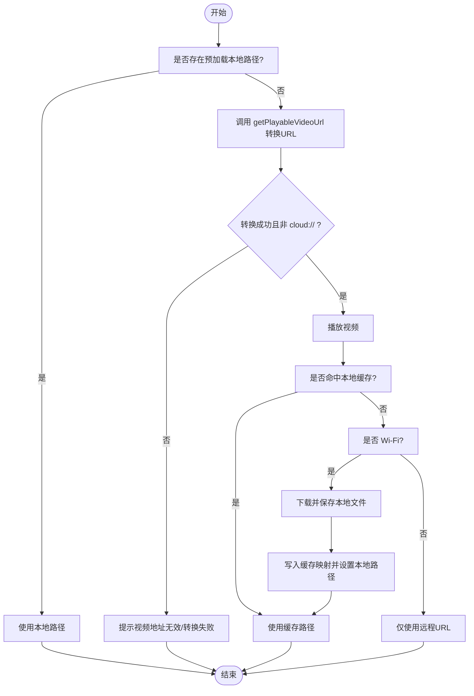
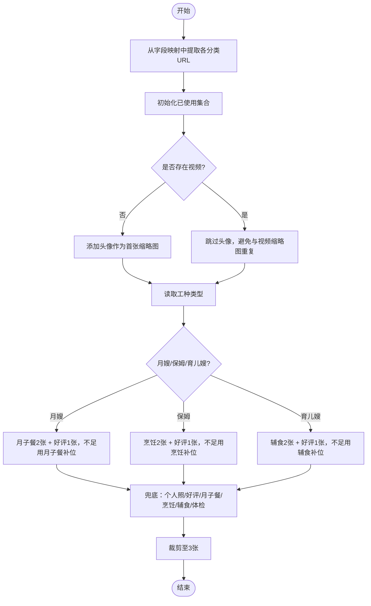
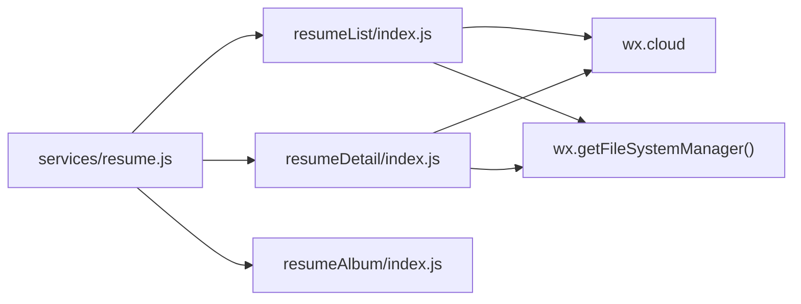

# 多媒体内容处理

<cite>
**本文引用的文件**
- [miniprogram/pages/resumeDetail/index.js](file://miniprogram/pages/resumeDetail/index.js)
- [miniprogram/pages/resumeAlbum/index.js](file://miniprogram/pages/resumeAlbum/index.js)
- [miniprogram/pages/resumeList/index.js](file://miniprogram/pages/resumeList/index.js)
- [miniprogram/services/resume.js](file://miniprogram/services/resume.js)
- [视频预加载优化方案.md](file://视频预加载优化方案.md)
</cite>

## 目录
1. [简介](#简介)
2. [项目结构](#项目结构)
3. [核心组件](#核心组件)
4. [架构总览](#架构总览)
5. [详细组件分析](#详细组件分析)
6. [依赖关系分析](#依赖关系分析)
7. [性能考量](#性能考量)
8. [故障排查指南](#故障排查指南)
9. [结论](#结论)
10. [附录](#附录)

## 简介
本文件聚焦于安得褓贝小程序简历详情页的多媒体内容处理，包括封面图、相册、视频等渲染与交互逻辑。重点说明：
- 视频播放控制、缩略图生成与预加载策略
- 前端如何处理 videoFileId 并转换为可播放的临时链接
- 使用 getPlayableVideoUrl 方法进行 URL 转换
- 视频缩略图使用头像图作为默认图的实现逻辑
- 相册图片的分类展示算法（按工种优先级展示月子餐/烹饪/辅食等）
- 性能优化建议（视频懒加载、图片预加载、本地缓存策略与非 Wi-Fi 网络下的预下载控制）

## 项目结构
多媒体相关内容主要分布在以下页面与服务：
- 简历详情页：负责视频 URL 转换、视频预加载、缩略图预览、相册入口
- 列表页：负责视频预加载管理器与批量预加载
- 相册页：负责相册分类与缩略图生成
- 服务层：封装简历相关 API 调用

图表来源
- [miniprogram/pages/resumeDetail/index.js](file://miniprogram/pages/resumeDetail/index.js#L897-L1019)
- [miniprogram/pages/resumeList/index.js](file://miniprogram/pages/resumeList/index.js#L37-L191)
- [miniprogram/pages/resumeAlbum/index.js](file://miniprogram/pages/resumeAlbum/index.js#L1-L174)
- [miniprogram/services/resume.js](file://miniprogram/services/resume.js)

章节来源
- [miniprogram/pages/resumeDetail/index.js](file://miniprogram/pages/resumeDetail/index.js#L1-L120)
- [miniprogram/pages/resumeList/index.js](file://miniprogram/pages/resumeList/index.js#L1-L120)
- [miniprogram/pages/resumeAlbum/index.js](file://miniprogram/pages/resumeAlbum/index.js#L1-L80)

## 核心组件
- 视频预加载管理器（列表页）：负责批量预加载、缓存管理、并发控制与 cloud:// 转换
- 简历详情页：负责视频 URL 转换、预加载视频路径注入、视频本地缓存、缩略图预览与相册入口
- 相册页：负责相册分类与缩略图生成
- 服务层：封装简历详情与列表 API

章节来源
- [miniprogram/pages/resumeList/index.js](file://miniprogram/pages/resumeList/index.js#L37-L191)
- [miniprogram/pages/resumeDetail/index.js](file://miniprogram/pages/resumeDetail/index.js#L897-L1019)
- [miniprogram/pages/resumeAlbum/index.js](file://miniprogram/pages/resumeAlbum/index.js#L1-L174)

## 架构总览
简历详情页的多媒体渲染流程如下：
- 列表页加载简历列表，提取视频 URL，调用预加载管理器进行批量预加载
- 详情页加载时，优先从列表页传递的预加载路径使用本地视频
- 若无预加载路径，则调用 getPlayableVideoUrl 将 cloud:// 或原始 URL 转换为可播放的临时链接
- 视频缩略图使用头像图作为默认图
- 相册图片按工种优先级挑选缩略图，支持查看全部相册

图表来源
- [miniprogram/pages/resumeList/index.js](file://miniprogram/pages/resumeList/index.js#L37-L191)
- [miniprogram/pages/resumeDetail/index.js](file://miniprogram/pages/resumeDetail/index.js#L897-L1019)
- [视频预加载优化方案.md](file://视频预加载优化方案.md#L1-L125)

## 详细组件分析

### 视频播放控制与 URL 转换
- videoFileId 处理逻辑
  - 详情页在加载时检测是否存在 videoFileId，若存在则尝试使用列表页传递的预加载本地路径
  - 若无预加载路径，则调用 getPlayableVideoUrl 将 cloud:// 或原始 URL 转换为可播放的临时链接
  - 对转换结果进行有效性校验，若仍为 cloud:// 或为空则提示失败
- getPlayableVideoUrl 方法
  - 若输入为 cloud://，通过 wx.cloud.getTempFileURL 获取临时链接
  - 否则直接返回原 URL
- 非 Wi-Fi 网络下的预下载控制
  - 详情页在 preloadVideo 中仅在 Wi-Fi 网络下执行预下载，避免在移动网络下占用流量
  - 预下载命中本地缓存后，直接使用本地路径，二次进入可秒开
- 本地缓存策略
  - 使用本地存储记录 URL 到本地文件路径的映射，超过最大缓存数量时采用 FIFO 清理旧缓存
  - 缓存失效时自动清理并回退到远程播放

图表来源
- [miniprogram/pages/resumeDetail/index.js](file://miniprogram/pages/resumeDetail/index.js#L454-L478)
- [miniprogram/pages/resumeDetail/index.js](file://miniprogram/pages/resumeDetail/index.js#L897-L919)
- [miniprogram/pages/resumeDetail/index.js](file://miniprogram/pages/resumeDetail/index.js#L921-L1019)

章节来源
- [miniprogram/pages/resumeDetail/index.js](file://miniprogram/pages/resumeDetail/index.js#L454-L478)
- [miniprogram/pages/resumeDetail/index.js](file://miniprogram/pages/resumeDetail/index.js#L897-L919)
- [miniprogram/pages/resumeDetail/index.js](file://miniprogram/pages/resumeDetail/index.js#L921-L1019)

### 视频缩略图与头像图默认策略
- 视频缩略图默认使用头像图（即个人照片第一张，若无则回退 coverFileId）
- 详情页在组装 detail 时，将 videoThumbSrc 设为头像图，避免与视频块重复
- 顶部缩略图预览算法在无视频时优先展示头像；有视频时避免与视频缩略图重复

章节来源
- [miniprogram/pages/resumeDetail/index.js](file://miniprogram/pages/resumeDetail/index.js#L443-L452)
- [miniprogram/pages/resumeDetail/index.js](file://miniprogram/pages/resumeDetail/index.js#L555-L570)

### 相册图片分类与缩略图预览算法
- 相册页
  - 支持两种数据来源：后端直接返回按分类组织的 albums，或按常见字段兜底拼装
  - 对图片进行去重与缩略图生成（根据域名自动拼接缩略图参数，支持腾讯云、阿里云、七牛等）
- 详情页缩略图预览算法（buildThumbPreview）
  - 从多个分类字段中提取图片：个人照、月子餐、烹饪、辅食、好评、体检、证书等
  - 依据工种优先级挑选缩略图：
    - 月嫂：优先月子餐（2张）+ 好评（1张），不足时用月子餐补位
    - 保姆：优先烹饪（2张）+ 好评（1张），不足时用烹饪补位
    - 育儿嫂：优先辅食（2张）+ 好评（1张），不足时用辅食补位
  - 兜底策略：个人照（除头像）、好评、月子餐/烹饪/辅食、体检
  - 结果固定为 3 张（不含视频块），避免与视频缩略图重复

图表来源
- [miniprogram/pages/resumeDetail/index.js](file://miniprogram/pages/resumeDetail/index.js#L480-L620)
- [miniprogram/pages/resumeAlbum/index.js](file://miniprogram/pages/resumeAlbum/index.js#L1-L174)

章节来源
- [miniprogram/pages/resumeDetail/index.js](file://miniprogram/pages/resumeDetail/index.js#L480-L620)
- [miniprogram/pages/resumeAlbum/index.js](file://miniprogram/pages/resumeAlbum/index.js#L1-L174)

### 列表页视频预加载管理器
- VideoPreloader 类
  - 负责单个视频预加载、批量预加载、缓存管理（Map + Set）、并发控制（Promise.allSettled）
  - 对 cloud:// URL 进行转换，下载成功后写入缓存并清理旧缓存（FIFO）
- 预加载策略
  - 列表加载完成后延迟触发批量预加载，限制并发数，避免网络拥塞
  - 将预加载后的本地路径写回简历数据，供详情页使用

章节来源
- [miniprogram/pages/resumeList/index.js](file://miniprogram/pages/resumeList/index.js#L37-L191)
- [视频预加载优化方案.md](file://视频预加载优化方案.md#L1-L125)

### 服务层与数据来源
- 简历详情 API：用于详情页与相册页获取简历数据
- 简历列表 API：用于列表页获取简历列表并提取视频 URL

章节来源
- [miniprogram/services/resume.js](file://miniprogram/services/resume.js)

## 依赖关系分析
- 列表页依赖 VideoPreloader 进行视频预加载，并将预加载结果写入简历数据
- 详情页依赖列表页传递的预加载路径，若无则自行转换与缓存
- 相册页依赖简历详情 API，支持两种数据来源：albums 或常见字段兜底
- 云能力依赖 wx.cloud 与 wx.getFileSystemManager

图表来源
- [miniprogram/pages/resumeDetail/index.js](file://miniprogram/pages/resumeDetail/index.js#L1-L120)
- [miniprogram/pages/resumeList/index.js](file://miniprogram/pages/resumeList/index.js#L1-L120)
- [miniprogram/pages/resumeAlbum/index.js](file://miniprogram/pages/resumeAlbum/index.js#L1-L80)
- [miniprogram/services/resume.js](file://miniprogram/services/resume.js)

章节来源
- [miniprogram/pages/resumeDetail/index.js](file://miniprogram/pages/resumeDetail/index.js#L1-L120)
- [miniprogram/pages/resumeList/index.js](file://miniprogram/pages/resumeList/index.js#L1-L120)
- [miniprogram/pages/resumeAlbum/index.js](file://miniprogram/pages/resumeAlbum/index.js#L1-L80)

## 性能考量
- 视频懒加载与预加载
  - 列表页批量预加载，限制并发，避免网络拥塞
  - 详情页优先使用预加载本地路径，秒开视频
- 非 Wi-Fi 网络下的预下载控制
  - 详情页仅在 Wi-Fi 下执行预下载，避免移动网络流量消耗
- 本地缓存策略
  - 使用本地存储记录 URL 到本地文件路径映射，超过最大缓存数量时 FIFO 清理
- 图片缩略图生成
  - 相册页对图片自动拼接缩略图参数，支持主流云厂商，降低传输体积

章节来源
- [miniprogram/pages/resumeList/index.js](file://miniprogram/pages/resumeList/index.js#L118-L191)
- [miniprogram/pages/resumeDetail/index.js](file://miniprogram/pages/resumeDetail/index.js#L921-L1019)
- [miniprogram/pages/resumeAlbum/index.js](file://miniprogram/pages/resumeAlbum/index.js#L1-L80)
- [视频预加载优化方案.md](file://视频预加载优化方案.md#L1-L125)

## 故障排查指南
- 视频地址无效/转换失败
  - 现象：getPlayableVideoUrl 返回空或仍为 cloud://
  - 处理：检查后端返回的 videoFileId 是否正确；确认云存储临时链接获取是否成功
- 预加载失败回退
  - 现象：预加载失败或非 Wi-Fi 网络下不预下载
  - 处理：详情页会回退到远程播放；可在 Wi-Fi 环境重试
- 缓存失效
  - 现象：本地缓存路径存在但文件不存在
  - 处理：详情页会清理失效缓存并重新下载
- 相册分类不全
  - 现象：相册缺少某些分类
  - 处理：确认后端是否返回 albums；若无则使用常见字段兜底

章节来源
- [miniprogram/pages/resumeDetail/index.js](file://miniprogram/pages/resumeDetail/index.js#L897-L919)
- [miniprogram/pages/resumeDetail/index.js](file://miniprogram/pages/resumeDetail/index.js#L921-L1019)
- [miniprogram/pages/resumeAlbum/index.js](file://miniprogram/pages/resumeAlbum/index.js#L96-L149)

## 结论
本方案通过“列表页预加载 + 详情页缓存 + 工种优先级缩略图”的组合，实现了简历详情页多媒体内容的高效渲染与良好体验。视频 URL 转换与本地缓存策略确保了在不同网络环境下的稳定性；相册分类与缩略图算法提升了信息密度与可读性。建议持续监控缓存命中率与预加载成功率，结合业务反馈迭代优化。

## 附录
- 关键实现位置参考
  - 视频 URL 转换：[getPlayableVideoUrl](file://miniprogram/pages/resumeDetail/index.js#L897-L919)
  - 详情页预加载与缓存：[preloadVideo](file://miniprogram/pages/resumeDetail/index.js#L921-L1019)
  - 列表页预加载管理器：[VideoPreloader](file://miniprogram/pages/resumeList/index.js#L37-L191)
  - 详情页缩略图预览算法：[buildThumbPreview](file://miniprogram/pages/resumeDetail/index.js#L555-L620)
  - 相册页缩略图生成：[toThumbUrl](file://miniprogram/pages/resumeAlbum/index.js#L29-L62)