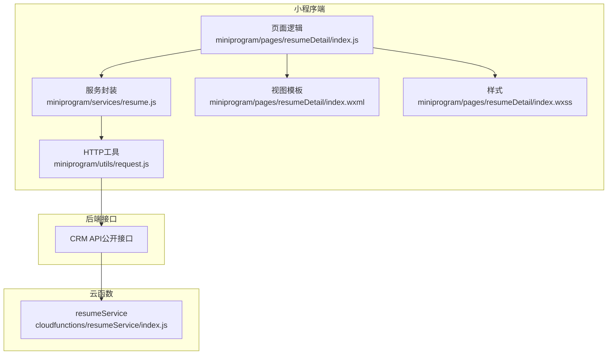
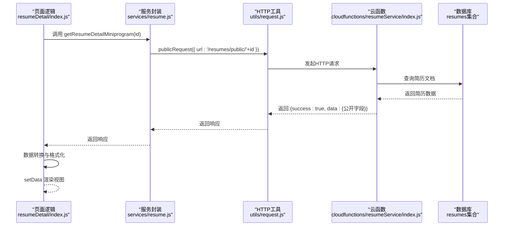
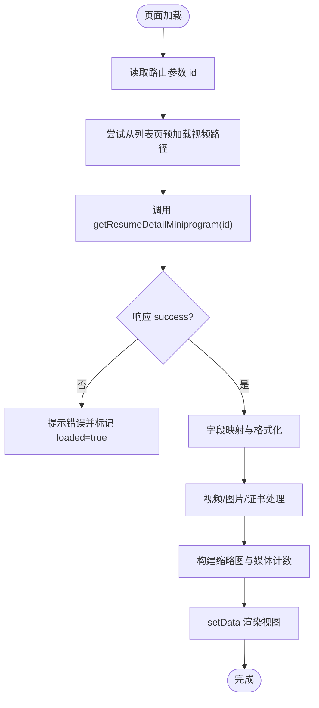
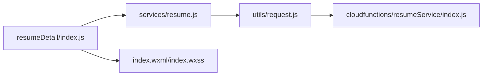

# 核心信息展示

<cite>
**本文引用的文件**
- [index.js](file://miniprogram/pages/resumeDetail/index.js)
- [resume.js](file://miniprogram/services/resume.js)
- [request.js](file://miniprogram/utils/request.js)
- [index.js](file://cloudfunctions/resumeService/index.js)
- [index.wxml](file://miniprogram/pages/resumeDetail/index.wxml)
- [index.wxss](file://miniprogram/pages/resumeDetail/index.wxss)
- [index.json](file://miniprogram/pages/resumeDetail/index.json)
- [PRD.md](file://PRD.md)
- [API完整文档.md](file://API完整文档.md)
</cite>

## 目录
1. [简介](#简介)
2. [项目结构](#项目结构)
3. [核心组件](#核心组件)
4. [架构总览](#架构总览)
5. [详细组件分析](#详细组件分析)
6. [依赖关系分析](#依赖关系分析)
7. [性能考虑](#性能考虑)
8. [故障排查指南](#故障排查指南)
9. [结论](#结论)
10. [附录](#附录)

## 简介
本章节聚焦于“安得褓贝”小程序简历详情页的核心信息展示，围绕前端如何通过服务层调用云函数 detail 接口获取数据，并对返回的简历对象进行字段映射与格式化，完成年龄、经验、价格、标签、自我介绍等核心字段的呈现，以及籍贯、星座、属相、学历等扩展信息的格式化处理。同时说明仅 published 状态的简历对 C 端用户可见的业务规则，并给出性能优化建议（数据缓存策略与字段懒加载思路）。

## 项目结构
简历详情页位于 miniprogram/pages/resumeDetail，主要由页面逻辑、WXML 视图、WXSS 样式、服务封装与云函数实现组成。页面逻辑负责发起请求、数据转换、格式化与 UI 渲染；服务层封装公共请求方法；云函数负责数据库查询与字段裁剪；WXML/WXSS 负责最终展示。

图表来源
- [index.js](file://miniprogram/pages/resumeDetail/index.js#L1-L120)
- [resume.js](file://miniprogram/services/resume.js#L73-L100)
- [request.js](file://miniprogram/utils/request.js#L1-L125)
- [index.js](file://cloudfunctions/resumeService/index.js#L180-L216)
- [index.wxml](file://miniprogram/pages/resumeDetail/index.wxml#L1-L120)

章节来源
- [index.js](file://miniprogram/pages/resumeDetail/index.js#L1-L120)
- [resume.js](file://miniprogram/services/resume.js#L73-L100)
- [request.js](file://miniprogram/utils/request.js#L1-L125)
- [index.js](file://cloudfunctions/resumeService/index.js#L180-L216)
- [index.wxml](file://miniprogram/pages/resumeDetail/index.wxml#L1-L120)
- [index.wxss](file://miniprogram/pages/resumeDetail/index.wxss#L1-L120)
- [index.json](file://miniprogram/pages/resumeDetail/index.json#L1-L4)

## 核心组件
- 页面逻辑（简历详情页）：负责发起请求、数据转换、格式化、媒体资源处理、UI 状态管理与交互事件。
- 服务封装（resume.js）：封装公开请求方法，暴露 getResumeDetailMiniprogram 供页面调用。
- HTTP 工具（request.js）：统一封装 publicRequest/authenticatedRequest，处理头部、鉴权与错误。
- 云函数（resumeService）：实现 detail 动作，查询数据库并裁剪返回字段，确保仅返回公开字段。
- 视图与样式（index.wxml/index.wxss）：承载头部视频/图片、基本信息行、证书票券、自我介绍、工作经历等模块。

章节来源
- [index.js](file://miniprogram/pages/resumeDetail/index.js#L1-L120)
- [resume.js](file://miniprogram/services/resume.js#L73-L100)
- [request.js](file://miniprogram/utils/request.js#L1-L125)
- [index.js](file://cloudfunctions/resumeService/index.js#L58-L76)
- [index.wxml](file://miniprogram/pages/resumeDetail/index.wxml#L1-L120)
- [index.wxss](file://miniprogram/pages/resumeDetail/index.wxss#L1-L120)

## 架构总览
前端通过 resumeService.getResumeDetailMiniprogram 调用 CRM 公开接口，云函数 resumeService.detail 从数据库读取简历并裁剪为公开字段，返回给前端。前端在页面逻辑中进行字段映射与格式化，再渲染到 WXML。

图表来源
- [index.js](file://miniprogram/pages/resumeDetail/index.js#L202-L239)
- [resume.js](file://miniprogram/services/resume.js#L92-L99)
- [request.js](file://miniprogram/utils/request.js#L12-L41)
- [index.js](file://cloudfunctions/resumeService/index.js#L108-L120)

章节来源
- [index.js](file://miniprogram/pages/resumeDetail/index.js#L202-L239)
- [resume.js](file://miniprogram/services/resume.js#L92-L99)
- [request.js](file://miniprogram/utils/request.js#L12-L41)
- [index.js](file://cloudfunctions/resumeService/index.js#L108-L120)

## 详细组件分析

### 前端调用链与数据流转
- 页面入口：onLoad 读取路由参数 id，尝试从上一页列表页预加载视频路径，随后调用 loadDetail。
- 请求流程：loadDetail 内部调用 resumeService.getResumeDetailMiniprogram(id)，得到 CRM 公开接口响应。
- 数据转换：将 CRM 返回的 data 对象映射为页面 detail 字段，兼容多后端字段差异，统一输出字段名与格式。
- 渲染：setData 设置 detail、缩略图、证书票券、媒体计数等，驱动 WXML 渲染。

图表来源
- [index.js](file://miniprogram/pages/resumeDetail/index.js#L166-L239)
- [index.js](file://miniprogram/pages/resumeDetail/index.js#L239-L480)
- [index.js](file://miniprogram/pages/resumeDetail/index.js#L480-L682)

章节来源
- [index.js](file://miniprogram/pages/resumeDetail/index.js#L166-L239)
- [index.js](file://miniprogram/pages/resumeDetail/index.js#L239-L480)
- [index.js](file://miniprogram/pages/resumeDetail/index.js#L480-L682)

### 字段映射与格式化（核心字段）
- 年龄：直接取 age 字段，页面渲染时拼接“岁”。
- 经验：直接取 experienceYears 字段，页面渲染时拼接“年经验”。
- 价格/月薪：映射为 expectedSalary/priceMonth，页面渲染时展示。
- 标签/技能：skills 数组映射为 skillsText/tags，使用 SKILLS_MAP 字典转换。
- 自我介绍：selfIntroduction/intro 字段直接展示。
- 性别：gender 映射为“男/女”。

章节来源
- [index.js](file://miniprogram/pages/resumeDetail/index.js#L255-L362)
- [index.js](file://miniprogram/pages/resumeDetail/index.js#L281-L283)

### 字段映射与格式化（扩展信息）
- 属相：normalizeZodiac 支持“属XX”、“rat/tiger”等输入，统一输出“属XX”。
- 星座：normalizeConstellation 支持英文/中文/带“座”，统一输出“XX座”。
- 籍贯：formatNativePlace 截取到省/市/自治区/特别行政区范围，优先保留“市”。
- 民族：nationText 去空白，兜底“—”。
- 学历：EDUCATION_MAP 字典映射。
- 基本信息行：将 zodiacText、ageText、constellationText、nativePlaceText、nationText、educationText 组合为 basicInfoItems。

章节来源
- [index.js](file://miniprogram/pages/resumeDetail/index.js#L364-L441)
- [index.js](file://miniprogram/pages/resumeDetail/index.js#L434-L441)

### 字典与常量
- JOB_TYPE_MAP：工种中文映射。
- EDUCATION_MAP：学历中文映射。
- MATERNITY_LEVEL_MAP：月嫂等级中文映射。
- ORDER_STATUS_MAP：接单状态中文映射。
- DISTRICT_MAP：区域拼音到中文映射。
- SKILLS_MAP：技能代码到中文映射。

章节来源
- [index.js](file://miniprogram/pages/resumeDetail/index.js#L8-L91)

### 媒体资源与缩略图策略
- 视频：优先使用列表页预加载的本地路径；否则通过 getPlayableVideoUrl 将 cloud:// 转换为临时 URL；支持本地缓存策略（见性能章节）。
- 图片：personalPhoto/photos 作为主图集；certificates/reports 作为证书/体检等图片；视频缩略图使用头像图。
- 缩略图：根据工种（月嫂/保姆/育儿嫂）优先选择对应类别图片，避免与视频缩略图重复，固定展示 3 张，兜底补齐。

章节来源
- [index.js](file://miniprogram/pages/resumeDetail/index.js#L454-L620)
- [index.js](file://miniprogram/pages/resumeDetail/index.js#L620-L682)

### 证书票券展示
- 优先使用 certificates 数组生成票券卡片，文本来自 SKILLS_MAP；若 skills 更多，则补充无图片的票券。
- 支持点击预览证书图片，合并 detail 与票券中的证书 URL。

章节来源
- [index.js](file://miniprogram/pages/resumeDetail/index.js#L640-L668)
- [index.js](file://miniprogram/pages/resumeDetail/index.js#L745-L790)

### 视频播放与错误处理
- 视频组件默认不自动播放，等待用户点击中心播放按钮后才播放。
- 提供静音切换、缓冲状态、错误提示与常见问题提示。
- getPlayableVideoUrl 将 cloud:// fileID 转换为临时 URL；preloadVideo 在 Wi-Fi 下命中缓存或下载成本地文件，二次打开秒开。

章节来源
- [index.js](file://miniprogram/pages/resumeDetail/index.js#L809-L919)
- [index.js](file://miniprogram/pages/resumeDetail/index.js#L921-L1020)

### 视图渲染要点
- 顶部视频/图片区域：heroMediaType 控制视频/图片切换；center play button 与 mute 控件。
- 信息卡片：头像、姓名、工种、经验、好评数、基本信息行。
- 证书区域：横向滚动展示票券卡片。
- 自我介绍与工作经历：分节展示，支持工作照片预览与客户评价。

章节来源
- [index.wxml](file://miniprogram/pages/resumeDetail/index.wxml#L1-L120)
- [index.wxml](file://miniprogram/pages/resumeDetail/index.wxml#L120-L220)
- [index.wxml](file://miniprogram/pages/resumeDetail/index.wxml#L220-L303)
- [index.wxss](file://miniprogram/pages/resumeDetail/index.wxss#L1-L120)
- [index.wxss](file://miniprogram/pages/resumeDetail/index.wxss#L310-L520)

## 依赖关系分析
- 页面逻辑依赖服务封装与 HTTP 工具，服务封装依赖 HTTP 工具。
- 服务封装调用 CRM 公开接口，云函数实现 detail 动作，查询数据库并裁剪公开字段。
- 视图依赖页面逻辑的数据绑定与事件处理。

图表来源
- [index.js](file://miniprogram/pages/resumeDetail/index.js#L1-L120)
- [resume.js](file://miniprogram/services/resume.js#L73-L100)
- [request.js](file://miniprogram/utils/request.js#L1-L125)
- [index.js](file://cloudfunctions/resumeService/index.js#L180-L216)
- [index.wxml](file://miniprogram/pages/resumeDetail/index.wxml#L1-L120)
- [index.wxss](file://miniprogram/pages/resumeDetail/index.wxss#L1-L120)

章节来源
- [index.js](file://miniprogram/pages/resumeDetail/index.js#L1-L120)
- [resume.js](file://miniprogram/services/resume.js#L73-L100)
- [request.js](file://miniprogram/utils/request.js#L1-L125)
- [index.js](file://cloudfunctions/resumeService/index.js#L180-L216)
- [index.wxml](file://miniprogram/pages/resumeDetail/index.wxml#L1-L120)
- [index.wxss](file://miniprogram/pages/resumeDetail/index.wxss#L1-L120)

## 性能考虑
- 数据缓存策略
  - 云函数返回的视频 fileID 需要转换为临时 URL 才能在 <video> 播放。页面逻辑提供本地缓存策略：在 Wi-Fi 下命中缓存或下载成本地文件，二次打开秒开。
  - 缓存键与上限：使用固定键名与最大数量限制，超过上限按 FIFO 清理旧缓存。
- 字段懒加载
  - 仅在需要时处理与渲染：如工作经历照片、证书图片等，采用横向滚动与按需预览，减少首屏压力。
  - 媒体计数与缩略图：先计算媒体总量与固定缩略图，避免重复遍历。
- 网络与错误处理
  - 视频播放失败时提供明确提示与常见原因指引，避免用户长时间等待。
  - 列表页预加载视频路径，详情页优先使用本地路径，降低二次加载耗时。

章节来源
- [index.js](file://miniprogram/pages/resumeDetail/index.js#L921-L1020)
- [index.js](file://miniprogram/pages/resumeDetail/index.js#L879-L919)
- [index.js](file://miniprogram/pages/resumeDetail/index.js#L480-L682)

## 故障排查指南
- 简历不可见
  - 仅 status=published 的简历对 C 端可见。详情页调用的是公开接口，云函数 detail 返回公开字段，列表页同样受此约束。
- 视频无法播放
  - 检查 fileID 是否已转换为临时 URL；确认网络类型与格式兼容性；查看错误回调与常见原因提示。
- 字段显示异常
  - 星座/属相/籍贯/学历等字段存在多种后端字段名，页面逻辑已做兼容映射；若仍异常，检查后端返回字段与字典映射。
- 证书预览为空
  - 确认 certificates 与 skills 是否存在；点击票券时合并 detail 与票券 URL，确保去重与顺序正确。

章节来源
- [PRD.md](file://PRD.md#L313-L325)
- [index.js](file://cloudfunctions/resumeService/index.js#L108-L120)
- [index.js](file://miniprogram/pages/resumeDetail/index.js#L879-L919)
- [index.js](file://miniprogram/pages/resumeDetail/index.js#L640-L668)

## 结论
简历详情页通过服务层与云函数实现了清晰的职责分离：前端负责数据转换与渲染，云函数负责数据安全与字段裁剪。页面逻辑对核心字段与扩展字段进行了完善的映射与格式化，并结合媒体资源处理与缓存策略，提升了用户体验。业务规则方面，仅 published 状态的简历对 C 端可见，保障了内容合规性。

## 附录
- API 调用路径参考
  - 页面逻辑调用：resumeService.getResumeDetailMiniprogram(id)
  - 服务封装实现：publicRequest('/resumes/public/' + id)
  - 云函数动作：detail -> pickPublicFields
- 字典与常量定义位置
  - JOB_TYPE_MAP、EDUCATION_MAP、MATERNITY_LEVEL_MAP、ORDER_STATUS_MAP、DISTRICT_MAP、SKILLS_MAP
- 视图与样式
  - index.wxml 与 index.wxss 负责最终渲染与交互

章节来源
- [resume.js](file://miniprogram/services/resume.js#L92-L99)
- [request.js](file://miniprogram/utils/request.js#L12-L41)
- [index.js](file://cloudfunctions/resumeService/index.js#L58-L76)
- [index.js](file://miniprogram/pages/resumeDetail/index.js#L8-L91)
- [index.wxml](file://miniprogram/pages/resumeDetail/index.wxml#L1-L120)
- [index.wxss](file://miniprogram/pages/resumeDetail/index.wxss#L1-L120)