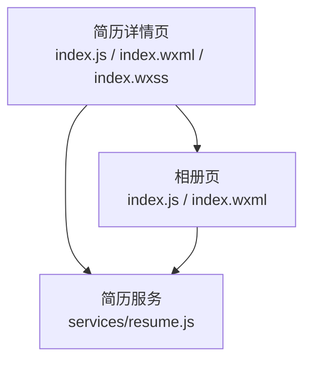
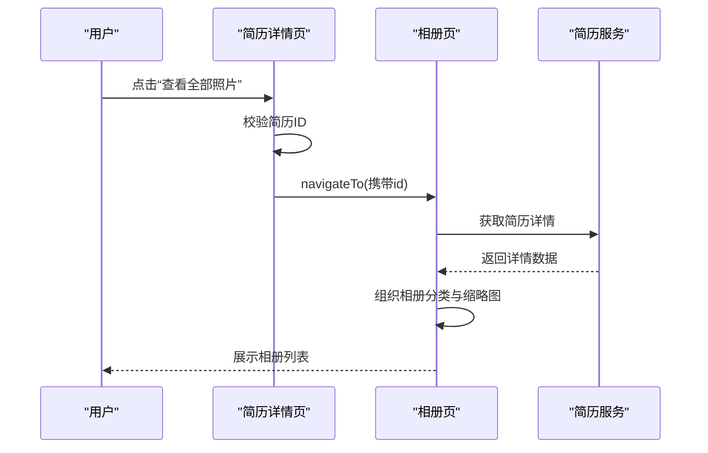
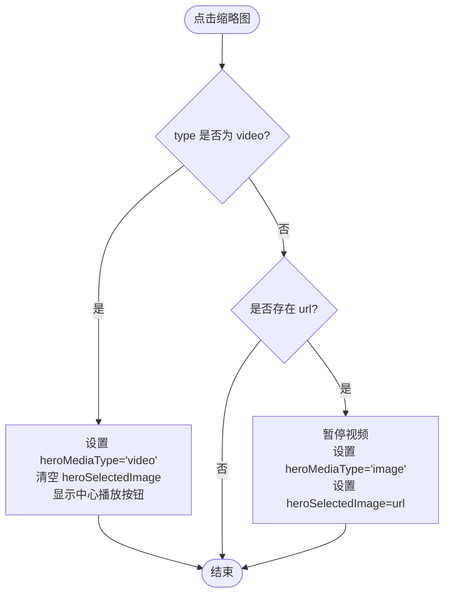
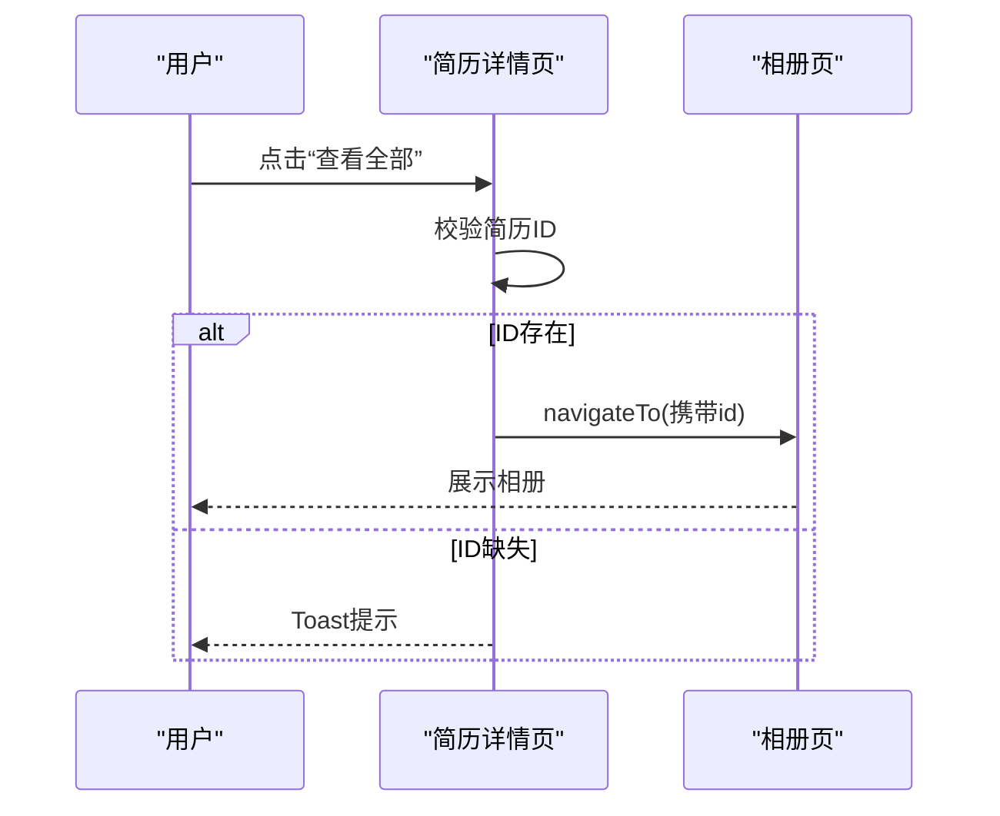
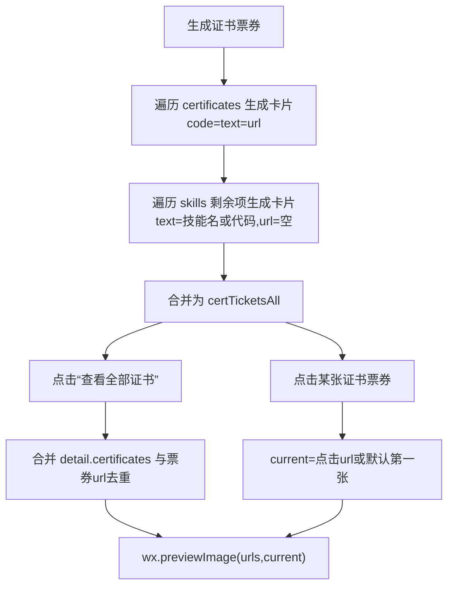
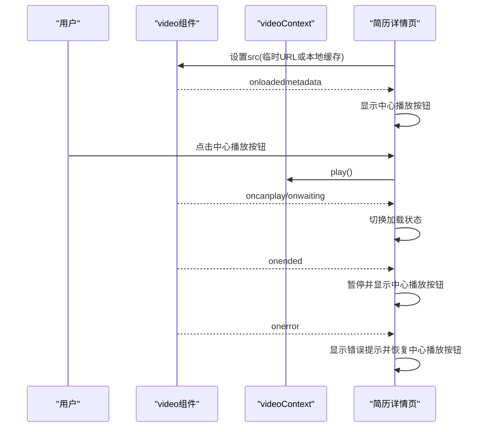
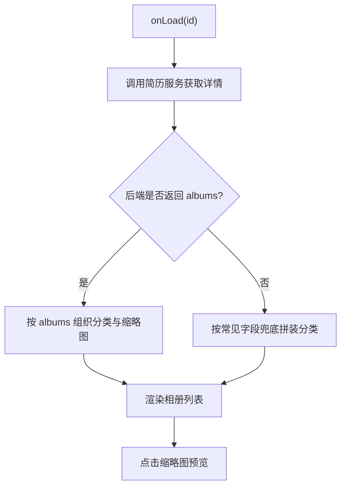

# 用户交互与导航

<cite>
**本文引用的文件**
- [miniprogram/pages/resumeDetail/index.js](file://miniprogram/pages/resumeDetail/index.js)
- [miniprogram/pages/resumeDetail/index.json](file://miniprogram/pages/resumeDetail/index.json)
- [miniprogram/pages/resumeDetail/index.wxml](file://miniprogram/pages/resumeDetail/index.wxml)
- [miniprogram/pages/resumeDetail/index.wxss](file://miniprogram/pages/resumeDetail/index.wxss)
- [miniprogram/pages/resumeAlbum/index.js](file://miniprogram/pages/resumeAlbum/index.js)
- [miniprogram/pages/resumeAlbum/index.json](file://miniprogram/pages/resumeAlbum/index.json)
- [miniprogram/pages/resumeAlbum/index.wxml](file://miniprogram/pages/resumeAlbum/index.wxml)
- [miniprogram/services/resume.js](file://miniprogram/services/resume.js)
</cite>

## 目录
1. [简介](#简介)
2. [项目结构](#项目结构)
3. [核心组件](#核心组件)
4. [架构总览](#架构总览)
5. [详细组件分析](#详细组件分析)
6. [依赖关系分析](#依赖关系分析)
7. [性能考量](#性能考量)
8. [故障排查指南](#故障排查指南)
9. [结论](#结论)

## 简介
本文件聚焦于简历详情页的用户交互与导航功能，围绕以下目标展开：
- 通过顶部缩略图在主媒体区（视频/图片）之间切换，并说明 onTapHeroThumb 如何基于 type 和 url 参数更新 heroMediaType 与 heroSelectedImage。
- 解释“查看全部照片”如何通过 onTapViewAllPhotos 跳转至相册页并携带简历ID。
- 描述证书票券（certTickets）的交互逻辑：点击票券预览对应证书图片；合并 certificates 与 skills 生成完整票券列表。
- 提供用户体验优化建议：触控反馈、加载状态提示、手势支持等。

## 项目结构
简历详情页与相册页位于 miniprogram/pages 下，分别负责：
- 简历详情页：展示主媒体区（视频/图片）、缩略图导航、证书票券、工作经历等。
- 相册页：按分类展示简历照片集合，支持预览。

图表来源
- [miniprogram/pages/resumeDetail/index.js](file://miniprogram/pages/resumeDetail/index.js#L1-L120)
- [miniprogram/pages/resumeDetail/index.wxml](file://miniprogram/pages/resumeDetail/index.wxml#L1-L125)
- [miniprogram/pages/resumeAlbum/index.js](file://miniprogram/pages/resumeAlbum/index.js#L1-L120)
- [miniprogram/services/resume.js](file://miniprogram/services/resume.js#L1-L120)

章节来源
- [miniprogram/pages/resumeDetail/index.json](file://miniprogram/pages/resumeDetail/index.json#L1-L4)
- [miniprogram/pages/resumeAlbum/index.json](file://miniprogram/pages/resumeAlbum/index.json#L1-L9)

## 核心组件
- 主媒体区与缩略图导航：由简历详情页的 wxml 控制布局，js 处理状态与事件。
- 证书票券：由 certificates 与 skills 合并生成，支持点击预览。
- 相册页：按分类聚合照片，支持预览与下拉刷新。

章节来源
- [miniprogram/pages/resumeDetail/index.wxml](file://miniprogram/pages/resumeDetail/index.wxml#L1-L125)
- [miniprogram/pages/resumeDetail/index.js](file://miniprogram/pages/resumeDetail/index.js#L639-L708)
- [miniprogram/pages/resumeAlbum/index.js](file://miniprogram/pages/resumeAlbum/index.js#L90-L154)

## 架构总览
简历详情页与相册页通过“简历ID”串联，详情页负责导航入口，相册页负责照片集合展示。

图表来源
- [miniprogram/pages/resumeDetail/index.js](file://miniprogram/pages/resumeDetail/index.js#L732-L743)
- [miniprogram/pages/resumeAlbum/index.js](file://miniprogram/pages/resumeAlbum/index.js#L90-L154)
- [miniprogram/services/resume.js](file://miniprogram/services/resume.js#L87-L112)

## 详细组件分析

### 顶部缩略图与主媒体区切换
- 顶部缩略图展示策略：根据工种类型（如月嫂、保姆、育儿嫂）优先选择对应类别照片，避免与视频缩略图重复；不足3张时进行兜底补充。
- 切换逻辑：点击缩略图项时，通过 data-type 与 data-url 传入事件处理器，onTapHeroThumb 根据 type 切换 heroMediaType：
  - type 为 video：切换到视频模式，清空 heroSelectedImage，并显示中心播放按钮。
  - type 为 image 且 url 存在：切换到图片模式，暂停视频并设置 heroSelectedImage。
- 主媒体区渲染：当 heroMediaType 为 video 时渲染 video 组件；否则渲染 image 组件。

图表来源
- [miniprogram/pages/resumeDetail/index.wxml](file://miniprogram/pages/resumeDetail/index.wxml#L85-L123)
- [miniprogram/pages/resumeDetail/index.js](file://miniprogram/pages/resumeDetail/index.js#L710-L730)

章节来源
- [miniprogram/pages/resumeDetail/index.wxml](file://miniprogram/pages/resumeDetail/index.wxml#L1-L125)
- [miniprogram/pages/resumeDetail/index.js](file://miniprogram/pages/resumeDetail/index.js#L480-L708)

### “查看全部照片”导航
- 点击“查看全部”按钮后，onTapViewAllPhotos 读取简历ID并跳转至相册页。
- 若简历ID缺失，弹出提示并终止跳转。

图表来源
- [miniprogram/pages/resumeDetail/index.js](file://miniprogram/pages/resumeDetail/index.js#L732-L743)
- [miniprogram/pages/resumeAlbum/index.js](file://miniprogram/pages/resumeAlbum/index.js#L90-L104)

章节来源
- [miniprogram/pages/resumeDetail/index.js](file://miniprogram/pages/resumeDetail/index.js#L732-L743)
- [miniprogram/pages/resumeAlbum/index.js](file://miniprogram/pages/resumeAlbum/index.js#L90-L104)

### 证书票券交互与合并逻辑
- 数据来源：
  - certificates：证书图片数组
  - skills：技能代码数组
- 合并策略：
  - 优先以 certificates 生成票券卡片，text 使用对应技能名称（若存在），url 对应证书图片。
  - 若 skills 数量超过 certificates，则为剩余技能创建“仅有文本”的卡片（url 留空）。
- 交互方式：
  - 点击“查看全部证书”：合并 detail.certificates 与票券中的 url，去重后预览。
  - 点击某张证书票券：以当前点击的 url 作为当前预览项，若无则默认第一张。

图表来源
- [miniprogram/pages/resumeDetail/index.js](file://miniprogram/pages/resumeDetail/index.js#L640-L668)
- [miniprogram/pages/resumeDetail/index.js](file://miniprogram/pages/resumeDetail/index.js#L745-L790)

章节来源
- [miniprogram/pages/resumeDetail/index.js](file://miniprogram/pages/resumeDetail/index.js#L640-L668)
- [miniprogram/pages/resumeDetail/index.js](file://miniprogram/pages/resumeDetail/index.js#L745-L790)

### 视频播放与手势支持
- 视频组件配置：
  - 禁用内置控件与中心播放按钮，采用自定义“中心播放按钮”与“静音/开声”按钮。
  - 启用“播放手势”，禁用“进度手势”，减少误触。
- 交互流程：
  - 视频元数据加载完成后显示中心播放按钮，等待用户点击后再播放。
  - 用户点击播放按钮后创建 videoContext 并执行 play。
  - 缓冲中显示加载提示，可播放时关闭加载提示。
  - 播放结束自动暂停并恢复中心播放按钮。
  - 错误时提示并恢复中心播放按钮。
- 视频地址处理：
  - 对云存储 fileID 自动转换为临时链接，确保可在 video 组件中播放。
  - 首次进入时尝试预下载（仅 Wi-Fi 且命中缓存时），提升二次打开速度。

图表来源
- [miniprogram/pages/resumeDetail/index.wxml](file://miniprogram/pages/resumeDetail/index.wxml#L1-L31)
- [miniprogram/pages/resumeDetail/index.js](file://miniprogram/pages/resumeDetail/index.js#L828-L906)
- [miniprogram/pages/resumeDetail/index.js](file://miniprogram/pages/resumeDetail/index.js#L921-L1019)

章节来源
- [miniprogram/pages/resumeDetail/index.wxml](file://miniprogram/pages/resumeDetail/index.wxml#L1-L31)
- [miniprogram/pages/resumeDetail/index.js](file://miniprogram/pages/resumeDetail/index.js#L828-L906)
- [miniprogram/pages/resumeDetail/index.js](file://miniprogram/pages/resumeDetail/index.js#L921-L1019)

### 相册页数据组织与预览
- 数据来源：优先使用后端返回的 albums；若无则按常见字段兜底拼装分类。
- 隐藏策略：相册页默认隐藏“证书”分类标题。
- 预览：点击任意缩略图，使用 wx.previewImage 展示当前分组的所有图片。

图表来源
- [miniprogram/pages/resumeAlbum/index.js](file://miniprogram/pages/resumeAlbum/index.js#L96-L154)
- [miniprogram/pages/resumeAlbum/index.wxml](file://miniprogram/pages/resumeAlbum/index.wxml#L1-L35)

章节来源
- [miniprogram/pages/resumeAlbum/index.js](file://miniprogram/pages/resumeAlbum/index.js#L96-L154)
- [miniprogram/pages/resumeAlbum/index.wxml](file://miniprogram/pages/resumeAlbum/index.wxml#L1-L35)

## 依赖关系分析
- 简历详情页依赖简历服务获取详情数据，并在本地进行字段归一化与缩略图构建。
- 相册页同样依赖简历服务，但侧重于相册数据的分类与缩略图生成。
- 两者均通过简历ID进行数据关联。

图表来源
- [miniprogram/pages/resumeDetail/index.js](file://miniprogram/pages/resumeDetail/index.js#L1-L20)
- [miniprogram/pages/resumeAlbum/index.js](file://miniprogram/pages/resumeAlbum/index.js#L1-L10)
- [miniprogram/services/resume.js](file://miniprogram/services/resume.js#L87-L112)

章节来源
- [miniprogram/pages/resumeDetail/index.js](file://miniprogram/pages/resumeDetail/index.js#L1-L20)
- [miniprogram/pages/resumeAlbum/index.js](file://miniprogram/pages/resumeAlbum/index.js#L1-L10)
- [miniprogram/services/resume.js](file://miniprogram/services/resume.js#L87-L112)

## 性能考量
- 视频预加载策略：仅在 Wi-Fi 且命中缓存时进行本地缓存，避免在移动网络下拖慢首屏；二次进入可直接使用本地路径。
- 缩略图生成：按工种优先选择代表性照片，减少冗余，提升首屏展示效率。
- 相册缩略图：对常见云存储域名进行缩略图处理，兼顾清晰度与加载速度。

章节来源
- [miniprogram/pages/resumeDetail/index.js](file://miniprogram/pages/resumeDetail/index.js#L921-L1019)
- [miniprogram/pages/resumeAlbum/index.js](file://miniprogram/pages/resumeAlbum/index.js#L1-L82)

## 故障排查指南
- 视频播放失败：
  - 检查视频地址是否为 cloud:// 且未转换为临时链接。
  - 检查视频编码与格式是否兼容（建议 mp4/H.264）。
  - 检查下载域名与 Range 支持。
- 缩略图重复或缺失：
  - 确认视频缩略图与个人照第一张不重复。
  - 确认工种类型映射正确，兜底分类齐全。
- 证书预览为空：
  - 确认 certificates 与 skills 是否存在有效数据。
  - 确认合并后的 urls 是否去重且非空。

章节来源
- [miniprogram/pages/resumeDetail/index.js](file://miniprogram/pages/resumeDetail/index.js#L879-L895)
- [miniprogram/pages/resumeDetail/index.js](file://miniprogram/pages/resumeDetail/index.js#L640-L668)
- [miniprogram/pages/resumeDetail/index.js](file://miniprogram/pages/resumeDetail/index.js#L745-L790)

## 结论
本页通过“缩略图导航 + 证书票券 + 相册页跳转”的组合，实现了简历详情页的高效浏览体验。关键点在于：
- 以工种为导向的缩略图策略，保证主媒体区内容与用户关注点一致。
- 证书票券与技能的合并展示，增强可信度与信息密度。
- 相册页的分类与预览能力，满足用户对照片的深入探索需求。
- 视频播放的延迟策略与手势配置，平衡了性能与交互体验。