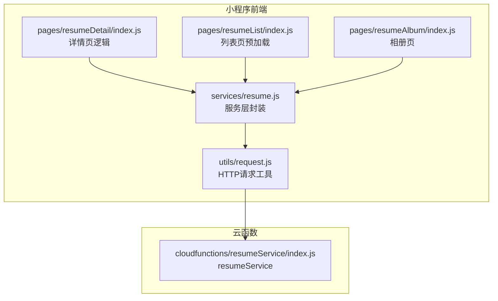
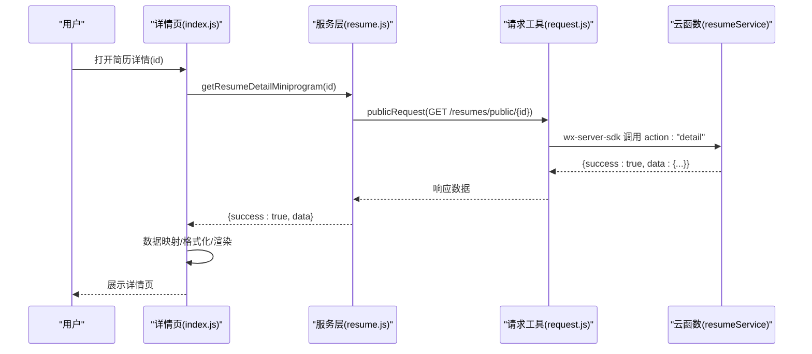
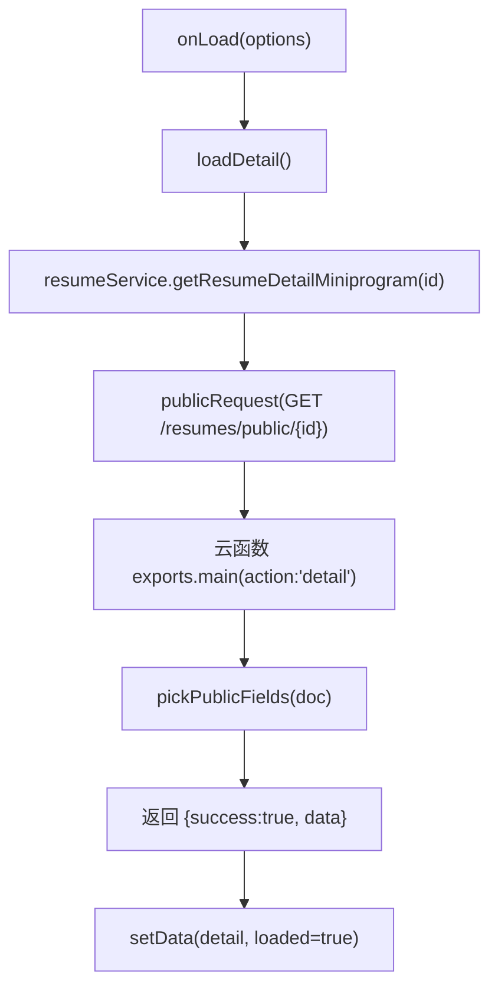
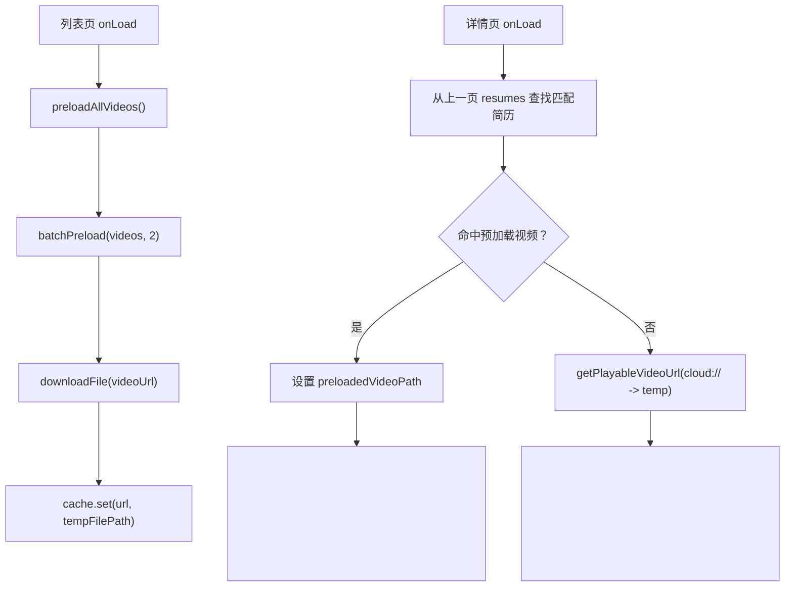
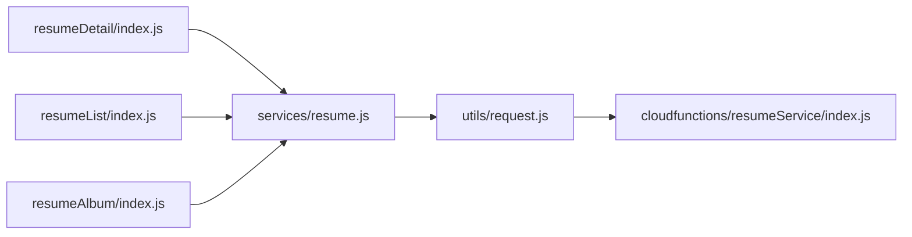

# 简历详情

<cite>
**本文引用的文件**
- [miniprogram/pages/resumeDetail/index.js](file://miniprogram/pages/resumeDetail/index.js)
- [miniprogram/pages/resumeDetail/index.wxml](file://miniprogram/pages/resumeDetail/index.wxml)
- [miniprogram/pages/resumeDetail/index.json](file://miniprogram/pages/resumeDetail/index.json)
- [miniprogram/services/resume.js](file://miniprogram/services/resume.js)
- [miniprogram/utils/request.js](file://miniprogram/utils/request.js)
- [cloudfunctions/resumeService/index.js](file://cloudfunctions/resumeService/index.js)
- [miniprogram/pages/resumeList/index.js](file://miniprogram/pages/resumeList/index.js)
- [miniprogram/pages/resumeAlbum/index.js](file://miniprogram/pages/resumeAlbum/index.js)
- [视频预加载优化方案.md](file://视频预加载优化方案.md)
</cite>

## 目录
1. [简介](#简介)
2. [项目结构](#项目结构)
3. [核心组件](#核心组件)
4. [架构总览](#架构总览)
5. [详细组件分析](#详细组件分析)
6. [依赖关系分析](#依赖关系分析)
7. [性能考虑](#性能考虑)
8. [故障排查指南](#故障排查指南)
9. [结论](#结论)
10. [附录](#附录)

## 简介
本文件面向“安得褓贝”小程序简历详情页，围绕前端通过服务层调用云函数 detail 接口获取数据的完整流程进行深入说明。重点覆盖以下方面：
- 数据来源与调用链路：前端服务层调用公开接口，云函数读取数据库并返回公开字段
- 字段展示与格式化：年龄、经验、价格、标签、自我介绍等核心字段，以及籍贯、星座、属相、学历等扩展信息的格式化处理
- 多媒体内容渲染：封面图、相册、视频的渲染方式，视频播放控制、缩略图生成与预加载策略
- 业务规则与网络策略：仅 published 状态简历对 C 端可见；视频播放的网络策略
- 性能优化建议：视频懒加载、图片预加载、数据缓存

## 项目结构
简历详情页位于 miniprogram/pages/resumeDetail，配套的服务层位于 miniprogram/services/resume.js，云函数位于 cloudfunctions/resumeService/index.js。列表页负责视频预加载并与详情页共享缓存，相册页负责按分类展示图片。

图表来源
- [miniprogram/pages/resumeDetail/index.js](file://miniprogram/pages/resumeDetail/index.js#L1-L120)
- [miniprogram/pages/resumeList/index.js](file://miniprogram/pages/resumeList/index.js#L1-L120)
- [miniprogram/pages/resumeAlbum/index.js](file://miniprogram/pages/resumeAlbum/index.js#L1-L120)
- [miniprogram/services/resume.js](file://miniprogram/services/resume.js#L1-L120)
- [miniprogram/utils/request.js](file://miniprogram/utils/request.js#L1-L120)
- [cloudfunctions/resumeService/index.js](file://cloudfunctions/resumeService/index.js#L180-L216)

章节来源
- [miniprogram/pages/resumeDetail/index.js](file://miniprogram/pages/resumeDetail/index.js#L1-L120)
- [miniprogram/pages/resumeList/index.js](file://miniprogram/pages/resumeList/index.js#L1-L120)
- [miniprogram/pages/resumeAlbum/index.js](file://miniprogram/pages/resumeAlbum/index.js#L1-L120)
- [miniprogram/services/resume.js](file://miniprogram/services/resume.js#L1-L120)
- [miniprogram/utils/request.js](file://miniprogram/utils/request.js#L1-L120)
- [cloudfunctions/resumeService/index.js](file://cloudfunctions/resumeService/index.js#L180-L216)

## 核心组件
- 详情页逻辑（index.js）：负责加载数据、字段映射与格式化、视频与相册渲染、交互事件处理
- 服务层（services/resume.js）：封装公开接口调用，统一请求头与错误处理
- 云函数（cloudfunctions/resumeService/index.js）：根据 action 分发至 list/detail 等处理，返回公开字段
- 列表页（pages/resumeList/index.js）：负责视频预加载与缓存管理，供详情页复用
- 相册页（pages/resumeAlbum/index.js）：按分类聚合图片，支持预览
- 请求工具（utils/request.js）：封装公共/认证请求，统一封装错误与登录态处理

章节来源
- [miniprogram/pages/resumeDetail/index.js](file://miniprogram/pages/resumeDetail/index.js#L1-L200)
- [miniprogram/services/resume.js](file://miniprogram/services/resume.js#L1-L120)
- [cloudfunctions/resumeService/index.js](file://cloudfunctions/resumeService/index.js#L180-L216)
- [miniprogram/pages/resumeList/index.js](file://miniprogram/pages/resumeList/index.js#L1-L120)
- [miniprogram/pages/resumeAlbum/index.js](file://miniprogram/pages/resumeAlbum/index.js#L1-L120)
- [miniprogram/utils/request.js](file://miniprogram/utils/request.js#L1-L120)

## 架构总览
前端通过服务层调用公开接口获取简历详情，云函数根据 action 调用数据库查询并返回公开字段。详情页对数据进行映射与格式化，渲染视频与相册，并提供交互控制。

图表来源
- [miniprogram/pages/resumeDetail/index.js](file://miniprogram/pages/resumeDetail/index.js#L200-L260)
- [miniprogram/services/resume.js](file://miniprogram/services/resume.js#L87-L112)
- [miniprogram/utils/request.js](file://miniprogram/utils/request.js#L12-L41)
- [cloudfunctions/resumeService/index.js](file://cloudfunctions/resumeService/index.js#L180-L216)

## 详细组件分析

### 数据加载与调用链
- 前端入口：详情页 onLoad 读取 id，随后调用服务层 getResumeDetailMiniprogram
- 服务层：使用 publicRequest 发起 GET /resumes/public/{id}
- 云函数：根据 event.action 分发到 getDetail，读取 resumes 集合并返回 pickPublicFields
- 详情页：校验 success，将返回数据映射为页面可用字段并 setData

图表来源
- [miniprogram/pages/resumeDetail/index.js](file://miniprogram/pages/resumeDetail/index.js#L166-L210)
- [miniprogram/services/resume.js](file://miniprogram/services/resume.js#L87-L112)
- [cloudfunctions/resumeService/index.js](file://cloudfunctions/resumeService/index.js#L108-L120)

章节来源
- [miniprogram/pages/resumeDetail/index.js](file://miniprogram/pages/resumeDetail/index.js#L166-L210)
- [miniprogram/services/resume.js](file://miniprogram/services/resume.js#L87-L112)
- [cloudfunctions/resumeService/index.js](file://cloudfunctions/resumeService/index.js#L108-L120)

### 字段映射与格式化
- 字典映射：JOB_TYPE_MAP、EDUCATION_MAP、MATERNITY_LEVEL_MAP、ORDER_STATUS_MAP、SKILLS_MAP
- 基本信息行：属相、年龄、星座、籍贯（省市）、民族、学历，使用 normalizeZodiac、normalizeConstellation、formatNativePlace 等函数进行格式化
- 价格与标签：expectedSalary 映射为 priceMonth，skills 映射为 skillsText/tags
- 自我介绍：intro 字段直接展示
- 工作经历：处理 workExperiences，兼容 photos/workPhotos，格式化日期为年月，服务区域转换为中文，订单编号掩码处理
- 头像与封面：头像优先取 personalPhoto 第一张，否则回退 coverFileId；视频缩略图使用头像图

章节来源
- [miniprogram/pages/resumeDetail/index.js](file://miniprogram/pages/resumeDetail/index.js#L8-L91)
- [miniprogram/pages/resumeDetail/index.js](file://miniprogram/pages/resumeDetail/index.js#L230-L362)
- [miniprogram/pages/resumeDetail/index.js](file://miniprogram/pages/resumeDetail/index.js#L364-L478)

### 多媒体内容渲染
- 顶部主媒体区：视频或图片二选一，支持静音/中心播放按钮/加载提示
- 顶部缩略图：固定展示 3 张，按工种偏好选择（月嫂优先月子餐，保姆优先烹饪，育儿嫂优先辅食），避免与视频缩略图重复
- 媒体总数：视频 + 去重后的相册图片（不含证书）
- 证书票券：优先使用 certificates，不足时用 skills 补齐，支持滑动提示与预览

章节来源
- [miniprogram/pages/resumeDetail/index.wxml](file://miniprogram/pages/resumeDetail/index.wxml#L1-L125)
- [miniprogram/pages/resumeDetail/index.js](file://miniprogram/pages/resumeDetail/index.js#L480-L682)
- [miniprogram/pages/resumeDetail/index.js](file://miniprogram/pages/resumeDetail/index.js#L682-L759)

### 视频播放控制与预加载策略
- 视频源转换：详情页优先使用列表页预加载的本地路径；若无则尝试将 cloud:// 转换为临时 HTTPS URL
- 播放控制：中心播放按钮、静音切换、加载提示；视频组件关闭内置控件，使用自定义控件
- 预加载：列表页使用 IntersectionObserver + VideoPreloader 批量预加载，最多缓存 15 个，最多 2 并发
- 详情页复用：onLoad 从上一页 resumes 中查找匹配简历，命中则直接使用 videoLocalPath

图表来源
- [miniprogram/pages/resumeList/index.js](file://miniprogram/pages/resumeList/index.js#L36-L116)
- [miniprogram/pages/resumeList/index.js](file://miniprogram/pages/resumeList/index.js#L116-L194)
- [miniprogram/pages/resumeDetail/index.js](file://miniprogram/pages/resumeDetail/index.js#L166-L210)
- [miniprogram/pages/resumeDetail/index.js](file://miniprogram/pages/resumeDetail/index.js#L454-L478)
- [视频预加载优化方案.md](file://视频预加载优化方案.md#L1-L125)

章节来源
- [miniprogram/pages/resumeList/index.js](file://miniprogram/pages/resumeList/index.js#L1-L194)
- [miniprogram/pages/resumeDetail/index.js](file://miniprogram/pages/resumeDetail/index.js#L166-L210)
- [视频预加载优化方案.md](file://视频预加载优化方案.md#L1-L125)

### 交互逻辑
- 切换主媒体：点击缩略图视频入口切回视频，点击图片缩略图切换到图片并暂停视频
- 查看全部照片：跳转相册页，按分类展示
- 查看全部证书：合并详情与票券中的证书图片，预览
- 票券点击：预览对应证书图片
- 其他图片预览：证书等图片仍支持预览

章节来源
- [miniprogram/pages/resumeDetail/index.js](file://miniprogram/pages/resumeDetail/index.js#L710-L799)
- [miniprogram/pages/resumeAlbum/index.js](file://miniprogram/pages/resumeAlbum/index.js#L150-L174)

### 业务规则与网络策略
- 仅 published 状态简历对 C 端用户可见：云函数 detail 返回 pickPublicFields，且列表查询 status=published
- 视频播放网络策略：优先使用本地缓存路径；若无则转换 cloud:// 为临时 HTTPS；详情页优先使用列表页预加载路径

章节来源
- [cloudfunctions/resumeService/index.js](file://cloudfunctions/resumeService/index.js#L78-L106)
- [cloudfunctions/resumeService/index.js](file://cloudfunctions/resumeService/index.js#L108-L120)
- [miniprogram/pages/resumeDetail/index.js](file://miniprogram/pages/resumeDetail/index.js#L454-L478)

## 依赖关系分析
- 详情页依赖服务层与云函数，服务层依赖请求工具
- 列表页与详情页共享视频预加载逻辑与缓存
- 相册页依赖服务层获取详情数据并按分类聚合

图表来源
- [miniprogram/pages/resumeDetail/index.js](file://miniprogram/pages/resumeDetail/index.js#L1-L40)
- [miniprogram/services/resume.js](file://miniprogram/services/resume.js#L1-L40)
- [miniprogram/utils/request.js](file://miniprogram/utils/request.js#L1-L40)
- [cloudfunctions/resumeService/index.js](file://cloudfunctions/resumeService/index.js#L180-L216)
- [miniprogram/pages/resumeList/index.js](file://miniprogram/pages/resumeList/index.js#L1-L40)
- [miniprogram/pages/resumeAlbum/index.js](file://miniprogram/pages/resumeAlbum/index.js#L1-L40)

章节来源
- [miniprogram/pages/resumeDetail/index.js](file://miniprogram/pages/resumeDetail/index.js#L1-L40)
- [miniprogram/services/resume.js](file://miniprogram/services/resume.js#L1-L40)
- [miniprogram/utils/request.js](file://miniprogram/utils/request.js#L1-L40)
- [cloudfunctions/resumeService/index.js](file://cloudfunctions/resumeService/index.js#L180-L216)
- [miniprogram/pages/resumeList/index.js](file://miniprogram/pages/resumeList/index.js#L1-L40)
- [miniprogram/pages/resumeAlbum/index.js](file://miniprogram/pages/resumeAlbum/index.js#L1-L40)

## 性能考虑
- 视频懒加载与预加载
  - 列表页使用 IntersectionObserver 监听卡片进入视口，阈值 0.1，命中后批量预加载（并发 2），最多缓存 15 个
  - 详情页优先使用列表页预加载的本地路径，避免二次下载
- 图片预加载与缩略图
  - 相册页对缩略图进行统一处理，适配不同云存储域名，减少大图传输
- 数据缓存
  - 列表页缓存视频临时路径，详情页直接复用
- 网络与错误处理
  - 云函数返回公开字段，避免敏感信息泄露
  - 详情页对 cloud:// 转换失败与无效 URL 做容错提示

章节来源
- [miniprogram/pages/resumeList/index.js](file://miniprogram/pages/resumeList/index.js#L1-L194)
- [miniprogram/pages/resumeDetail/index.js](file://miniprogram/pages/resumeDetail/index.js#L454-L478)
- [miniprogram/pages/resumeAlbum/index.js](file://miniprogram/pages/resumeAlbum/index.js#L1-L80)
- [视频预加载优化方案.md](file://视频预加载优化方案.md#L1-L125)

## 故障排查指南
- 简历不存在或未发布
  - 云函数 detail 返回 pickPublicFields，列表查询 status=published；若返回失败，前端提示“简历不存在”
- 视频地址无效
  - 详情页检测 videoFileId 是否为空或仍为 cloud://，若无效则提示“视频地址无效/转换失败”
- Token 过期
  - 请求工具 authenticatedRequest 遇到 401 自动清除本地 token 并跳转登录页
- 网络异常
  - 服务层与请求工具均捕获失败并提示“加载失败”

章节来源
- [cloudfunctions/resumeService/index.js](file://cloudfunctions/resumeService/index.js#L108-L120)
- [miniprogram/pages/resumeDetail/index.js](file://miniprogram/pages/resumeDetail/index.js#L470-L478)
- [miniprogram/utils/request.js](file://miniprogram/utils/request.js#L60-L103)

## 结论
简历详情页通过清晰的服务层与云函数分层，实现了公开数据的安全获取与高效渲染。详情页对核心字段与扩展信息进行了完善的映射与格式化，结合列表页的视频预加载与缓存策略，显著提升了视频播放体验。同时，相册页与证书票券增强了多媒体内容的展示与交互。建议持续关注网络策略与缓存容量，确保在不同网络环境下稳定运行。

## 附录
- 导航标题：简历详情
- 页面配置：导航栏标题为“简历详情”

章节来源
- [miniprogram/pages/resumeDetail/index.json](file://miniprogram/pages/resumeDetail/index.json#L1-L4)