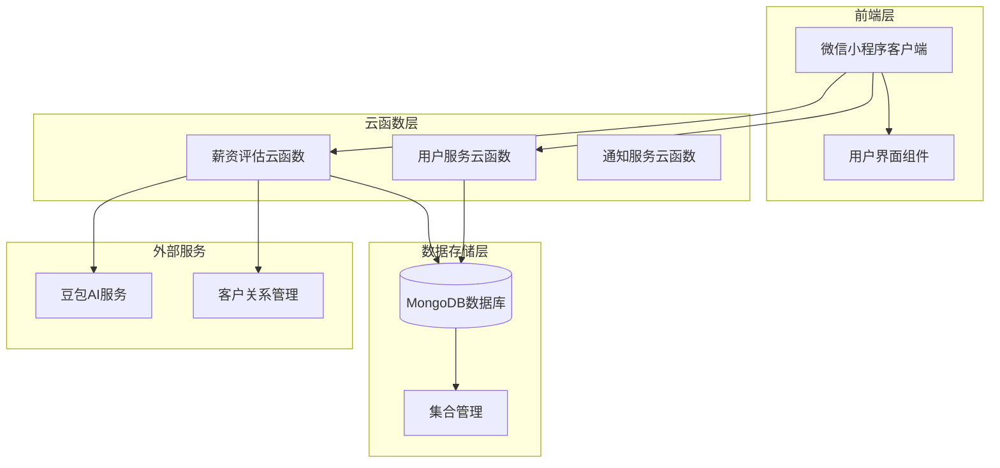
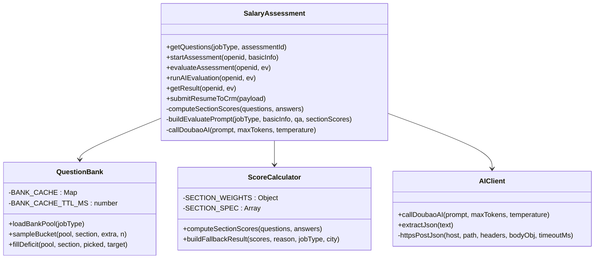
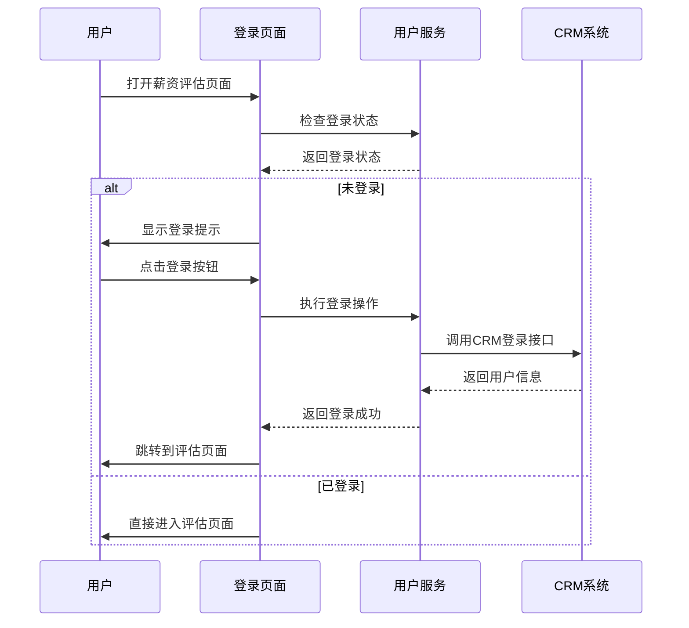
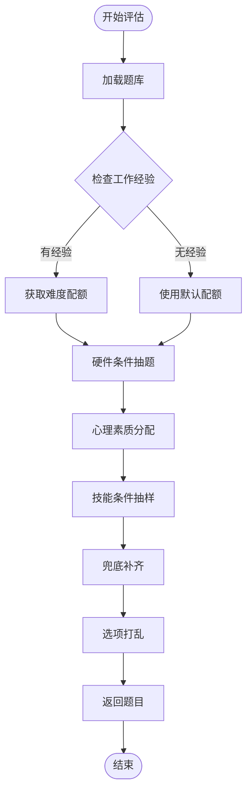
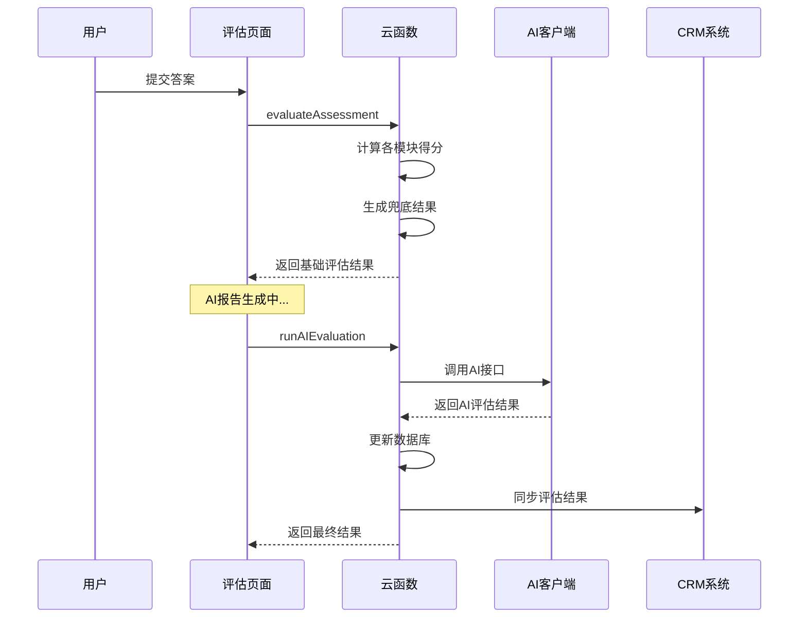
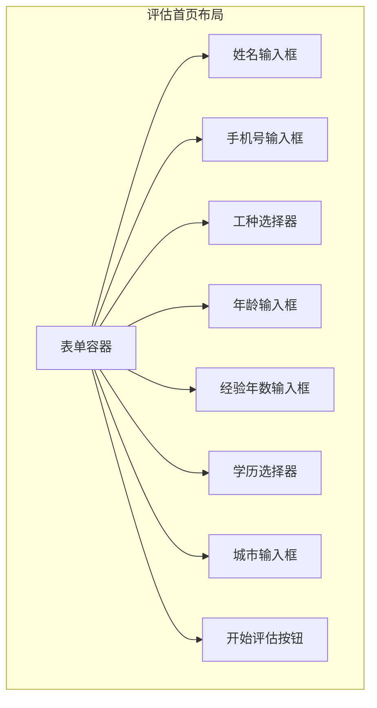
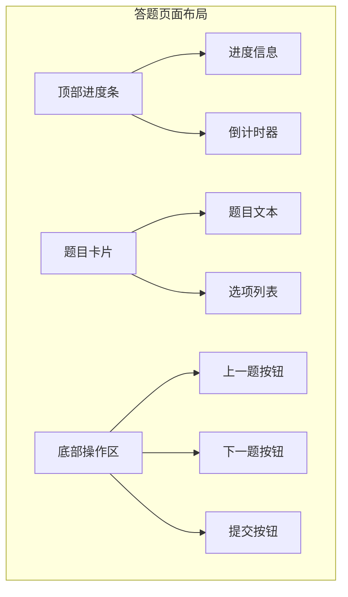
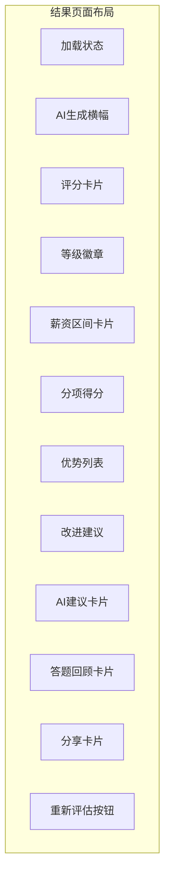
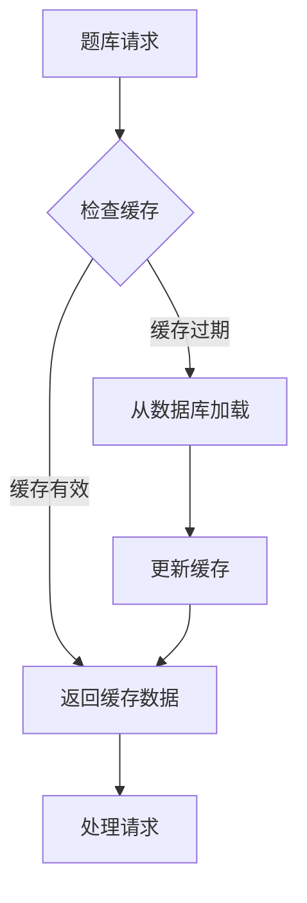
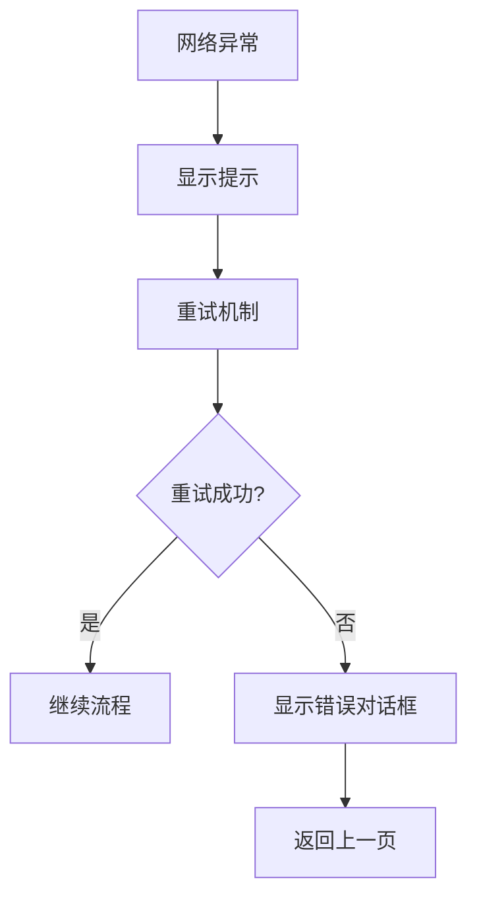

# 薪资评估系统

<cite>
**本文档引用的文件**
- [cloudfunctions/salaryAssessment/index.js](file://cloudfunctions/salaryAssessment/index.js)
- [miniprogram/pages/salaryAssessment/index.js](file://miniprogram/pages/salaryAssessment/index.js)
- [miniprogram/pages/salaryAssessment/quiz.js](file://miniprogram/pages/salaryAssessment/quiz.js)
- [miniprogram/pages/salaryAssessment/result.js](file://miniprogram/pages/salaryAssessment/result.js)
- [miniprogram/pages/salaryAssessment/result.wxml](file://miniprogram/pages/salaryAssessment/result.wxml)
- [miniprogram/pages/salaryAssessment/quiz.wxml](file://miniprogram/pages/salaryAssessment/quiz.wxml)
- [cloudfunctions/salaryAssessment/package.json](file://cloudfunctions/salaryAssessment/package.json)
- [cloudfunctions/salaryAssessment/config.json](file://cloudfunctions/salaryAssessment/config.json)
- [miniprogram/services/userService.js](file://miniprogram/services/userService.js)
- [miniprogram/app.js](file://miniprogram/app.js)
- [scripts/data/_import_salary_question_bank_yuexin.json](file://scripts/data/_import_salary_question_bank_yuexin.json)
</cite>

## 目录
1. [项目概述](#项目概述)
2. [系统架构](#系统架构)
3. [核心组件](#核心组件)
4. [数据库设计](#数据库设计)
5. [AI 评估流程](#ai-评估流程)
6. [用户界面设计](#用户界面设计)
7. [性能优化策略](#性能优化策略)
8. [错误处理机制](#错误处理机制)
9. [部署配置](#部署配置)
10. [总结](#总结)

## 项目概述

薪资评估系统是一个基于微信小程序平台的智能家政人员薪资评估工具。该系统通过AI技术为家政从业人员提供专业的薪资水平评估，涵盖月嫂、育儿嫂、保姆、护老/陪护四个主要工种。

### 系统特色

- **智能化评估**：基于AI模型进行专业能力评估
- **多工种支持**：覆盖家政行业四大核心工种
- **实时反馈**：5分钟内生成评估报告
- **CRM集成**：与客户关系管理系统无缝对接
- **移动端优化**：专为微信小程序优化的用户体验

## 系统架构

薪资评估系统采用前后端分离的架构设计，主要分为三个层次：



**图表来源**
- [cloudfunctions/salaryAssessment/index.js:1-928](file://cloudfunctions/salaryAssessment/index.js#L1-L928)
- [miniprogram/pages/salaryAssessment/index.js:1-335](file://miniprogram/pages/salaryAssessment/index.js#L1-L335)

### 技术栈

- **前端**：微信小程序原生开发框架
- **后端**：Node.js 云函数
- **数据库**：MongoDB（云开发）
- **AI服务**：豆包AI（doubao-seed-2-0-mini）
- **部署**：腾讯云开发平台

## 核心组件

### 1. 薪资评估云函数

薪资评估云函数是整个系统的核心，负责处理所有业务逻辑。

#### 主要功能模块



**图表来源**
- [cloudfunctions/salaryAssessment/index.js:369-465](file://cloudfunctions/salaryAssessment/index.js#L369-L465)
- [cloudfunctions/salaryAssessment/index.js:531-586](file://cloudfunctions/salaryAssessment/index.js#L531-L586)
- [cloudfunctions/salaryAssessment/index.js:182-209](file://cloudfunctions/salaryAssessment/index.js#L182-L209)

#### 关键配置参数

| 参数名称 | 默认值 | 描述 |
|---------|--------|------|
| ARK_API_KEY | 未配置 | 豆包AI API密钥 |
| SECTION_WEIGHTS | {hardware: 20, skill: 60, personality: 20} | 各模块权重分配 |
| TOTAL_QUESTIONS | 30 | 总题数 |
| BANK_CACHE_TTL_MS | 600000 | 题库缓存过期时间 |

**章节来源**
- [cloudfunctions/salaryAssessment/index.js:48-125](file://cloudfunctions/salaryAssessment/index.js#L48-L125)
- [cloudfunctions/salaryAssessment/index.js:182-209](file://cloudfunctions/salaryAssessment/index.js#L182-L209)

### 2. 用户界面组件

#### 登录注册页面



**图表来源**
- [miniprogram/pages/salaryAssessment/index.js:133-180](file://miniprogram/pages/salaryAssessment/index.js#L133-L180)
- [miniprogram/services/userService.js:27-44](file://miniprogram/services/userService.js#L27-L44)

**章节来源**
- [miniprogram/pages/salaryAssessment/index.js:1-335](file://miniprogram/pages/salaryAssessment/index.js#L1-L335)
- [miniprogram/services/userService.js:1-45](file://miniprogram/services/userService.js#L1-L45)

### 3. 评估流程组件

#### 题目抽取算法

系统采用智能抽题策略，确保评估的科学性和公平性：



**图表来源**
- [cloudfunctions/salaryAssessment/index.js:369-465](file://cloudfunctions/salaryAssessment/index.js#L369-L465)

**章节来源**
- [cloudfunctions/salaryAssessment/index.js:369-465](file://cloudfunctions/salaryAssessment/index.js#L369-L465)

## 数据库设计

### 集合结构

系统使用三个核心集合来存储评估相关的数据：

#### 1. salary_assessments 集合

存储用户的评估记录和结果：

| 字段名 | 类型 | 描述 |
|--------|------|------|
| openid | String | 用户唯一标识 |
| name | String | 用户姓名 |
| phone | String | 联系电话 |
| jobType | String | 申请工种 |
| age | Number | 年龄 |
| experienceYears | Number | 工作经验年数 |
| education | String | 学历 |
| city | String | 常住城市 |
| status | String | 评估状态 |
| result | Object | AI评估结果 |
| sectionScores | Object | 各模块得分 |
| pickedQuestions | Array | 抽取的题目列表 |
| answers | Array | 用户答案 |
| createdAt | Date | 创建时间 |
| updatedAt | Date | 更新时间 |

#### 2. salary_question_bank 集合

存储题库数据：

| 字段名 | 类型 | 描述 |
|--------|------|------|
| jobType | String | 工种类型 |
| section | String | 题目模块 |
| subsection | String | 子模块 |
| difficulty | String | 难度级别 |
| type | String | 题型（choice/judge） |
| question | String | 题目内容 |
| options | Array | 选项列表 |
| explanation | String | 解析内容 |
| source | String | 出处信息 |
| createdAt | Date | 创建时间 |

#### 3. salary_assessment_questions 集合

存储题目统计信息：

| 字段名 | 类型 | 描述 |
|--------|------|------|
| jobType | String | 工种类型 |
| section | String | 题目模块 |
| count | Number | 题目数量 |
| lastUpdated | Date | 最后更新时间 |

**章节来源**
- [cloudfunctions/salaryAssessment/index.js:119-125](file://cloudfunctions/salaryAssessment/index.js#L119-L125)
- [scripts/data/_import_salary_question_bank_yuexin.json:1-200](file://scripts/data/_import_salary_question_bank_yuexin.json#L1-L200)

## AI 评估流程

### 评估算法设计

系统采用多阶段评估策略，确保评估结果的准确性和实用性：



**图表来源**
- [cloudfunctions/salaryAssessment/index.js:608-729](file://cloudfunctions/salaryAssessment/index.js#L608-L729)
- [cloudfunctions/salaryAssessment/index.js:658-729](file://cloudfunctions/salaryAssessment/index.js#L658-L729)

### 评分标准

#### 薪资矩阵设计

系统根据不同城市的经济水平制定相应的薪资标准：

| 工种 | 初级 | 中级 | 高级 | 金牌 | 钻石 |
|------|------|------|------|------|------|
| 月嫂 | 7000-9000 | 9000-12000 | 12000-15000 | 15000-18000 | 18000-22000 |
| 育儿嫂 | 6000-7000 | 7000-8000 | 8000-9000 | 9000-10000 | 10000-11000 |
| 保姆 | 6000-7000 | 7000-8000 | 8000-9500 | 9500-11500 | 11500-14000 |
| 护老 | 4500-5000 | 5500-6000 | 6000-7000 | 7000-8500 | 8500-10000 |

#### 城市系数调整

| 城市类型 | 系数 | 说明 |
|----------|------|------|
| 一线城市 | 1.0 | 北京、上海、深圳、广州 |
| 新一线城市 | 0.85 | 杭州、成都、苏州等 |
| 其他城市 | 0.7 | 普通城市 |

**章节来源**
- [cloudfunctions/salaryAssessment/index.js:74-114](file://cloudfunctions/salaryAssessment/index.js#L74-L114)
- [cloudfunctions/salaryAssessment/index.js:80-92](file://cloudfunctions/salaryAssessment/index.js#L80-L92)

## 用户界面设计

### 页面布局结构

#### 评估首页

评估首页提供用户基本信息收集和工种选择功能：



**图表来源**
- [miniprogram/pages/salaryAssessment/index.js:42-62](file://miniprogram/pages/salaryAssessment/index.js#L42-L62)

#### 评估答题页面

答题页面采用简洁直观的设计，提供良好的用户体验：



**图表来源**
- [miniprogram/pages/salaryAssessment/quiz.wxml:1-49](file://miniprogram/pages/salaryAssessment/quiz.wxml#L1-L49)

#### 结果展示页面

结果页面提供详细的评估报告和个性化建议：



**图表来源**
- [miniprogram/pages/salaryAssessment/result.wxml:1-198](file://miniprogram/pages/salaryAssessment/result.wxml#L1-L198)

**章节来源**
- [miniprogram/pages/salaryAssessment/index.js:1-335](file://miniprogram/pages/salaryAssessment/index.js#L1-L335)
- [miniprogram/pages/salaryAssessment/quiz.js:1-265](file://miniprogram/pages/salaryAssessment/quiz.js#L1-L265)
- [miniprogram/pages/salaryAssessment/result.js:1-275](file://miniprogram/pages/salaryAssessment/result.js#L1-L275)

## 性能优化策略

### 1. 题库缓存机制

系统实现了智能题库缓存，显著提升响应速度：



**图表来源**
- [cloudfunctions/salaryAssessment/index.js:310-340](file://cloudfunctions/salaryAssessment/index.js#L310-L340)

### 2. 异步处理策略

系统采用异步处理模式，确保用户体验流畅：

- **AI评估异步化**：评估结果生成与页面渲染分离
- **CRM同步异步化**：简历同步不影响主流程
- **图片生成异步化**：海报生成不影响页面交互

### 3. 内存优化

- **模块作用域缓存**：题库数据缓存在模块作用域
- **TTL过期机制**：10分钟自动刷新缓存
- **内存池管理**：避免频繁的内存分配

**章节来源**
- [cloudfunctions/salaryAssessment/index.js:310-340](file://cloudfunctions/salaryAssessment/index.js#L310-L340)
- [cloudfunctions/salaryAssessment/index.js:117-125](file://cloudfunctions/salaryAssessment/index.js#L117-L125)

## 错误处理机制

### 1. 网络异常处理

系统实现了完善的网络异常处理机制：



### 2. AI服务降级

当AI服务不可用时，系统自动降级到兜底策略：

- **快速评分**：立即生成基础评估结果
- **人工审核**：后续由人工审核完善
- **数据备份**：确保用户数据安全

### 3. 数据一致性保证

- **事务处理**：关键操作使用事务保证原子性
- **幂等设计**：重复操作不影响最终结果
- **状态同步**：前后端状态保持一致

**章节来源**
- [cloudfunctions/salaryAssessment/index.js:690-700](file://cloudfunctions/salaryAssessment/index.js#L690-L700)
- [cloudfunctions/salaryAssessment/index.js:716-721](file://cloudfunctions/salaryAssessment/index.js#L716-L721)

## 部署配置

### 1. 云函数配置

#### 环境变量配置

| 环境变量 | 必需性 | 描述 |
|----------|--------|------|
| ARK_API_KEY | 必需 | 豆包AI API密钥 |
| NODE_ENV | 可选 | 运行环境（development/production） |

#### 超时配置

- **默认超时**：120秒
- **AI调用超时**：25秒
- **HTTP请求超时**：120秒

### 2. 数据库权限

系统要求以下数据库权限：

```json
{
  "permissions": {
    "openapi": []
  }
}
```

### 3. 自动部署

系统支持自动化部署流程：

```bash
# 部署命令
./uploadCloudFunction.sh

# 部署验证
./verify-deployment.js
```

**章节来源**
- [cloudfunctions/salaryAssessment/config.json:1-7](file://cloudfunctions/salaryAssessment/config.json#L1-L7)
- [cloudfunctions/salaryAssessment/package.json:1-10](file://cloudfunctions/salaryAssessment/package.json#L1-L10)

## 总结

薪资评估系统是一个功能完整、架构清晰的智能评估平台。系统通过AI技术为家政从业人员提供专业的薪资水平评估，具有以下特点：

### 技术优势

- **智能化程度高**：AI驱动的专业评估算法
- **用户体验优秀**：简洁直观的界面设计
- **性能表现优异**：多层缓存和异步处理机制
- **扩展性强**：模块化设计便于功能扩展

### 业务价值

- **提升透明度**：为家政从业人员提供客观的薪资参考
- **促进市场发展**：帮助建立更加规范的家政服务市场
- **增强信任度**：专业的评估结果增加用户信任

### 发展前景

系统具备良好的扩展基础，未来可以：
- 支持更多工种和技能评估
- 集成更多AI模型提升评估精度
- 扩展到更多地区和城市
- 增加更多个性化功能和服务

通过持续的技术创新和业务优化，薪资评估系统将成为家政服务行业的重要基础设施。