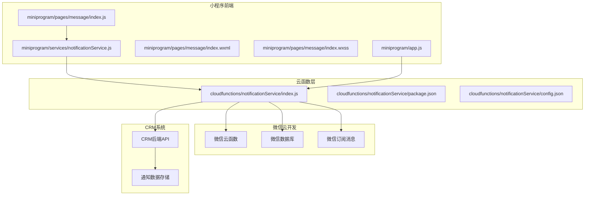
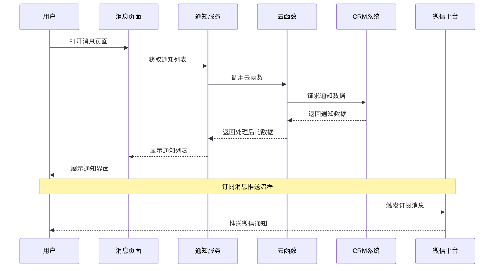
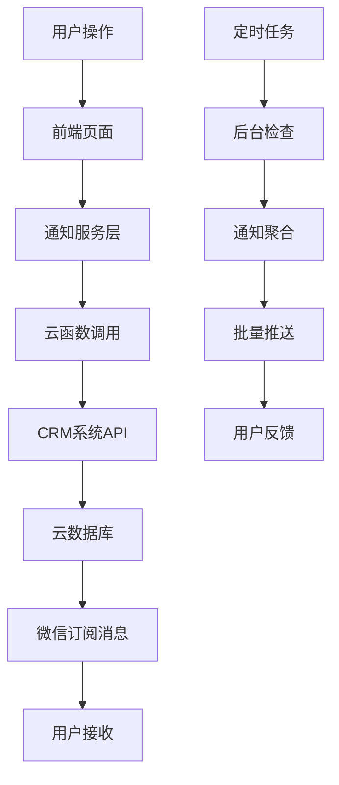
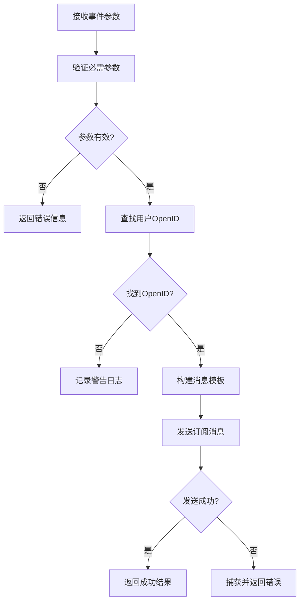
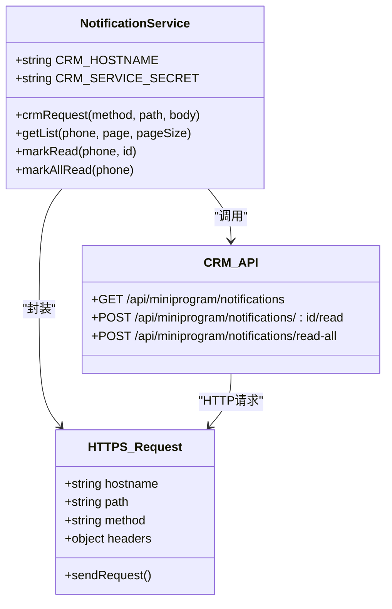
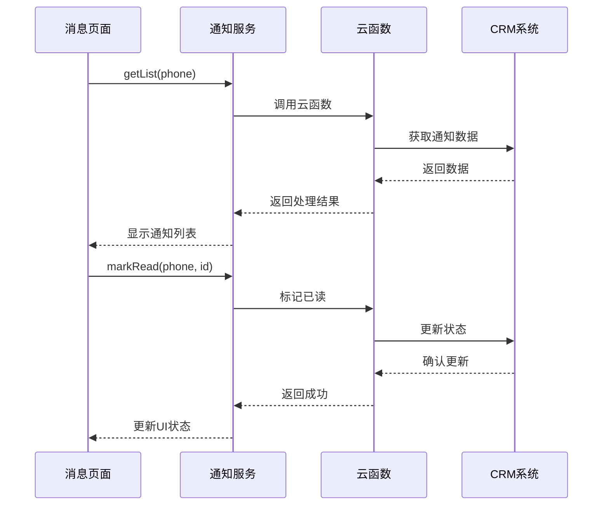
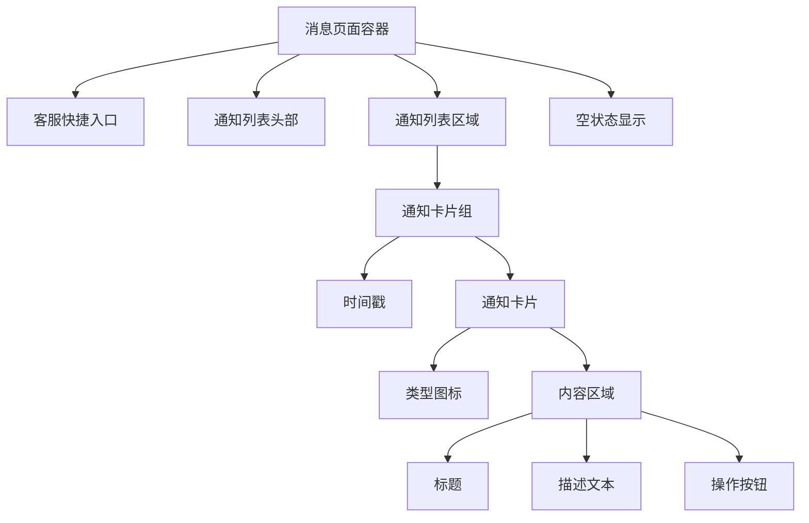
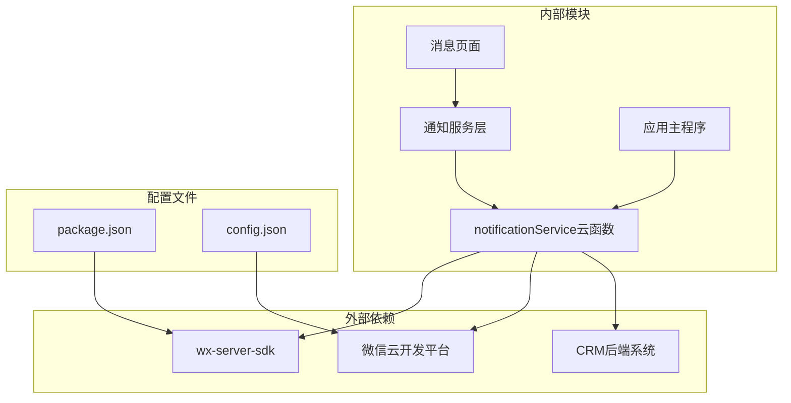
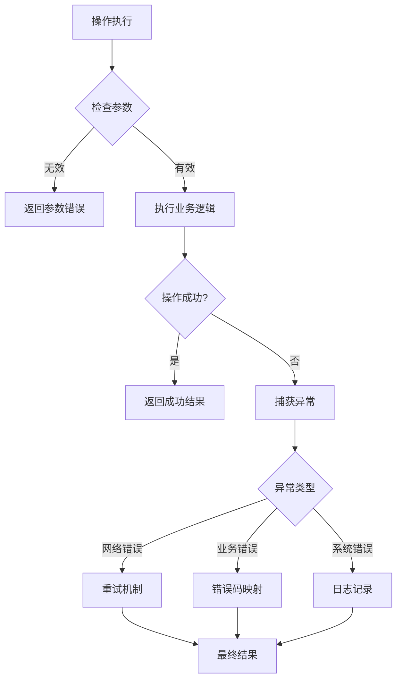

# 通知服务

<cite>
**本文档引用的文件**
- [cloudfunctions/notificationService/index.js](file://cloudfunctions/notificationService/index.js)
- [cloudfunctions/notificationService/package.json](file://cloudfunctions/notificationService/package.json)
- [cloudfunctions/notificationService/config.json](file://cloudfunctions/notificationService/config.json)
- [miniprogram/services/notificationService.js](file://miniprogram/services/notificationService.js)
- [miniprogram/pages/message/index.js](file://miniprogram/pages/message/index.js)
- [miniprogram/pages/message/index.wxml](file://miniprogram/pages/message/index.wxml)
- [miniprogram/pages/message/index.wxss](file://miniprogram/pages/message/index.wxss)
- [miniprogram/app.js](file://miniprogram/app.js)
</cite>

## 目录
1. [简介](#简介)
2. [项目结构](#项目结构)
3. [核心组件](#核心组件)
4. [架构概览](#架构概览)
5. [详细组件分析](#详细组件分析)
6. [依赖关系分析](#依赖关系分析)
7. [性能考虑](#性能考虑)
8. [故障排除指南](#故障排除指南)
9. [结论](#结论)

## 简介

通知服务是安得褓贝小程序中的重要功能模块，主要负责以下核心功能：

- **订阅消息通知**：向员工发送简历被查看的微信订阅消息
- **通知中心管理**：提供完整的通知列表、标记已读、全部已读等功能
- **CRM系统集成**：与CRM后端系统对接，实现通知数据的同步和管理
- **多渠道通知**：支持微信订阅消息和小程序内部通知机制

该服务采用前后端分离的设计模式，前端通过云函数调用实现，后端通过微信云开发平台提供服务。

## 项目结构

通知服务在整个项目中的组织结构如下：

**图表来源**
- [cloudfunctions/notificationService/index.js:1-248](file://cloudfunctions/notificationService/index.js#L1-L248)
- [miniprogram/services/notificationService.js:1-46](file://miniprogram/services/notificationService.js#L1-L46)

**章节来源**
- [cloudfunctions/notificationService/index.js:1-248](file://cloudfunctions/notificationService/index.js#L1-L248)
- [cloudfunctions/notificationService/package.json:1-10](file://cloudfunctions/notificationService/package.json#L1-L10)
- [cloudfunctions/notificationService/config.json:1-8](file://cloudfunctions/notificationService/config.json#L1-L8)

## 核心组件

通知服务由多个核心组件构成，每个组件都有明确的职责分工：

### 云函数组件
- **notificationService云函数**：提供完整的通知服务API接口
- **权限配置**：配置云函数所需的微信开放API权限
- **依赖管理**：管理云函数的运行时依赖

### 前端服务组件
- **notificationService.js**：封装云函数调用的前端服务层
- **消息页面**：提供用户友好的通知展示界面
- **样式系统**：完整的UI样式和交互设计

### 数据模型组件
- **通知类型配置**：定义不同类型通知的展示规则
- **用户状态管理**：处理用户登录状态和权限验证
- **消息格式化**：统一处理通知时间、内容格式化

**章节来源**
- [miniprogram/services/notificationService.js:1-46](file://miniprogram/services/notificationService.js#L1-L46)
- [miniprogram/pages/message/index.js:1-226](file://miniprogram/pages/message/index.js#L1-L226)

## 架构概览

通知服务采用分层架构设计，确保了良好的可维护性和扩展性：

**图表来源**
- [cloudfunctions/notificationService/index.js:187-247](file://cloudfunctions/notificationService/index.js#L187-L247)
- [miniprogram/services/notificationService.js:6-15](file://miniprogram/services/notificationService.js#L6-L15)

### 数据流架构

**图表来源**
- [cloudfunctions/notificationService/index.js:223-239](file://cloudfunctions/notificationService/index.js#L223-L239)
- [miniprogram/pages/message/index.js:74-134](file://miniprogram/pages/message/index.js#L74-L134)

## 详细组件分析

### 云函数核心实现

notificationService云函数提供了完整的通知服务API，包括订阅消息发送、通知列表管理等功能。

#### 订阅消息发送功能

**图表来源**
- [cloudfunctions/notificationService/index.js:44-97](file://cloudfunctions/notificationService/index.js#L44-L97)

#### CRM系统集成

云函数通过HTTPS请求与CRM后端系统进行数据交换：

**图表来源**
- [cloudfunctions/notificationService/index.js:99-133](file://cloudfunctions/notificationService/index.js#L99-L133)

**章节来源**
- [cloudfunctions/notificationService/index.js:44-97](file://cloudfunctions/notificationService/index.js#L44-L97)
- [cloudfunctions/notificationService/index.js:99-133](file://cloudfunctions/notificationService/index.js#L99-L133)

### 前端服务层

前端通知服务层提供了简洁的API接口，便于页面组件调用：

#### 服务接口设计

| 方法名 | 参数 | 返回值 | 功能描述 |
|--------|------|--------|----------|
| getList | phone, page, pageSize | Promise\<NotificationList\> | 获取通知列表 |
| markRead | phone, id | Promise\<void\> | 标记单条通知已读 |
| markAllRead | phone | Promise\<void\> | 标记所有通知已读 |

#### 页面集成模式

**图表来源**
- [miniprogram/services/notificationService.js:6-43](file://miniprogram/services/notificationService.js#L6-L43)
- [miniprogram/pages/message/index.js:74-134](file://miniprogram/pages/message/index.js#L74-L134)

**章节来源**
- [miniprogram/services/notificationService.js:1-46](file://miniprogram/services/notificationService.js#L1-L46)
- [miniprogram/pages/message/index.js:1-226](file://miniprogram/pages/message/index.js#L1-L226)

### 用户界面组件

消息页面提供了完整的用户交互界面，支持通知的查看、操作和管理：

#### 通知类型配置系统

系统支持多种通知类型的展示配置，每种类型都有特定的视觉标识和交互行为：

| 通知类型 | Emoji | 颜色 | 标题 | 操作按钮 |
|----------|-------|------|------|----------|
| contract_invite | 📄 | #5B8DEF | 合同待签署 | 去签署 → |
| referral_submitted | 📋 | #8766F3 | 推荐简历待审核 | 去审核 → |
| referral_approved | ✅ | #52c41a | 推荐官申请已通过 | - |
| referral_contracted | 🎉 | #fa8c16 | 推荐阿姨已签单 | - |

#### 响应式布局设计

页面采用Flexbox布局系统，支持不同屏幕尺寸的自适应显示：

**图表来源**
- [miniprogram/pages/message/index.wxml:1-66](file://miniprogram/pages/message/index.wxml#L1-L66)

**章节来源**
- [miniprogram/pages/message/index.wxml:1-66](file://miniprogram/pages/message/index.wxml#L1-L66)
- [miniprogram/pages/message/index.wxss:1-263](file://miniprogram/pages/message/index.wxss#L1-L263)

## 依赖关系分析

通知服务的依赖关系体现了清晰的分层架构：

**图表来源**
- [cloudfunctions/notificationService/package.json:6-8](file://cloudfunctions/notificationService/package.json#L6-L8)
- [cloudfunctions/notificationService/config.json:2-6](file://cloudfunctions/notificationService/config.json#L2-L6)

### 权限控制机制

云函数通过配置文件声明所需的微信开放API权限：

| 权限名称 | 描述 | 使用场景 |
|----------|------|----------|
| subscribeMessage.send | 发送订阅消息 | 简历查看通知 |
| database.read | 读取数据库 | 用户信息查询 |
| database.write | 写入数据库 | 用户状态更新 |

### 错误处理策略

系统实现了多层次的错误处理机制：

**图表来源**
- [cloudfunctions/notificationService/index.js:89-96](file://cloudfunctions/notificationService/index.js#L89-L96)

**章节来源**
- [cloudfunctions/notificationService/config.json:2-6](file://cloudfunctions/notificationService/config.json#L2-L6)
- [cloudfunctions/notificationService/index.js:89-96](file://cloudfunctions/notificationService/index.js#L89-L96)

## 性能考虑

通知服务在设计时充分考虑了性能优化：

### 缓存策略
- **用户状态缓存**：在应用启动时预加载用户信息
- **通知列表缓存**：合理设置缓存时间，平衡实时性和性能
- **样式资源缓存**：利用小程序的样式缓存机制

### 网络优化
- **批量请求**：支持分页加载，避免一次性加载大量数据
- **并发控制**：限制同时进行的网络请求数量
- **连接复用**：复用HTTPS连接，减少握手开销

### 内存管理
- **数据清理**：及时清理不再使用的临时数据
- **事件解绑**：页面卸载时正确清理事件监听器
- **图片优化**：使用合适的图片尺寸和格式

## 故障排除指南

### 常见问题及解决方案

#### 订阅消息发送失败

**问题现象**：用户收不到微信订阅消息通知

**可能原因**：
1. 用户未订阅该消息类型
2. 模板ID配置错误
3. 用户取消了消息订阅

**解决步骤**：
1. 检查用户是否已订阅消息
2. 验证模板ID的有效性
3. 引导用户重新订阅

#### 通知列表加载失败

**问题现象**：消息页面无法显示通知列表

**可能原因**：
1. 用户未登录或登录状态失效
2. 网络连接异常
3. CRM系统接口异常

**解决步骤**：
1. 检查用户登录状态
2. 验证网络连接
3. 查看CRM系统状态

#### OpenID查找失败

**问题现象**：无法通过手机号找到用户的OpenID

**可能原因**：
1. 用户信息未正确同步到云数据库
2. 手机号格式不正确
3. 数据库查询异常

**解决步骤**：
1. 检查用户信息同步状态
2. 验证手机号格式
3. 查看数据库查询日志

**章节来源**
- [cloudfunctions/notificationService/index.js:135-185](file://cloudfunctions/notificationService/index.js#L135-L185)
- [cloudfunctions/notificationService/index.js:200-221](file://cloudfunctions/notificationService/index.js#L200-L221)

### 调试工具和方法

#### 诊断功能
云函数提供了专门的诊断功能，帮助开发者快速定位问题：

| 诊断功能 | 用途 | 使用场景 |
|----------|------|----------|
| sendTestNotify | 发送测试通知 | 验证通知配置 |
| debugUsers | 用户信息诊断 | 检查用户数据 |
| getList | 列表获取测试 | 验证API接口 |

#### 日志监控
系统实现了完善的日志记录机制，便于问题追踪和性能分析。

## 结论

通知服务作为安得褓贝小程序的核心功能模块，展现了优秀的架构设计和实现质量：

### 设计优势
- **模块化设计**：清晰的分层架构，便于维护和扩展
- **用户体验**：直观的界面设计和流畅的交互体验
- **可靠性**：完善的错误处理和异常恢复机制
- **性能优化**：合理的缓存策略和网络优化

### 技术亮点
- **微信生态集成**：充分利用微信云开发平台的能力
- **前后端协作**：高效的前后端数据交互模式
- **安全机制**：多重身份验证和权限控制
- **监控告警**：完善的日志记录和错误报告

### 改进建议
- **国际化支持**：考虑添加多语言支持
- **推送策略**：优化通知推送的时机和频率
- **数据分析**：增加通知效果的统计分析功能
- **离线支持**：考虑添加离线通知缓存机制

通知服务为整个安得褓贝小程序提供了坚实的基础支撑，为用户提供了及时、准确的通知服务，有效提升了用户体验和运营效率。