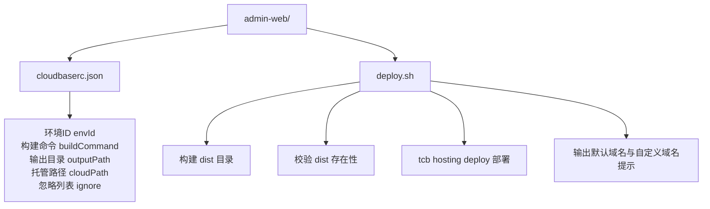
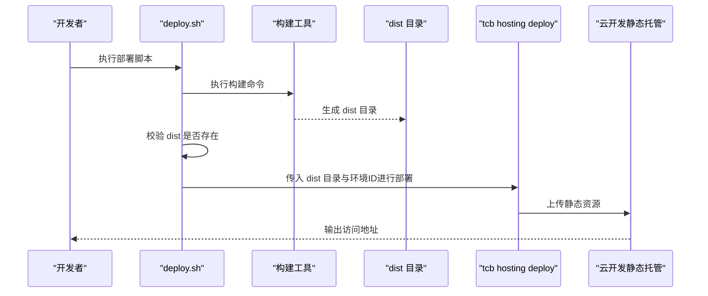
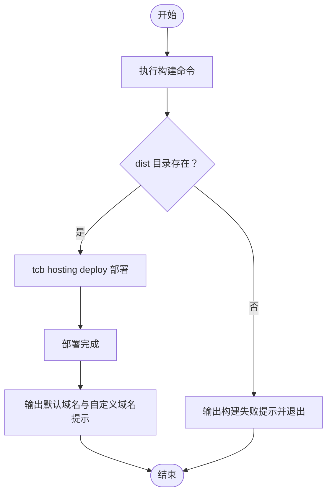
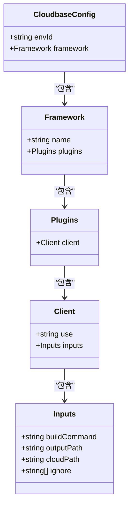
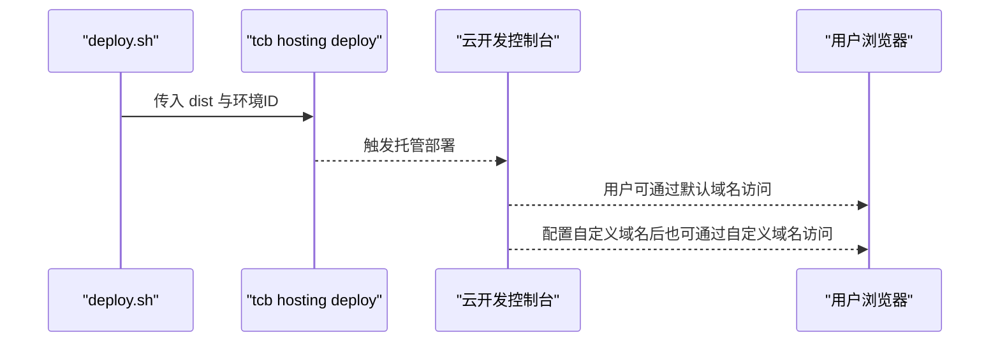
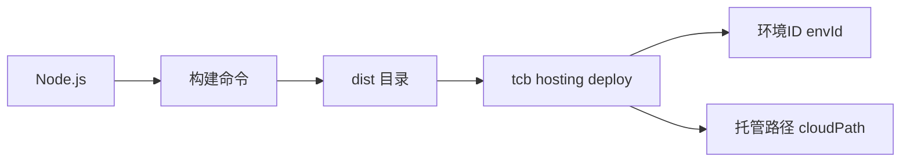

# Web管理后台部署

<cite>
**本文引用的文件**
- [cloudbaserc.json](file://admin-web/cloudbaserc.json)
- [deploy.sh](file://admin-web/deploy.sh)
- [Web管理后台快速实施指南.md](file://docs/Web管理后台快速实施指南.md)
- [README.md](file://README.md)
</cite>

## 目录
1. [简介](#简介)
2. [项目结构](#项目结构)
3. [核心组件](#核心组件)
4. [架构总览](#架构总览)
5. [详细组件分析](#详细组件分析)
6. [依赖分析](#依赖分析)
7. [性能考虑](#性能考虑)
8. [故障排查指南](#故障排查指南)
9. [结论](#结论)
10. [附录](#附录)

## 简介
本指南面向Web管理后台的自动化部署，围绕admin-web目录下的部署脚本与配置文件展开，重点解析以下内容：
- deploy.sh脚本的四个执行阶段：构建生产资源、dist目录验证、云开发静态托管部署、部署完成后的访问地址输出
- cloudbaserc.json中环境ID的配置方法及其与云开发环境的关联关系
- 自定义域名与HTTPS证书的配置思路
- 部署前准备清单（Node.js环境、tcb-cli初始化、项目权限等）
- 典型失败场景与对应解决策略（构建失败、网络超时、权限不足等）

## 项目结构
admin-web目录包含两个关键文件：
- cloudbaserc.json：云开发框架配置，定义环境ID、构建命令、输出目录、托管路径与忽略规则
- deploy.sh：一键部署脚本，封装构建、校验、部署与访问地址输出流程

**图表来源**
- [cloudbaserc.json](file://admin-web/cloudbaserc.json#L1-L24)
- [deploy.sh](file://admin-web/deploy.sh#L1-L28)

**章节来源**
- [cloudbaserc.json](file://admin-web/cloudbaserc.json#L1-L24)
- [deploy.sh](file://admin-web/deploy.sh#L1-L28)

## 核心组件
- 部署脚本 deploy.sh
  - 阶段一：执行构建命令生成生产资源
  - 阶段二：检查dist目录是否存在
  - 阶段三：调用tcb hosting deploy命令部署至云开发静态托管
  - 阶段四：输出默认域名与自定义域名访问提示
- 配置文件 cloudbaserc.json
  - envId：云开发环境ID
  - framework.plugins.client.inputs：定义构建命令、输出目录、托管路径与忽略规则

**章节来源**
- [deploy.sh](file://admin-web/deploy.sh#L1-L28)
- [cloudbaserc.json](file://admin-web/cloudbaserc.json#L1-L24)

## 架构总览
下图展示了从本地构建到云开发静态托管的整体流程，映射到实际文件与命令：

**图表来源**
- [deploy.sh](file://admin-web/deploy.sh#L1-L28)

## 详细组件分析

### 部署脚本 deploy.sh 分析
- 阶段一：构建生产资源
  - 通过构建命令生成生产资源，产物位于dist目录
- 阶段二：dist目录验证
  - 若dist目录不存在则终止并提示构建失败
- 阶段三：部署至云开发静态托管
  - 使用tcb hosting deploy命令，指定dist目录与环境ID
- 阶段四：输出访问地址
  - 提供默认域名与自定义域名访问提示

**图表来源**
- [deploy.sh](file://admin-web/deploy.sh#L1-L28)

**章节来源**
- [deploy.sh](file://admin-web/deploy.sh#L1-L28)

### 配置文件 cloudbaserc.json 分析
- envId：用于标识云开发环境，脚本中通过-e参数传递给tcb命令
- framework.plugins.client.inputs：
  - buildCommand：构建命令
  - outputPath：构建输出目录
  - cloudPath：托管路径（部署到云开发托管的子路径）
  - ignore：部署时忽略的文件/目录

**图表来源**
- [cloudbaserc.json](file://admin-web/cloudbaserc.json#L1-L24)

**章节来源**
- [cloudbaserc.json](file://admin-web/cloudbaserc.json#L1-L24)

### 部署流程与访问地址
- 默认域名：基于环境ID生成的默认访问地址
- 自定义域名：需在云开发控制台配置域名与证书后生效

**图表来源**
- [deploy.sh](file://admin-web/deploy.sh#L1-L28)

**章节来源**
- [deploy.sh](file://admin-web/deploy.sh#L1-L28)

## 依赖分析
- 外部工具依赖
  - Node.js：用于执行构建命令
  - tcb-cli：用于云开发静态托管部署
- 内部配置依赖
  - cloudbaserc.json中的envId与deploy.sh中的-e参数必须一致
  - cloudbaserc.json中的cloudPath决定静态资源在托管中的相对路径

**图表来源**
- [cloudbaserc.json](file://admin-web/cloudbaserc.json#L1-L24)
- [deploy.sh](file://admin-web/deploy.sh#L1-L28)

**章节来源**
- [cloudbaserc.json](file://admin-web/cloudbaserc.json#L1-L24)
- [deploy.sh](file://admin-web/deploy.sh#L1-L28)

## 性能考虑
- 构建阶段
  - 使用生产构建命令以获得最小化与压缩后的资源
  - 控制打包体积，避免一次性上传过多静态资源
- 部署阶段
  - 仅上传必要文件，合理设置ignore列表减少传输量
  - 利用CDN加速静态资源访问

[本节为通用建议，不涉及具体文件分析]

## 故障排查指南
- 构建失败
  - 现象：dist目录不存在
  - 排查：确认构建命令执行是否报错；检查Node.js版本与依赖安装
  - 处置：修复构建错误后重试
- 网络超时
  - 现象：tcb hosting deploy过程中网络不稳定导致失败
  - 排查：检查网络连通性；尝试在更稳定的网络环境下重试
  - 处置：重试部署；必要时分批上传或优化构建产物
- 权限不足
  - 现象：tcb命令提示无权限或无法识别环境ID
  - 排查：确认已使用正确的账号登录tcb-cli；核对环境ID是否正确
  - 处置：重新登录tcb-cli；修正环境ID；确保项目权限配置正确
- 环境ID不匹配
  - 现象：cloudbaserc.json中的envId与deploy.sh中的-e参数不一致
  - 排查：比对两处配置
  - 处置：统一为相同环境ID

**章节来源**
- [deploy.sh](file://admin-web/deploy.sh#L1-L28)
- [cloudbaserc.json](file://admin-web/cloudbaserc.json#L1-L24)

## 结论
通过deploy.sh与cloudbaserc.json的配合，可以实现Web管理后台的自动化部署。关键在于：
- 明确环境ID与托管路径配置
- 确保构建产物完整且符合预期
- 在云开发控制台完成自定义域名与HTTPS证书配置
- 遇到问题时按阶段定位并逐项排查

[本节为总结性内容，不涉及具体文件分析]

## 附录

### 部署前准备清单
- Node.js环境
  - 安装Node.js并确保npm可用
- tcb-cli工具初始化
  - 安装并登录tcb-cli，确保可正常执行tcb hosting deploy命令
- 项目权限配置
  - 确认当前账号对目标云开发环境具有部署权限
- 构建与部署
  - 在本地执行构建命令生成dist目录
  - 使用deploy.sh完成部署

**章节来源**
- [deploy.sh](file://admin-web/deploy.sh#L1-L28)
- [README.md](file://README.md#L1-L13)

### 自定义域名与HTTPS证书配置
- 自定义域名
  - 在云开发控制台为托管域名绑定自定义域名
  - 配置DNS解析指向云开发提供的CNAME记录
- HTTPS证书
  - 为自定义域名申请并配置SSL证书
  - 证书生效后即可通过HTTPS访问

**章节来源**
- [Web管理后台快速实施指南.md](file://docs/Web管理后台快速实施指南.md#L520-L526)