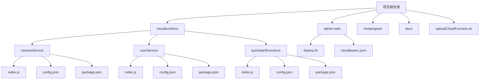
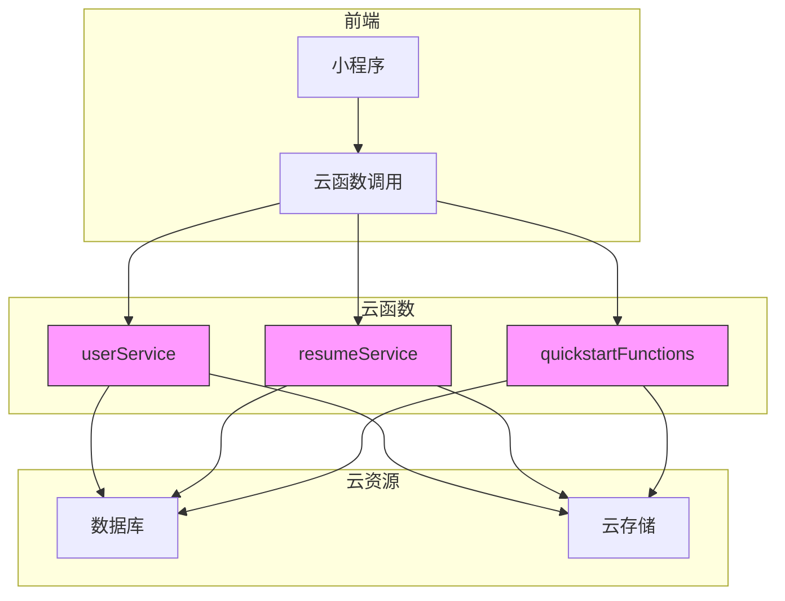
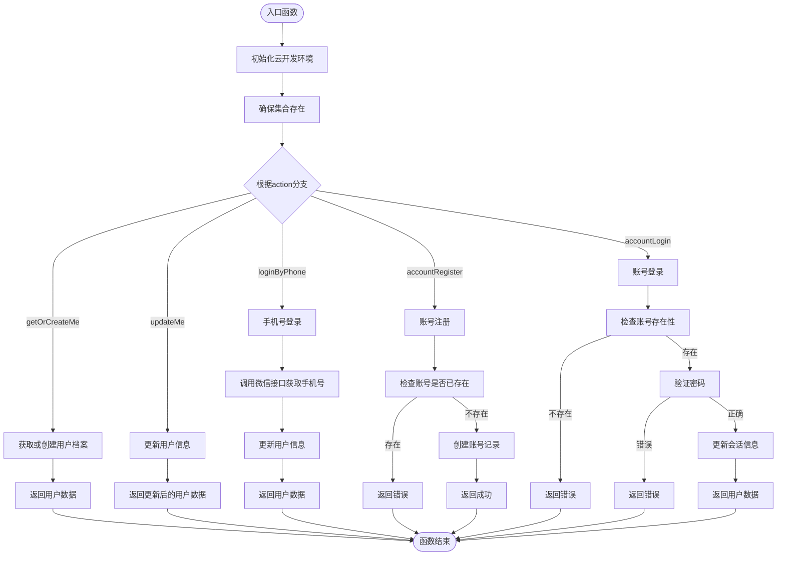
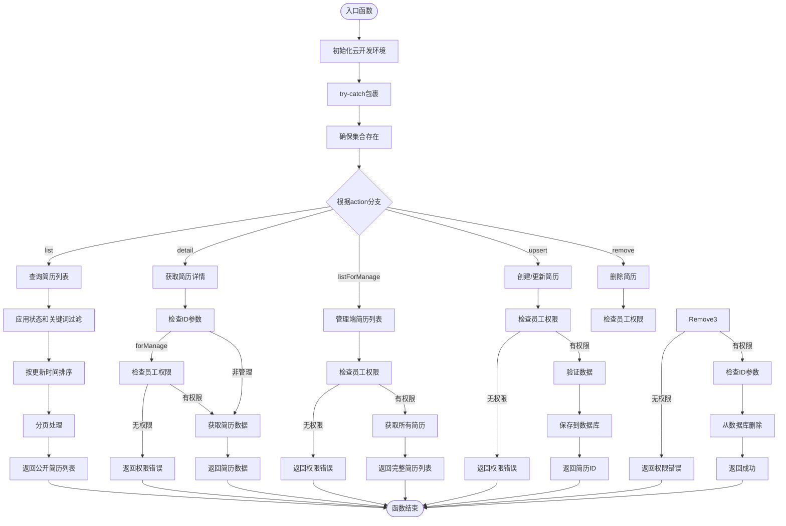
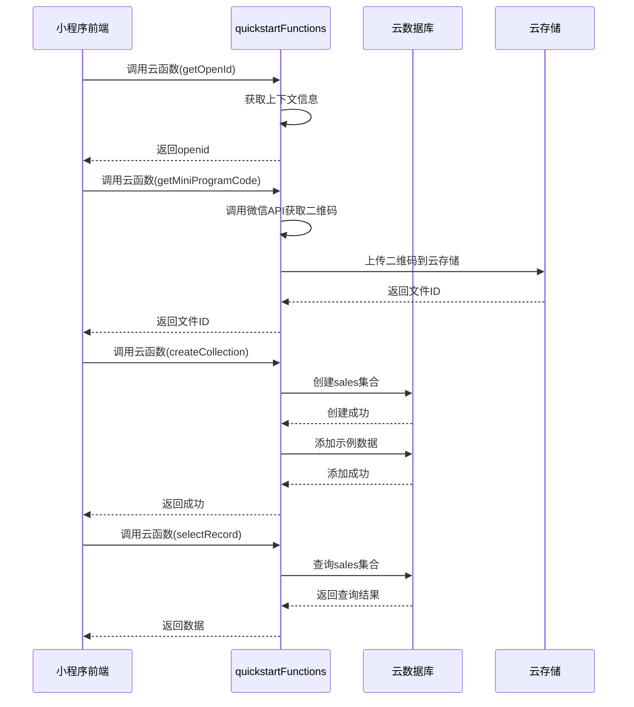
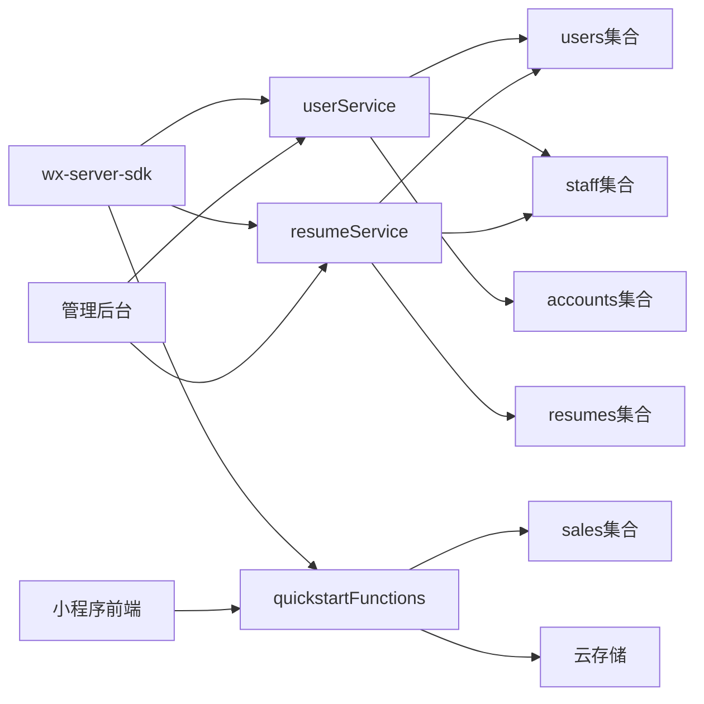

# 云函数部署

<cite>
**本文档中引用的文件**   
- [userService/index.js](file://cloudfunctions/userService/index.js)
- [resumeService/index.js](file://cloudfunctions/resumeService/index.js)
- [quickstartFunctions/index.js](file://cloudfunctions/quickstartFunctions/index.js)
- [userService/config.json](file://cloudfunctions/userService/config.json)
- [resumeService/config.json](file://cloudfunctions/resumeService/config.json)
- [quickstartFunctions/config.json](file://cloudfunctions/quickstartFunctions/config.json)
- [uploadCloudFunction.sh](file://uploadCloudFunction.sh)
- [admin-web/deploy.sh](file://admin-web/deploy.sh)
- [admin-web/cloudbaserc.json](file://admin-web/cloudbaserc.json)
- [miniprogram/app.js](file://miniprogram/app.js)
- [PRD.md](file://PRD.md)
- [docs/Web管理后台快速实施指南.md](file://docs/Web管理后台快速实施指南.md)
</cite>

## 目录
1. [简介](#简介)
2. [项目结构](#项目结构)
3. [核心组件](#核心组件)
4. [架构概述](#架构概述)
5. [详细组件分析](#详细组件分析)
6. [依赖分析](#依赖分析)
7. [性能考虑](#性能考虑)
8. [故障排除指南](#故障排除指南)
9. [结论](#结论)

## 简介
本文档提供安得褓贝项目中云函数部署的详细指南，涵盖resumeService、userService和quickstartFunctions的完整部署流程。文档说明了如何通过uploadCloudFunction.sh脚本实现自动化批量部署，并解释了脚本中${envId}和${projectPath}环境变量的配置方式与作用范围。提供了手动部署与脚本部署两种方式的操作步骤，包括在微信开发者工具中上传云函数和通过CLI命令行工具部署的方法。

**Section sources**
- [PRD.md](file://PRD.md#L282-L292)

## 项目结构
安得褓贝项目的云函数部署结构清晰，主要包含三个核心云函数：userService、resumeService和quickstartFunctions，分别位于cloudfunctions目录下。每个云函数都有独立的index.js入口文件和config.json配置文件。项目根目录包含uploadCloudFunction.sh自动化部署脚本，admin-web目录包含Web管理后台的部署脚本deploy.sh和环境配置文件cloudbaserc.json。

**Diagram sources **
- [cloudfunctions/resumeService/index.js](file://cloudfunctions/resumeService/index.js#L1-L216)
- [cloudfunctions/userService/index.js](file://cloudfunctions/userService/index.js#L1-L289)
- [cloudfunctions/quickstartFunctions/index.js](file://cloudfunctions/quickstartFunctions/index.js#L1-L187)

**Section sources**
- [cloudfunctions/resumeService/index.js](file://cloudfunctions/resumeService/index.js#L1-L216)
- [cloudfunctions/userService/index.js](file://cloudfunctions/userService/index.js#L1-L289)
- [cloudfunctions/quickstartFunctions/index.js](file://cloudfunctions/quickstartFunctions/index.js#L1-L187)

## 核心组件
安得褓贝项目包含三个核心云函数组件：userService负责用户认证与信息管理，resumeService处理简历数据的增删改查，quickstartFunctions为初始化示例函数。每个云函数都通过index.js文件定义其主要功能，并通过config.json文件配置权限和触发器规则。

**Section sources**
- [cloudfunctions/userService/index.js](file://cloudfunctions/userService/index.js#L1-L289)
- [cloudfunctions/resumeService/index.js](file://cloudfunctions/resumeService/index.js#L1-L216)
- [cloudfunctions/quickstartFunctions/index.js](file://cloudfunctions/quickstartFunctions/index.js#L1-L187)

## 架构概述
安得褓贝项目的云函数架构基于微信云开发平台，采用微服务设计模式，将不同业务功能分离到独立的云函数中。userService处理用户身份验证和信息管理，resumeService专注于简历数据的CRUD操作，quickstartFunctions提供基础功能示例。所有云函数共享相同的wx-server-sdk依赖，并通过环境变量动态配置运行环境。

**Diagram sources **
- [cloudfunctions/userService/index.js](file://cloudfunctions/userService/index.js#L1-L289)
- [cloudfunctions/resumeService/index.js](file://cloudfunctions/resumeService/index.js#L1-L216)
- [cloudfunctions/quickstartFunctions/index.js](file://cloudfunctions/quickstartFunctions/index.js#L1-L187)

## 详细组件分析

### userService分析
userService云函数负责用户认证与信息管理，提供用户档案的创建、获取和更新功能。该函数通过openid识别用户身份，并支持通过手机号判断用户角色（员工或客户）。它还实现了账号密码注册和登录功能，为系统提供多因素身份验证支持。

#### 功能流程图

**Diagram sources **
- [cloudfunctions/userService/index.js](file://cloudfunctions/userService/index.js#L258-L288)

**Section sources**
- [cloudfunctions/userService/index.js](file://cloudfunctions/userService/index.js#L1-L289)
- [PRD.md](file://PRD.md#L282-L292)

### resumeService分析
resumeService云函数处理简历数据的增删改查操作，为系统提供简历管理功能。该函数实现了简历列表查询、详情获取、创建/更新和删除功能。只有具有员工角色的用户才能进行简历的创建、更新和删除操作，确保数据安全。

#### 操作流程图

**Diagram sources **
- [cloudfunctions/resumeService/index.js](file://cloudfunctions/resumeService/index.js#L180-L215)

**Section sources**
- [cloudfunctions/resumeService/index.js](file://cloudfunctions/resumeService/index.js#L1-L216)

### quickstartFunctions分析
quickstartFunctions云函数作为初始化示例函数，提供基础功能演示。它包含获取openid、生成小程序码、数据库操作等示例功能，帮助开发者快速理解云函数的使用方法。

#### 功能调用序列图

**Diagram sources **
- [cloudfunctions/quickstartFunctions/index.js](file://cloudfunctions/quickstartFunctions/index.js#L169-L186)
- [miniprogram/pages/example/index.js](file://miniprogram/pages/example/index.js#L203-L257)

**Section sources**
- [cloudfunctions/quickstartFunctions/index.js](file://cloudfunctions/quickstartFunctions/index.js#L1-L187)

## 依赖分析
安得褓贝项目的云函数依赖关系清晰，所有云函数都依赖于微信官方提供的wx-server-sdk，版本为~2.4.0。各云函数之间没有直接依赖，通过数据库共享数据，实现了松耦合的设计。quickstartFunctions被小程序示例页面直接调用，展示了云函数的基本使用方法。

**Diagram sources **
- [cloudfunctions/userService/package.json](file://cloudfunctions/userService/package.json#L1-L12)
- [cloudfunctions/resumeService/package.json](file://cloudfunctions/resumeService/package.json#L1-L12)
- [cloudfunctions/quickstartFunctions/package.json](file://cloudfunctions/quickstartFunctions/package.json#L1-L15)

**Section sources**
- [cloudfunctions/userService/package.json](file://cloudfunctions/userService/package.json#L1-L12)
- [cloudfunctions/resumeService/package.json](file://cloudfunctions/resumeService/package.json#L1-L12)
- [cloudfunctions/quickstartFunctions/package.json](file://cloudfunctions/quickstartFunctions/package.json#L1-L15)

## 性能考虑
在部署云函数时，需要考虑性能优化因素。建议根据实际使用情况调整云函数的内存配置和超时设置，避免因配置不当导致的性能问题或额外费用。对于resumeService等数据操作频繁的函数，可以考虑添加适当的缓存机制来减少数据库查询次数，提高响应速度。

## 故障排除指南
云函数部署过程中可能遇到常见问题，如依赖包缺失、Node.js版本不兼容、权限错误等。当出现"Environment not found"错误时，请检查环境ID与miniprogram/app.js中的env参数是否一致。当出现"FunctionName parameter could not be found"错误时，需要上传相应的云函数。确保config.json中正确配置了所需的OpenAPI权限，如userService需要phonenumber.getPhoneNumber权限，quickstartFunctions需要wxacode.get权限。

**Section sources**
- [miniprogram/app.js](file://miniprogram/app.js#L1-L20)
- [docs/Web管理后台快速实施指南.md](file://docs/Web管理后台快速实施指南.md#L550-L577)
- [cloudfunctions/userService/config.json](file://cloudfunctions/userService/config.json#L1-L6)
- [cloudfunctions/quickstartFunctions/config.json](file://cloudfunctions/quickstartFunctions/config.json#L1-L7)

## 结论
安得褓贝项目的云函数部署体系完整，通过清晰的模块划分和自动化部署脚本，实现了高效的开发和部署流程。建议开发者在部署时遵循文档指导，正确配置环境变量和权限策略，确保云函数能够正常运行。通过合理使用手动部署和脚本部署两种方式，可以满足不同场景下的部署需求。