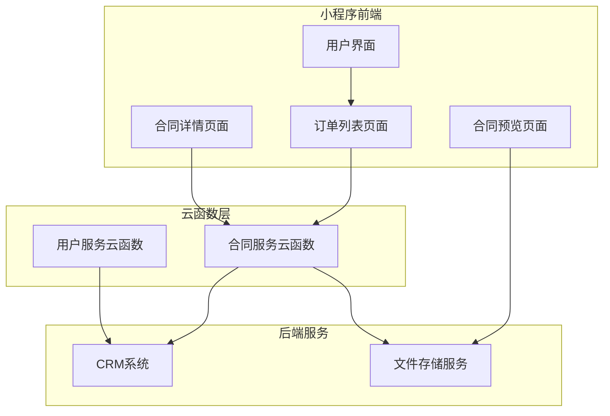
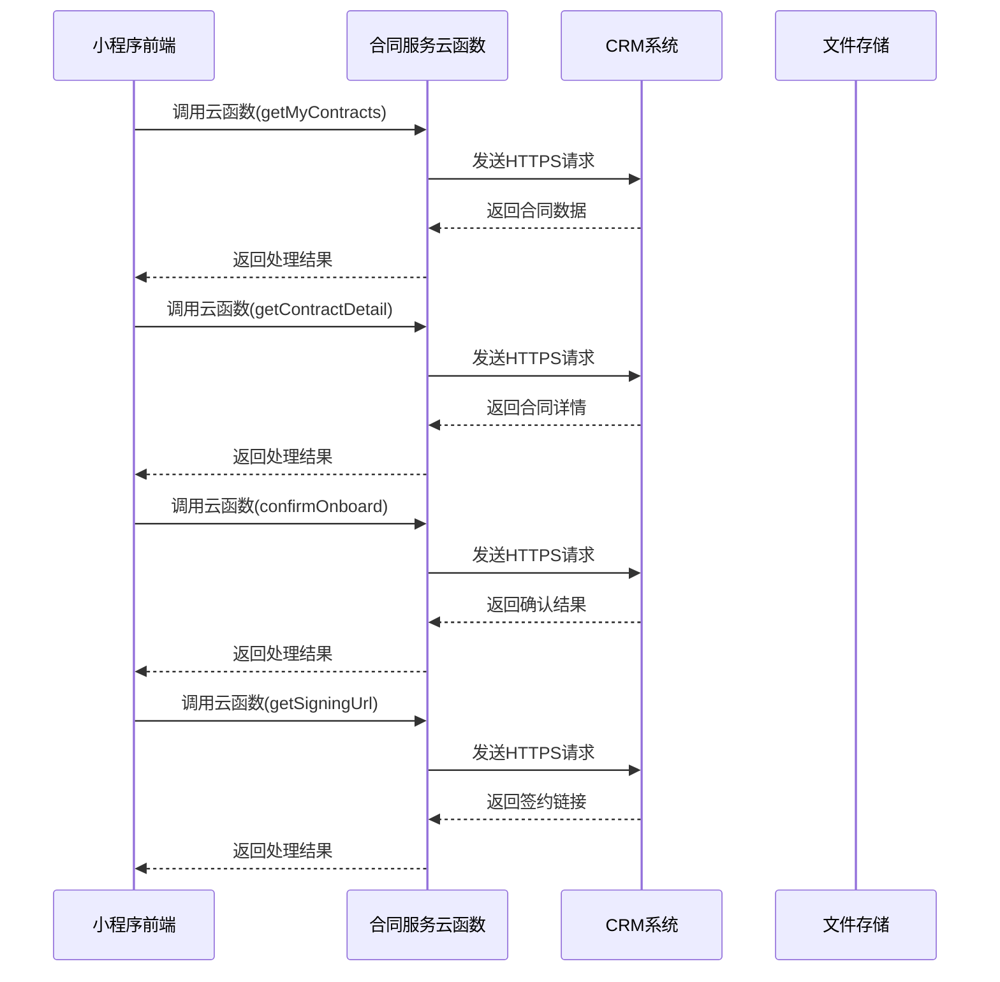
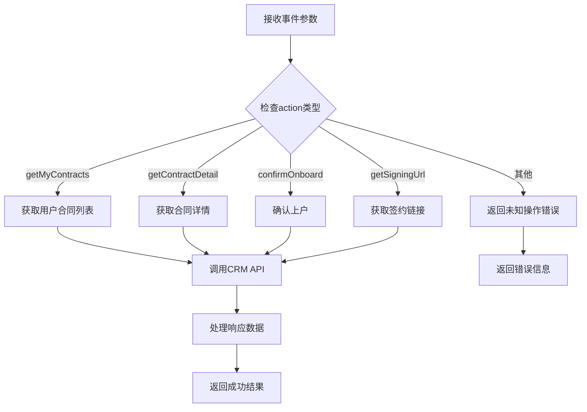
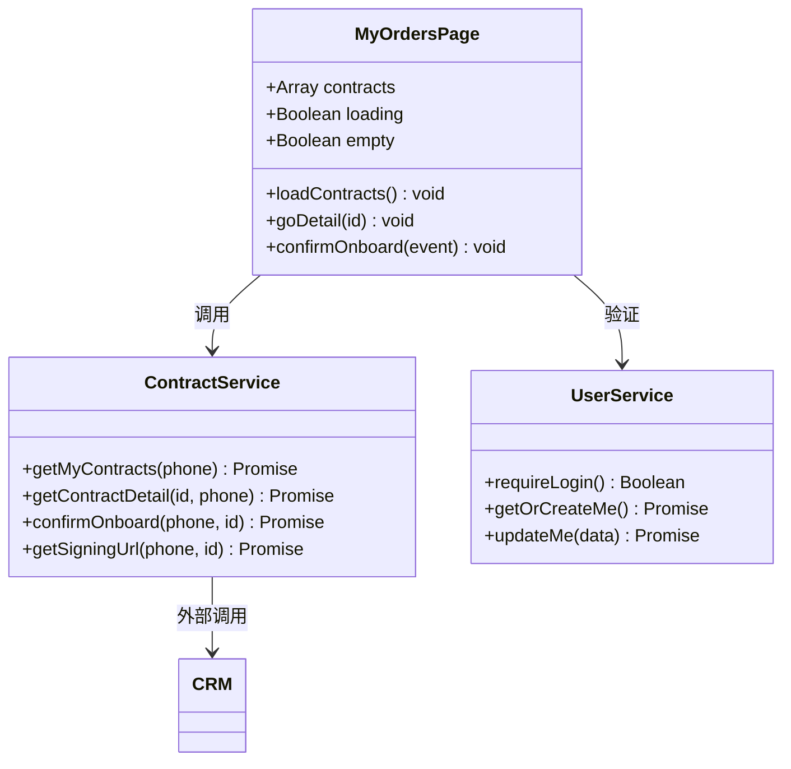
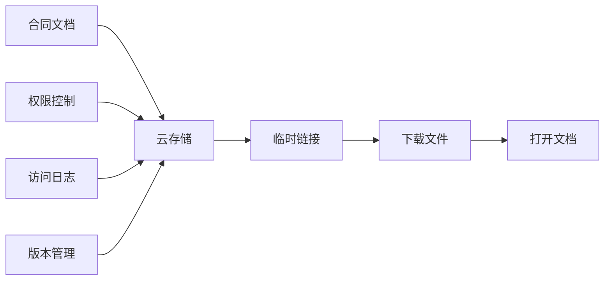
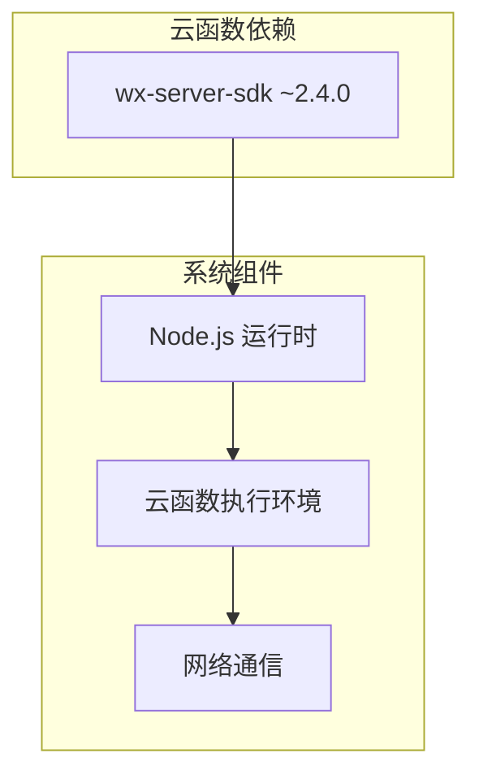
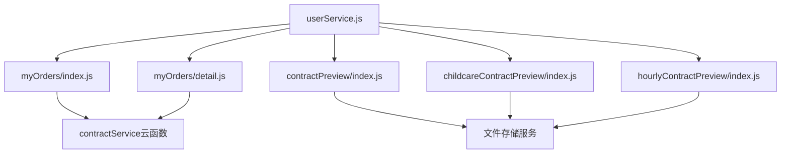

# 合同服务云函数

<cite>
**本文档引用的文件**
- [index.js](file://cloudfunctions/contractService/index.js)
- [package.json](file://cloudfunctions/contractService/package.json)
- [config.json](file://cloudfunctions/contractService/config.json)
- [package-lock.json](file://cloudfunctions/contractService/package-lock.json)
- [index.js](file://miniprogram/pages/myOrders/index.js)
- [detail.js](file://miniprogram/pages/myOrders/detail.js)
- [index.js](file://miniprogram/services/userService.js)
- [index.js](file://miniprogram/pages/contractPreview/index.js)
- [index.js](file://miniprogram/pages/childcareContractPreview/index.js)
- [index.js](file://miniprogram/pages/hourlyContractPreview/index.js)
- [cloudbaserc.json](file://admin-web/cloudbaserc.json)
- [README.md](file://README.md)
</cite>

## 目录
1. [简介](#简介)
2. [项目结构](#项目结构)
3. [核心组件](#核心组件)
4. [架构概览](#架构概览)
5. [详细组件分析](#详细组件分析)
6. [依赖关系分析](#依赖关系分析)
7. [性能考虑](#性能考虑)
8. [故障排除指南](#故障排除指南)
9. [结论](#结论)

## 简介

合同服务云函数是安得褓贝家政服务平台的核心组件之一，负责处理小程序端与CRM系统的合同管理业务。该云函数提供了完整的合同生命周期管理功能，包括合同查询、合同详情获取、上户确认和电子签约等功能。

该系统采用前后端分离架构，小程序端通过云函数调用的方式与CRM后端进行数据交互，确保了数据的安全性和业务逻辑的集中化管理。系统支持多种服务类型的合同管理，包括保姆服务、育儿嫂服务和小时工服务等。

## 项目结构

安得褓贝项目采用模块化的组织方式，合同服务云函数位于`cloudfunctions/contractService`目录下，与小程序前端页面形成清晰的分层架构。

**图表来源**
- [index.js:1-112](file://cloudfunctions/contractService/index.js#L1-L112)
- [index.js:1-121](file://miniprogram/pages/myOrders/index.js#L1-L121)
- [detail.js:1-184](file://miniprogram/pages/myOrders/detail.js#L1-L184)

**章节来源**
- [index.js:1-112](file://cloudfunctions/contractService/index.js#L1-L112)
- [package.json:1-16](file://cloudfunctions/contractService/package.json#L1-L16)
- [config.json:1-7](file://cloudfunctions/contractService/config.json#L1-L7)

## 核心组件

合同服务云函数包含以下核心功能模块：

### 主要功能模块

1. **合同查询模块** - 获取用户的合同列表
2. **合同详情模块** - 获取单个合同的详细信息
3. **上户确认模块** - 确认用户已正式上户
4. **电子签约模块** - 获取电子签约链接

### 技术特性

- **安全认证** - 使用X-Service-Secret进行服务间身份验证
- **HTTPS通信** - 所有外部请求均通过HTTPS协议
- **错误处理** - 完善的异常捕获和错误返回机制
- **环境配置** - 支持动态环境变量配置

**章节来源**
- [index.js:17-52](file://cloudfunctions/contractService/index.js#L17-L52)
- [index.js:54-79](file://cloudfunctions/contractService/index.js#L54-L79)

## 架构概览

合同服务云函数采用微服务架构设计，实现了业务逻辑的解耦和功能的模块化。

**图表来源**
- [index.js:81-110](file://cloudfunctions/contractService/index.js#L81-L110)
- [index.js:42-48](file://miniprogram/pages/myOrders/index.js#L42-L48)
- [detail.js:128-131](file://miniprogram/pages/myOrders/detail.js#L128-L131)

## 详细组件分析

### 云函数核心实现

合同服务云函数采用事件驱动的架构模式，通过单一入口函数处理不同的业务操作。

#### 核心函数结构

**图表来源**
- [index.js:81-110](file://cloudfunctions/contractService/index.js#L81-L110)

#### CRM集成模块

云函数通过专用的`crmRequest`函数与CRM系统进行安全通信：

- **认证机制**：使用X-Service-Secret头进行身份验证
- **客户端标识**：添加X-Client-Type头标识来源
- **HTTPS协议**：确保数据传输安全
- **错误处理**：统一的HTTP状态码和错误解析

**章节来源**
- [index.js:17-52](file://cloudfunctions/contractService/index.js#L17-L52)

### 小程序集成实现

#### 订单管理页面

订单列表页面实现了完整的合同管理功能：

**图表来源**
- [index.js:16-121](file://miniprogram/pages/myOrders/index.js#L16-L121)
- [detail.js:24-184](file://miniprogram/pages/myOrders/detail.js#L24-L184)

#### 合同详情页面

合同详情页面提供了丰富的合同信息展示和操作功能：

- **状态管理**：实时显示合同状态和签约进度
- **操作控制**：根据合同状态动态显示可用操作
- **数据格式化**：提供日期格式化和状态文本转换
- **用户体验**：完善的加载状态和错误提示

**章节来源**
- [detail.js:1-184](file://miniprogram/pages/myOrders/detail.js#L1-L184)

### 文件存储集成

系统支持多种合同文档的在线预览和下载功能：

#### 合同文档管理

**图表来源**
- [index.js:23-129](file://miniprogram/pages/contractPreview/index.js#L23-L129)
- [index.js:23-129](file://miniprogram/pages/childcareContractPreview/index.js#L23-L129)
- [index.js:23-129](file://miniprogram/pages/hourlyContractPreview/index.js#L23-L129)

**章节来源**
- [index.js:1-132](file://miniprogram/pages/contractPreview/index.js#L1-L132)
- [index.js:1-132](file://miniprogram/pages/childcareContractPreview/index.js#L1-L132)
- [index.js:1-132](file://miniprogram/pages/hourlyContractPreview/index.js#L1-L132)

## 依赖关系分析

### 外部依赖

合同服务云函数的依赖关系相对简单，主要依赖于微信云开发SDK：

**图表来源**
- [package.json:11-13](file://cloudfunctions/contractService/package.json#L11-L13)

### 内部模块依赖

小程序端各页面之间的依赖关系形成了清晰的功能层次：

**图表来源**
- [index.js:1-45](file://miniprogram/services/userService.js#L1-L45)
- [index.js:1-121](file://miniprogram/pages/myOrders/index.js#L1-L121)
- [detail.js:1-184](file://miniprogram/pages/myOrders/detail.js#L1-L184)

**章节来源**
- [package-lock.json:1-41](file://cloudfunctions/contractService/package-lock.json#L1-L41)

## 性能考虑

### 云函数性能优化

1. **连接复用**：合理管理HTTPS连接，避免频繁建立新连接
2. **缓存策略**：对于频繁访问的数据考虑适当的缓存机制
3. **异步处理**：充分利用Promise和async/await提升并发性能
4. **资源清理**：及时释放不需要的内存和连接资源

### 网络通信优化

1. **超时控制**：为外部API调用设置合理的超时时间
2. **重试机制**：对临时性错误实现智能重试
3. **错误隔离**：避免单点故障影响整体系统稳定性
4. **监控告警**：建立完善的性能监控和异常告警机制

## 故障排除指南

### 常见问题及解决方案

#### 云函数调用失败

**问题现象**：小程序端调用云函数返回失败

**可能原因**：
1. 云函数部署失败或版本不正确
2. 网络连接异常
3. 参数传递错误

**解决步骤**：
1. 检查云函数部署状态
2. 验证网络连接稳定性
3. 确认参数格式和完整性

#### CRM系统集成问题

**问题现象**：云函数无法正常访问CRM系统

**可能原因**：
1. SERVICE_SECRET配置错误
2. CRM系统服务不可用
3. 网络防火墙阻断

**解决步骤**：
1. 验证环境变量配置
2. 检查CRM系统健康状态
3. 排查网络连通性

#### 合同状态不同步

**问题现象**：小程序显示的合同状态与实际不符

**可能原因**：
1. 缓存数据过期
2. 网络延迟导致的状态更新延迟
3. 并发操作冲突

**解决步骤**：
1. 清除本地缓存数据
2. 手动刷新页面获取最新状态
3. 检查并发操作的事务处理

**章节来源**
- [index.js:106-109](file://cloudfunctions/contractService/index.js#L106-L109)
- [index.js:149-152](file://miniprogram/pages/myOrders/detail.js#L149-L152)

## 结论

合同服务云函数作为安得褓贝平台的核心业务组件，成功实现了合同管理的完整业务流程。该系统具有以下特点：

1. **架构清晰**：采用分层架构设计，职责明确，易于维护和扩展
2. **安全可靠**：通过多重安全措施保护数据传输和存储安全
3. **用户体验**：提供流畅的操作体验和及时的状态反馈
4. **技术先进**：采用现代化的开发技术和最佳实践

未来可以考虑的改进方向包括：
- 增加更完善的日志记录和监控功能
- 优化性能指标，提升响应速度
- 扩展支持更多服务类型的合同管理
- 加强数据备份和灾难恢复机制

该系统为家政服务平台的数字化转型提供了坚实的技术基础，有效提升了业务效率和服务质量。