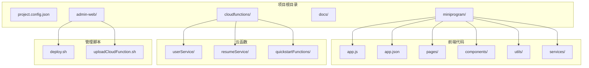
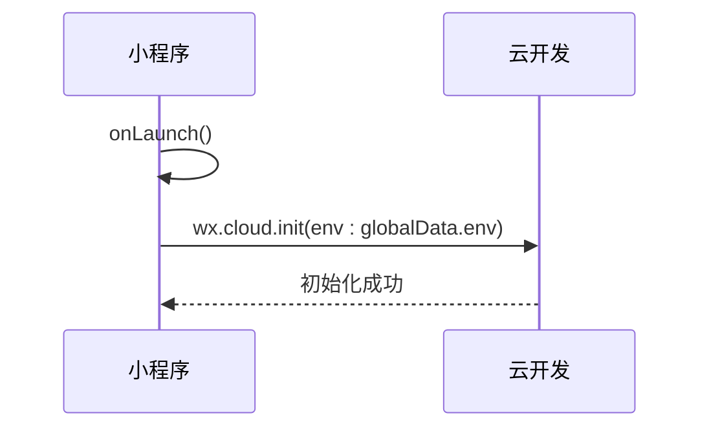
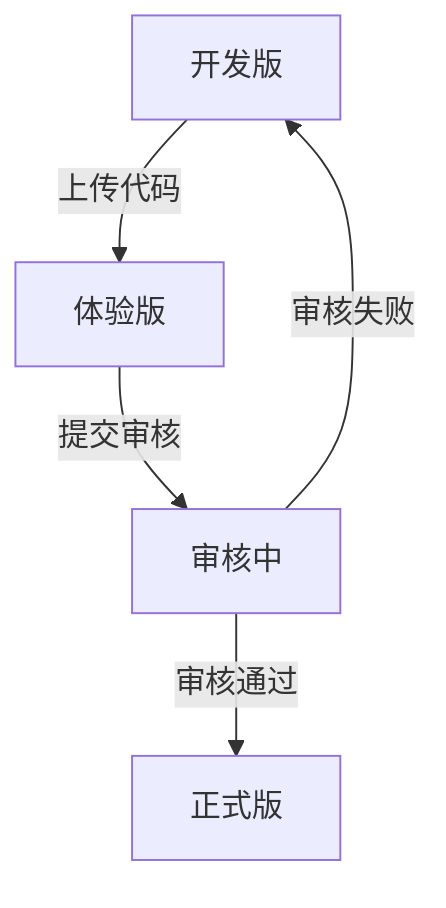

# 前端小程序发布

<cite>
**本文档引用文件**  
- [project.config.json](file://project.config.json)
- [miniprogram/app.js](file://miniprogram/app.js)
- [miniprogram/app.json](file://miniprogram/app.json)
- [miniprogram/sitemap.json](file://miniprogram/sitemap.json)
- [miniprogram/envList.js](file://miniprogram/envList.js)
- [miniprogram/services/auth.js](file://miniprogram/services/auth.js)
- [miniprogram/utils/request.js](file://miniprogram/utils/request.js)
- [cloudfunctions/userService/index.js](file://cloudfunctions/userService/index.js)
- [miniprogram/pages/legal/userAgreement/index.json](file://miniprogram/pages/legal/userAgreement/index.json)
- [miniprogram/pages/legal/privacyPolicy/index.json](file://miniprogram/pages/legal/privacyPolicy/index.json)
</cite>

## 目录
1. [简介](#简介)
2. [项目结构](#项目结构)
3. [核心配置文件详解](#核心配置文件详解)
4. [app.js 与 app.json 的作用](#appjs-与-appjson-的作用)
5. [微信开发者工具版本管理机制](#微信开发者工具版本管理机制)
6. [代码上传与发布流程](#代码上传与发布流程)
7. [发布前检查清单](#发布前检查清单)
8. [常见发布问题排查](#常见发布问题排查)
9. [总结](#总结)

## 简介

本文档旨在为“安得褓贝”小程序的前端开发团队提供完整的代码上传与线上发布指南。涵盖从本地开发环境配置、关键文件说明、微信开发者工具使用、版本管理机制、代码包优化、接口权限声明到发布失败问题排查的全流程指导，确保每次发布稳定、合规、高效。

## 项目结构

安得褓贝小程序采用标准的小程序云开发项目结构，主要分为前端页面、云函数、配置文件和文档四大部分。前端代码位于 `miniprogram/` 目录，云函数位于 `cloudfunctions/` 目录，项目级配置由 `project.config.json` 统一管理。

**Diagram sources**
- [project.config.json](file://project.config.json#L1-L85)
- [miniprogram](file://miniprogram)
- [cloudfunctions](file://cloudfunctions)

**Section sources**
- [project.config.json](file://project.config.json#L1-L85)

## 核心配置文件详解

### project.config.json 关键配置项

`project.config.json` 是微信小程序项目的核心配置文件，决定了项目的编译、运行和部署行为。

#### appid
- **含义**：小程序的唯一标识，由微信平台分配。
- **修改方法**：在微信开发者工具中创建项目时自动填入，或手动替换为已注册的小程序 AppID。
- **当前值**：`wx9144012a42975120`

#### miniprogramRoot
- **含义**：指定小程序前端代码的根目录路径。
- **修改方法**：若前端代码不在项目根目录下，可修改此路径指向正确的目录。
- **当前值**：`miniprogram/`

#### cloudfunctionRoot
- **含义**：指定云函数代码的根目录路径。
- **修改方法**：若云函数目录结构变更，需同步更新此路径。
- **当前值**：`cloudfunctions/`

#### setting 编译设置
- **es6**: 启用 ES6 转 ES5，确保低版本兼容。
- **postcss**: 启用 PostCSS，支持现代 CSS 语法。
- **minified**: 上传时压缩代码，减小包体积。
- **uploadWithSourceMap**: 上传 sourcemap，便于线上错误定位。

**Section sources**
- [project.config.json](file://project.config.json#L1-L85)

## app.js 与 app.json 的作用

### app.js：小程序逻辑入口

`app.js` 是小程序的全局逻辑文件，定义了小程序的生命周期函数和全局数据。

- **onLaunch**：小程序初始化时触发，用于执行全局初始化逻辑。
- **globalData**：定义全局共享数据，如云环境 ID。
- **wx.cloud.init**：初始化云开发能力，指定默认环境和用户追踪。

**关键配置**：
- `env`: 云开发环境 ID，当前为 `cloud1-6gyrh73h8e8206ce`，需在云控制台确认。

**Diagram sources**
- [miniprogram/app.js](file://miniprogram/app.js#L2-L20)

**Section sources**
- [miniprogram/app.js](file://miniprogram/app.js#L2-L20)

### app.json：小程序公共配置

`app.json` 是小程序的全局配置文件，定义了页面路径、窗口样式、底部 tab 等。

#### pages
- 定义所有页面路径，按顺序加载。
- 当前包含首页、消息、简历列表、个人中心等核心页面。

#### window
- 配置默认窗口样式，如背景色、导航栏颜色和标题。

#### tabBar
- 自定义底部 tab 样式，包含“首页”、“消息”、“我的”三个入口。

#### sitemapLocation
- 指定 sitemap.json 路径，控制页面是否被微信索引。

**Section sources**
- [miniprogram/app.json](file://miniprogram/app.json#L1-L54)

## 微信开发者工具版本管理机制

微信小程序提供三种版本类型，用于不同阶段的测试与发布。

### 开发版
- **用途**：开发者本地调试使用。
- **特点**：实时更新，无需上传，仅开发者可见。
- **适用场景**：日常开发、功能调试。

### 体验版
- **用途**：邀请特定用户进行功能预览和测试。
- **特点**：需上传代码并生成体验二维码，体验用户可扫码访问。
- **适用场景**：内部测试、客户演示、灰度测试。

### 正式版
- **用途**：面向所有用户发布的稳定版本。
- **特点**：需提交审核，审核通过后方可发布。
- **适用场景**：功能上线、版本迭代。

**Diagram sources**
- [project.config.json](file://project.config.json#L47)
- [miniprogram/app.json](file://miniprogram/app.json#L2-L54)

## 代码上传与发布流程

### 1. 代码上传
1. 打开微信开发者工具，确保项目配置正确。
2. 点击“上传”按钮，填写版本号和项目备注。
3. 工具自动编译并上传代码包。

### 2. 版本提交
1. 登录[微信公众平台](https://mp.weixin.qq.com)。
2. 进入“开发管理” -> “版本管理”。
3. 选择刚上传的开发版，点击“提交审核”。

### 3. 审核发布
1. 填写审核信息：类目、测试账号、功能说明。
2. 提交后等待微信团队审核（通常1-7天）。
3. 审核通过后，在“审核版本”中点击“发布”。

### 注意事项
- **代码包大小**：主包不超过2MB，总包不超过20MB，建议使用分包加载。
- **合法域名**：所有网络请求域名需在“开发设置”中配置，否则无法请求。
- **接口权限**：敏感接口（如获取手机号）需在“接口设置”中申请并说明用途。

**Section sources**
- [project.config.json](file://project.config.json#L47)
- [miniprogram/utils/request.js](file://miniprogram/utils/request.js#L6)
- [cloudfunctions/userService/index.js](file://cloudfunctions/userService/index.js#L105-L157)

## 发布前检查清单

为确保发布顺利，发布前需完成以下检查：

| 检查项 | 说明 | 文件/位置 |
|--------|------|----------|
| 隐私合规声明 | 是否包含隐私政策页面 | [pages/legal/privacyPolicy/index](file://miniprogram/pages/legal/privacyPolicy/index.json) |
| 用户协议链接 | 是否包含用户协议页面 | [pages/legal/userAgreement/index](file://miniprogram/pages/legal/userAgreement/index.json) |
| 敏感接口调用 | 获取手机号等接口是否已申请权限 | [cloudfunctions/userService/index.js](file://cloudfunctions/userService/index.js#L105-L157) |
| 合法域名配置 | 所有 API 域名是否已添加 | 微信公众平台 - 开发设置 |
| 云环境 ID | app.js 中 env 是否正确 | [miniprogram/app.js](file://miniprogram/app.js#L9) |
| 代码包大小 | 主包是否超限 | 微信开发者工具上传提示 |
| 页面索引 | sitemap 是否允许所有页面被索引 | [miniprogram/sitemap.json](file://miniprogram/sitemap.json#L4-L5) |

**Section sources**
- [miniprogram/app.js](file://miniprogram/app.js#L9)
- [miniprogram/sitemap.json](file://miniprogram/sitemap.json#L1-L7)
- [miniprogram/pages/legal/userAgreement/index.json](file://miniprogram/pages/legal/userAgreement/index.json#L1-L4)
- [miniprogram/pages/legal/privacyPolicy/index.json](file://miniprogram/pages/legal/privacyPolicy/index.json#L1-L4)

## 常见发布问题排查

### 证书错误
- **原因**：HTTPS 证书无效或域名未备案。
- **解决方案**：确保使用有效的 SSL 证书，域名已完成 ICP 备案。

### 包大小超限
- **原因**：主包资源过多。
- **解决方案**：
  - 使用分包加载（subpackages）。
  - 压缩图片资源，移除未使用代码。
  - 将大体积库文件放入分包。

### WXML 语法错误
- **原因**：标签未闭合、属性名错误等。
- **解决方案**：
  - 在开发者工具中查看控制台错误提示。
  - 使用格式化工具检查 WXML 结构。

### 接口调用失败
- **原因**：域名未配置、Token 过期、参数错误。
- **解决方案**：
  - 检查 `request.js` 中的 `BASE_URL` 和请求头。
  - 确保 `Authorization` Token 有效。
  - 查看云函数日志（`userService/index.js`）。

**Section sources**
- [miniprogram/utils/request.js](file://miniprogram/utils/request.js#L47-L103)
- [cloudfunctions/userService/index.js](file://cloudfunctions/userService/index.js#L258-L288)

## 总结

本文档系统梳理了“安得褓贝”小程序的发布全流程，从项目结构、核心配置、版本管理到发布检查与问题排查，提供了全面的实践指导。开发者应严格遵循发布流程，确保每次上线都经过充分测试与合规审查，保障用户体验与系统稳定性。