# 环境配置管理

<cite>
**本文档引用文件**  
- [project.config.json](file://project.config.json)
- [miniprogram/app.js](file://miniprogram/app.js)
- [admin-web/cloudbaserc.json](file://admin-web/cloudbaserc.json)
- [miniprogram/envList.js](file://miniprogram/envList.js)
- [uploadCloudFunction.sh](file://uploadCloudFunction.sh)
- [admin-web/deploy.sh](file://admin-web/deploy.sh)
- [cloudfunctions/*/index.js](file://cloudfunctions/quickstartFunctions/index.js)
</cite>

## 目录
1. [项目结构](#项目结构)
2. [核心配置文件分析](#核心配置文件分析)
3. [环境隔离策略](#环境隔离策略)
4. [多环境切换机制](#多环境切换机制)
5. [前端环境变量管理](#前端环境变量管理)
6. [部署流程与检查清单](#部署流程与检查清单)
7. [最佳实践](#最佳实践)
8. [常见问题诊断与修复](#常见问题诊断与修复)
9. [总结](#总结)

## 项目结构

安得褓贝项目采用微信小程序与云开发结合的架构，包含小程序前端、云函数和管理后台三个主要部分。项目结构清晰地分离了不同环境的配置和功能模块。

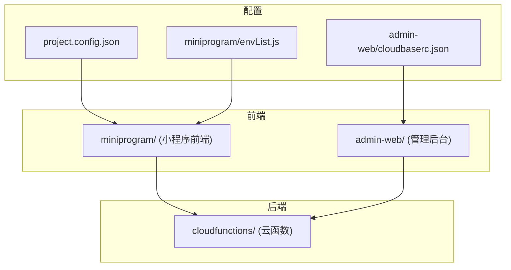

**Diagram sources**
- [project.config.json](file://project.config.json)
- [admin-web/cloudbaserc.json](file://admin-web/cloudbaserc.json)
- [miniprogram/envList.js](file://miniprogram/envList.js)

**Section sources**
- [project.config.json](file://project.config.json)
- [admin-web/cloudbaserc.json](file://admin-web/cloudbaserc.json)
- [miniprogram/envList.js](file://miniprogram/envList.js)

## 核心配置文件分析

### project.config.json 配置分析

`project.config.json` 是小程序项目的核心配置文件，定义了项目的基本信息和开发设置。

```mermaid
classDiagram
class ProjectConfig {
+string miniprogramRoot
+string cloudfunctionRoot
+object setting
+string appid
+string projectname
+string libVersion
+object condition
+string compileType
}
ProjectConfig : envId : string
ProjectConfig : appid : wx9144012a42975120
```

该文件中的 `appid` 字段（`wx9144012a42975120`）是小程序的唯一标识，所有环境共享同一个 appid。这种设计确保了小程序在不同环境中的一致性，同时通过其他机制实现环境隔离。

**Section sources**
- [project.config.json](file://project.config.json#L47)

### cloudbaserc.json 配置分析

`admin-web/cloudbaserc.json` 文件定义了管理后台的云开发环境配置。

```mermaid
classDiagram
class CloudBaseRC {
+string $schema
+string version
+string envId
+object framework
}
CloudBaseRC : envId : cloud1-6gyrh73h8e8206ce
CloudBaseRC : framework.name : admin-web
```

该配置文件中的 `envId` 字段（`cloud1-6gyrh73h8e8206ce`）指定了管理后台部署的目标云环境。通过修改此值，可以实现不同环境之间的切换。

**Section sources**
- [admin-web/cloudbaserc.json](file://admin-web/cloudbaserc.json#L4)

### app.js 初始化配置

`miniprogram/app.js` 文件中的初始化代码定义了小程序运行时的环境配置。

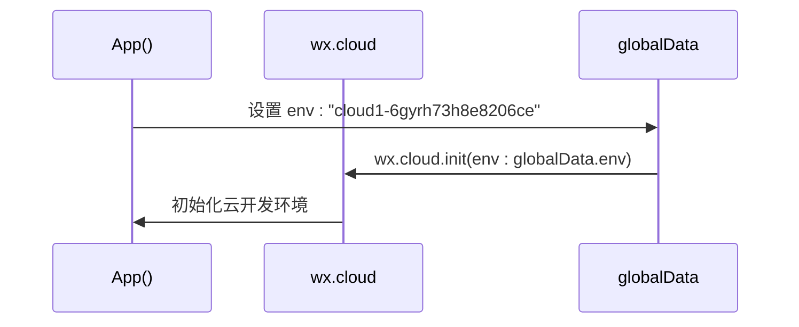

在 `onLaunch` 生命周期中，通过 `wx.cloud.init()` 方法初始化云开发环境，使用 `globalData.env` 中指定的环境 ID。这种设计允许在运行时动态切换环境。

**Diagram sources**
- [miniprogram/app.js](file://miniprogram/app.js#L9)
- [miniprogram/app.js](file://miniprogram/app.js#L15)

**Section sources**
- [miniprogram/app.js](file://miniprogram/app.js#L2-L20)

## 环境隔离策略

### 环境 ID 隔离机制

项目采用微信云开发的多环境功能实现数据隔离。所有环境共享同一个 `appid`，但使用不同的环境 ID 来区分数据和资源。

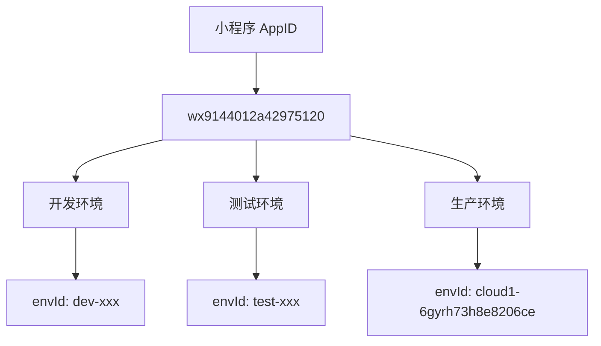

这种策略的优势包括：
- **一致性**：所有环境使用相同的 appid，确保小程序行为一致
- **隔离性**：不同环境的数据完全隔离，避免相互影响
- **灵活性**：可以轻松创建和管理多个环境

**Diagram sources**
- [project.config.json](file://project.config.json#L47)
- [miniprogram/app.js](file://miniprogram/app.js#L9)

**Section sources**
- [project.config.json](file://project.config.json)
- [miniprogram/app.js](file://miniprogram/app.js)

### 云函数环境配置

每个云函数都有独立的配置文件，用于定义其权限和依赖。

```mermaid
erDiagram
USER_SERVICE ||--o{ CONFIG : "has"
RESUME_SERVICE ||--o{ CONFIG : "has"
QUICKSTART_FUNCTIONS ||--o{ CONFIG : "has"
CONFIG {
string permissions
array openapi
}
USER_SERVICE {
string name : userService
string env : DYNAMIC_CURRENT_ENV
}
RESUME_SERVICE {
string name : resumeService
string env : DYNAMIC_CURRENT_ENV
}
QUICKSTART_FUNCTIONS {
string name : quickstartFunctions
string env : DYNAMIC_CURRENT_ENV
}
```

所有云函数都使用 `cloud.DYNAMIC_CURRENT_ENV` 作为环境标识，这意味着它们会自动使用调用方指定的环境，实现了环境感知能力。

**Diagram sources**
- [cloudfunctions/userService/index.js](file://cloudfunctions/userService/index.js#L3)
- [cloudfunctions/resumeService/index.js](file://cloudfunctions/resumeService/index.js#L3)
- [cloudfunctions/quickstartFunctions/index.js](file://cloudfunctions/quickstartFunctions/index.js#L3)

**Section sources**
- [cloudfunctions/*/index.js](file://cloudfunctions/quickstartFunctions/index.js)
- [cloudfunctions/*/config.json](file://cloudfunctions/userService/config.json)

## 多环境切换机制

### 环境切换配置

项目通过多种方式支持环境切换，确保开发、测试和生产环境的正确使用。

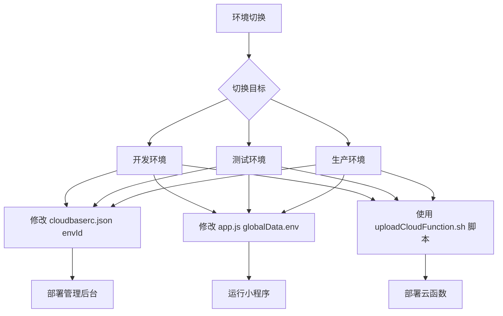

**Diagram sources**
- [admin-web/cloudbaserc.json](file://admin-web/cloudbaserc.json#L4)
- [miniprogram/app.js](file://miniprogram/app.js#L9)
- [uploadCloudFunction.sh](file://uploadCloudFunction.sh)

**Section sources**
- [admin-web/cloudbaserc.json](file://admin-web/cloudbaserc.json)
- [miniprogram/app.js](file://miniprogram/app.js)
- [uploadCloudFunction.sh](file://uploadCloudFunction.sh)

### 部署脚本分析

项目提供了自动化部署脚本，简化了多环境部署流程。

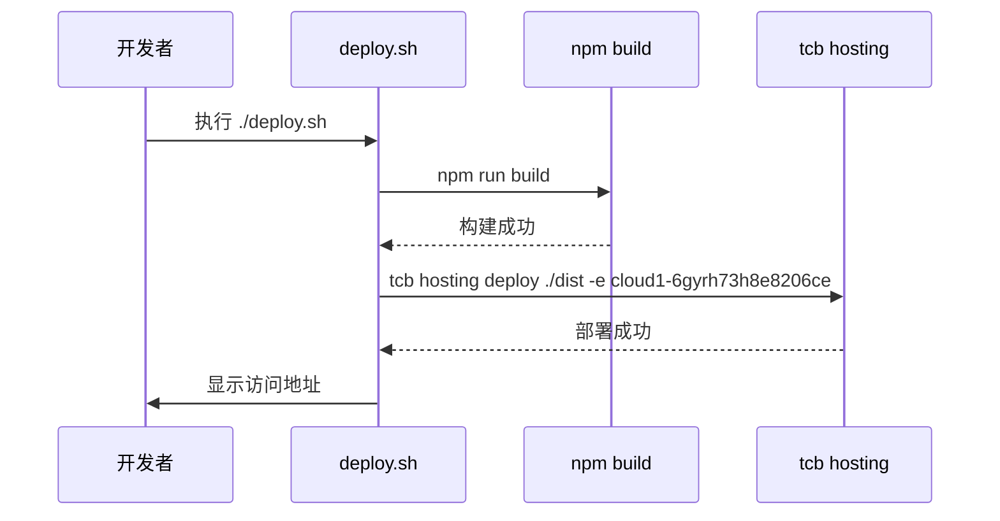

`admin-web/deploy.sh` 脚本实现了管理后台的一键部署，自动执行构建和部署到指定环境的流程。

**Diagram sources**
- [admin-web/deploy.sh](file://admin-web/deploy.sh#L10)
- [admin-web/deploy.sh](file://admin-web/deploy.sh#L20)

**Section sources**
- [admin-web/deploy.sh](file://admin-web/deploy.sh)

## 前端环境变量管理

### envList.js 配置分析

`miniprogram/envList.js` 文件用于管理前端环境变量。

```mermaid
classDiagram
class EnvListModule {
+array envList
+boolean isMac
}
EnvListModule : envList : []
EnvListModule : isMac : false
```

目前该文件为空数组，但为未来扩展多环境支持提供了基础结构。可以通过填充 `envList` 数组来支持环境选择功能。

**Section sources**
- [miniprogram/envList.js](file://miniprogram/envList.js)

### 环境变量使用模式

项目中环境变量的使用遵循最佳实践，避免硬编码。

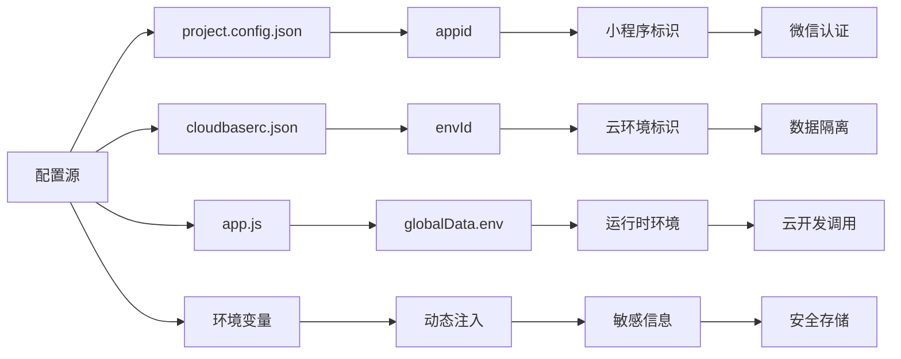

**Diagram sources**
- [project.config.json](file://project.config.json#L47)
- [admin-web/cloudbaserc.json](file://admin-web/cloudbaserc.json#L4)
- [miniprogram/app.js](file://miniprogram/app.js#L9)

**Section sources**
- [project.config.json](file://project.config.json)
- [admin-web/cloudbaserc.json](file://admin-web/cloudbaserc.json)
- [miniprogram/app.js](file://miniprogram/app.js)

## 部署流程与检查清单

### 标准化部署流程

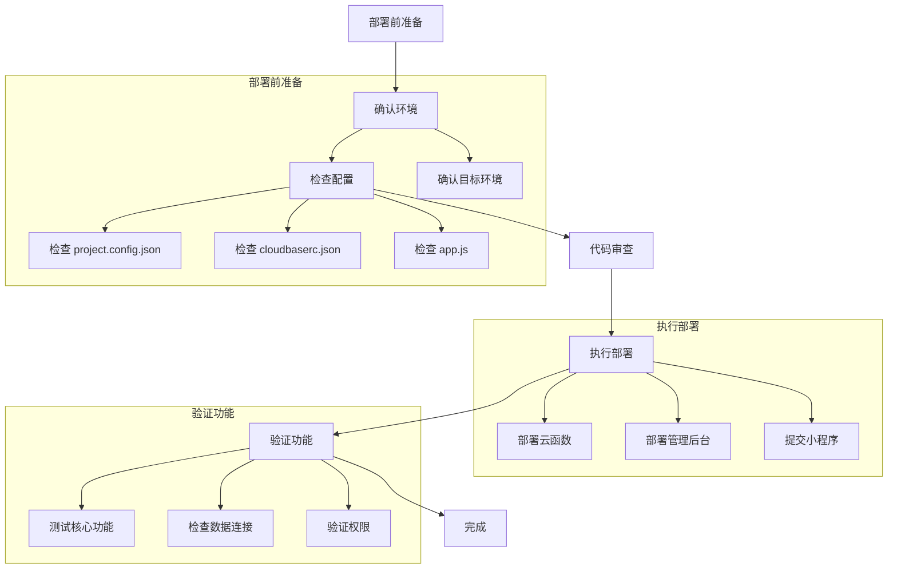

**Diagram sources**
- [project.config.json](file://project.config.json)
- [admin-web/cloudbaserc.json](file://admin-web/cloudbaserc.json)
- [miniprogram/app.js](file://miniprogram/app.js)

### 部署检查清单

| 检查项 | 开发环境 | 测试环境 | 生产环境 | 备注 |
|--------|----------|----------|----------|------|
| **配置文件** | | | | |
| project.config.json appid | ✓ | ✓ | ✓ | 所有环境相同 |
| cloudbaserc.json envId | dev-xxx | test-xxx | prod-xxx | 环境特定 |
| app.js globalData.env | dev-xxx | test-xxx | prod-xxx | 环境特定 |
| **部署脚本** | | | | |
| deploy.sh 目标环境 | ✓ | ✓ | ✓ | 确认正确 |
| uploadCloudFunction.sh 参数 | ✓ | ✓ | ✓ | 检查 envId |
| **安全检查** | | | | |
| 敏感信息加密 | ✓ | ✓ | ✓ | 避免明文 |
| .gitignore 配置 | ✓ | ✓ | ✓ | 保护配置 |
| 权限最小化 | ✓ | ✓ | ✓ | 遵循原则 |

**Section sources**
- [project.config.json](file://project.config.json)
- [admin-web/cloudbaserc.json](file://admin-web/cloudbaserc.json)
- [miniprogram/app.js](file://miniprogram/app.js)
- [admin-web/deploy.sh](file://admin-web/deploy.sh)
- [uploadCloudFunction.sh](file://uploadCloudFunction.sh)

## 最佳实践

### 配置管理最佳实践

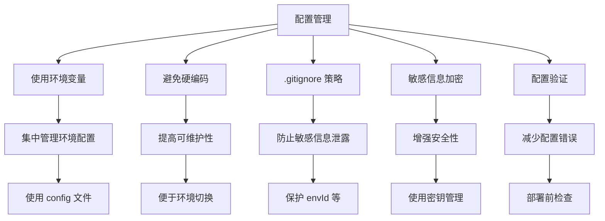

**Diagram sources**
- [project.config.json](file://project.config.json)
- [admin-web/cloudbaserc.json](file://admin-web/cloudbaserc.json)
- [miniprogram/app.js](file://miniprogram/app.js)

### 灰度发布策略

利用微信云开发的多环境功能，可以实现安全的灰度发布。

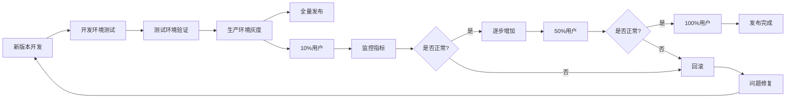

**Diagram sources**
- [admin-web/cloudbaserc.json](file://admin-web/cloudbaserc.json)
- [miniprogram/app.js](file://miniprogram/app.js)

**Section sources**
- [admin-web/cloudbaserc.json](file://admin-web/cloudbaserc.json)
- [miniprogram/app.js](file://miniprogram/app.js)

## 常见问题诊断与修复

### 数据库连接失败

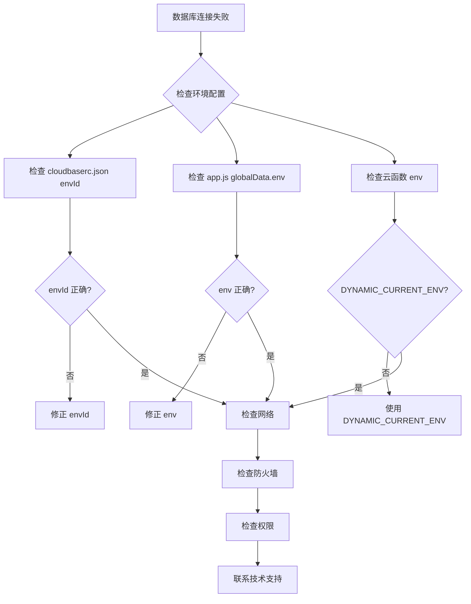

**Diagram sources**
- [admin-web/cloudbaserc.json](file://admin-web/cloudbaserc.json#L4)
- [miniprogram/app.js](file://miniprogram/app.js#L9)
- [cloudfunctions/*/index.js](file://cloudfunctions/quickstartFunctions/index.js#L3)

### 函数调用403错误

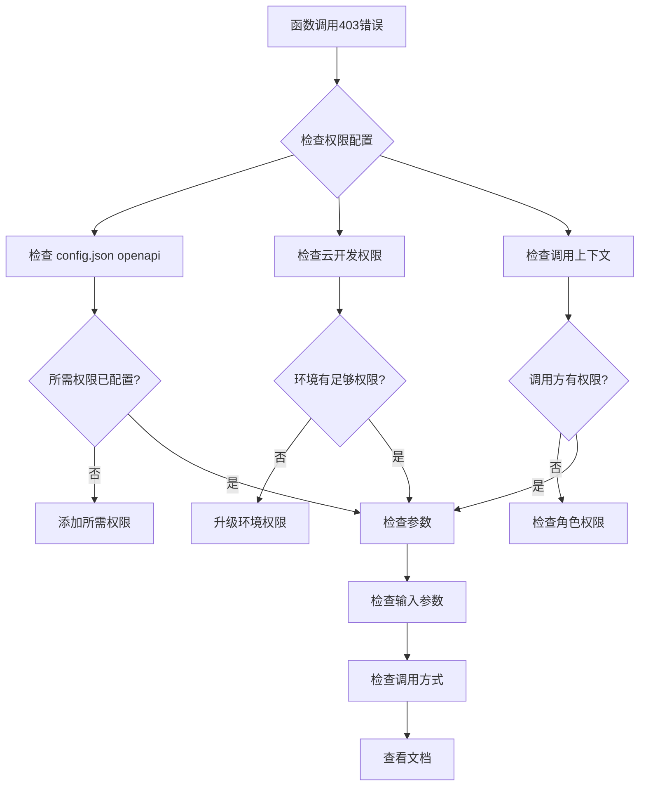

**Diagram sources**
- [cloudfunctions/*/config.json](file://cloudfunctions/userService/config.json#L3)
- [cloudfunctions/*/index.js](file://cloudfunctions/userService/index.js)

**Section sources**
- [cloudfunctions/*/config.json](file://cloudfunctions/userService/config.json)
- [cloudfunctions/*/index.js](file://cloudfunctions/userService/index.js)

## 总结

安得褓贝项目通过合理的环境配置管理策略，实现了开发、测试和生产环境的有效隔离。项目采用微信云开发的多环境功能，通过统一的 `appid` 和不同的 `envId` 实现环境隔离，确保了配置的一致性和数据的安全性。

关键配置要点包括：
- 所有环境共享同一个 `appid`（`wx9144012a42975120`）
- 使用不同的 `envId`（如 `cloud1-6gyrh73h8e8206ce`）实现数据隔离
- 云函数使用 `cloud.DYNAMIC_CURRENT_ENV` 实现环境感知
- 通过 `cloudbaserc.json` 和 `app.js` 配置文件管理环境切换
- 提供自动化部署脚本简化部署流程

建议团队遵循配置管理最佳实践，使用环境变量而非硬编码，合理配置 `.gitignore` 文件保护敏感信息，并建立标准化的部署检查清单，确保部署过程的安全性和可靠性。