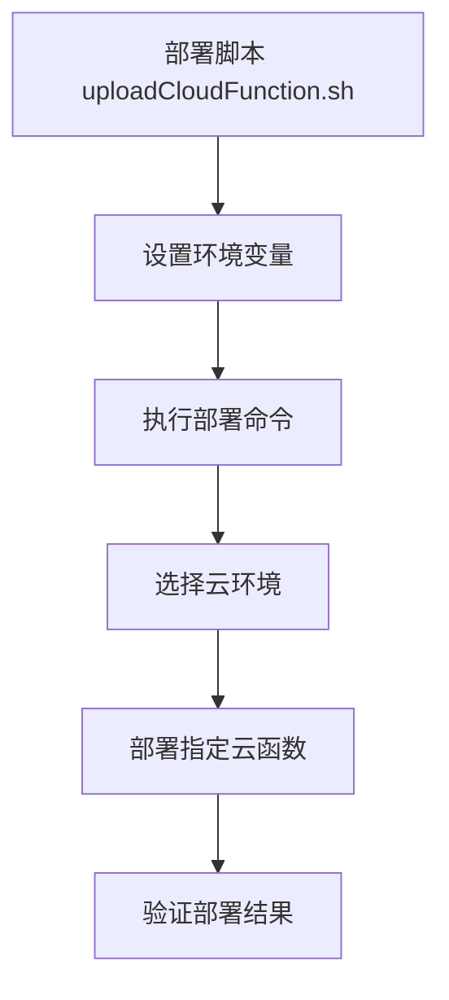
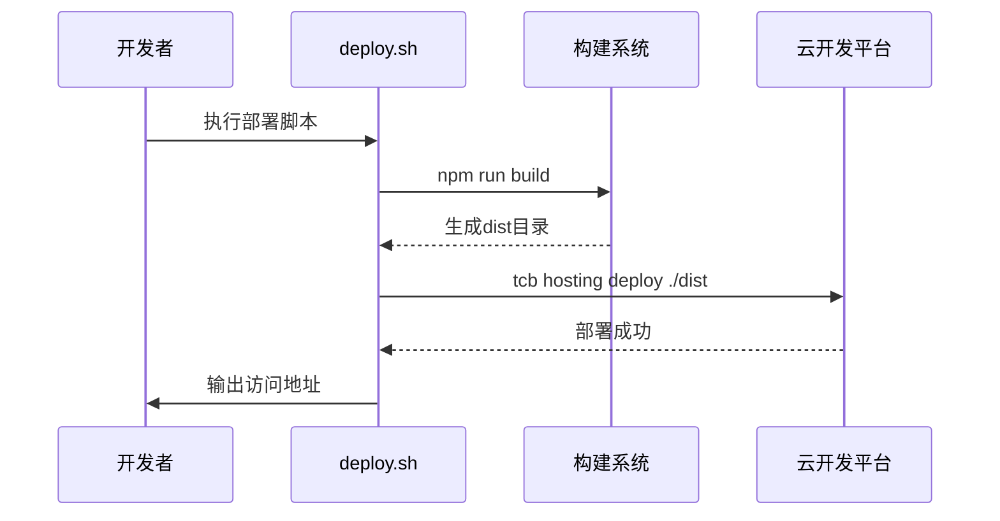
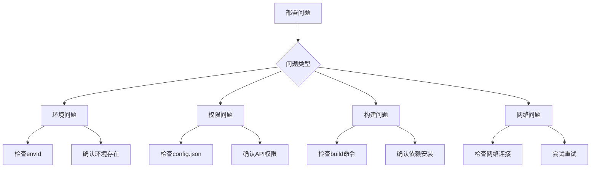

# 部署与维护

<cite>
**本文档引用的文件**  
- [admin-web/cloudbaserc.json](file://admin-web/cloudbaserc.json)
- [admin-web/deploy.sh](file://admin-web/deploy.sh)
- [uploadCloudFunction.sh](file://uploadCloudFunction.sh)
- [miniprogram/app.js](file://miniprogram/app.js)
- [miniprogram/envList.js](file://miniprogram/envList.js)
- [cloudfunctions/resumeService/config.json](file://cloudfunctions/resumeService/config.json)
- [cloudfunctions/userService/config.json](file://cloudfunctions/userService/config.json)
- [cloudfunctions/quickstartFunctions/config.json](file://cloudfunctions/quickstartFunctions/config.json)
- [cloudfunctions/resumeService/package.json](file://cloudfunctions/resumeService/package.json)
- [cloudfunctions/userService/package.json](file://cloudfunctions/userService/package.json)
- [cloudfunctions/quickstartFunctions/package.json](file://cloudfunctions/quickstartFunctions/package.json)
- [project.private.config.json](file://project.private.config.json)
- [docs/Web管理后台快速实施指南.md](file://docs/Web管理后台快速实施指南.md)
</cite>

## 目录
1. [简介](#简介)
2. [微信小程序部署配置](#微信小程序部署配置)
3. [云函数批量部署](#云函数批量部署)
4. [Web管理后台自动化部署](#web管理后台自动化部署)
5. [环境配置最佳实践](#环境配置最佳实践)
6. [常见部署问题排查](#常见部署问题排查)
7. [项目维护注意事项](#项目维护注意事项)

## 简介
本文档为“安得褓贝”项目提供完整的部署与维护指南，涵盖从零开始的部署流程、环境配置、自动化脚本使用、问题排查及长期维护策略。文档基于项目实际文件结构和配置，确保操作的准确性和可执行性。

## 微信小程序部署配置
### 云开发环境ID设置
在微信小程序中，云开发环境ID决定了小程序调用云能力时所使用的云资源环境。该配置在 `miniprogram/app.js` 文件中通过 `env` 参数指定。

```javascript
App({
  onLaunch: function () {
    this.globalData = {
      env: "cloud1-6gyrh73h8e8206ce" // 云环境ID
    };
    wx.cloud.init({
      env: this.globalData.env,
      traceUser: true,
    });
  }
});
```

**配置说明：**
- `env`：必须填写正确的云环境ID，可在微信云开发控制台查看。
- 若未填写，则默认使用第一个创建的环境。

### 开发环境配置
`miniprogram/envList.js` 文件用于管理多环境配置，当前为空数组，表示未配置多环境切换机制。建议根据开发、测试、生产环境添加相应的环境ID。

**Section sources**
- [miniprogram/app.js](file://miniprogram/app.js#L1-L20)
- [miniprogram/envList.js](file://miniprogram/envList.js#L1-L7)

## 云函数批量部署
### 部署脚本分析
项目根目录下的 `uploadCloudFunction.sh` 脚本用于批量部署云函数。该脚本通过环境变量控制部署行为。

```bash
${installPath} cloud functions deploy --e ${envId} --n quickstartFunctions --r --project ${projectPath}
```

**脚本参数说明：**
- `${installPath}`：微信开发者工具安装路径
- `--e ${envId}`：指定部署的云环境ID
- `--n quickstartFunctions`：指定要部署的云函数名称
- `--r`：覆盖部署，删除远程函数后重新上传
- `--project ${projectPath}`：指定项目路径

### 云函数配置与权限
各云函数的 `config.json` 文件定义了其所需的API权限：

- **resumeService**：无特殊权限需求
- **userService**：需要 `phonenumber.getPhoneNumber` 权限用于获取用户手机号
- **quickstartFunctions**：需要 `wxacode.get` 权限用于生成小程序码

所有云函数均依赖 `wx-server-sdk` 作为基础开发包，版本为 `~2.4.0`。



**Diagram sources**
- [uploadCloudFunction.sh](file://uploadCloudFunction.sh#L1)
- [cloudfunctions/resumeService/config.json](file://cloudfunctions/resumeService/config.json#L1-L6)
- [cloudfunctions/userService/config.json](file://cloudfunctions/userService/config.json#L1-L6)
- [cloudfunctions/quickstartFunctions/config.json](file://cloudfunctions/quickstartFunctions/config.json#L1-L7)

**Section sources**
- [uploadCloudFunction.sh](file://uploadCloudFunction.sh#L1)
- [cloudfunctions/resumeService/config.json](file://cloudfunctions/resumeService/config.json#L1-L6)
- [cloudfunctions/userService/config.json](file://cloudfunctions/userService/config.json#L1-L6)
- [cloudfunctions/quickstartFunctions/config.json](file://cloudfunctions/quickstartFunctions/config.json#L1-L7)
- [cloudfunctions/resumeService/package.json](file://cloudfunctions/resumeService/package.json#L1-L12)
- [cloudfunctions/userService/package.json](file://cloudfunctions/userService/package.json#L1-L12)
- [cloudfunctions/quickstartFunctions/package.json](file://cloudfunctions/quickstartFunctions/package.json#L1-L15)

## Web管理后台自动化部署
### 部署流程
Web管理后台位于 `admin-web` 目录，通过 `deploy.sh` 脚本实现自动化部署。

**部署步骤：**
1. 执行 `npm run build` 构建生产版本
2. 检查 `dist` 目录是否存在
3. 使用 `tcb hosting deploy` 命令部署到云开发静态网站托管
4. 输出访问地址

```bash
#!/bin/bash
echo "🚀 开始部署 Web 管理后台..."
npm run build
if [ ! -d "dist" ]; then
  echo "❌ 构建失败，dist 目录不存在"
  exit 1
fi
tcb hosting deploy ./dist -e cloud1-6gyrh73h8e8206ce
echo "✅ 部署完成！"
```

### 部署配置文件
`cloudbaserc.json` 文件定义了Web应用的部署配置：

- `envId`：指定部署环境ID
- `framework.plugins.client.inputs`：
  - `buildCommand`：构建命令
  - `outputPath`：构建输出目录
  - `cloudPath`：云托管路径
  - `ignore`：忽略上传的文件列表



**Diagram sources**
- [admin-web/deploy.sh](file://admin-web/deploy.sh#L1-L28)
- [admin-web/cloudbaserc.json](file://admin-web/cloudbaserc.json#L1-L26)

**Section sources**
- [admin-web/deploy.sh](file://admin-web/deploy.sh#L1-L28)
- [admin-web/cloudbaserc.json](file://admin-web/cloudbaserc.json#L1-L26)

## 环境配置最佳实践
### 多环境管理
建议采用以下环境管理策略：

1. **环境隔离**：为开发、测试、生产环境创建独立的云环境
2. **配置文件分离**：使用不同的配置文件管理各环境参数
3. **环境变量注入**：通过CI/CD系统注入环境变量

### 配置文件优先级
根据 `project.private.config.json` 的注释说明，私有配置文件会覆盖主配置文件中的相同字段，且项目改动优先同步到此文件。

**最佳实践建议：**
- 开发环境：使用本地调试配置
- 测试环境：使用独立的测试云环境
- 生产环境：严格控制访问权限，启用HTTPS和域名验证

**Section sources**
- [project.private.config.json](file://project.private.config.json#L1-L25)
- [docs/Web管理后台快速实施指南.md](file://docs/Web管理后台快速实施指南.md#L1-L614)

## 常见部署问题排查
### 云环境未找到
**症状**：部署时报错“环境不存在”或“envId无效”

**解决方案：**
1. 登录微信云开发控制台确认环境ID
2. 检查 `app.js` 和部署脚本中的envId是否一致
3. 确认当前账号有该环境的访问权限

### 函数部署失败
**症状**：上传云函数时报错“部署失败”或“权限不足”

**解决方案：**
1. 检查 `config.json` 中的权限配置是否正确
2. 确认 `package.json` 中的依赖已正确安装
3. 检查磁盘空间和网络连接
4. 尝试使用 `--r` 参数重新部署

### 构建失败
**症状**：`deploy.sh` 脚本中提示“dist目录不存在”

**解决方案：**
1. 检查 `npm run build` 命令是否能在本地成功执行
2. 确认 `node_modules` 是否完整
3. 检查 `vite.config.js` 或 `webpack` 配置是否正确



**Diagram sources**
- [admin-web/deploy.sh](file://admin-web/deploy.sh#L13-L15)
- [uploadCloudFunction.sh](file://uploadCloudFunction.sh#L1)

## 项目维护注意事项
### 云函数版本管理
- 每次部署前备份当前版本
- 使用语义化版本号标记重要版本
- 对核心函数（如userService）进行灰度发布
- 记录每次变更的变更日志

### 数据库备份策略
- 启用云数据库自动备份功能
- 定期导出重要数据（如用户信息、简历数据）
- 将备份数据存储在独立的存储桶中
- 测试恢复流程以确保备份有效性

### 监控告警设置
- 配置云函数调用监控
- 设置异常调用告警（如高频调用、失败率上升）
- 监控数据库读写性能
- 配置存储空间使用告警

**Section sources**
- [docs/Web管理后台快速实施指南.md](file://docs/Web管理后台快速实施指南.md#L1-L614)
- [admin-web/deploy.sh](file://admin-web/deploy.sh#L1-L28)
- [uploadCloudFunction.sh](file://uploadCloudFunction.sh#L1)