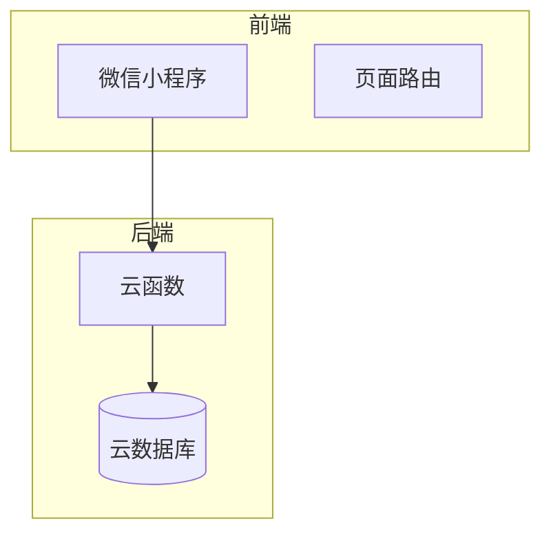

# 项目概述

<cite>
**本文档引用文件**  
- [README.md](file://README.md)
- [PRD.md](file://PRD.md)
- [app.js](file://miniprogram/app.js)
- [app.json](file://miniprogram/app.json)
- [resumeService/index.js](file://cloudfunctions/resumeService/index.js)
- [userService/index.js](file://cloudfunctions/userService/index.js)
- [resumeList/index.js](file://miniprogram/pages/resumeList/index.js)
- [resumeDetail/index.js](file://miniprogram/pages/resumeDetail/index.js)
- [resumeEdit/index.js](file://miniprogram/pages/admin/resumeEdit/index.js)
- [resumeManage/index.js](file://miniprogram/pages/admin/resumeManage/index.js)
- [resume.js](file://miniprogram/services/resume.js)
- [auth.js](file://miniprogram/services/auth.js)
- [cloudbaserc.json](file://admin-web/cloudbaserc.json)
- [安得家政架构分析-真实方案.md](file://docs/安得家政架构分析-真实方案.md)
- [API完整文档.md](file://API完整文档.md)
</cite>

## 目录
1. [项目简介](#项目简介)
2. [核心功能与业务目标](#核心功能与业务目标)
3. [用户角色与使用场景](#用户角色与使用场景)
4. [技术架构与设计原则](#技术架构与设计原则)
5. [功能范围与边界](#功能范围与边界)
6. [项目启动与配置](#项目启动与配置)
7. [基础概念指引](#基础概念指引)

## 项目简介

安得褓贝是一个基于微信小程序平台的全栈应用，专注于月嫂阿姨简历的展示与管理。该项目利用微信云开发技术栈，实现了前后端分离的架构，通过云函数、云数据库和云存储三大核心能力，为C端客户和员工端提供高效、安全的服务。项目旨在通过数字化手段，提升月嫂服务的透明度和管理效率，满足客户浏览和员工管理的双重需求。

**Section sources**
- [README.md](file://README.md#L1-L13)
- [PRD.md](file://PRD.md#L1-L353)

## 核心功能与业务目标

安得褓贝项目的核心功能包括简历列表、简历详情、简历搜索和员工管理。C端用户可以浏览已发布的阿姨简历，获取详细的个人信息和服务介绍。员工则可以在小程序内完成简历的增删改查及发布状态管理。项目通过微信云开发能力，确保了数据的安全性和服务的稳定性，实现了高效的数据交互和管理。

**Section sources**
- [PRD.md](file://PRD.md#L1-L353)
- [resumeService/index.js](file://cloudfunctions/resumeService/index.js#L1-L216)

## 用户角色与使用场景

### 角色定义

| 角色 | 标识 | 主要权限 | 获取方式 |
| --- | --- | --- | --- |
| 客户/访客 | `customer` | 浏览已发布简历（列表/详情） | 若不在 `staff` 集合中，则在 `users.role` 记录为 `customer` |
| 员工 | `staff` | 额外拥有简历管理权限（列表管理、创建/编辑、删除、发布/草稿） | 若在 `staff` 集合中存在 `openid` 记录，则判定为 `staff` |

### 关键场景

1. **访客**：我想搜索并查看某位阿姨的简历详情，以评估是否合适。
2. **员工**：我想新增一份阿姨简历，上传封面、图片、视频，并设置为发布状态，让客户可见。
3. **员工**：我想编辑或下架（改为草稿）某份简历；或删除不再使用的简历。

**Section sources**
- [PRD.md](file://PRD.md#L37-L53)
- [userService/index.js](file://cloudfunctions/userService/index.js#L1-L289)

## 技术架构与设计原则

### 前后端分离

安得褓贝项目采用前后端分离的设计原则，前端负责展示和交互，后端负责业务逻辑和数据处理。前端通过调用云函数接口，实现与后端的数据交互。这种设计提高了系统的可维护性和扩展性，使得前后端开发可以并行进行，加快了开发进度。

### 云函数与云数据库集成

项目利用微信云开发的云函数和云数据库，实现了数据的高效管理和安全访问。云函数负责处理业务逻辑，如简历的增删改查、用户权限验证等。云数据库则存储用户信息、简历数据和员工白名单等。通过云函数与云数据库的集成，项目实现了数据的实时同步和高效查询。



**Diagram sources**
- [app.js](file://miniprogram/app.js#L1-L21)
- [resumeService/index.js](file://cloudfunctions/resumeService/index.js#L1-L216)
- [userService/index.js](file://cloudfunctions/userService/index.js#L1-L289)

**Section sources**
- [app.js](file://miniprogram/app.js#L1-L21)
- [resumeService/index.js](file://cloudfunctions/resumeService/index.js#L1-L216)
- [userService/index.js](file://cloudfunctions/userService/index.js#L1-L289)

## 功能范围与边界

### 当前支持的功能

- **简历列表**：支持关键词搜索、分页加载更多。
- **简历详情**：展示简历的完整信息，包括图片、视频和文字介绍。
- **个人中心**：用户可以授权更新头像和昵称，员工可以访问简历管理功能。
- **员工简历管理**：员工可以查看所有简历（含草稿和已发布），进行新增、编辑、删除操作。

### 当前不支持的功能

- **支付、下单、咨询/客服、预约流程**：这些功能不在当前代码范围内。
- **运营活动、收藏/分享、评论**：这些功能尚未实现。
- **多角色后台**：除了 `staff` 和 `customer` 外，其他角色的后台管理功能未定义。

**Section sources**
- [PRD.md](file://PRD.md#L23-L34)
- [resumeList/index.js](file://miniprogram/pages/resumeList/index.js#L1-L698)
- [resumeDetail/index.js](file://miniprogram/pages/resumeDetail/index.js#L1-L800)
- [resumeEdit/index.js](file://miniprogram/pages/admin/resumeEdit/index.js#L1-L211)
- [resumeManage/index.js](file://miniprogram/pages/admin/resumeManage/index.js#L1-L112)

## 项目启动与配置

### 云环境设置

项目需要在 `miniprogram/app.js` 中配置正确的云环境 `env`。如果未配置，会出现“云开发环境未找到”的错误。当前配置的云环境ID为 `cloud1-6gyrh73h8e8206ce`。

```javascript
App({
  onLaunch: function () {
    this.globalData = {
      env: "cloud1-6gyrh73h8e8206ce"
    };
    if (!wx.cloud) {
      console.error("请使用 2.2.3 或以上的基础库以使用云能力");
    } else {
      wx.cloud.init({
        env: this.globalData.env,
        traceUser: true,
      });
    }
  },
});
```

### 云函数部署

项目需要部署以下云函数：
- `resumeService`：处理简历相关的增删改查操作。
- `userService`：处理用户信息的获取和更新。
- `quickstartFunctions`：保留的示例函数，如需示例能力可保留。

**Section sources**
- [app.js](file://miniprogram/app.js#L1-L21)
- [cloudbaserc.json](file://admin-web/cloudbaserc.json#L1-L26)

## 基础概念指引

### 微信小程序基础

微信小程序是一种无需下载安装即可使用的应用，用户可以通过扫描二维码或搜索进入小程序。小程序具有轻量、快速的特点，适合处理简单的业务场景。开发者可以使用微信提供的开发工具，编写小程序的前端代码，并通过云开发能力实现后端功能。

### 云开发三大能力

#### 数据库

微信云开发提供了一个JSON文档型数据库，可以在小程序前端直接操作，也可以在云函数中读写。数据库支持多种查询条件，如模糊匹配、排序、分页等，满足了项目中简历列表和详情的查询需求。

#### 存储

云存储允许在小程序前端直接上传和下载云端文件，支持图片、视频等多种文件类型。通过云存储，项目可以高效地管理简历中的封面、图片和视频文件，确保用户能够快速访问和查看。

#### 云函数

云函数是在云端运行的代码，微信私有协议天然鉴权，开发者只需编写业务逻辑代码。云函数可以处理复杂的业务逻辑，如用户权限验证、数据处理等，确保了数据的安全性和服务的稳定性。

**Section sources**
- [README.md](file://README.md#L1-L13)
- [PRD.md](file://PRD.md#L1-L353)
- [resumeService/index.js](file://cloudfunctions/resumeService/index.js#L1-L216)
- [userService/index.js](file://cloudfunctions/userService/index.js#L1-L289)