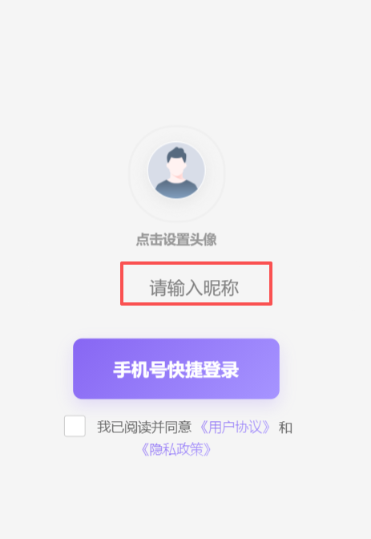

## 📋 功能概述

实现了文章阅读量的显示和自动累加功能：
- ✅ 阅读量显示在文章卡片右下角
- ✅ 点击文章时自动增加阅读量
- ✅ 新文章自动设置随机初始值（1000-5000）
- ✅ 使用云函数实现，数据存储在云数据库

---

## 🎨 UI 改动

### 修改前
```
┌─────────────────┐
│   文章封面图     │
├─────────────────┤
│ 文章标题         │
│ 作者 · 123阅读   │
└─────────────────┘
```

### 修改后
```
┌─────────────────┐
│   文章封面图     │
├─────────────────┤
│ 文章标题         │
│ 作者    123阅读  │  ← 阅读量在右下角
└─────────────────┘
```

---

## 🔧 技术实现

### 1. 云函数 `articleService`

**文件**: `cloudfunctions/articleService/index.js`

**功能**:
- `incrementViewCount` - 增加文章阅读量
- `batchInitialize` - 批量初始化所有文章的阅读量

**阅读量规则**:
- 新文章首次访问时，自动设置随机初始值（1000-5000）
- 每次点击文章，阅读量 +1
- 阅读量存储在云数据库 `articles` 集合的 `viewCount` 字段

### 2. 小程序端服务

**文件**: `miniprogram/services/article.js`

**新增方法**:
```javascript
// 增加文章阅读量
incrementViewCount(articleId)

// 批量初始化所有文章的阅读量
batchInitializeViewCounts()
```

### 3. 页面集成

**修改的文件**:
- `miniprogram/pages/home/index.js` - 首页
- `miniprogram/pages/home/index.wxml` - 首页模板
- `miniprogram/pages/home/index.wxss` - 首页样式
- `miniprogram/pages/resumeList/index.js` - 简历列表页
- `miniprogram/pages/resumeList/index.wxml` - 简历列表页模板
- `miniprogram/pages/resumeList/index.wxss` - 简历列表页样式

**点击文章时的流程**:
1. 用户点击文章卡片
2. 调用云函数增加阅读量
3. 更新本地显示的阅读量
4. 跳转到文章详情页（待实现）

---

## 🚀 部署步骤

### 步骤 1: 部署云函数

1. **在微信开发者工具中**:
   - 右键点击 `cloudfunctions/articleService` 文件夹
   - 选择 **"上传并部署：云端安装依赖"**
   - 等待部署完成

2. **验证部署**:
   ```javascript
   // 在控制台运行
   wx.cloud.callFunction({
     name: 'articleService',
     data: { action: 'batchInitialize' }
   }).then(res => {
     console.log('部署成功:', res);
   });
   ```

### 步骤 2: 初始化现有文章的阅读量

**方法 A: 在小程序控制台运行**

```javascript
const articleService = require('../../services/article.js');

articleService.batchInitializeViewCounts().then(result => {
  console.log('✅ 初始化完成:', result);
  // 输出: { initialized: 4, message: "成功初始化 4 篇文章的阅读量" }
});
```

**方法 B: 在测试页面添加按钮**

在 `pages/test-article-api.wxml` 中添加：
```xml
<button bindtap="initViewCounts">初始化所有文章阅读量</button>
```

在 `pages/test-article-api.js` 中添加：
```javascript
initViewCounts() {
  const articleService = require('../../services/article.js');
  articleService.batchInitializeViewCounts().then(result => {
    wx.showToast({
      title: result.message,
      icon: 'success'
    });
  });
}
```

### 步骤 3: 测试功能

1. **编译运行小程序**
2. **打开首页或简历列表页**
3. **点击任意文章卡片**
4. **查看控制台日志**:
   ```
   📰 点击文章: 6967700ebaf1a7bfe723665c
   📰 阅读量已更新: 1234
   ```
5. **刷新页面，阅读量应该已经增加**

---

## 📊 数据库结构

### articles 集合

```javascript
{
  "_id": "文章ID",
  "title": "文章标题",
  "author": "作者",
  "content": "文章内容",
  "viewCount": 1234,  // ← 新增字段
  "status": "published",
  "createdAt": "2024-01-01T00:00:00.000Z",
  "updatedAt": "2024-01-01T00:00:00.000Z"
}
```

---

## 🔍 常见问题

### Q1: 为什么阅读量不增加？

**可能原因**:
1. 云函数未部署
2. 云函数部署失败
3. 文章ID不正确

**解决方法**:
- 检查云函数是否部署成功
- 查看控制台错误日志
- 确认文章ID正确

### Q2: 如何修改初始阅读量范围？

修改 `cloudfunctions/articleService/index.js` 中的代码：

```javascript
// 修改前：1000-5000
const initialViewCount = Math.floor(Math.random() * 4001) + 1000;

// 修改为：5000-10000
const initialViewCount = Math.floor(Math.random() * 5001) + 5000;
```

### Q3: 如何重置所有文章的阅读量？

在云开发控制台的数据库中：
1. 打开 `articles` 集合
2. 批量删除 `viewCount` 字段
3. 重新运行批量初始化

---

## ✅ 完成清单

- [x] 创建云函数 `articleService`
- [x] 实现阅读量增加逻辑
- [x] 实现随机初始值（1000-5000）
- [x] 修改UI，阅读量显示在右下角
- [x] 集成到首页
- [x] 集成到简历列表页
- [x] 点击文章时自动增加阅读量
- [x] 更新本地显示的阅读量
- [ ] 部署云函数（需要手动操作）
- [ ] 初始化现有文章的阅读量（需要手动操作）

---

## 🎯 下一步

1. **部署云函数** - 在微信开发者工具中上传
2. **初始化阅读量** - 运行批量初始化
3. **测试功能** - 点击文章查看阅读量是否增加
4. **创建文章详情页** - 完整的文章阅读体验

---

**现在请按照部署步骤操作，然后测试功能！** 🚀

